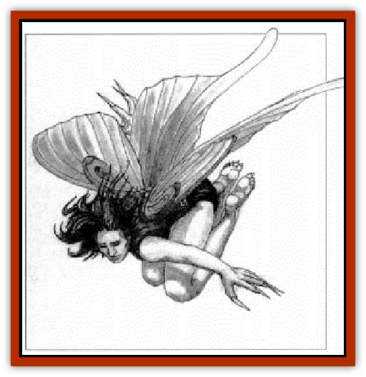
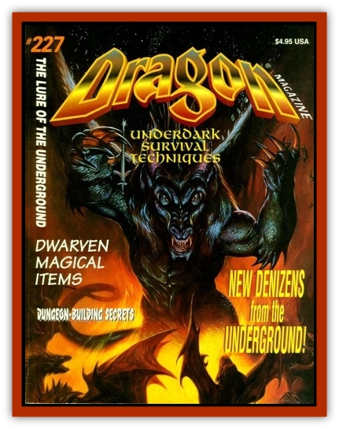

# Glouras

| Statistic | **Glouras** |
| --- | --- |
| **Activity Cycle:** | Any |
| **Alignment:** | Neutral |
| **Armor Class:** | 4 |
| **Climate/Terrain:** | Any Underdark |
| **Damage/Attack:** | 1-8 |
| **Diet:** | Omnivore |
| **Frequency:** | Very rare |
| **Hit Dice:** | 4+4 |
| **Intelligence:** | Exceptional (15) |
| **Magic Resistance:** | 20% |
| **Morale:** | Average (10) |
| **Movement:** | 6, Fl 3, Br 3 |
| **No. Appearing:** | 1-2 |
| **No. of Attacks:** | 1 (claws) |
| **Organization:** | Solitary |
| **Size:** | S (3' tall, 8' wingspan) |
| **Special Attacks:** | Sing-song drone |
| **Special Defenses:** | Servants |
| **THAC0:** | 15 |
| **Treasure:** | R,U |
| **XP Value:** | 650 |

The glouras is a rare faerie creature of the underdark, a gray-skinned humanoid creature with huge, moth-like wings, long fingers, sharp claws, and a mass of dark hair. Sometimes called the "[[Unicorn|unicorn]] of the deeps" because of its elusive nature, it flies through the eternal darkness on shimmering wings that propel it slowly from place to place. Glouras giggle, sing, and titter more often than they speak: but they can speak drow, elvish, and the faerie tongue.

**Combat:** The glouras' wings create a constant droning song, described by some adventurers as more beautiful even than the songs of [[Sirine|sirines]]. This song allows them to *charm* other creatures of the underdark, and charmed servants will follow them anywhere, even over a cliff or into roiling rivers. Any creature hearing the glouras' song must make a saving throw vs. spell or be likewise enslaved by the song, becoming a servant. New saving throws are permitted as per the *charm person* spell; once a creature is free, it cannot be recaptured by the glouras.

In battle, the glouras depends on its song and its *charmed* servants to survive. These creatures obey their faerie master, attacking heedless of their own lives.

The glouras often offers commentary on its followers, congratulating one on a particularly heavy blow, or berating another for not pressing the attack strongly enough. Glouras seem to have trouble deciding what is sentient and what is not; they address <a href= "/appendix/spider">giant spiders</a> and [[Dwarf_Derro|derro]] as equals in their coterie of followers, and they may even ask sentient followers to apologize to non-intelligent ones if the occasion merits it.

A glouras does more than just command its legions of [[Bat|giant bats]], spiders, or sentient creatures into battle; it considers them its court of followers, issuing orders or prompting them to entertain it. This has led some creatures to call the glouras the "royal" or "courtly" faeries, with whom they frolic until the first hint of dawn colors the east. They despise all creatures of daylight and attack them with strength born of rage.

**Habitat/Society:** Glouras keep to themselves except on nights of the new moon, when they rise to the surface world among swarms of bats, seeking the members of the Unseelie Court with whom they frolic until the first hint of dawn colors the east. They despise all creatures of daylight and attack them with strength born of rage.

**Ecology:** The glouras is worshiped as a messenger of Elistraee by those few [[Elf_Drow|drow]] who follow that goddess, and it is feared and hunted by the rest. Its shimmering wings are highly valued for use in decorations, and are worth as much as 400 gp to underdark traders.

---
## Discovery & Documentation

**Source Publication:** Dragon227 (1996)
**Campaign Setting:** Dragon Magazine
**Author(s):** 

### Other Creatures Found in This Source Book
   * [[Beetle_Scarab_Giant|Beetle, Scarab, Giant]]
   * [[Elemental_Darkness|Elemental, Darkness]]
   * [[Fireweed|Fireweed]]
   * [[Octopus_Blue-Ring|Octopus, Blue-Ring]]
