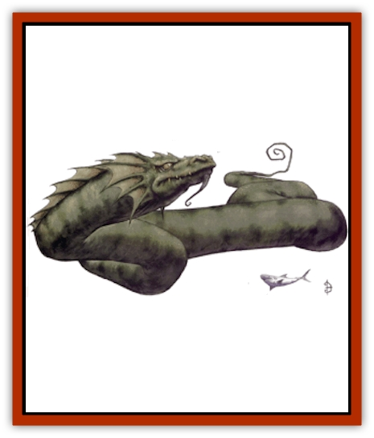

# Glutton - Sea

| Statistic | **Glutton, Sea** |
| --- | --- |
| **Activity Cycle:** | Any |
| **Alignment:** | Neutral (evil) |
| **Armor Class:** | 6 |
| **Climate/Terrain:** | Deep saltwater |
| **Damage/Attack:** | 2d6/2d10 |
| **Diet:** | Carnivore |
| **Frequency:** | Very rare |
| **Hit Dice:** | 9+2 |
| **Intelligence:** | Low (5-7) |
| **Magic Resistance:** | Nil |
| **Morale:** | Elite (13-14) |
| **Movement:** | 10, Sw 18 |
| **No. Appearing:** | 1d2 |
| **No. of Attacks:** | 2 (bite/tail) |
| **Organization:** | Solitary |
| **Size:** | G (50'+ long) |
| **Special Attacks:** | Constriction, swallow whole |
| **Special Defenses:** | Nil |
| **THAC0:** | 11 |
| **Treasure:** | Nil |
| **XP Value:** | 3,000 |

The sea [[Wolverine|glutton]] is a form of giant serpent - the kind mariners have whispered tales of since the beginning of ocean travel. They are most often reported lying on top of the water, sunning themselves; provoking one is a poor idea.

The creature has a long serpentine body covered with dark green, glistening scales. Its underbelly is a chalky gray. The head of a sea glutton resembles a dragon more than an actual serpent, with a large mouth full of sharp teeth and two protruding fangs.

All sea gluttons have a ridge of webbed spikes running down their backs. These spikes start out tiny on the creature's nose ridge, grow quickly to make a large crest over its head, and then trail off over the next 20 feet or so. The spikes can lie flat along the back or be extended to provide protection. Males also have a webbed fan of spikes circling their heads. These are usually flared during fights to make the creature's head seem larger and more threatening.

**Combat:** Sea gluttons provoke an attack only when in search of food. Food consists of almost anything under or on top of the water. The creature can attack with both a bite and a tail slap. On a natural attack roll of 19 or 20, the sea glutton can swallow whole any creature man-sized or smaller. Sea gluttons may attempt a constricting attack instead of a tail slap. If the attack is successful, 2d10 points of damage are automatically inflicted on the victim every round. Victims can attempt a bend bars roll to escape the sea glutton's grip. If attacking a ship, the creature can crush the vessel within 10 rounds.

**Habitat/Society:** Sea gluttons roam the open sea waters, traveling alone or with a mate. Its young are abandoned at birth and left to fend for themselves, many falling prey to other sea creatures during this vulnerable period. Those who survive their first year are considered adults and can pretty well take care of themselves. No one knows how old or how large a sea glutton can get, though sailors speak of one that is commonly mistaken for a small island.

Sea gluttons are most often spotted by Vilaverdan sailing vessels off the coast of Robrenn. The Izondian Deep provides the deep saltwater channels these creatures prefer and supports a large variety of sea life on which they can feed. Though sea gluttons do not stake out a territory, they are wary of each other. Battles have been witnessed between two males or two females but never between opposite genders. Sea gluttons often hunt the surface of the water for food, and they love to sun themselves right after a meal. Otherwise they remain in deep water.

**Ecology:** Sea gluttons are possibly the most feared creature in the Western Sea and almost certainly along the waters of the Izondian Deep. Their primary food staple is the [[Echyan|echyan]]; they provide a critical check in keeping down the population of these sea worms. The only creature sea gluttons truly fear after the first year is the [[Kla'a-tah|kla'a-tah]], which hunts and feeds on them.

---
## Discovery & Documentation

**Source Publication:** Monstrous Compendium, 1997 Annual, Volume 4 (1995)
**Campaign Setting:** Advanced Dungeons & Dragons 2nd Edition
**Author(s):** Jon Pickens

### Other Creatures Found in This Source Book
   * [[Anemone_Giant_Sea|Anemone, Giant Sea]]
   * [[Asperii|Asperii]]
   * [[Bainligor|Bainligor]]
   * [[Beast_of_Chaos|Beast of Chaos]]
   * [[Blindheim|Blindheim]]
   * [[Bloodsipper_Far_Realm|Bloodsipper (Far Realm)]]
   * [[Bulette_Gohlbrorn|Bulette, Gohlbrorn]]
   * [[Child_of_the_Sea|Child of the Sea]]
   * [[Clockwork_Horror|Clockwork Horror]]
   * [[Clockwork_Swordsman|Clockwork Swordsman]]
   * [[Coral|Coral]]
   * [[Darklore|Darklore]]
   * [[Dharculus|Dharculus]]
   * [[Dolphin_Athas|Dolphin (Athas)]]
   * [[Dragon_Neutral_Moonstone|Dragon, Neutral, Moonstone]]
   * [[Dragon_Prismatic|Dragon, Prismatic]]
   * [[Dream_Stalker|Dream Stalker]]
   * [[Dragon-kin_Albino_Wyrm|Dragon-kin, Albino Wyrm]]
   * [[Echyan|Echyan]]
   * [[Firestar|Firestar]]
   * [[Firetail|Firetail]]
   * [[Fish_Ascallion|Fish, Ascallion]]
   * [[Fish_Deep_Ocean|Fish, Deep Ocean]]
   * [[Fish_Tropical|Fish, Tropical]]
   * [[Fish_Vurgens|Fish, Vurgens]]
   * [[Fogwarden|Fogwarden]]
   * [[Fraal|Fraal]]
   * [[Giant_Crag|Giant, Crag]]
   * [[Gibberling_Brood|Gibberling, Brood]]
   * [[Golden_Ammonite|Golden Ammonite]]
   * [[Golem_Brass_Minotaur|Golem, Brass Minotaur]]
   * [[Golem_Gemstone|Golem, Gemstone]]
   * [[Golem_Maggot|Golem, Maggot]]
   * [[Groundling|Groundling]]
   * [[Hermit_Sea|Hermit, Sea]]
   * [[Hound_of_Law|Hound of Law]]
   * [[Human_Amazon|Human, Amazon]]
   * [[Human_Pygmy|Human, Pygmy]]
   * [[Inquisitor|Inquisitor]]
   * [[Kercpa|Kercpa]]
   * [[Kreel|Kreel]]
   * [[Lycanthrope_Lythari|Lycanthrope, Lythari]]
   * [[Mercurial|Mercurial]]
   * [[Mold_Chromatic|Mold, Chromatic]]
   * [[Mummy_Bog|Mummy, Bog]]
   * [[Neh-thalggu|Neh-thalggu]]
   * [[Nymph_Grain|Nymph, Grain]]
   * [[Nymph_Unseelie|Nymph, Unseelie]]
   * [[Octopus_Octo-Jelly|Octopus, Octo-Jelly]]
   * [[Puddingfish|Puddingfish]]
   * [[Sea_Demon|Sea Demon]]
   * [[Shade|Shade]]
   * [[Shadowrath|Shadowrath]]
   * [[Shark_Athas|Shark (Athas)]]
   * [[Siren_Ravenloft|Siren (Ravenloft)]]
   * [[Skeleton_Variant|Skeleton, Variant]]
   * [[Skyfish|Skyfish]]
   * [[Spectral_Scion|Spectral Scion]]
   * [[Spyder_Fiend|Spyder Fiend]]
   * [[Squid_Squark|Squid, Squark]]
   * [[Tanar'ri_Lesser_Uridezu|Tanar'ri, Lesser, Uridezu]]
   * [[Troll_Mutate|Troll Mutate]]
   * [[Vaati|Vaati]]
   * [[Vampire_Cerebral|Vampire, Cerebral]]
   * [[Varkha|Varkha]]
   * [[Wizshade|Wizshade]]
   * [[Worm_Lukhorn|Worm, Lukhorn]]
   * [[Wyste|Wyste]]
   * [[Yugoloth_Lesser_Gacholoth|Yugoloth, Lesser, Gacholoth]]
   * [[Zombie_Mud|Zombie, Mud]]
