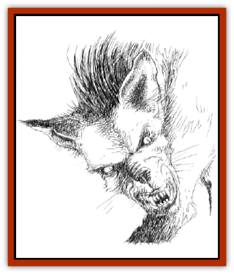

# Gnasher

| Statistic | **Gnasher** |
| --- | --- |
| **Activity Cycle:** | Day |
| **Alignment:** | Chaotic evil |
| **Armor Class:** | 6 |
| **Climate/Terrain:** | Temperate/forest or rough |
| **Damage/Attack:** | 1-6 |
| **Diet:** | Carnivore |
| **Frequency:** | Uncommon |
| **Hit Dice:** | 3 |
| **Intelligence:** | Semi- (2-4) |
| **Magic Resistance:** | Nil |
| **Morale:** | Elite (13) |
| **Movement:** | 15 |
| **No. Appearing:** | 2-20 |
| **No. of Attacks:** | 1 |
| **Organization:** | Pack |
| **Size:** | M (5-7' long) |
| **Special Attacks:** | Nil |
| **Special Defenses:** | Nil |
| **THAC0:** | 17 |
| **Treasure:** | Nil |
| **XP Value:** | 120 / Leader: 175 |

Created by a master sorcerer ages ago, these creatures most closely resemble [[Dog|dogs]], but their wolfish snouts sport many more razor-sharp teeth than their canine cousins, and there is a bristly tuft of hair that grows between their shoulders. Coloration tends toward dark blacks, greys, and browns. Their eyes show evidence of the hatred and evil burning within their breasts, practically burning with the desire to kill and maim.

**Combat:** Gnashers live for the kill, and their tactics show it. When attacking, they circle their prey and then lunge in with snapping jaws, often trying for the throat. Their powerful jaws inflict 1d6 points of damage. Gnashers prefer to make jabbing attacks, circling and feigning, until they have sufficiently weakened their prey. Then they all lunge in at once, swarming and overbearing the prey from all directions until it goes down. Anyone taken down under a gnasher attack has little hope of survival. The prone victim's AC is effectively reduced by 4 and the gnashers inflict an additional +2 points of damage per attack.

The only hope someone has of escaping a gnasher pack is to climb something the gnashers cannot ascend. However, if there is no other way down, gnashers have been known to stand guard until the prey dies of dehydration or attempts an escape.

**Habitat/Society:** Gnashers hunt in packs, following a leader that has earned its place by brute force (+1 Hit Die). As the leader ages, the younger toughs of the pack wait for a chance to displace it. Once this has occured, the remainder of the potential leaders fight for dominance, rarely to the death.

Even though gnashers are vicious, they avoid populated areas when possible, attacking those who wander into the wilderness. They are usually only encountered in the wilds, although at times smaller farming communities have trouble with packs of gnashers that kill livestock and lone villagers.

The pack communicates on a rudimentary level, using a combination of barks, growls, and body language. Although gnashers frequently squabble among themselves - fighting over food, pack dominance, and mates - they do not rise against each other if there are foes present. They only kill gnashers of other packs, since these are viewed as competitors in the struggle for survival in the wilds.

**Ecology:** Gnashers survive solely on meat. They attack nearly anything in the area, from rabbits to adventurers to low-flying birds. An area controlled by these creatures will be devoid of other animal life. Anyone entering the territory of a pack of gnashers will notice an eerie silence in an area cleaned out by them. It takes nearly a year for any animals to return to an area where a gnasher pack has made its home, even after the gnashers leave it for more fruitful pastures.

Gnashers mate in the spring, the female bearing 1d4+1 cubs that stay with the mother for the first year and are then forced out on their own. For many years these creatures *were* mistaken for dogs, until it was realized that they do not flee pain, and indeed seem to revel in it.

Their natural enemy is the [[Mammal|elven dog]], or cooshee. The two species hate each other and will attack upon first hint of the other. Even the typical canine surrender will not suffice for these two; no quarter is ever given.

---
## Discovery & Documentation

**Source Publication:** Dragon Mountain (1993)
**Campaign Setting:** Advanced Dungeons & Dragons 2nd Edition
**Author(s):** Colin McComb, Paul Arden Lidberg

### Other Creatures Found in This Source Book
   * [[Dragon-kin|Dragon-kin]]
   * [[Elemental_Earth_Kin_Earth_Weird|Elemental, Earth Kin, Earth Weird]]
   * [[Gnasher_Winged|Gnasher, Winged]]
   * [[Kobold_Dragon_Mountain|Kobold, Dragon Mountain]]
   * [[Living_Steel|Living Steel]]
   * [[Noran|Noran]]
   * [[Ophidian|Ophidian]]
   * [[Rautym|Rautym]]
   * [[Spider_Brain|Spider, Brain]]
   * [[Squeaker|Squeaker]]
   * [[Stone_Snake|Stone Snake]]
   * [[Suwyze|Suwyze]]
   * [[Tanar'ri_Greater_Wastrilith|Tanar'ri, Greater, Wastrilith]]
   * [[Undead_Dwarf|Undead Dwarf]]
