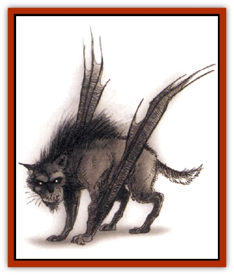

# Gnasher - Winged

| Statistic | **Gnasher, Winged** |
| --- | --- |
| **Activity Cycle:** | Day |
| **Alignment:** | Chaotic evil |
| **Armor Class:** | 5 |
| **Climate/Terrain:** | Forest/rough hills |
| **Damage/Attack:** | 1-8 |
| **Diet:** | Carnivore |
| **Frequency:** | Rare |
| **Hit Dice:** | 4 |
| **Intelligence:** | Low (5-7) |
| **Magic Resistance:** | Nil |
| **Morale:** | Elite (14) |
| **Movement:** | 12, Fl 6 (E) |
| **No. Appearing:** | 2-12 |
| **No. of Attacks:** | 1 |
| **Organization:** | Pack |
| **Size:** | L (8-10' long) |
| **Special Attacks:** | Surprise |
| **Special Defenses:** | Nil |
| **THAC0:** | 17 |
| **Treasure:** | Nil |
| **XP Value:** | 270 /  Leader 650 |

These are slightly bigger cousins of normal [[Gnasher|gnashers]], encountered only in areas with natural outcroppings of stone. They have batlike wings - thick membranes attached to their forelegs and running the length of their bodies - that enable them to leap into tine air from these outcroppings and glide for distances of 50 feet for every 10 feet of height from which they leaped. However, their wings tend to tire easily, and they cannot maintain glides of over 200 feet. They can also leap into the air from the ground and glide for 20 feet, but they suffer a -2 attack penalty when attempting to bring down a target from such a jump.

Winged gnashers are equally at home on the ground. Though they have wings, the membranes stretch enough that the gnashers can run quickly along the ground. Though they do not have the speed normal gnashers have, they can usually catch prey that does not have a running start.

**Combat:** Like normal gnashers, winged gnashers live for the kill and use tactics much like their land-based brethren, circling around their prey until it is surrounded, and then closing in with surprising speed. In addition to their circling tactics, winged gnashers also "fly" at prey, folding their wings and dropping down from heights of up to 20 feet to achieve surprise. This is equivalent to a charge attack, giving the winged gnasher a +2 attack bonus. However, they suffer a -1 AC penalty.

**Habitat/Society:** Winged gnashers (also known simply as "wings") live in caves in the rough hills. They hardly ever sleep in the open, unless they are forced from their cave by something larger and fiercer than them. Their nests inside these caves are crude collections of straw and branches in which they sleep. There is usually very little treasure in a gnasher cave, since they have no use for it. They generally leave it on the carcasses of the creatures they kill.

Like their cousins, winged gnashers live in packs. Winged gnasher leaders have 1 extra Hit Die and are larger than the rest of the pack. Intrapack struggles are common, as the younger males wish to try their strength against that of their leader. Those who fail are driven from the pack to try and fend for themselves in the wild. Unfortunately for these exiles, most wilderness creatures take the opportunity to eliminate lone gnashers when they can.

**Ecology:** Winged gnashers generally feed off land-based creatures, since most flying creatures are far more mobile and aerially agile than they are. Only if they attack by surprise can winged gnashers bring down the majority of flying creatures, and only if that creature is flying less than 40 feet above the ground.

Gnashers have no regard for the balance of nature, and they tend to completely eliminate every sizeable creature in an area. These areas are notable for their lack of animal life, and gnashers do not stay long in a place they have cleaned out.

Winged gnashers find that most other aerial monsters are their natural enemies, especially [[Griffon|griffons]] and [[Hippogriff|hippogriffs]]. These creatures will put aside their differences in order to eliminate gnasher packs. Thus, winged gnashers try to find places to live that are far from the nests of such creatures, for unless the other monster makes a foolish mistake, the gnashers are no match for them.

---
## Discovery & Documentation

**Source Publication:** Dragon Mountain (1993)
**Campaign Setting:** Advanced Dungeons & Dragons 2nd Edition
**Author(s):** Colin McComb, Paul Arden Lidberg

### Other Creatures Found in This Source Book
   * [[Dragon-kin|Dragon-kin]]
   * [[Elemental_Earth_Kin_Earth_Weird|Elemental, Earth Kin, Earth Weird]]
   * [[Gnasher|Gnasher]]
   * [[Kobold_Dragon_Mountain|Kobold, Dragon Mountain]]
   * [[Living_Steel|Living Steel]]
   * [[Noran|Noran]]
   * [[Ophidian|Ophidian]]
   * [[Rautym|Rautym]]
   * [[Spider_Brain|Spider, Brain]]
   * [[Squeaker|Squeaker]]
   * [[Stone_Snake|Stone Snake]]
   * [[Suwyze|Suwyze]]
   * [[Tanar'ri_Greater_Wastrilith|Tanar'ri, Greater, Wastrilith]]
   * [[Undead_Dwarf|Undead Dwarf]]
