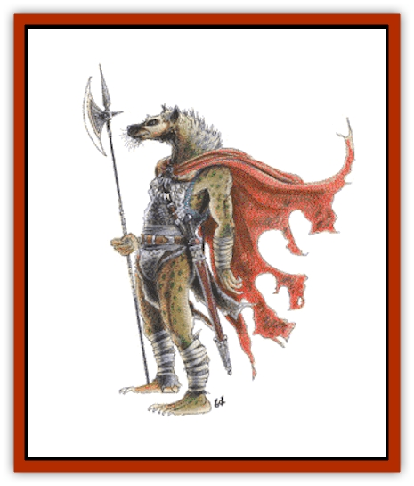

# Gnoll

| Statistic | **Flind** | **Gnoll** |
| --- | --- | --- |
| **Activity Cycle:** | Night | Night |
| **Alignment:** | Lawful evil | Chaotic evil |
| **Armor Class:** | 5 (10) | 5 (10) |
| **Climate/Terrain:** | Any tropical to temperate non-desert | Any tropical to temperate non-desert |
| **Damage/Attack:** | 1-6 or 1-4 (weapons) | 2-8 (2d4) (weapon) |
| **Diet:** | Carnivore | Carnivore |
| **Frequency:** | Rare | Uncommon |
| **Hit Dice:** | 2+3 | 2 |
| **Intelligence:** | Average (8-10) | Low (5-7) |
| **Magic Resistance:** | Nil | Nil |
| **Morale:** | Steady (11-12) | Steady (11) |
| **Movement:** | 12 | 9 |
| **No. Appearing:** | 1-4 | 2-12 (2d6) |
| **No. of Attacks:** | 1 or 2 | 1 |
| **Organization:** | Tribe | Tribe |
| **Size:** | M (6½' tall) | L (7½' tall) |
| **Special Attacks:** | Disarm | Nil |
| **Special Defenses:** | Nil | Nil |
| **THAC0:** | 17 | 19 |
| **Treasure:** | A | D,Q&times;5,S (L,M) |
| **XP Value:** | 120 | 35 / Leaders &amp; guards: 65 / Chieftain: 120 |

Gnolls are large, evil, hyena-like humanoids that roam about in loosely organized bands.

While the body of a gnoll is shaped like that of a large human, the details are those of a [[Hyena|hyena]]. They stand erect on two legs and have hands that can manipulate as well as those of any human. They have greenish gray skin, darker near the muzzle, with a short reddish gray to dull yellow mane.

Gnolls have their own language and many also speak the tongues of flinds, [[Troll|trolls]], [[Orc|orcs]], or [[Hobgoblin|hobgoblins]].

**Combat:** Gnolls seek to overwhelm their opponents by sheer numbers, using horde tactics. When under the direction of flinds or a strong leader, they can be made to hold rank and fight as a unit. While they do not often lay traps, they will ambush or attempt to attack from a flank or rear position. Gnolls favor swords (15%), pole arms (35%) and battle axes (20%) in combat, but also use bows (15%), morningstars (15%).

**Habitat/Society:** Gnolls are most often encountered underground or inside abandoned ruins. When above ground they operate primarily at night. Gnoll society is ruled by the strongest, using fear and intimidation. When found underground, they will have (30% chance) 1-3 trolls as guards and servants. Above ground they keep pets (65% of the time) such as 4-16 [[Hyena|hyenas]] (80%) or 2-12 [[Hyena|hyaenodons]] (20%) which can act as guards.

A gnoll lair will contain between 20 and 200 adult males. For every 20 gnolls, there will be a 3 Hit Die leader. If 100 or more are encountered there will also be a chieftain who has 4 Hit Dice, an Armor Class of 3, and who receives a +3 on his damage rolls due to his great strength. Further, each chieftain will be protected by 2-12 (2d6) elite warrior guards of 3 Hit Dice (AC 4, +2 damage).

In a lair, there will be females equal to half the number of males. Females are equal to males in combat, though not usually as well armed or armored. There will also be twice as many young as there are adults in the lair, but they do not fight. Gnolls always have at least 1 slave for every 10 adults in the lair, and may have many more.

Gnolls will work together with orcs, hobgoblins, [[Bugbear|bugbears]], [[Ogre|ogres]], and trolls. If encountered as a group, there must be a relative equality of strength. Otherwise the gnolls will kill and eat their partners (hunger comes before friendship or fear) or be killed and eaten by them. They dislike [[Goblin|goblins]], [[Kobold|kobolds]], giants, humans, demi-humans and any type of manual labor.

**Ecology:** Gnolls eat anything warm blooded, favoring intelligent creatures over animals because they scream better. They will completely hunt out an area before moving on. It may take several years for the game to return. When allowed to die of old age, the typical gnoll lives to be about 35 years old.

**Flind**

  The flind is similar to a gnoll in body style, though it is a little shorter, and broader. They are more muscular than their cousins. Short, dirty, brown and red fur covers their body. Their foreheads do not slope back as far, and their ears are rounded, but still animal like.

Flinds use clubs (75%) which inflict 1-6 points of damage and flindbars (25%) which do 1-4 points of damage. A flindbar is a pair of chain-linked iron bars which are spun at great speed. A flind with a flindbar can strike twice per round. Each successful hit requires the victim to save vs. wands or have his weapon entangled in the chain and torn from his grasp by the flindbar. Due to their great strength, flinds get a +1 on their attack rolls.

Flinds are regarded with reverence and awe by gnolls. Flind leaders are 3+3 Hit Dice, at least 13 intelligence and 18 charisma to gnolls (15 to flinds), and always use flindbars.

---
## Discovery & Documentation

**Source Publication:** MC1 Volume I (w/binder #1) (1991)
**Campaign Setting:** Advanced Dungeons & Dragons 2nd Edition
**Author(s):** Jay Batista, Scott Bennie, Grant Boucher, William W. Connors, Steve Gilbert, Heike Kubasch, James Lowder, David Edward Martin, Bruce Nesmith, Jean Rabe, Rick Swan, John J. Terra, Gary L. Thomas

### Other Creatures Found in This Source Book
   * [[Bat|Bat]]
   * [[Bear|Bear]]
   * [[Behir|Behir]]
   * [[Boar|Boar]]
   * [[Bookworm|Bookworm]]
   * [[Brownie|Brownie]]
   * [[Bugbear|Bugbear]]
   * [[Carrion_Crawler|Carrion Crawler]]
   * [[Cat_Great|Cat, Great]]
   * [[Catoblepas|Catoblepas]]
   * [[Dragon_General_Information|Dragon, General Information]]
   * [[Dragonfish|Dragonfish]]
   * [[Elemental_Air_Kin_Aerial_Servant|Elemental, Air Kin, Aerial Servant]]
   * [[Elemental_Earth_Kin_Sandling|Elemental, Earth Kin, Sandling]]
   * [[Elephant|Elephant]]
   * [[Hobgoblin|Hobgoblin]]
   * [[Homunculus|Homunculus]]
   * [[Hornet_Giant|Hornet, Giant]]
   * [[Horse|Horse]]
   * [[Hyena|Hyena]]
   * [[Jackal|Jackal]]
   * [[Jackalwere|Jackalwere]]
   * [[Korred|Korred]]
   * [[Lich|Lich]]
   * [[Lizard|Lizard]]
   * [[Lizard_Man|Lizard Man]]
   * [[Lycanthrope_General_Information|Lycanthrope, General Information]]
   * [[Lycanthrope_Seawolf|Lycanthrope, Seawolf]]
   * [[Lycanthrope_Werebear|Lycanthrope, Werebear]]
   * [[Lycanthrope_Weretiger|Lycanthrope, Weretiger]]
   * [[Lycanthrope_Werewolf|Lycanthrope, Werewolf]]
   * [[Manticore|Manticore]]
   * [[Medusa|Medusa]]
   * [[Mind_Flayer|Mind Flayer]]
   * [[Minotaur|Minotaur]]
   * [[Mudman|Mudman]]
   * [[Mummy|Mummy]]
   * [[Nixie|Nixie]]
   * [[Nymph|Nymph]]
   * [[Ogre|Ogre]]
   * [[Ooze_Slime_Jelly_I|Ooze/Slime/Jelly I]]
   * [[Ooze_Slime_Jelly_II|Ooze/Slime/Jelly II]]
   * [[Orc|Orc]]
   * [[Owl|Owl]]
   * [[Owlbear_I|Owlbear I]]
   * [[Pegasus|Pegasus]]
   * [[Piercer|Piercer]]
   * [[Pudding_Deadly|Pudding, Deadly]]
   * [[Rakshasa|Rakshasa]]
   * [[Rat|Rat]]
   * [[Ray|Ray]]
   * [[Remorhaz|Remorhaz]]
   * [[Satyr|Satyr]]
   * [[Scorpion|Scorpion]]
   * [[Selkie|Selkie]]
   * [[Shadow|Shadow]]
   * [[Skeleton|Skeleton]]
   * [[Skunk|Skunk]]
   * [[Snake|Snake]]
   * [[Spectre|Spectre]]
   * [[Spider|Spider]]
   * [[Sprite|Sprite]]
   * [[Toad_Giant|Toad, Giant]]
   * [[Treant|Treant]]
   * [[Troll|Troll]]
   * [[Umber_Hulk|Umber Hulk]]
   * [[Unicorn|Unicorn]]
   * [[Vampire|Vampire]]
   * [[Wight|Wight]]
   * [[Will_O'Wisp|Will O'Wisp]]
   * [[Wolf|Wolf]]
   * [[Wolfwere|Wolfwere]]
   * [[Wraith|Wraith]]
   * [[Wyvern|Wyvern]]
   * [[Yeti|Yeti]]
   * [[Yuan-ti|Yuan-ti]]
   * [[Zombie|Zombie]]
