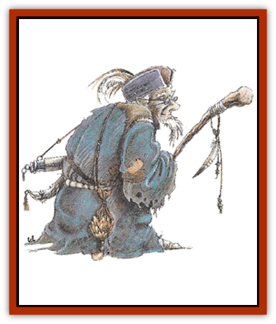

# Gnome

| Statistic | **Forest** | **Gnome (Rock)** | **Svirfneblin** | **Tinker** |
| --- | --- | --- | --- | --- |
| **Activity Cycle:** | Day | Any | Any | Any |
| **Alignment:** | Neutral good | Neutral good | Neutral (good) | Neutral or Lawful good |
| **Armor Class:** | 10 | 6 or better | 2 or better | 10 or 5 |
| **Climate/Terrain:** | Forest | Hills | Subterranean | Mountains |
| **Damage/Attack:** | By weapon | By weapon | By weapon | By weapon |
| **Diet:** | Omnivore | Omnivore | Omnivore | Omnivore |
| **Frequency:** | Very rare | Rare | Very rare | Rare |
| **Hit Dice:** | 2 (base) | 1 (base) | 3+6 (base) | 1 (base) |
| **Intelligence:** | Varies (3-17) | Varies (7-19) | Varies (3-17) | Varies (8-18) |
| **Magic Resistance:** | Special | Special | 20% (and up) | Special |
| **Morale:** | Elite (14) | Steady (12) | Elite (13) | Average (8) |
| **Movement:** | 12 | 6 | 9 | 6 |
| **No. Appearing:** | 1-4 (1d4) | 4-12 (4d3) | 5-8 (1d4+4) | 1-12 (1d12) |
| **No. of Attacks:** | 1 | 1 | 1 | 1 |
| **Organization:** | Clans | Clans | Colony | Colony/Guild |
| **Size:** | S (2-2½') | S (3½') | S (3-3½') | S (3½') |
| **Special Attacks:** | Traps | Nil | Stun darts | Nil |
| **Special Defenses:** | See below | See below | See below | See below |
| **THAC0:** | 18 | 19 | 17 | 19 |
| **Treasure:** | J,K,Q&times;2 (C) | M&times;3 (C,Q&times;20) | K&times;2,Q&times;3 (D,Q&times;5) | M&times;30 (C,Q&times;20) |
| **XP Value:** | 120 (base) | 65 (base) | 420 (base) | 65 (base) |

Small cousins of the [[Dwarf|dwarves]], gnomes are friendly but reticent, quick to help their friends but rarely seen by other races unless they want to be. They tend to dwell underground in hilly, wooded regions where they can pursue their interests in peace. Gnomes can be fighters or priests, but most prefer to become thieves or illusionists instead. Multi-class characters are more common among the gnomes than any other demihuman race.

Gnomes strongly resemble small, thin, nimble dwarves, with the exception of two notable facial features: gnomes prefer to keep their beards short and stylishly-trimmed, and they take pride in their enormous noses (often fully twice the size of any dwarf or human's). Skin, hair, and eye color vary somewhat by subrace: the most common type of gnome, the Rock Gnome, has skin ranging from a dark tan to a woody brown (sometimes with a hint of gray), pale hair, and eyes any shade of blue. Gnomish clothing tends toward leather and earth tones, brightened by a bit of intricately wrought jewelry or stitching. Rock gnomes have an average life span of around 450 years, although some live to be 600 years or more.

Gnomes speak their own language, and each subrace has its own distinctive dialect. Many gnomes learn the tongues of humans, [[Kobold|kobolds]], [[Goblin|goblins]], [[Halfling|halflings]], and dwarves in order to communicate with their neighbors, and some Rock Gnomes are able to communicate with burrowing mammals via a basic language of grunts, snorts, and signs.

Gnomes posses infravision to 60 feet, and the ability to detect sloping passages (1-5 on 1d6), unsafe stonework (1-7 on 1d10), and approximate depth (1-4 on 1d6) and direction (1-3 on 1d6) underground. They are highly resistant to magic, gaining a +1 bonus to their saving throws for each 3.5 points of Constitution (a typical gnome will have a bonus of +3 to +4). Unfortunately, this also means that there is a 20% chance that any magical item a gnome attempts to use will malfunction (armor, weapons, and illusionary items exempted).

**Combat:** Gnomes prefer the use of strategy over brute force in combat and will often use illusions in imaginative ways to "even the odds�. Their great hatred of kobolds and goblins, their traditional enemies, gives them a+1 on their attack rolls when fighting these beings. They are adept at dodging the attacks of large opponents, forcing all giant class creatures ([[Gnoll|gnolls]], [[Bugbear|bugbears]], [[Ogre|ogres]], [[Troll|trolls]], giants, etc.) to subtract 4 from their attack rolls when fighting gnomes.

Gnomes can use any weapon that matches their size and often carry a second (or even a third) weapon as a back-up. Short swords, hammers, and spears are favorite melee weapons, with short bows, crossbows, slings, and darts coming into play when distance weapons are called for; virtually every gnome will also carry a sharp knife somewhere on his or her person as a final line of defense.

A typical rock gnome will wear studded leather armor and use a small shield (AC 6). Their leaders will have chain mail (AC 4), and any gnome above 5th level has plate mail (AC 2). There is a 10% chance for each level above 5th that the gnome's armor and/or weapon is magical (roll separately for each). Spell casters have a 10% chance per level of having 1-3 magical items usable by their character class.

**Habitat/Society:** Gnomes live in underground burrows in remote hilly, wooded regions. They are clannish, with friendly rivalries occurring between neighboring clans. They spend their lives mining, crafting fine jewelry, and enjoying the fruits of their labors. Gnomes work hard, and they play hard. They observe many festivals and holidays, which usually involve games, nose measuring contests, and swapping of grand tales. Their society is well organized, with many levels of responsibility, culminating in a single chief who is advised by clerics in matters directly relating to their calling.

A gnomish lair is home to some 40-400 (4d10>010) gnomes, one-quarter of them children. For every 40 adults there is a fighter of 2nd to 4th level. If 160 or more are encountered there is also a 5th-level chief and a 3rd-level lieutenant. If 200 or more are met, there is a cleric or illusionist of 4th to 6th level. If 320 or more are present, add a 6th-level fighter, two 5th-level fighters, a 7th-level cleric, four 3rd-level clerics, a 5th-level illusionist, and two 2nd-level illusionists.

Gnomes often befriend burrowing mammals, so 5d6 [[Badger|badgers]] (70%), 3d4 [[Badger|giant badgers]] (20%), or 2d4 [[Wolverine|wolverines]] (10%) will be present as well. These animals are neither pets nor servants, but allies who will help guard the clan.

**Ecology:** Gnomes are very much a magical part of nature, existing in harmony with the land they inhabit. They choose to live underground but remain near the surface in order to enjoy its beauty.

## Svirfneblin (Deep Gnome)

Far beneath the surface of the earth dwell the Svirfneblin, or Deep Gnomes. Small parties of these demihumans roam the Underdark's mazes of small passageways searching for gemstones. They are said to dwell in great cities consisting of a closely connected series of tunnels, buildings, and caverns in which up to a thousand of these diminutive creatures live. They keep the location of these hidden cities secret in order to protect them from their deadly foes, the [[Kuo-Toa|kuo-toa]], [[Elf_Drow|Drow]], and [[Mind_Flayer|mind flayers]].

Svirfneblin are slightly smaller than rock gnomes, but their thin, wiry, gnarled frames are just as strong. Their skin is rock-colored, usually medium brown to brownish gray, and their eyes are gray. Male svirfneblin are completely bald; female deep gnomes have stringy gray hair. The average svirfneblin life span is 250 years.

Svirfneblin mining teams and patrols work together so smoothly that to outside observers they appear to communicate with each other by some form of racial empathy. They speak their own dialect of gnomish that other gnomish subraces are 60% likely to understand. Most deep gnomes are also able to converse in Underworld Common and speak and understand a fair amount of kuo-toan and drow. These small folk can also converse with any creature from the elemental plane of Earth via a curious "language" consisting solely of vibrations (each pitch conveys a different message), although only on a very basic level.

All svirfneblin have the innate ability to cast blindness, blur, and change self once per day. Deep gnomes also radiate non-detection identical to the spell of the same name. Deep gnomes have 120-foot infravision, as well as all the detection abilities of rock gnomes. (See also Wizard Spells, Player's Handbook)

**Combat:** Despite their metal armor and arms, these quick, small folk are able to move very quietly. Deep gnomes are able to "freeze" in place for long periods without any hint of movement, making them 60% unlikely to be seen by any observer, even those with infravision. They are surprised only on a roll of 1 on 1d10 due to their keen hearing and smelling abilities and surprise opponents 90% of the time.

The deep gnomes wear leather jacks sewn with rings or scales of mithral steel alloy over fine chainmail shirts, giving a typical svirfneblin warrior an Armor Class of 2. They do not usually carry shields, since these would hinder movement through the narrow corridors they favor. For every level above 3rd, a Deep Gnome's Armor Class improves by one point - a 4th-level deep gnome has AC 1, a 5th-level deep gnome, AC 0; to a maximum of AC 6.

All deep gnomes are 20% magic resistant, gaining an extra +5% magic resistance for each level they attain above 3rd. They are immune to illusions, phantasms, and hallucinations. Because of their high wisdom, speed, and agility, they make all saving throws at +3, except against poison, when their bonus is +2.

Deep Gnomes are typically armed with a pick and a dagger which, while nonmagical, gain a +1 bonus to attacks and damage due to their finely-honed edges. Svirfneblin also carry 1d4+6 special stun darts, throwing them to a range of 40 feet, with a +2 bonus to hit. Each dart releases a small puff of gas when it strikes; any creature inhaling the gas must save vs. poison or be stunned for 1 round and slowed for the next four rounds. Elite warriors (3rd level and above) often carry hollow darts with acid inside (+2d4 to damage) and crystal caltrops which, when stepped on, release a powerful sleep gas.

**Habitat/Society:** Svirfneblin society is strictly divided between the sexes: females are in charge of food production and running the city, while males patrol its borders and mine for precious stones. A svirfneblin city will have both a king and a queen, each of whom is independent and has his or her own sphere of responsibility. Since only males ever leave the city, the vast majority of encounters will be with deep gnome mining parties seeking for new lodes. For every four svirfneblin encountered, there will be an overseer with 4+7 Hit Dice. Groups of more than 20 will be led by a burrow warden (6+9 Hit Dice) with two 5th-level assistants (5+8 Hit Dice).

It is 25% probable that a 6th-level deep gnome will have illusionist abilities of 5th, 6th, or 7th level. Deep Gnomes who are not illusionists gain the ability at 6th level to summon an earth elemental (50% chance of success) once per day.

Deep gnome clerics have no ability to turn undead.

**Ecology:** Stealth, cleverness, and tenacity enable the svirfneblin to survive in the extremely hostile environment of the Underdark. They love gems, especially rubies, and will take great risks in order to gain them. Their affinity for stone is such that creatures from the elemental plane of Earth are 90% unlikely to harm a deep gnome, though they might demand a hefty tithe in gems or precious metals for allowing the gnome to escape.

## Tinker Gnome (Minoi)

Cheerful, industrious, and inept, [[Gnome_Tinker|tinker gnomes]] originated on Krynn, but they have spread to many other worlds via spelljamming ships. Physically similar to rock gnomes, even to the extent of sharing the same infravision range, magic resistance, combat bonuses, and detection abilities, their history and culture are so radically different as to qualify them for consideration as a separate subrace.

Graceful and quick in their movements, tinker gnomes' hands are deft and sure. Tinkers have rich brown skin, white hair, and china-blue or violet eyes. Males favor oddly-styled beards and moustaches, and both sexes have rounded ears and typically large gnomish noses. Tinkers who avoid getting blown up in an experiment live for 250-300 years.

Tinker gnomes speak very rapidly, running their words together in sentences that never seem to end. They are capable of talking and listening at the same time: when two tinkers meet, they babble away, answering questions asked by the other as part of the same continuous sentence.

**Combat:** Tinker gnomes rarely carry weapons, although some of their ever present tools can be pressed into service at need. However, they delight in invention and are always devising strange weapons of dubious utility, from the three barrel water blaster to the multiple spear flinger. Tinkers can wear any type of armor but typically outfit themselves in a variety of mismatched pieces for an effective AC of 5.

**Habitat/Society:** Tinker gnomes establish colonies consisting of immense tunnel complexes in secluded mountain ranges. The largest gnome settlement on Krynn, beneath Mount Nevermind, is home to some 59,000 tinkers. Other tinker gnome colonies exist, both on Krynn and elsewhere, but their populations seldom exceed 200-400.

All tinkers have a Life Quest: to attain perfect understanding of a single device. Few ever actually attain this goal, but their individual Life Quests do keep the ever hopeful tinkers busy. Males and females are equal in tinker society, and each pursue Life Quests with similar devotion. Each tinker gnome belongs to a guild. The guild occupies the same place in a tinker's life that the clan occupies for other gnomes. Together the guildmasters make up a grand council that governs the community.

Though most tinker gnomes are content to stay home and tinker with their projects, some have Life Quests which require them to venture out into the world. Adventuring gnomes are generally unable to learn from past experience and repeat the same mistakes, yet they are often successful with quirky solutions to save the day for their companions.

**Ecology:** Despite their great friendliness, tinker gnomes are not well-liked by other races: their technological bent makes them quite alien to those accustomed to magic, and their poor understanding of social relations puts off many potential friends. Sages generally agree that the tinkers' indiscriminate trumpeting of technology has discouraged its development by other races who have encountered tinker gnomes.

## Forest Gnome

Shy and elusive, the forest gnomes live deep in forests and shun contact with other races except in times of dire emergencies threatening their beloved woods. The smallest of all the gnomes, they average 2 to 2½ feet in height, with bark-colored, gray-green skin, dark hair, and blue, brown, or green eyes. A very long-lived people, they have an average life expectancy of 500 years.

In addition to their own gnomish dialect, most forest gnomes can speak gnome common (rock gnome), [[Elf|Elf]], [[Treant|Treant]], and a simple language that enables them to communicate on a very basic level with forest animals. All forest gnomes have the innate ability to *pass without trace*, hide in woodlands (90% chance of success), and the same saving throw bonus as their rock gnome cousins.

**Combat:** Forest gnomes prefer boobie traps and missile weapons to melee weapons when dealing with enemies. Due to size and quickness they receive a -4 bonus to Armor Class whenever they are fighting M- or L-sized opponents. Forest gnomes receive a +1 bonus to all attack and damage rolls when fighting [[Orc|orcs]], [[Lizard_Man|lizardmen]], [[Troglodyte|troglodytes]], or any creature which they have seen damage their forest.

**Habitat/Society:** Forest gnomes live in small villages of less than 100 gnomes, each family occupying a large, hollowed-out tree. Most of these villages are disguised so well that even an elf or a ranger could walk through one without realizing it.

**Ecology:** Forest gnomes are guardians of the woods and friends to the animals that live there. They will often help lost travellers but will strive to remain unseen while doing so.

---
## Discovery & Documentation

**Source Publication:** Monstrous Manual (1995)
**Campaign Setting:** Advanced Dungeons & Dragons 2nd Edition
**Author(s):** Tim Beach

### Other Creatures Found in This Source Book
   * [[Aarakocra|Aarakocra]]
   * [[Aboleth|Aboleth]]
   * [[Ankheg|Ankheg]]
   * [[Arcane|Arcane]]
   * [[Argos|Argos]]
   * [[Aurumvorax|Aurumvorax]]
   * [[Baatezu_Lesser_Abishai|Baatezu, Lesser, Abishai]]
   * [[Baatezu_General_Information|Baatezu, General Information]]
   * [[Baatezu_Greater_Pit_Fiend|Baatezu, Greater, Pit Fiend]]
   * [[Banshee|Banshee]]
   * [[Basilisk|Basilisk]]
   * [[Bat|Bat]]
   * [[Bear|Bear]]
   * [[Beetle_Giant|Beetle, Giant]]
   * [[Behir|Behir]]
   * [[Beholder_and_Beholder-kin_I|Beholder and Beholder-kin I]]
   * [[Beholder_and_Beholder-kin_II|Beholder and Beholder-kin II]]
   * [[Bird|Bird]]
   * [[Brain_Mole|Brain Mole]]
   * [[Broken_One|Broken One]]
   * [[Brownie|Brownie]]
   * [[Bugbear|Bugbear]]
   * [[Bulette|Bulette]]
   * [[Bullywug|Bullywug]]
   * [[Carrion_Crawler|Carrion Crawler]]
   * [[Cat_Great|Cat, Great]]
   * [[Catoblepas|Catoblepas]]
   * [[Cat_Small|Cat, Small]]
   * [[Cave_Fisher|Cave Fisher]]
   * [[Centaur|Centaur]]
   * [[Centipede|Centipede]]
   * [[Chimera|Chimera]]
   * [[Cloaker|Cloaker]]
   * [[Cockatrice|Cockatrice]]
   * [[Couatl|Couatl]]
   * [[Crabman|Crabman]]
   * [[Crawling_Claw|Crawling Claw]]
   * [[Crocodile|Crocodile]]
   * [[Crustacean_Giant|Crustacean, Giant]]
   * [[Crypt_Thing|Crypt Thing]]
   * [[Death_Knight|Death Knight]]
   * [[Deepspawn|Deepspawn]]
   * [[Dinosaur_I|Dinosaur I]]
   * [[Displacer_Beast|Displacer Beast]]
   * [[Dog|Dog]]
   * [[Dog_Moon|Dog, Moon]]
   * [[Dolphin|Dolphin]]
   * [[Doppelganger|Doppelganger]]
   * [[Dracolich|Dracolich]]
   * [[Dragon_Brown|Dragon, Brown]]
   * [[Dragon_Chromatic_Black|Dragon, Chromatic, Black]]
   * [[Dragon_Chromatic_Blue|Dragon, Chromatic, Blue]]
   * [[Dragon_Chromatic_Green|Dragon, Chromatic, Green]]
   * [[Dragon_Cloud|Dragon, Cloud]]
   * [[Dragon_Chromatic_Red|Dragon, Chromatic, Red]]
   * [[Dragon_Chromatic_White|Dragon, Chromatic, White]]
   * [[Dragon_Deep|Dragon, Deep]]
   * [[Dragon_Gem_Amethyst|Dragon, Gem, Amethyst]]
   * [[Dragon_Gem_Crystal|Dragon, Gem, Crystal]]
   * [[Dragon_Gem_Emerald|Dragon, Gem, Emerald]]
   * [[Dragon_Gem_Sapphire|Dragon, Gem, Sapphire]]
   * [[Dragon_Gem_Topaz|Dragon, Gem, Topaz]]
   * [[Dragon_Metallic_Brass|Dragon, Metallic, Brass]]
   * [[Dragon_Metallic_Bronze|Dragon, Metallic, Bronze]]
   * [[Dragon_Metallic_Copper|Dragon, Metallic, Copper]]
   * [[Dragon_Mercury|Dragon, Mercury]]
   * [[Dragon_Metallic_Gold|Dragon, Metallic, Gold]]
   * [[Dragon_Mist|Dragon, Mist]]
   * [[Dragon_Metallic_Silver|Dragon, Metallic, Silver]]
   * [[Dragon_General_Information|Dragon, General Information]]
   * [[Dragon_Shadow|Dragon, Shadow]]
   * [[Dragon_Steel|Dragon, Steel]]
   * [[Dragon_Yellow|Dragon, Yellow]]
   * [[Dragonne|Dragonne]]
   * [[Dragon_Turtle|Dragon Turtle]]
   * [[Dragonet_Faerie_Dragon|Dragonet, Faerie Dragon]]
   * [[Dragonet_Fire_Drake|Dragonet, Fire Drake]]
   * [[Dragonet_Pseudodragon|Dragonet, Pseudodragon]]
   * [[Dryad|Dryad]]
   * [[Dwarf_Derro|Dwarf, Derro]]
   * [[Dwarf|Dwarf]]
   * [[Elemental_Athas_General_Information|Elemental (Athas), General Information]]
   * [[Elemental_Air_Kin|Elemental, Air Kin]]
   * [[Elemental_Earth_Kin|Elemental, Earth Kin]]
   * [[Elemental_Fire_Kin|Elemental, Fire Kin]]
   * [[Elemental_Water_Kin|Elemental, Water Kin]]
   * [[Elemental_of_Chaos_Air_Earth|Elemental of Chaos, Air/Earth]]
   * [[Elemental_of_Chaos_Fire_Water|Elemental of Chaos, Fire/Water]]
   * [[Elemental_Composite|Elemental, Composite]]
   * [[Elemental_Air_Earth|Elemental, Air/Earth]]
   * [[Elemental_Fire_Water|Elemental, Fire/Water]]
   * [[Elemental_General_Information|Elemental, General Information]]
   * [[Elephant|Elephant]]
   * [[Elf|Elf]]
   * [[Elf_Aquatic|Elf, Aquatic]]
   * [[Elf_Drow|Elf, Drow]]
   * [[Ettercap|Ettercap]]
   * [[Eyewing|Eyewing]]
   * [[Feyr|Feyr]]
   * [[Fish|Fish]]
   * [[Frog|Frog]]
   * [[Fungus|Fungus]]
   * [[Galeb_Duhr|Galeb Duhr]]
   * [[Gargantua|Gargantua]]
   * [[Gargoyle_I|Gargoyle I]]
   * [[Genie|Genie]]
   * [[Ghost|Ghost]]
   * [[Ghoul|Ghoul]]
   * [[Giant_Cloud|Giant, Cloud]]
   * [[Giant_Cyclops|Giant, Cyclops]]
   * [[Giant_Desert|Giant, Desert]]
   * [[Giant_Ettin|Giant, Ettin]]
   * [[Giant_Firbolg|Giant, Firbolg]]
   * [[Giant_Fire|Giant, Fire]]
   * [[Giant_Fog|Giant, Fog]]
   * [[Giant_Fomorian|Giant, Fomorian]]
   * [[Giant_Frost|Giant, Frost]]
   * [[Giant_Hill|Giant, Hill]]
   * [[Giant_Jungle|Giant, Jungle]]
   * [[Giant_Mountain|Giant, Mountain]]
   * [[Giant_Reef|Giant, Reef]]
   * [[Giant_Stone|Giant, Stone]]
   * [[Giant_Storm|Giant, Storm]]
   * [[Giant_Verbeeg|Giant, Verbeeg]]
   * [[Giant_Wood|Giant, Wood]]
   * [[Gibberling|Gibberling]]
   * [[Giff|Giff]]
   * [[Gith|Gith]]
   * [[Gith_Pirate_of|Gith, Pirate of]]
   * [[Githyanki|Githyanki]]
   * [[Githzerai|Githzerai]]
   * [[Gloomwing|Gloomwing]]
   * [[Gnoll|Gnoll]]
   * [[Gnome_Spriggan|Gnome, Spriggan]]
   * [[Goblin|Goblin]]
   * [[Golem_General_Information|Golem, General Information]]
   * [[Golem_I_Greater_Golem|Golem I (Greater Golem)]]
   * [[Golem_II_Lesser_Golem|Golem II (Lesser Golem)]]
   * [[Golem_III|Golem III]]
   * [[Golem_IV|Golem IV]]
   * [[Golem_V|Golem V]]
   * [[Golem_VI_Stone_Variants|Golem VI (Stone Variants)]]
   * [[Gorgon|Gorgon]]
   * [[Grell_Colonial|Grell, Colonial]]
   * [[Gremlin_Jermlaine|Gremlin, Jermlaine]]
   * [[Gremlin|Gremlin]]
   * [[Griffon|Griffon]]
   * [[Grimlock|Grimlock]]
   * [[Grippli|Grippli]]
   * [[Hag|Hag]]
   * [[Halfling|Halfling]]
   * [[Harpy|Harpy]]
   * [[Hatori|Hatori]]
   * [[Haunt|Haunt]]
   * [[Hell_Hound|Hell Hound]]
   * [[Heucuva|Heucuva]]
   * [[Hippocampus|Hippocampus]]
   * [[Hippogriff|Hippogriff]]
   * [[Hobgoblin|Hobgoblin]]
   * [[Homunculus|Homunculus]]
   * [[Hook_Horror|Hook Horror]]
   * [[Horse|Horse]]
   * [[Human|Human]]
   * [[Hydra|Hydra]]
   * [[Imp|Imp]]
   * [[Insect_Giant|Insect, Giant]]
   * [[Insect_Swarm|Insect Swarm]]
   * [[Intellect_Devourer|Intellect Devourer]]
   * [[Invisible_Stalker|Invisible Stalker]]
   * [[Ixitxachitl|Ixitxachitl]]
   * [[Jackalwere|Jackalwere]]
   * [[Kenku|Kenku]]
   * [[Ki-rin|Ki-rin]]
   * [[Kirre|Kirre]]
   * [[Kobold|Kobold]]
   * [[Kuo-Toa|Kuo-Toa]]
   * [[Lamia|Lamia]]
   * [[Lammasu|Lammasu]]
   * [[Leech|Leech]]
   * [[Leprechaun|Leprechaun]]
   * [[Leucrotta|Leucrotta]]
   * [[Lich|Lich]]
   * [[Living_Wall|Living Wall]]
   * [[Lizard|Lizard]]
   * [[Lizard_Man|Lizard Man]]
   * [[Locathah|Locathah]]
   * [[Lurker|Lurker]]
   * [[Lycanthrope_General_Information|Lycanthrope, General Information]]
   * [[Lycanthrope_Seawolf|Lycanthrope, Seawolf]]
   * [[Lycanthrope_Werebear|Lycanthrope, Werebear]]
   * [[Lycanthrope_Wereboar|Lycanthrope, Wereboar]]
   * [[Lycanthrope_Werebat|Lycanthrope, Werebat]]
   * [[Lycanthrope_Werefox|Lycanthrope, Werefox]]
   * [[Lycanthrope_Wererat|Lycanthrope, Wererat]]
   * [[Lycanthrope_Wereraven|Lycanthrope, Wereraven]]
   * [[Lycanthrope_Weretiger|Lycanthrope, Weretiger]]
   * [[Lycanthrope_Werewolf|Lycanthrope, Werewolf]]
   * [[Mammal|Mammal]]
   * [[Mammal_Giant|Mammal, Giant]]
   * [[Mammal_Herd_I|Mammal, Herd I]]
   * [[Mammal_Small|Mammal, Small]]
   * [[Manscorpion|Manscorpion]]
   * [[Manticore|Manticore]]
   * [[Medusa_Maedar|Medusa, Maedar]]
   * [[Medusa|Medusa]]
   * [[Mephit_General_Information|Mephit, General Information]]
   * [[Merman|Merman]]
   * [[Mimic|Mimic]]
   * [[Mind_Flayer|Mind Flayer]]
   * [[Minotaur|Minotaur]]
   * [[Mist_Crimson_Death|Mist, Crimson Death]]
   * [[Mist_Vampiric|Mist, Vampiric]]
   * [[Mold_I|Mold I]]
   * [[Moldman|Moldman]]
   * [[Mongrelman|Mongrelman]]
   * [[Morkoth|Morkoth]]
   * [[Muckdweller|Muckdweller]]
   * [[Mudman|Mudman]]
   * [[Mummy_Greater|Mummy, Greater]]
   * [[Mummy|Mummy]]
   * [[Myconid|Myconid]]
   * [[Naga|Naga]]
   * [[Naga_Dark|Naga, Dark]]
   * [[Neogi|Neogi]]
   * [[Nightmare|Nightmare]]
   * [[Nymph|Nymph]]
   * [[Octopus_Giant|Octopus, Giant]]
   * [[Ogre|Ogre]]
   * [[Ogre_Half-|Ogre, Half-]]
   * [[Ooze_Slime_Jelly_I|Ooze/Slime/Jelly I]]
   * [[Ooze_Slime_Jelly_II|Ooze/Slime/Jelly II]]
   * [[Ooze_Slime_Jelly_Slithering_Tracker|Ooze/Slime/Jelly, Slithering Tracker]]
   * [[Orc|Orc]]
   * [[Otyugh|Otyugh]]
   * [[Owlbear_I|Owlbear I]]
   * [[Pegasus|Pegasus]]
   * [[Peryton|Peryton]]
   * [[Phantom|Phantom]]
   * [[Phoenix|Phoenix]]
   * [[Piercer|Piercer]]
   * [[Plant_Dangerous_I|Plant, Dangerous I]]
   * [[Plant_Intelligent|Plant, Intelligent]]
   * [[Poltergeist|Poltergeist]]
   * [[Pudding_Deadly|Pudding, Deadly]]
   * [[Quaggoth|Quaggoth]]
   * [[Rakshasa|Rakshasa]]
   * [[Rat|Rat]]
   * [[Rat_Osquip|Rat, Osquip]]
   * [[Remorhaz|Remorhaz]]
   * [[Revenant|Revenant]]
   * [[Roc|Roc]]
   * [[Roper|Roper]]
   * [[Rust_Monster|Rust Monster]]
   * [[Sahuagin|Sahuagin]]
   * [[Satyr|Satyr]]
   * [[Scorpion|Scorpion]]
   * [[Sea_Lion|Sea Lion]]
   * [[Selkie|Selkie]]
   * [[Shadow|Shadow]]
   * [[Shedu|Shedu]]
   * [[Sirine|Sirine]]
   * [[Skeleton|Skeleton]]
   * [[Skeleton_Giant|Skeleton, Giant]]
   * [[Skeleton_Warrior|Skeleton, Warrior]]
   * [[Slaad|Slaad]]
   * [[Slug_Giant|Slug, Giant]]
   * [[Snake|Snake]]
   * [[Snake_Winged|Snake, Winged]]
   * [[Spectre|Spectre]]
   * [[Sphinx|Sphinx]]
   * [[Spider|Spider]]
   * [[Sprite|Sprite]]
   * [[Squid_Giant|Squid, Giant]]
   * [[Stirge|Stirge]]
   * [[Su-Monster|Su-Monster]]
   * [[Swanmay|Swanmay]]
   * [[Tabaxi|Tabaxi]]
   * [[Tako|Tako]]
   * [[Tanar'ri_True_Balor|Tanar'ri, True, Balor]]
   * [[Tanar'ri_True_Marilith|Tanar'ri, True, Marilith]]
   * [[Tarrasque|Tarrasque]]
   * [[Tasloi|Tasloi]]
   * [[Thought_Eater|Thought Eater]]
   * [[Thri-kreen|Thri-kreen]]
   * [[Titan|Titan]]
   * [[Toad_Giant|Toad, Giant]]
   * [[Treant|Treant]]
   * [[Triton|Triton]]
   * [[Troglodyte|Troglodyte]]
   * [[Troll|Troll]]
   * [[Umber_Hulk|Umber Hulk]]
   * [[Unicorn|Unicorn]]
   * [[Urchin|Urchin]]
   * [[Vampire|Vampire]]
   * [[Wemic|Wemic]]
   * [[Whale|Whale]]
   * [[Wight|Wight]]
   * [[Will_O'Wisp|Will O'Wisp]]
   * [[Wolf|Wolf]]
   * [[Wolfwere|Wolfwere]]
   * [[Worm|Worm]]
   * [[Wraith|Wraith]]
   * [[Wyvern|Wyvern]]
   * [[Xorn|Xorn]]
   * [[Yeti|Yeti]]
   * [[Yuan-ti_Histachii|Yuan-ti, Histachii]]
   * [[Yuan-ti|Yuan-ti]]
   * [[Yugoloth_Guardian|Yugoloth, Guardian]]
   * [[Zaratan|Zaratan]]
   * [[Zombie|Zombie]]
