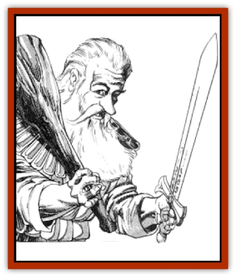

# Gnome - Tinker

| Statistic | **Gnome, Tinker** |
| --- | --- |
| **Activity Cycle:** | Any |
| **Alignment:** | Neutral or lawful good |
| **Armor Class:** | 5 (10) |
| **Climate/Terrain:** | Tropical, subtropical, and temperate/Subterranean |
| **Damage/Attack:** | 1-6 (weapon) |
| **Diet:** | Omnivore |
| **Frequency:** | Rare |
| **Hit Dice:** | 1 |
| **Intelligence:** | Varies (8-18) |
| **Magic Resistance:** | See below |
| **Morale:** | Average (8) |
| **Movement:** | 6 |
| **No. Appearing:** | 40-400 |
| **No. of Attacks:** | 1 |
| **Organization:** | Colony |
| **Size:** | S (3' tall) |
| **Special Attacks:** | See below |
| **Special Defenses:** | See below |
| **THAC0:** | 19 |
| **Treasure:** | M&times;3 (C,Q&times;20) |
| **XP Value:** | Varies |

Tinker [[Gnome|gnomes]] are constantly designing, building, and testing devices for a variety of applications, but their innate incompetence is such that anything their technology can do, magic can usually do more quickly and efficiently.

Tinker gnomes average three feet tall and weigh 45-50 pounds. Females are as large as males. Though short and stocky, tinker gnomes move gracefully, and their hands are deft and sure. They have rich brown skin, curly or straight white hair, china-blue or violet eyes, and straight, cavity-free teeth. Males have soft, curly white beards and moustaches. Both sexes have rounded ears and large noses; they develop facial wrinkles after age 50.

The voice of a tinker gnome resembles that of a human, except the timbre is more nasal. Tinker gnomes speak intensely and rapidly, running their words together in unending sentences. They are capable of listening carefully and speaking at the same time. When two gnomes meet, they babble away, answering questions asked by the other as part of the same continuous sentence. Gnomes have learned to speak slowly and distinctly to other races. If frightened or depressed, a gnome may speak in much shorter sentences than usual.

Tinker gnomes are second only to [[Dwarf_Gully|gully dwarves]] and [[Goblin|goblins]] as the worst dressers on Ansalon. They wear almost anything that is relatively clean. They especially enjoy scarves, shawls, and hard leather footwear. In their research areas, they wear easily cleaned smocks and coats.

**Combat:** Unless they are adventurers, gnomes rarely carry weapons, although some of their tools can be used as weapons. Strange weapons of dubious utility are always being invented. Some, like the three-barrel water blaster, are all but useless, while others, like the multiple spear flinger, show promise.

Hand-held and light crossbows, slings, short bows, darts, and melee weapons that can be hurled, such as hammers and hand axes, are the gnomes' preferred weapons. Squads of gnomes sometimes operate elaborate catapult-type devices to fire boulders, water bags, or garbage at their enemies. Gnomes wear all types of armor, but typically outfit themselves in a variety of mismatched pieces giving them an effective AC of 5.

**Habitat/Society:** Tinker gnomes establish colonies consisting of immense tunnel complexes in secluded mountain ranges. The largest gnome settlement in Ansalon is beneath Mount Nevermind. Other gnome colonies are scattered throughout Krynn in mountainous or rough, hilly regions, but their populations seldom exceed 200-400.

Mount Nevermind is a scene of nonstop activity and noise. Gnomes scurry from place to place while steam blasts, whistles shriek, gears grind, and lights flash. Hundreds of staircases, ramps, pulley elevators, and ladders cross from level to level. Catapults called gnomeflingers serve as rapid transport, as do steam-powered cars mounted on rails. Beneath the city is a complex network of tunnels and mines that spreads in all directions. This ancient tunnel system, also known as the Undercity, contains the lairs of dangerous monsters and pockets of hostile subterranean races. The gnomes use some of the tunnels as dump sites for hazardous wastes.

All tinker gnomes belong to a guild. There are perhaps 50 major guilds and a host of minor ones. Hydraulics, Chemistry, Architecture, Hydrodynamics, Kinetics, Mathematics, Weapons, Mechanical Engineering, and Education are among the more popular guilds. Only the Agricultural and Medical Guilds are concerned with life sciences. Scientific guilds without immediate application, such as Astronomy, are usually small and have little influence. Clerical gnomes originally belonged to the Priests Guild, which was the first and only guild to become extinct. Their functions were eventually absorbed by the Medical and Philosophers Guilds.

All gnomes have a Lifequest: to attain perfect understanding of a sing1e device. Since few have attained this goal, the tinker gnomes are perpetually unfulfilled.

The gnomes are governed by an elected Grand Council of clan leaders and guild masters. The council members serve for life. Methods of election vary from guild to guild and from clan to clan. The government is so heavily laden with bureaucracy that few major decisions are actually rendered by the Grand Council. Most decisions are made by guilds and clans who have their own agendas, regardless of the wishes of the rest of the community. Everyone insists on strict adherence to regulations, but this process is so time-consuming that even gnomes lack the necessary patience.

A gnome has three different names. One is the gnome's true name, which is actually an extensive history of the gnome's entire family tree. Though gnomes can easily remember at least the first few thousand letters of their true names, they use a shorter name for routine communication. This name is a simple listing of the highlights of the gnome's ancestry, requiring only half a minute or so to recite. Humans and other races who deal with gnomes have developed even shorter names for them, consisting of the first one or two syllables of their true names. Gnomes consider these abbreviated names undignified, but have learned to live with them.

Common to any gnomish colony are the sages who record endless volumes of information, guesses, facts, figures, speculations and philosophical doodles detailing their guild committees' various concerns. These records are seldom meaningful to anyone except the authors.

Reorx is the only deity recognized by the tinker gnomes. Though they have no formal religious services, the gnomes have a healthy respect for their god. Reorx is thought of as an unusually large gnome who epitomizes the gnomish love of creating and tinkering, as evidenced by such inventions as the sun and the moons.

Though most gnomes are content to stay home and tinker with their projects, there are some who can be as adventurous as members of any other race. Adventuring gnomes are generally unable to learn from previous experience and repeat the same mistakes, yet they are often successful in developing quirky solutions to save the day for their companions. Adventurer gnomes are general handymen and jacks-of-all-trades; anything and everything draws their attention, causing them to reach for their notebooks or tool belts.

But the vast majority of gnomes are devoted to creating new devices. Gnomish inventions are almost exclusively driven by basic mechanical devices, such as gears, windmills, waterwheels, pulleys, and screws, in unnecessarily complicated arrangements. Their sheer love of technology is their downfall, for they improve their inventions to death. Simple solutions are rejected in favor of redundant and ultimately unworkable complications. Needless to say, gnomish technology has had little impact on the cultures of Ansalon.

**Ecology:** In general, tinker gnomes are not well-liked by other races. Their technological bent makes them quite alien to those accustomed to magic, and their poor understanding of social relations puts off most potential friends. The Agricultural Guild looks after the gnomes' nutritional needs, maintaining fungi growth farms and herds of cave-dwelling sheep. Research into the creation of artificial foods continues, but so far has produced nothing edible.

**Mad Gnomes**

  Mad gnomes look like normal tinker gnomes and have similar abilities, but they have no talent for technology. They are almost always from lands far away from Ansalon. The few mad gnomes who have learned technological skills never do their work properly as far as normal gnomes are concerned - their devices work too well.

All off-world gnomes are considered to be mad gnomes. Krynn gnomes get a yearly dice roll to see if they become mad gnomes. If a 100 is rolled on 1d100, 1d100 is rolled again. If a 100 result occurs again, the gnome becomes a mad gnome. Mad gnomes from Krynn start out with the gnomish technological skills. Off-world mad gnomes have a 1% chance of learning gnomish technological skills during any six-month period spent with normal gnomes; the roll is not cumulative and can be checked only once every six months. Unlike normal tinker gnomes, mad gnomes with technological skills create devices that are elegant and efficient.

Mad gnomes who can use technology get a +3 bonus to any success roll involved in creating a device. Also, the device is automatically 1d6 sizes smaller than a regular gnomish device of this type.

---
## Discovery & Documentation

**Source Publication:** MC4 Dragonlance Appendix (w/binder #2) (1989)
**Campaign Setting:** Dragonlance
**Author(s):** Rick Swan

### Other Creatures Found in This Source Book
   * [[Anemone_Giant_Sea|Anemone, Giant Sea]]
   * [[Bear_Ice|Bear, Ice]]
   * [[Beast_Undead|Beast, Undead]]
   * [[Bird_Krynn|Bird (Krynn)]]
   * [[Disir|Disir]]
   * [[Draconian_Aurak|Draconian, Aurak]]
   * [[Draconian_Baaz|Draconian, Baaz]]
   * [[Draconian_Bozak|Draconian, Bozak]]
   * [[Draconian_Kapak|Draconian, Kapak]]
   * [[Draconian_General_Information|Draconian, General Information]]
   * [[Draconian_Sivak|Draconian, Sivak]]
   * [[Draconian_Proto-_Traag|Draconian, Proto-, Traag]]
   * [[Dragon_Amphi|Dragon, Amphi]]
   * [[Dragon_Astral|Dragon, Astral]]
   * [[Dragon_Kodragon|Dragon, Kodragon]]
   * [[Dragon_Krynn_Othlorx_General_Information|Dragon (Krynn), Othlorx, General Information]]
   * [[Dragon_Krynn_General_Information|Dragon (Krynn), General Information]]
   * [[Dragon_Sea|Dragon, Sea]]
   * [[Dreamshadow|Dreamshadow]]
   * [[Dreamwraith|Dreamwraith]]
   * [[Dwarf_Daergar|Dwarf, Daergar]]
   * [[Dwarf_Hill_Neidar|Dwarf, Hill, Neidar]]
   * [[Dwarf_Mountain_Hylar|Dwarf, Mountain, Hylar]]
   * [[Dwarf_Theiwar|Dwarf, Theiwar]]
   * [[Dwarf_Zakhar|Dwarf, Zakhar]]
   * [[Elf_Half-|Elf, Half-]]
   * [[Elf_High_Qualinesti|Elf, High, Qualinesti]]
   * [[Elf_High_Silvanesti|Elf, High, Silvanesti]]
   * [[Elf_Sea_Dargonesti|Elf, Sea, Dargonesti]]
   * [[Elf_Sea_Dimernesti|Elf, Sea, Dimernesti]]
   * [[Elf_Wild_Kagonesti|Elf, Wild, Kagonesti]]
   * [[Eyewing|Eyewing]]
   * [[Fetch|Fetch]]
   * [[Fire_Minion|Fire Minion]]
   * [[Fireshadow|Fireshadow]]
   * [[Gurik_Cha'ahl|Gurik Cha'ahl]]
   * [[Haunt_Knight|Haunt, Knight]]
   * [[Horax|Horax]]
   * [[Human_Krynn|Human (Krynn)]]
   * [[Imp_Blood_Sea|Imp, Blood Sea]]
   * [[Kalothagh|Kalothagh]]
   * [[Kani_Doll|Kani Doll]]
   * [[Kender|Kender]]
   * [[Kyrie|Kyrie]]
   * [[Lizard_Man_Krynn|Lizard Man (Krynn)]]
   * [[Minotaur_Krynn|Minotaur, Krynn]]
   * [[Ogre_High|Ogre, High]]
   * [[Ogre_Krynn|Ogre (Krynn)]]
   * [[Phaethon|Phaethon]]
   * [[Saqualaminoi|Saqualaminoi]]
   * [[Shadowperson|Shadowperson]]
   * [[Shimmerweed|Shimmerweed]]
   * [[Skrit|Skrit]]
   * [[Spectral_Minion|Spectral Minion]]
   * [[Spider_Krynn|Spider (Krynn)]]
   * [[Stag|Stag]]
   * [[Tayling|Tayling]]
   * [[Thanoi|Thanoi]]
   * [[Tylor|Tylor]]
   * [[Wichtlin|Wichtlin]]
   * [[Wyndlass|Wyndlass]]
   * [[Yaggol|Yaggol]]
