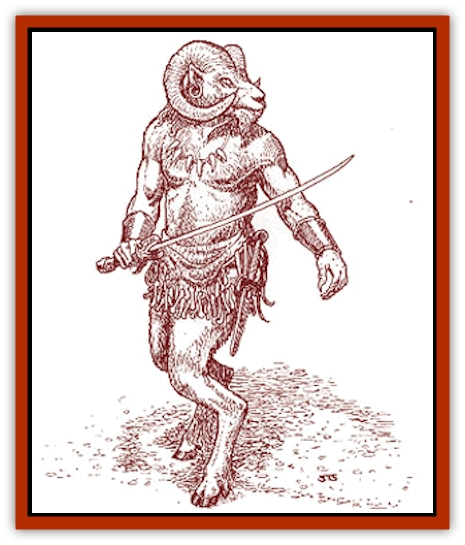

# Goatman

| Statistic | **Goatman** |
| --- | --- |
| **Activity Cycle:** | Day |
| **Alignment:** | Neutral (evil) |
| **Armor Class:** | 5 (7) |
| **Climate/Terrain:** | Mountain |
| **Damage/Attack:** | 1d4 (or by weapon) |
| **Diet:** | Omnivore |
| **Frequency:** | Uncommon |
| **Hit Dice:** | 2+2 |
| **Intelligence:** | Average (8-10) |
| **Magic Resistance:** | Nil |
| **Morale:** | Unsteady (5-7) |
| **Movement:** | 18 |
| **No. Appearing:** | 1d6+4 |
| **No. of Attacks:** | 1 |
| **Organization:** | Clan |
| **Size:** | M (5-6' tall) |
| **Special Attacks:** | Surprise, backstab |
| **Special Defenses:** | Nil |
| **THAC0:** | 19 |
| **Treasure:** | M,N,O (Q&times;10,S,V) |
| **XP Value:** | 175 / Scout: 270 / Patriarch: 650 / Shaman: 975 |

A cross between a man and mountain goat, this creature is native to the Black Mountains east of the City-States, but it is becoming more and more common in the Savage Baronies. Smarter than [[Orc|orcs]] but not as capable as humans, these humanoids still make natural thieves.

Goatmen look like tall, bipedal goats with human arms. They have cloven hooves and powerful lower legs, but their torsos are vaguely humanoid with slender arms jointed like those of humans. The head is that of a mountain goat, with horns growing in a tight curl on each side. Except for the arms, the entire body of a goatman is covered with short, wooly fur ranging in color from white to black. Their hair grows long and shaggy on the head and down the back, separated into braids with decorative beads and leather strips.

Goatmen have a language with so many different dialects that many of them have trouble communicating with each other. However, most of them know common, speaking with a naturally rough and hoarse voice.

**Combat:** Goatmen move with both speed and stealth, allowing them to appear from an unexpected direction (-1 penalty to opponent's surprise roll). In a fight, goatmen rely more on Dexterity than Strength. If a goatman attacks from behind and gains surprise, it is allowed to make a backstab as per the thief special ability. This free attack is made before initiative is rolled. On a rear attack, a goatman gains a +4 bonus to its attack roll and ignores the defender's Armor Class Dexterity adjustment. Most goatmen inflict double damage with this strike, but scouts and goatman leaders inflict triple damage.

Goatmen favor smaller weapons such as daggers, crude short swords, clubs, and maces. A goatman can never wield a two-handed sword or any bow other than a light crossbow. However, goatmen can use firearms. Goatmen also have a natural +1 attack bonus when attacking with a dagger or knife. Very few of them possess qualms about using poison, but it is difficult for them to attain.

Ramming is a natural ability of the goatman, employed in combat only if the conditions are right. Their horns are not suited for goring though incredible strong, and the thick neck muscles of a goatman allow him to absorb incredible amounts of force with no negative effect. Ramming requires a running start and only causes 1d4 points of damage. However, the force of the blow forces the victim to make a Dexterity check with a -6 penalty (if the victim is surprised, no check is allowed). A failed check indicates that the victim is shoved forward 1d10 feet and automatically falls. This attack is most useful when a person is standing within a few feet from the edge of a cliff or very steep slope.

A small number of goatmen (5%) follow a different path from the rest, learning primitive clerical magic. These goatman shamans lose the backstab ability but still use the same weapons as a regular goatman. These shamans are treated as 5th-level priests. With a shaman present, goatman morale increases to Average (8-10).

Using their fast movement and stealth, goatmen usually make a coordinated effort to take advantage of their backstab ability. Sometimes, a small group appears ahead of the victims to make noise and draw attention away from the goatmen coming up from behind. If victory is not assured after the first few rounds of fighting, the goatman leader will call for a retreat. A second attack will proceed much like the first, but with a stronger diversionary force. The third attack will almost always be a normal battle, with no surprises. A goatman leader will not usually commit his people to a fight unless they possess overwhelming numbers.

Powerful lower legs, sharp hooves, and incredible balance allow goatmen to traverse steep mountain terrain with no detriment to their Movement Rate. At times, they can leap five feet straight up. Goatmen move at half their normal Movement Rate when moving through swampy or marshy ground.

**Habitat/Society:** Goatmen are natives of the Black Mountains that lay to the east of the City-States. They live in small communities formed around a family patriarch or matriarch, numbering anywhere from 20 to 50 members per clan. The one patriarch (or matriarch) is considered a 5th-level thief, though 1 out of every 10 goatmen is likely to be of similar experience. Another 3 of every 10 are considered 3rd-level thieves (scouts), and 1 of every 20 is a clan shaman. These numbers hold fairly true whether encountering a goatman clan or a traveling band.

Clans might lay claim to a particular mountain valley or summit, controlling the terrain for several miles in any direction, but they always remain ready to move should game get too scarce to feed them or a neighboring clan too powerful to deal with. The clans are fierce rivals, often fighting over borders. In hard times, one clan might try to raid another, but generally the weaker clan moves on to a better location before this happens.

Goatmen try to live near caves, which they use for emergency shelter or a common meeting place. They build simple stone dwellings for each mated couple and their immediate family, usually with a heavy thatch roof. Goatmen raise crops but do not tend them very well; they also hunt for wild game. Occasionally a clan will keep pigs and horses for food.

Evening meals are often a community event, with the patriarch deciding who should supply food and a clan shaman leading the festivities. Goatmen play a variety of simple instruments, and their music is very enthusiastic if not exactly beautiful. They love to sing and dance and will often build up a huge bonfire to supply light for their revelry, which can last well into the night.

In the face of deprivation, the clans sometimes put their differences aside to work together. This usually results in a large raiding force that comes down out of the Black Mountains to attack farms and villages of the eastern City-States, or perhaps the nation of Hule. Currently, under the leadership of Gr'anth Mountainwalker (9th-level thief, 5th-level shaman), several clans are waging a merciless guerrilla war to rid the hills northwest of Zvornik of all [[Goblin|goblins]].

At times, small bands of goatmen and even individuals enter the lands of the Savage Coast, seeking work, fortune, and mischief. Goatmen are rare in the Savage Baronies, and are very rare east of Renardy. Their reputation precedes them, so goatmen are not particularly welcome, except by those who are in need of such unscrupulous sorts. However, goatmen are not persecuted except in the Baronia de Narvaez where they are thought to be "spawns of fiends". Goatmen also have a natural dislike for [[Dog|dogs]], straining relations with the [[Lupin|lupins]] of Renardy.

**Legends:** An ancient tale tells of a wealthy mountain city called Bielagul, which was once ruled by goatmen. When it fell, due to either outside invasion or the disfavor of the Immortals, the goatmen were scattered throughout the Black Mountains.

Over the years, adventurers have returned from the Black Mountains with tales of the ruins of a grand city they discovered. Organized searches have met with little success over the years, however.

The goatmen devoutly believe in the existence of this city, and several clans think that the city is near their territory. Gr'anth Mountainwalker, current warleader of the clans, claims to have visited the city and promises to return the goatmen to it one day. Many think that the City-State of Zvornik has promised to aid Gr'anth in this cause in return for clearing out the nearby goblins. Even if such a promise were made, it seems likely that Zvornik will abandon any ties to this barbarous race once the goblins are eradicated.

**Ecology:** In large numbers, goatmen strain any environment. They overhunt regions and their farming methods leach away the soil's nutrients. They fight against any race that appears weak and, often, among themselves. The only qualities that the goatmen have to offer other races are their roguish skills.

Often, goatmen are also hunted for their value to alchemists and wizards. The tongue of a goatman can be made into a *philter of glibness*, and a special assortment of muscles from the arms and legs can be enchanted and formed into *bracers of dexterity*. Other parts of these creatures are also reported to have special uses - the inner ear workings having to do with superior balance, and their horn with various *armor* spells.

---
## Discovery & Documentation

**Source Publication:** Monstrous Compendium Savage Coast Appendix (Online Exclusive) (1995)
**Campaign Setting:** Mystara
**Author(s):** Loren L Coleman, Ted James, Thomas Zuvich, Cindi M. Rice

### Other Creatures Found in This Source Book
   * [[Aranea_Savage_Coast|Aranea (Savage Coast)]]
   * [[Arashaeem|Arashaeem]]
   * [[Batracine|Batracine]]
   * [[Cat_Marine|Cat, Marine]]
   * [[Cinnavixen|Cinnavixen]]
   * [[Clockwork_Swordsman|Clockwork Swordsman]]
   * [[Critter_Temple|Critter, Temple]]
   * [[Cursed_One|Cursed One]]
   * [[Deathmare|Deathmare]]
   * [[Dragon_Savage_Coast_Crimson|Dragon (Savage Coast), Crimson]]
   * [[Dragon_Savage_Coast_Red_Hawk|Dragon (Savage Coast), Red Hawk]]
   * [[Echyan|Echyan]]
   * [[Ee'aar|Ee'aar]]
   * [[Enduk|Enduk]]
   * [[Fachan_Savage_Coast|Fachan (Savage Coast)]]
   * [[Feliquine|Feliquine]]
   * [[Fiend_Narvaezan|Fiend, Narvaezan]]
   * [[Frelôn|Frelôn]]
   * [[Ghriest|Ghriest]]
   * [[Glutton_Sea|Glutton, Sea]]
   * [[Golem_Naâruk|Golem, Naâruk]]
   * [[Golem_Savage_Coast|Golem (Savage Coast)]]
   * [[Grudgling|Grudgling]]
   * [[Heraldic_Servant_I|Heraldic Servant I]]
   * [[Heraldic_Servant_II|Heraldic Servant II]]
   * [[Heraldic_Servant_III|Heraldic Servant III]]
   * [[Heraldic_Servant_IV|Heraldic Servant IV]]
   * [[Heraldic_Servant_V|Heraldic Servant V]]
   * [[Heraldic_Servant_General_Information|Heraldic Servant, General Information]]
   * [[Hermit_Sea|Hermit, Sea]]
   * [[Jorri|Jorri]]
   * [[Juhrion|Juhrion]]
   * [[Kla'a-tah|Kla'a-tah]]
   * [[Leech_Legacy|Leech, Legacy]]
   * [[Lich_Inheritor|Lich, Inheritor]]
   * [[Lizard_Kin_Savage_Coast|Lizard Kin (Savage Coast)]]
   * [[Lupasus|Lupasus]]
   * [[Lupin|Lupin]]
   * [[Lyra_Bird_Saragón|Lyra Bird, Saragón]]
   * [[Malfera|Malfera]]
   * [[Manscorpion_Nimmurian|Manscorpion, Nimmurian]]
   * [[Mythuínn_Folk|Mythuínn Folk]]
   * [[Neshezu|Neshezu]]
   * [[Nikt'oo|Nikt'oo]]
   * [[Nosferatu|Nosferatu]]
   * [[Omm-wa|Omm-wa]]
   * [[Omshirim|Omshirim]]
   * [[Parasite_Savage_Coast|Parasite (Savage Coast)]]
   * [[Phanaton|Phanaton]]
   * [[Plant_Savage_Coast|Plant (Savage Coast)]]
   * [[Pudding_Vermilion|Pudding, Vermilion]]
   * [[Rakasta|Rakasta]]
   * [[Ray_Forest|Ray, Forest]]
   * [[Shedu_Greater_Savage_Coast|Shedu, Greater (Savage Coast)]]
   * [[Shimmerfish|Shimmerfish]]
   * [[Skinwing|Skinwing]]
   * [[Spawn_of_Nimmur|Spawn of Nimmur]]
   * [[Spider-spy|Spider-spy]]
   * [[Spirit_Heroic|Spirit, Heroic]]
   * [[Spirit_Walleran|Spirit, Walleran]]
   * [[Succulus|Succulus]]
   * [[Swampmare|Swampmare]]
   * [[Symbiont_Shadow|Symbiont, Shadow]]
   * [[Tortle|Tortle]]
   * [[Troll_Legacy|Troll, Legacy]]
   * [[Trosip|Trosip]]
   * [[Tyminid|Tyminid]]
   * [[Utukku|Utukku]]
   * [[Voat|Voat]]
   * [[Voat_Herathian|Voat, Herathian]]
   * [[Vulturehound|Vulturehound]]
   * [[Wallara|Wallara]]
   * [[Wurmling|Wurmling]]
   * [[Wynzet|Wynzet]]
   * [[Yeshom|Yeshom]]
   * [[Zombie_Red|Zombie, Red]]
