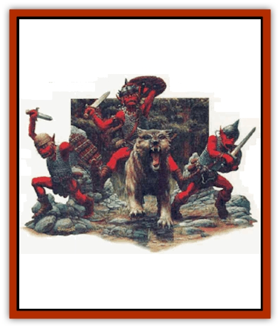

# Goblin - Cerilia

| Statistic | **Goblin (Cerilia)** |
| --- | --- |
| **Activity Cycle:** | Any |
| **Alignment:** | Lawful evil |
| **Armor Class:** | Common: 7 (10) / Elite: 5 (10) / Huge: 3 (10 |
| **Climate/Terrain:** | Any |
| **Damage/Attack:** | By weapon (+1 huge) |
| **Diet:** | Carnivore |
| **Frequency:** | Common |
| **Hit Dice:** | Common: 1-1 / Elite: 1+1 / Huge: 3+l |
| **Intelligence:** | Low to High (8-14) |
| **Magic Resistance:** | Nil |
| **Morale:** | Average to Elite (10-14) |
| **Movement:** | 6 |
| **No. Appearing:** | 4-24 (60-360 in settlement) |
| **No. of Attacks:** | 1 |
| **Organization:** | Clan or tribe |
| **Size:** | Common: S (4' tall) / Elite: M (6' tall) / Huge: L (7' tall) |
| **Special Attacks:** | Nil |
| **Special Defenses:** | Nil |
| **THAC0:** | Common: 20 / Elite: 19 / Huge: 17 |
| **Treasure:** | K (C) |
| **XP Value:** | 35, 65, or 120 |

Goblins are common in Cerilia, controlling numerous kingdoms in the more desolate and dangerous parts of the land. In this world, all races of goblin kind are considered one species, despite large variations in size, strength, and appearance:

<ul><li>Common goblins are generally equal to the [[Goblin|goblins]] desnibed in the Monstrous Manual Tome, they make up about 50% of the goblin tribes;</li><li>Elite goblins are roughly equal to [[Hobgoblin|hobgoblins]], and account for about 30% of the population;</li><li>Huge goblins are equivalent to [[Bugbear|bugbears]], and make up about 20% of the tribes.</li></ul>Regardless of size, all goblins are identified by their squat, bandylegged builds. flat faces, pointed ears, and wide mouths filled with sharp teeth. Their skin color ranges from grayish-green to dull brown, and their eyes tend to glow with a reddish, evil light when they're agitated.

All goblins speak one language, although significant variations in dialect exist from clan to clan.

**Combat:** Cerilian goblins aren't hindered by sunlight, although they prefer overcast days. They have infravision to a range of 60 feet. Common goblins usually wear Ieather armor and carry shields, but will use heavier scale or chain mail when they can get it. Elite goblins and wolfriders wear scale mail, and huge goblins often wear banded or splint mail. All goblins favor spears, polearms, morning stars, axes, maces, and short swords. Most common goblins prefer to fight as skirmishers, slingers, or archers.

**Habitat/Society:** Goblins live in clan steadings with a dozen or more extrnded families (6d6x10 individuals) sharing a small hill fort. Goblin society represses females, who are expected to take care of most domestic tasks; this includes supervising slavse and captives. Goblins trade slaves between clans often. and frequently mount raids in search of more captives.

Goblm leaders make up about 5% of the population and can be classed NPCs, as shown.

|  | Fighter | Priest | Magician | Thief |
| --- | --- | --- | --- | --- |
| Common | 1st-4th | 1st-4th | 1st-4th | 1st-10th |
| Elite | 1st-4th | 1st-4th | 1st-4th | 1st-8th |
| Huge | 3rd-10th | 1st-4th | 1st-3rd | - |

These leaders will have abilities and magical items appropriate to their class and level. About 90% of classed goblins are fighters, priests, and thieves; magicians are extremely rare.

Goblins domesticate [[Wolf|wolves]], and most goblin steadings are guarded by 2d4 wolves per 50 goblins. About 25% of such wolves are [[Wolf|dire wolves]]; common goblins can ride these creatures.

**Ecology:** Goblins rarely engage in farming, but they commonly tend livestock. Leather, dried beef, and mining products are their chief exports. Goblin states tend to be warlike and aggressive, raiding nearby lands, hiring out as mercenaries, or demanding heavy tolls from passing merchants.

The Five Peaks, Thurazor, Markazor, Urga-Zai, and Kal Kalathor are all held by goblins. Some of these states are recognized by their human or demihuman neighbors as true kingdoms. No one likes having goblins for neighbors, but in some cases, there are too many goblins for the humans to seriously consider clearing them out.

---
## Discovery & Documentation

**Source Publication:** Monstrous Compendium, 1996 Annual, Volume 3 (1995)
**Campaign Setting:** Advanced Dungeons & Dragons 2nd Edition
**Author(s):** Jon Pickens

### Other Creatures Found in This Source Book
   * [[Alaghi|Alaghi]]
   * [[Alhoon|Alhoon]]
   * [[Aranea_Savage_Coast|Aranea (Savage Coast)]]
   * [[Arcane_Head|Arcane Head]]
   * [[Banedead|Banedead]]
   * [[Banelich|Banelich]]
   * [[Bat_Bonebat|Bat, Bonebat]]
   * [[Beetle|Beetle]]
   * [[Belgoi|Belgoi]]
   * [[Bladeling|Bladeling]]
   * [[Braxat|Braxat]]
   * [[Bunyip|Bunyip]]
   * [[Burbur|Burbur]]
   * [[Bvanen|Bvanen]]
   * [[Cat_Great_Snow_Tiger|Cat, Great, Snow Tiger]]
   * [[Chosen_One|Chosen One]]
   * [[Chronovoid|Chronovoid]]
   * [[Cildabrin|Cildabrin]]
   * [[Coffer_Corpse|Coffer Corpse]]
   * [[Disenchanter|Disenchanter]]
   * [[Dog_Temporal|Dog, Temporal]]
   * [[Dragon_Cerilia|Dragon (Cerilia)]]
   * [[Dragon_Ghost|Dragon, Ghost]]
   * [[Dragon_Lesser_Undead|Dragon, Lesser Undead]]
   * [[Dragon_Neutral_Amber|Dragon, Neutral, Amber]]
   * [[Dread_Warrior|Dread Warrior]]
   * [[Dreamweaver|Dreamweaver]]
   * [[Dream_Spawn_Greater_Ennui|Dream Spawn, Greater, Ennui]]
   * [[Dream_Spawn_Lesser_Morph|Dream Spawn, Lesser, Morph]]
   * [[Dwarf_Arctic|Dwarf, Arctic]]
   * [[Dwarf_Urdunnir|Dwarf, Urdunnir]]
   * [[Eel_Giant_Moray|Eel, Giant Moray]]
   * [[Elemental_Fire_Kin_Tome_Guardian|Elemental, Fire Kin, Tome Guardian]]
   * [[Elf_Rockseer|Elf, Rockseer]]
   * [[Ethyk|Ethyk]]
   * [[Faerie_Faerie_Fiddler|Faerie, Faerie Fiddler]]
   * [[Faerie_Petty_Bramble|Faerie, Petty, Bramble]]
   * [[Faerie_Petty_Gorse|Faerie, Petty, Gorse]]
   * [[Faerie_Petty|Faerie, Petty]]
   * [[Firenewt|Firenewt]]
   * [[Formian|Formian]]
   * [[Gargoyle_II|Gargoyle II]]
   * [[Giant_Cerilia|Giant (Cerilia)]]
   * [[Golem_Magic|Golem, Magic]]
   * [[Golem_Shaboath|Golem, Shaboath]]
   * [[Hag_Bheur|Hag, Bheur]]
   * [[Hamadryad|Hamadryad]]
   * [[Hound_of_Ill-Omen|Hound of Ill-Omen]]
   * [[Human_Cerilia|Human (Cerilia)]]
   * [[Hybsil|Hybsil]]
   * [[Ibrandlin|Ibrandlin]]
   * [[Imp_Chaos|Imp, Chaos]]
   * [[Ixitxachitl_Ixzan|Ixitxachitl, Ixzan]]
   * [[Jabberwock|Jabberwock]]
   * [[Kyton|Kyton]]
   * [[Kyuss_Son_of|Kyuss, Son of]]
   * [[Lillend|Lillend]]
   * [[Life-Shaped_Creation_Guardian|Life-Shaped Creation, Guardian]]
   * [[Life-Shaped_Creation_Transport|Life-Shaped Creation, Transport]]
   * [[Lycanthrope_Werecrocodile|Lycanthrope, Werecrocodile]]
   * [[Lycanthrope_Werespider|Lycanthrope, Werespider]]
   * [[Magedoom|Magedoom]]
   * [[Manotaur|Manotaur]]
   * [[Mastiff_Shadow|Mastiff, Shadow]]
   * [[Meazel|Meazel]]
   * [[Mist_Scarlet_Dancer|Mist, Scarlet Dancer]]
   * [[Needleman|Needleman]]
   * [[Orc_Neo-Orog|Orc, Neo-Orog]]
   * [[Orc_Ondonti|Orc, Ondonti]]
   * [[Owlbear_II|Owlbear II]]
   * [[Pegataur|Pegataur]]
   * [[Phaerimm|Phaerimm]]
   * [[Reggelid|Reggelid]]
   * [[Render|Render]]
   * [[Saurial|Saurial]]
   * [[Scalamagdrion|Scalamagdrion]]
   * [[Sharn|Sharn]]
   * [[Snake_Messenger|Snake, Messenger]]
   * [[Spirit_Forest_Uthraki|Spirit, Forest, Uthraki]]
   * [[Spirit_Forest_Wood_Man|Spirit, Forest, Wood Man]]
   * [[Spirit_Ice_Orglash|Spirit, Ice, Orglash]]
   * [[Spirit_Rock_Thomil|Spirit, Rock, Thomil]]
   * [[Strider_Giant|Strider, Giant]]
   * [[Tembo|Tembo]]
   * [[Temporal_Glider|Temporal Glider]]
   * [[Temporal_Stalker|Temporal Stalker]]
   * [[Tether_Beast|Tether Beast]]
   * [[Thessalmonster|Thessalmonster]]
   * [[Time_Dimensional|Time Dimensional]]
   * [[Tomb_Tapper|Tomb Tapper]]
   * [[Undead_Dragon_Slayer|Undead Dragon Slayer]]
   * [[Unicorn_Black_Toril|Unicorn, Black (Toril)]]
   * [[Vaath|Vaath]]
   * [[Vortex_Spider|Vortex Spider]]
   * [[Weredragon|Weredragon]]
   * [[Zhentarim_Spirit|Zhentarim Spirit]]
