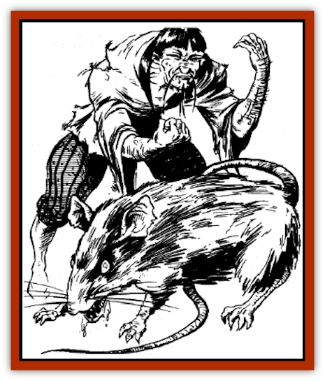

# Goblin Rat

| Statistic | **Goblin Rat** |
| --- | --- |
| **Activity Cycle:** | Night |
| **Alignment:** | Lawful evil |
| **Armor Class:** | 7 |
| **Climate/Terrain:** | Tropical, subtropical, and temperate plain, forest, hill, and mountain |
| **Damage/Attack:** | 1-8 or by weapon |
| **Diet:** | Omnivore |
| **Frequency:** | Rare |
| **Hit Dice:** | 3 |
| **Intelligence:** | Low to average (5-10) |
| **Magic Resistance:** | 10% |
| **Morale:** | Average (10) |
| **Movement:** | 9 |
| **No. Appearing:** | 1-20 |
| **No. of Attacks:** | 1 |
| **Organization:** | Pack |
| **Size:** | S (3-4' tall) |
| **Special Attacks:** | Nil |
| **Special Defenses:** | Shape change |
| **THAC0:** | 17 |
| **Treasure:** | B |
| **XP Value:** | 270 |

The goblin rat is a repulsive, disease-ridden shapechanger and a cousin of the [[Hengeyokai|hengeyokai]].

Unlike the hengeyokai, the goblin rat can assume only two forms: animal and humanoid. In its animal form, it looks like a [[Rat|giant rat]], about 3 feet from nose to rump with a lean body and black or brown fur. Its hairless tail is nearly as long as its body. It has pointed ears, beady red or black eyes, and a mouth filled with sharp fangs. In its humanoid form, it appears as a ratman - a short human with a wiry body, thin moustache, greasy skin, and darting eyes.

Goblin rats do not have their own language, but they speak the trade language as well as any languages common to their immediate area. They can speak only in humanoid form.

**Combat:** Goblin rats almost always prefer flight to combat, even when their lairs are threatened. However, when cornered or hungry, goblin rats will fight ferociously.

In either form, the goblin rat retains all its hit points and abilities. Changing forms requires one full round, during which the creature can take no other actions. Armor and equipment do not change form along with the goblin rat. When changing from humanoid to animal form, all weapons and armor fall from its body to the ground.

While in animal form, a goblin rat cannot use weapons or armor. It attacks with its bite instead. Each successful hit inflicts 1-8 points of damage and has a 5% chance of transmitting a disease to the victim. Cholera, plague, and fevers are the diseases most commonly transmitted.

In its ratman (humanoid) form, a goblin rat cannot inflict damage with its bite. It can use weapons and armor, however. It favors spears, naginata, and two-handed swords. For armor, it prefers studded leather and ring mail (yeilding AC 6).

When 10 or more goblin rats are encountered, one of the creatures serves as king of the group. The king has 5 HD, AC 4, and - in rat form - bites to inflict 3-11 (1d8 +2) points of damage. In humanoid form, the king typically wields a two-handed sword.

The goblin rat is terrified of all cats and catlike creatures. When facing such felines, it must make a saving throw vs. paralyzation. Goblin rats who fail their saving throw flee in panic for one full turn; those who succeed are unaffected by the feline's presence. Feline creatures gain a +1 bonus to all attack rolls when fighting goblin rats. (This bonus stems from the antipathy between the two creatures and the goblin rat's extreme fear.) Such is the extent of this fear that even lifelike paintings of cats can protect a household from goblin rats. (A painting is considered to be sufficiently lifelike if it is a painting of quality and has been created for the express purpose of keeping away goblin rats.)

**Habitat/Society:** Goblin rats live on the fringes of human settlements. They usually dwell in abandoned huts, deserted temples, or other buildings from which they have driven the former owners. A typical rat pack is an extended family of 1-10 adult males, an equal number of adult females (as dangerous as males), and a number of young equal to the total number of adults.

The largest male adult is the self-declared king. He maintains absolute authority over the pack. If the king is challenged by another male rat in the pack, they duel to the death in their animal forms, with the winner assuming the kingly duties.

Under the cover of night, goblin rat packs make raids into human villages to steal food and livestock. Occasionally, they also prey on lone travelers. Goblin rats hoard sizeable treasure, including coins, gems, and other shiny trinkets, which they usually bury in deep holes behind their lairs.

**Ecology:** Goblin rats eat whatever morsels they can scrounge. Hunting is not their forte, so they prefer easy, domisticated prey such as pigs, sheep, and horses. They also enjoy fruits and grains.

Goblin rats are symbols of cowardice and deviousness. Because of the diseases they carry, they are not considered desirable company by other creatures. [[Oni|Oni]] have been known to employ them as servants, however. The flesh of this creature is inedible. Some folk consider the whiskers to be an effective cure for baldness, and create a tonic by boiling the whiskers in water.

---
## Discovery & Documentation

**Source Publication:** MC6 Kara-Tur Appendix (1990)
**Campaign Setting:** Kara-Tur (Forgotten Realms)
**Author(s):** Rick Swan

### Other Creatures Found in This Source Book
   * [[Bajang|Bajang]]
   * [[Bakemono|Bakemono]]
   * [[Bisan|Bisan]]
   * [[Buso|Buso]]
   * [[Carp_Giant|Carp, Giant]]
   * [[Centipede_Spirit|Centipede, Spirit]]
   * [[Chu-u|Chu-u]]
   * [[Con-tinh|Con-tinh]]
   * [[Doc_cu'o'c|Doc cu'o'c]]
   * [[Duruch'i-lin|Duruch'i-lin]]
   * [[Flame_Spirit|Flame Spirit]]
   * [[Foo_Creature|Foo Creature]]
   * [[Gaki|Gaki]]
   * [[Gargantua|Gargantua]]
   * [[Hai_Nu|Hai Nu]]
   * [[Hannya|Hannya]]
   * [[Hengeyokai|Hengeyokai]]
   * [[Hsing-sing|Hsing-sing]]
   * [[Hu_Hsien|Hu Hsien]]
   * [[Human_Kara-Tur|Human (Kara-Tur)]]
   * [[Ikiryo|Ikiryo]]
   * [[Jishin_Mushi|Jishin Mushi]]
   * [[Kala|Kala]]
   * [[Kaluk|Kaluk]]
   * [[Kappa|Kappa]]
   * [[Korobokuru|Korobokuru]]
   * [[Krakentua|Krakentua]]
   * [[Kuei|Kuei]]
   * [[Memedi|Memedi]]
   * [[Men-shen|Men-shen]]
   * [[Nat|Nat]]
   * [[Ningyo|Ningyo]]
   * [[Oni|Oni]]
   * [[P'oh|P'oh]]
   * [[P'oh_Gohei|P'oh, Gohei]]
   * [[Shan_Sao|Shan Sao]]
   * [[Shirokinukatsukami|Shirokinukatsukami]]
   * [[Spirit_Folk|Spirit Folk]]
   * [[Spirit_Nature|Spirit, Nature]]
   * [[Spirit_Stone|Spirit, Stone]]
   * [[Tako|Tako]]
   * [[Tengu|Tengu]]
   * [[Wang-Liang|Wang-Liang]]
   * [[Yuan-ti_Histachii|Yuan-ti, Histachii]]
   * [[Yuki-on-na|Yuki-on-na]]
