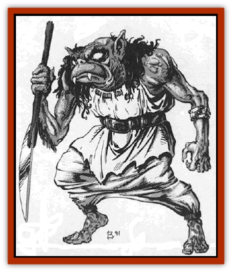

# Goblyn

| Statistic | **Goblyn** |
| --- | --- |
| **Activity Cycle:** | Any |
| **Alignment:** | Neutral evil |
| **Armor Class:** | 4 |
| **Climate/Terrain:** | Any |
| **Damage/Attack:** | 1d6/1d6 or 2d6 |
| **Diet:** | Carnivorous |
| **Frequency:** | Rare |
| **Hit Dice:** | 4+4 |
| **Intelligence:** | Low (5-7) |
| **Magic Resistance:** | 10% |
| **Morale:** | Special/Fearless (20) |
| **Movement:** | 12 |
| **No. Appearing:** | 3-24 (3d8) |
| **No. of Attacks:** | 2 or 1 |
| **Organization:** | Servant |
| **Size:** | M (4-6') |
| **Special Attacks:** | Special |
| **Special Defenses:** | Nil |
| **THAC0:** | 13 |
| **Treasure:** | Nil |
| **XP Value:** | 975 |

Goblyns are hideous creatures with slightly bloated heads, pointed ears, and glowing red eyes. They have long, mangy hair which grows only on the back of their head and necks. About half of their face is taken up with a wide mouth full of needle-sharp teeth.

These creatures are formed by powerful evil magical items and spells which transform humans into these twisted beings. This transformation causes them to become very evil and totally submissive to their master's every whim.

Goblyns have a telepathic link with their master and, through him, with all of the other goblyns he controls.

**Combat:** Goblyns are very nimble creatures causing a -2 adjustmeet to their opponent's surprise roll. Furthermore, when a goblyn is unexpectedly encountered, it will suddenly flash its teeth and leer at its opponent's face in a terribly frightening manner. A fear check is required the first time this is encountered. In any event, this action causes a -4 penalty to surprise. Those surprised will be so stricken with fear that they will be unable to move that round.

Goblyns seldom attack with weapons. Instead, they strike an their victim's throat with their clawed hands. Each successful claw attack inflicts 1d6 points of damage. If both of their claws hit, the goblin is assumed to have gotten a solid hold on the target's neck. On each subsequent round, the victim will be bitten (usually in the face) for an additional 2-12 (2d6) hits. In addition, the victim will have difficulty breathing and must make a saving throw versus spells or suffer an additional 1d4 points of suffocation damage. Both of these attacks are assumed to be automatic hits. The goblins refer to this as "feasting", and it is so frightening to observe that all who see someone attacked in this manner must make a horror check.

In additions for every 10 points of feasting damage done, the victim will suffer a permanent -1 adjustment to their Charisma due to facial scars and deformity.

Any attacks made by someone who has a goblyn at his throat suffers a -3 penalty on all attack or damage rolls and saving throws. Others who are striking at a goblyn which is "feasting" gain a +2 on their attack and damage rolls while its attention is focused on its victim.

Goblyns are similar to undead creatures in that they never check morale.

All goblins have the ability to move silently (80%), hide in shadows (70%), and climb wails (25%). They have infravision which functions at a range of 90 feet.

**Habitat/Society:** Goblyns are totally controlled by their master's desires. If they are told to attack another of their kind, they will do so without pity. They never instigate combat on their own, but eagerly leap to the attack if challenged or instructed to do so. Goblyns have no apparent desires other than to fulfill their master's every whim with an emotionless devotion.

Goblyns do not sleep, tire, or become bored. Furthermore, they can go for a considerable amount of time without food or drink.

**Ecology:** Goblyns are strict carnivores. They will eat only freshly killed meat, in addition to drinking the blood of their victims.

Goblyns are often sought after by certain wizards and priests, for they are useful as components in spells and magical items that control humans.

---
## Discovery & Documentation

**Source Publication:** MC10 Ravenloft Appendix I (1989)
**Campaign Setting:** Planescape
**Author(s):** William W. Connors

### Other Creatures Found in This Source Book
   * [[Bastellus|Bastellus]]
   * [[Bat_Ravenloft|Bat (Ravenloft)]]
   * [[Bowlyn|Bowlyn]]
   * [[Broken_One|Broken One]]
   * [[Bussengeist|Bussengeist]]
   * [[Darkling|Darkling]]
   * [[Doom_Guard|Doom Guard]]
   * [[Doppelganger_Plant|Doppelganger Plant]]
   * [[Elemental_Ravenloft|Elemental (Ravenloft)]]
   * [[Ermordenung|Ermordenung]]
   * [[Ghoul_Lord|Ghoul Lord]]
   * [[Golem_III|Golem III]]
   * [[Golem_IV|Golem IV]]
   * [[Golem_Ravenloft|Golem (Ravenloft)]]
   * [[Grim_Reaper|Grim Reaper]]
   * [[Human_Abber_Nomad|Human, Abber Nomad]]
   * [[Human_Ravenloft|Human (Ravenloft)]]
   * [[Imp_Assassin|Imp, Assassin]]
   * [[Impersonator|Impersonator]]
   * [[Lycanthrope_Werebat|Lycanthrope, Werebat]]
   * [[Lycanthrope_Wereraven|Lycanthrope, Wereraven]]
   * [[Mist_Horror|Mist Horror]]
   * [[Mummy_Greater|Mummy, Greater]]
   * [[Quevari|Quevari]]
   * [[Quickwood|Quickwood]]
   * [[Ravenkin|Ravenkin]]
   * [[Reaver|Reaver]]
   * [[Scarecrow_Ravenloft|Scarecrow (Ravenloft)]]
   * [[Shadow_Fiend|Shadow Fiend]]
   * [[Skeleton_Giant|Skeleton, Giant]]
   * [[Strahd's_Skeletal_Steed|Strahd's Skeletal Steed]]
   * [[Treant_Evil|Treant, Evil]]
   * [[Treant_Undead|Treant, Undead]]
   * [[Valpurgeist|Valpurgeist]]
   * [[Vampire_Dwarf|Vampire, Dwarf]]
   * [[Vampire_Elf|Vampire, Elf]]
   * [[Vampire_Gnome|Vampire, Gnome]]
   * [[Vampire_Halfling|Vampire, Halfling]]
   * [[Vampire_General_Information|Vampire, General Information]]
   * [[Vampire_Kender|Vampire, Kender]]
   * [[Vampyre|Vampyre]]
   * [[Widow_Red|Widow, Red]]
   * [[Wolfwere_Greater|Wolfwere, Greater]]
   * [[Zombie_Lord|Zombie Lord]]
