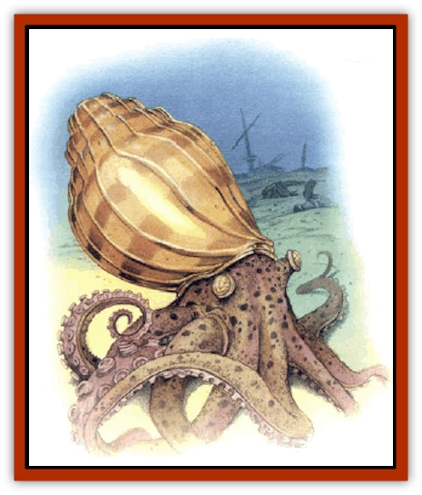

# Golden Ammonite

| Statistic | **Dragon Variety** | **Toril Variety** |
| --- | --- | --- |
| **Activity Cycle:** | Any | Any |
| **Alignment:** | Neutral | Neutral |
| **Armor Class:** | 2/8 | 6 (shell), 8 (arms/head) |
| **Climate/Terrain:** | Ocean depths | Oceanic canyons over 1,000' deep |
| **Damage/Attack:** | 1d4 (&times;10) | 1-4 each tentacle |
| **Diet:** | Scavenger? | Scavenger |
| **Frequency:** | Very rare | Very rare |
| **Hit Dice:** | 8+3 | 8+3 |
| **Intelligence:** | Semi- (2-4) | Semi- (2-4) |
| **Magic Resistance:** | 90% | 90% |
| **Morale:** | Champion (15-16) | Average (10) |
| **Movement:** | 1 | 1 |
| **No. Appearing:** | 1-3 | 1-3 |
| **No. of Attacks:** | 10 | 10 |
| **Organization:** | Solitary | Solitary |
| **Size:** | L (6-8' shell diameter; 12' tentacles) | L (6' shell, 8-12' tentacles) |
| **Special Attacks:** | Blinding, constriction | Blinding, draining |
| **Special Defenses:** | Immune to psionics | Immune to psionic attack, telepathy, <i>ESP</i>, and all enchantment/charm spells; takes half damage from blunt weapons and cold-based attacks; can regenerate; cannot be surprised in its environment |
| **THAC0:** | 11 | 11 |
| **Treasure:** | Special (shell) | Special |
| **XP Value:** | 6,000 | 8,000 |

## Toril Variety

In oceanic abysses, where light never penetrates, lives a species of large-shelled mollusk that feeds upon the debris and minerals on the sea floor. Gold is extracted from the sludgy silt of the ocean floors that this monster consumes. This metal is then deposited on the creature's shell, creating an eerily beautiful coiled wonder that gives this beast its name, the golden ammonite. The exposed parts of the golden ammonite's soft body are dark brown with spots of black. The shell is, of course, brilliant, pure gold.

**Combat:** Each of these monsters has two fist-sized, multifaceted eyes that project on stalks just beyond the rim of its shell. These eyes are not especially remarkable in power, as they are very nearsighted and work best when a lighted object is within 30 feet, though they can detect light and heat sources to 120 feet. The creature's skin, however, is fantastically pressure sensitive, so any sound or motion within 600 feet of it is instantly detected, ruling out all surprise even if an approaching being is magically silenced. Blinding this creature with *light* spells is very easy, but as a tactic it is useless, as the creature can "see" its environment far better with its skin's "sonar sense", which is obviously not hindered by such spells.

Any being approaching within 90 feet of this monster is made the focus of a *light ball* attack. Each eye independently launches a small globe of magical light, 1 foot in diameter, at its chosen target, usually targeting the largest creature in a group first. A victim must make a successful saving throw vs. spells against the *light ball* or be struck in the face by the magically guided missile. An abyssal creature with eyes is instantly blinded and will flee this attack. A surface dweller suffers a -4 penalty on all attacks, and is also effectively blinded by the light in his eyes. Two victims may be attacked each round, at will. A *dispel magic* spell can remove this effect if it is successfully cast against 8th-level magic. If the victim is blinded for longer than 12 turns, however, his eyesight is permanently damaged and a *wish*, *heal*, or *cure blindness* spell is required to cure the -2 attack penalty he suffers when the light ball is removed.

If beings come within grappling range, the golden ammonite lashes out with its tentacles at up to 10 opponents. Each tentacle can cause 1-4 points of damage by constriction, but suckers on each tentacle also begin to draw out the vital fluids in the victim's body. The draining damage caused per round by each tentacle is equal to the victim's Armor Class, not counting Dexterity or shield bonuses, as a measure of how many suckers can be fixed to the victim's skin. Thus, a constricted man in chain mail armor receives 1d4+5 points of damage per round. Constricting tentacles need not roll to attack in subsequent rounds. Victims can attempt to escape only if their die roll is equal to or better than their chances to bend bars/lift gates, as per their Strength. One roll is allowed each round. A successful Strength roll to open doors allows a trapped victim to free his arms and weapons and strike out, though with a -2 attack penalty.

Unintelligent or nondiscriminating beings in combat with a golden ammonite have a 50% chance with each attack to strike at the Armor Class 6 shell instead of the Armor Class 8 body. Intelligent, discriminating beings can attack only the soft part of its body, but any miss must be rerolled against Armor Class 6 to see if the shell was struck instead, reducing its value. Any roll of four or more higher than the score needed to hit may be directed by an intelligent opponent at one of the golden ammonite's two eyes, which are destroyed instantly by any amount of damage. The creature withdraws into its shell immediately if it loses an eye, staying put for hours while it regenerates all of its damage.

Because of its soft, elastic body, this creature takes half damage from non-edged weapons. Many weapons cannot be used underwater anyway because of physical constraints. Any weapons that strike the shell of the golden ammonite have part of their impact absorbed, and cause only half damage (with fractions rounded down) in this case as well. Thus, a blunt weapon used on its shell causes only one-quarter damage. In addition, the creature is partially adapted to cold and receives only half damage from cold-based attacks. It regenerates damage to its soft body at a rate of 1 hit point per turn. Shell damage can be regrown in 7-12 months.

The golden ammonite's shell is valued at 50,000-80,000 gold pieces by the wealthiest surface-dwelling buyers, and some undersea races see them as priceless. Each point of damage inflicted on a shell reduces this overall value by 1,000 gold pieces, to a minimum value of 10,000 gold pieces, which would essentially be a smashed shell. A golden shell weighs about 1,000 pounds, regardless of its condition.

**Habitat/Society:** Golden ammonites have adapted to the crushing darkness of the bottoms of great marine trenches, where savage, ghastly monsters are rumored to live. Little is known of these dangerous regions, into which it is said even [[Sahuagin|sahuagin]] fear to venture. If golden ammonites have anything resembling a society among them, it has yet to be discovered. So alien are their thought patterns that telepathy and *ESP* are useless in communicating with them, and produce only confused and frightening images. Psionic attack and spells that affect the mind are similarly rendered worthless. Sages guess that they might have a language based on touch, sound waves, or some other medium, but no proof of this exists.

Golden ammonites collect no treasure or property, and they manufacture no known items. The shells of these beings have never been found empty on the ocean floor. No young have ever been seen. Their lifespans are probably very long, perhaps in the hundreds of years.

**Ecology:** Aside from consuming the carcasses of dead creatures and sea-floor debris, the effect that the golden ammonite has on its environment and neighbors has yet to be unveiled.

## Dragon Variety

The legendary golden ammonites are sea-dwelling octopoids that live in great coiled shells like hermit crabs. The body and tentacles of a golden ammonite are dark brown with spots of black. The shell, however, is made of pure, solid gold; each weighs between 1,200 and 1,800 pounds. So rare and beautiful are the shells that they can be sold for up to 150,000 gp each, if a buyer who can afford one can be found.

A golden ammonite has two great multifaceted eyes on either side of its body that project just beyond the rim of its golden shell. While most of its soft body is protected, the creature has 10 tentacles it can use to drag itself slowly across the ocean floor.

The golden ammonites do not speak or communicate by sound. They may have some type of tentacle sign language, though no one has proven this.

**Combat:** The ammonite discourages close approach by its magical ability to project *lightballs* from its faceted eyes. Each eye can fire one *lightball* per round, to a distance of 90 feet. The eyes rotate independently (much like a chameleon's) and each can thus target a creature in any direction as long as the line of sight is not physically blocked.

The casting of a *lightball* may look at first like the casting of a *fireball* - a small ball of light, one foot in diameter, is sent streaking toward a target (but, of course, a *fireball* is impossible underwater). Each target creature must make a successful saving throw vs. spell, with Dexterity adjustments if applicable. Failure means the victim is struck in the face by the *lightball* and blinded as if by a *continual light* spell. The *lightball* can be removed only by a *dispel magic* from a caster of at least 12th levell, or by a *wish*.

Golden ammonites are immune to all psionic attacks, though they are susceptible to ESP.

If attacked physically, these creatures are 50% likely to fight with their tentacles and 50% likely to crawl back into their shells and seal themselves up. When sealed up, the golden ammonite has Armor Class 2 all around.

Physical attacks on an ammonite that is not sealed up are 50% likely to hit the shell (AC 2), 45% likely to strike the soft body or tentacles (AC 8), and 5% likely to hit one of the two large eyes (AC 2). Any damage to an eye destroys it instantly, and the creature immediately withdraws into its shell for 4d6 turns. Attacks that strike the shell reduce its value by 1,000 gp per point of damage inflicted, to a minimum value of 15,000 gp for the shattered pieces of an entire shell.

A golden ammonite that fights with its tentacles can make up to 10 attacks. Once an opponent is hit by one or more tentacles, the tentacles constrict for 1d4 points of damage each round until the foe is dead, or until the golden ammonite has been slain or driven back into its shell. The creature is reputed to direct its attacks with some intelligence.

A single blow with an edged weapon that inflicts 8 or more points of damage, or an attack roll of a natural 20, will sever a tentacle. The golden ammonite can regrow severed tentacles completely in a few weeks.

**Habitat/Society:** The golden ammonite is found only in the deepest marine canyons, at depths below 1,000 feet, in the coldest and darkest regions of the sea. It moves slowly about the ocean floor, grazing on whatever food it can find. The ammonite collects no treasure or property.

Now and then, an [[Beholder_and_Beholder-kin_I|Eye of the Deep]] will be found with these creatures (76% chance). When this occurs, the beholder-kin apparently acts as an ally, for the golden ammonite does not attack it in any way.

**Ecology:** No golden ammonite shell has ever been found empty; it is believed that these creatures may have a lifespan of thousands of years. The origin of the ammonite's golden shell is as obscure as the details of its day-to-day existence. All that can be said is that it slowly makes its way through its undersea world and most natural predators seem to leave it alone.

---
## Discovery & Documentation

**Source Publication:** MC11 Forgotten Realms Appendix II (1991)
**Campaign Setting:** Advanced Dungeons & Dragons 2nd Edition
**Author(s):** Tim Beach, Tim Brown, William W. Connors, Dale Donovan, Ed Greenwood, Jeff Grubb, Bruce Heard, Slade Henson, Rob King, Colin McComb, Roger E. Moore, Bruce Nesmith, Jon Pickens, Jean Rabe, Dori Watry, Skip Williams

### Other Creatures Found in This Source Book
   * [[Alaghi|Alaghi]]
   * [[Alguduir|Alguduir]]
   * [[Beguiler|Beguiler]]
   * [[Bird_Toril|Bird (Toril)]]
   * [[Cantobele|Cantobele]]
   * [[Carapace|Carapace]]
   * [[Cat_Toril|Cat (Toril)]]
   * [[Chitine|Chitine]]
   * [[Cildabrin|Cildabrin]]
   * [[Dimensional_Warper|Dimensional Warper]]
   * [[Dragon_Deep|Dragon, Deep]]
   * [[Fachan_Toril|Fachan (Toril)]]
   * [[Fael|Fael]]
   * [[Feyr|Feyr]]
   * [[Firetail|Firetail]]
   * [[Frost|Frost]]
   * [[Gaund|Gaund]]
   * [[Gloomwing|Gloomwing]]
   * [[Golem_Lightning|Golem, Lightning]]
   * [[Hamadryad|Hamadryad]]
   * [[Harrier|Harrier]]
   * [[Harrla|Harrla]]
   * [[Haun|Haun]]
   * [[Haundar|Haundar]]
   * [[Hendar|Hendar]]
   * [[Inquisitor|Inquisitor]]
   * [[Lhiannan_Shee|Lhiannan Shee]]
   * [[Loxo|Loxo]]
   * [[Manni|Manni]]
   * [[Manscorpion|Manscorpion]]
   * [[Mara|Mara]]
   * [[Morin|Morin]]
   * [[Naga_Dark|Naga, Dark]]
   * [[Orpsu|Orpsu]]
   * [[Plant_Carnivorous_Black_Willow|Plant, Carnivorous, Black Willow]]
   * [[Plant_Carnivorous_Toril|Plant, Carnivorous (Toril)]]
   * [[Plant_Dangerous_I|Plant, Dangerous I]]
   * [[Ring-Worm|Ring-Worm]]
   * [[Rohch|Rohch]]
   * [[Sand_Cat|Sand Cat]]
   * [[Saurial|Saurial]]
   * [[Sha'az|Sha'az]]
   * [[Silver_Dog|Silver Dog]]
   * [[Simpathetic|Simpathetic]]
   * [[Skuz|Skuz]]
   * [[Spider_Monkey|Spider, Monkey]]
   * [[Tren|Tren]]
