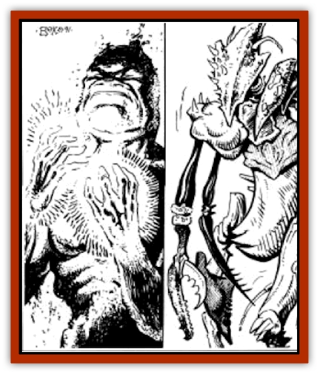

# Golem - Athas - I

| Statistic | **Ash** | **Chitin** |
| --- | --- | --- |
| **Activity Cycle:** | Any | Any |
| **Alignment:** | Neutral | Neutral |
| **Armor Class:** | 7 | 6 |
| **Climate/Terrain:** | Any | Any |
| **Damage/Attack:** | 3-18 | 2-20 |
| **Diet:** | None | None |
| **Frequency:** | Very rare | Very rare |
| **Hit Dice:** | 8 | 9 |
| **Intelligence:** | Semi- (2-4) | Semi- (2-4) |
| **Magic Resistance:** | Nil | Nil |
| **Morale:** | Fearless (19-20) | Fearless (19-20) |
| **Movement:** | 9 | 9 |
| **No. Appearing:** | 1 | 1 |
| **No. of Attacks:** | 1 | 1 |
| **Organization:** | Solitary | Solitary |
| **Size:** | L (8' tall) | L (10' tall) |
| **Special Attacks:** | See below | Poison |
| **Special Defenses:** | See below | See below |
| **THAC0:** | 13 | 11 |
| **Treasure:** | Nil | Nil |
| **XP Value:** | 3,000 | 3,000 |

## Ash Golem

Ash [[Golem_General_Information|golems]] are grey in color, stand eight feet tall, and weigh only 150 pounds. As they move, ash [[Golem_Athas_General_Information|golems]] leave a fine dusting of ash behind them, which makes tracking these creatures easy.

**Combat:** All fire-based attacks do only half damage to ash golems. Also, an ash golem can damage melee weapons used against it. If an attack is rolled and the result misses by more than 4, the weapon is caught within the golem.s body, and a saving throw vs. magical fire must be made for the weapon. If it makes the saving throw, the weapon is freed and unharmed. If the weapon fails its save, it is ruined.

Ash golems attack with their large arms, and a successful blow does 3d6 points of damage to a victim. In addition, ash golems have two special attack forms. The first is a burning grasp. This attack, usable up to three times a day, is employed by a golem grappling its opponent. On any natural attack roll of 17+ that hits a target, the victim is grappled. This does the normal 3d6 points of damage for the first round. Each round after that, the victim suffers an additional 1d10 points of fire damage until freed. The victim can be freed by either making a successful Open Doors roll or by his companions doing a total of 20 points of damage to the golem in a single round. Either method will force the golem to let its victim loose.

The second special attack is a *fireball* spell. An ash golem can use this attack only once per day and does so as though it were an 8th-level spellcaster.

The dust that an ash golem leaves behind it is corrosive. One to two hours after this dust contacts bare skin, the being contacted by the ash will suffer 1d4 points of damage per turn until the dust it totally washed off. Completely removing the dust takes about one hour of scrubbing. Any creature hit by an ash golem will also suffer from its corrosive dust, in the same manner as described above. The dust of an ash golem can also be removed through the use of a *heal* spell.

**Habitat/Society:** Ash golems are found in the settled areas near the rocky barrens of the Athasian plains.

## Chitin Golem

Chitin golems are humanoid in shape, but up to 10 feet tall. They generally weigh from 200-250 pounds. They have no facial features to speak of, though they are able to make growling sounds when provoked. The limbs of a chitin golem are somewhat long, hanging easily below its knees. A chitin golem bears a slight odor of decay or death, noticeable only at close range. When a chitin golem walks, it appears to be very unstable.

**Combat:** Chitin golems are very nasty opponents. They are immune to all spells cast by beings of less than 5 Hit Dice or experience levels; they are totally immune to all necromantic spells, regardless of the caster's level. This resistance is due to the use of necromantic magic in the creation of chitin golems.

When chitin golems attack, they do so with their clawed hands. A successful blow does 2d10 points of damage. Also, the blow of a chitin golem is poisonous. Any being struck must save vs. poison or suffer 2d6 points of additional damage and have his Strength reduced by 1d4 points. This effect lasts for 2 turns. Those who save still take 1d6 points of damage, but suffer no Strength loss.

**Habitat/Society:** Chitin golems are most often found in the forest areas of Athas, but are not widely encountered. The sorcerer-kings seldom make use of chitin golems in their strongholds. Chitin golems are most commonly created by necromantic defilers, who use them to protect their homes from enemies.

---
## Discovery & Documentation

**Source Publication:** MC12 Dark Sun Appendix I - Terrors of the Desert (1991)
**Campaign Setting:** Dark Sun
**Author(s):** Tom Prusa, Louis J. Prosperi, Walter M. Baas

### Other Creatures Found in This Source Book
   * [[Animal_Herd_Athas|Animal, Herd (Athas)]]
   * [[Animal_Household_Athas|Animal, Household (Athas)]]
   * [[Antloid_Desert|Antloid, Desert]]
   * [[Banshee_Dwarf|Banshee, Dwarf]]
   * [[Beetle_Agony|Beetle, Agony]]
   * [[Bog_Wader|Bog Wader]]
   * [[Brambleweed|Brambleweed]]
   * [[B'rohg|B'rohg]]
   * [[Burnflower|Burnflower]]
   * [[Cat_Psionic|Cat, Psionic]]
   * [[Cha'thrang|Cha'thrang]]
   * [[Cistern_Fiend|Cistern Fiend]]
   * [[Clam_Giant|Clam, Giant]]
   * [[Cloud_Ray|Cloud Ray]]
   * [[Drake_Athas_Air|Drake (Athas), Air]]
   * [[Drake_Athas_Earth|Drake (Athas), Earth]]
   * [[Drake_Athas_Fire|Drake (Athas), Fire]]
   * [[Drake_Athas_Water|Drake (Athas), Water]]
   * [[Dune_Runner|Dune Runner]]
   * [[Dune_Trapper|Dune Trapper]]
   * [[Elemental_Athas_Greater_Air|Elemental (Athas), Greater, Air]]
   * [[Elemental_Athas_Greater_Earth|Elemental (Athas), Greater, Earth]]
   * [[Elemental_Athas_Greater_Fire|Elemental (Athas), Greater, Fire]]
   * [[Elemental_Athas_Greater_Water|Elemental (Athas), Greater, Water]]
   * [[Elemental_Athas_Lesser_Air_Earth|Elemental (Athas), Lesser, Air/Earth]]
   * [[Elemental_Athas_Lesser_Fire_Water|Elemental (Athas), Lesser, Fire/Water]]
   * [[Elemental_Athas_General_Information|Elemental (Athas), General Information]]
   * [[Erdland|Erdland]]
   * [[Esperweed|Esperweed]]
   * [[Flailer|Flailer]]
   * [[Floater|Floater]]
   * [[Giant_Athas|Giant (Athas)]]
   * [[Golem_Athas_II|Golem (Athas) II]]
   * [[Golem_Athas_III|Golem (Athas) III]]
   * [[Golem_Athas_General_Information|Golem (Athas), General Information]]
   * [[Halfling_Renegade|Halfling, Renegade]]
   * [[Hej-kin|Hej-kin]]
   * [[Id_Fiend|Id Fiend]]
   * [[Insect_Swarm_Athas|Insect Swarm (Athas)]]
   * [[Kank_Wild|Kank, Wild]]
   * [[Kirre|Kirre]]
   * [[Megapede|Megapede]]
   * [[Mul_Wild|Mul, Wild]]
   * [[Nightmare_Beast|Nightmare Beast]]
   * [[Plant_Carnivorous_Athas|Plant, Carnivorous (Athas)]]
   * [[Pterran|Pterran]]
   * [[Pterrax|Pterrax]]
   * [[Pulp_Bee|Pulp Bee]]
   * [[Pyreen|Pyreen]]
   * [[Rasclinn|Rasclinn]]
   * [[Razorwing|Razorwing]]
   * [[Roc_Athas|Roc (Athas)]]
   * [[Sand_Bride|Sand Bride]]
   * [[Sand_Cactus|Sand Cactus]]
   * [[Sand_Vortex|Sand Vortex]]
   * [[Scrab|Scrab]]
   * [[Silt_Horror|Silt Horror]]
   * [[Silt_Runner|Silt Runner]]
   * [[Sink_Worm|Sink Worm]]
   * [[Sloth_Athas|Sloth (Athas)]]
   * [[So-ut|So-ut]]
   * [[Spider_Cactus|Spider Cactus]]
   * [[Spider_Crystal|Spider, Crystal]]
   * [[Spirit_of_the_Land|Spirit of the Land]]
   * [[T'Chowb|T'Chowb]]
   * [[Thrax|Thrax]]
   * [[Tohr-kreen_I|Tohr-kreen I]]
   * [[Villichi|Villichi]]
   * [[Zhackal|Zhackal]]
   * [[Zombie_Plant|Zombie Plant]]
