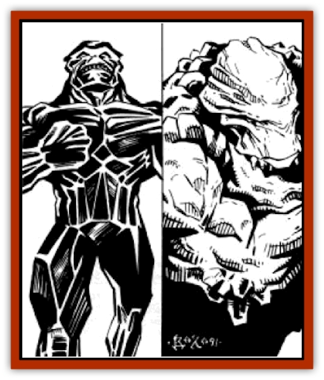

# Golem - Athas - II

| Statistic | **Obsidian** | **Rock** |
| --- | --- | --- |
| **Activity Cycle:** | Any | Any |
| **Alignment:** | Neutral | Neutral |
| **Armor Class:** | 4 | 4 |
| **Climate/Terrain:** | Any | Any |
| **Damage/Attack:** | 4-40 | 2-20 |
| **Diet:** | None | None |
| **Frequency:** | Very rare | Very rare |
| **Hit Dice:** | 12 | 10 |
| **Intelligence:** | Semi- (2-4) | Semi- (2-4) |
| **Magic Resistance:** | Nil | Nil |
| **Morale:** | Fearless (19-20) | Fearless (19-20) |
| **Movement:** | 6 | 6 |
| **No. Appearing:** | 1 | 1 |
| **No. of Attacks:** | 1 | 1 |
| **Organization:** | Solitary | Solitary |
| **Size:** | L (12' tall) | L (9' tall) |
| **Special Attacks:** | See below | Nil |
| **Special Defenses:** | See below | See below |
| **THAC0:** | 9 | 11 |
| **Treasure:** | Nil | Nil |
| **XP Value:** | 9,000 | 3,000 |

## Obsidian Golem

Obsidian [[Golem_General_Information|golems]] are massive statues, measuring 12 feet tall, and weighing up to 900 pounds. Their shape is humanoid. Like the rock [[Golem_Athas_General_Information|golem]], obsidian golems are not capable of speech. Obsidian golems are fairly slow moving, but move in a strong determined manner. The hands of an obsidian golem are formed into huge fists, but they are incapable of opening.

**Combat:** Obsidian golems are immune to all spells cast by beings of less than 7 Hit Dice or experience levels. Additionally, they are totally immune to spells cast by preservers, regardless of the caster's level.

When obsidian golems attack, they do so with their huge fists. They can make only one attack per round, but each does 4d10 points of damage when it strikes. Obsidian golems have a special attack form that has two distinct effects. This attack can be used instead of the golem's normal attack. When an obsidian golem uses this special attack, it smashes it two fists together. This creates an extremely loud sound which causes all who hear to be stunned for the next round. All initiative rolls and attack rolls are at -4 due this effect. Those who save vs. paralysis are unaffected. The other effect this attack has is to spray the immediate area with tiny obsidian shards. All creatures within 20 feet of the golem are affected by this attack and take 2d6 points of damage and must save vs. poison. Those who fail take 2d10 points of additional damage, while those who succeed take only 2d4 additional damage points.

**Habitat/Society:** Obsidian golems are used to guard valuable possessions and property. The magics required to create an obsidian golem are so difficult to manage that not many of these golems exist. There are tales of sorcerer-kings who have let these golems loose in their cities as a manner of frightening the populace into submission, but none have been substantiated.

## Rock Golem

[[Golem_Mystara_III|Rock golems]] are nine feet tall and usually resemble huge men in full armor. Weighing up to 600 pounds, rock golems are fairly slow and are incapable of movement faster than walking. They have features carved into their faces, but those features are immobile, and useless. The golem cannot speak.

**Combat:** Rock golems are very dangerous in combat, capable of doing great harm to their opponents. Like all Athasian golems, rock golems can only be harmed by magical weapons. Additionally, rock golems are immune to spells cast at them by wizards or priests of less than 5th level and, like sand golems, are totally immune to all transmutation spells. Because they are created through defiler magic, spells cast by a preserver mage do additional damage to a rock golem. For each level of experience of the caster beyond 5th level, damage from spells is increased by 1 point (a 6th-level caster adds + 1, a 7th-level caster +2, etc.).

Rock golems use melee attacks when in combat. A blow from one of its hand does 2d10 points of damage. So powerful is a blow from a rock golem that those struck must make a save vs. paralysis or be knocked off their feet. A character that is knocked down in this manner takes an additional 1d6 points of damage.

**Habitat/Society:** Rock golems are used as guards. They stand motionless, like statues, until given orders to attack or prevent offenders from entering the area they protect.

---
## Discovery & Documentation

**Source Publication:** MC12 Dark Sun Appendix I - Terrors of the Desert (1991)
**Campaign Setting:** Dark Sun
**Author(s):** Tom Prusa, Louis J. Prosperi, Walter M. Baas

### Other Creatures Found in This Source Book
   * [[Animal_Herd_Athas|Animal, Herd (Athas)]]
   * [[Animal_Household_Athas|Animal, Household (Athas)]]
   * [[Antloid_Desert|Antloid, Desert]]
   * [[Banshee_Dwarf|Banshee, Dwarf]]
   * [[Beetle_Agony|Beetle, Agony]]
   * [[Bog_Wader|Bog Wader]]
   * [[Brambleweed|Brambleweed]]
   * [[B'rohg|B'rohg]]
   * [[Burnflower|Burnflower]]
   * [[Cat_Psionic|Cat, Psionic]]
   * [[Cha'thrang|Cha'thrang]]
   * [[Cistern_Fiend|Cistern Fiend]]
   * [[Clam_Giant|Clam, Giant]]
   * [[Cloud_Ray|Cloud Ray]]
   * [[Drake_Athas_Air|Drake (Athas), Air]]
   * [[Drake_Athas_Earth|Drake (Athas), Earth]]
   * [[Drake_Athas_Fire|Drake (Athas), Fire]]
   * [[Drake_Athas_Water|Drake (Athas), Water]]
   * [[Dune_Runner|Dune Runner]]
   * [[Dune_Trapper|Dune Trapper]]
   * [[Elemental_Athas_Greater_Air|Elemental (Athas), Greater, Air]]
   * [[Elemental_Athas_Greater_Earth|Elemental (Athas), Greater, Earth]]
   * [[Elemental_Athas_Greater_Fire|Elemental (Athas), Greater, Fire]]
   * [[Elemental_Athas_Greater_Water|Elemental (Athas), Greater, Water]]
   * [[Elemental_Athas_Lesser_Air_Earth|Elemental (Athas), Lesser, Air/Earth]]
   * [[Elemental_Athas_Lesser_Fire_Water|Elemental (Athas), Lesser, Fire/Water]]
   * [[Elemental_Athas_General_Information|Elemental (Athas), General Information]]
   * [[Erdland|Erdland]]
   * [[Esperweed|Esperweed]]
   * [[Flailer|Flailer]]
   * [[Floater|Floater]]
   * [[Giant_Athas|Giant (Athas)]]
   * [[Golem_Athas_I|Golem (Athas) I]]
   * [[Golem_Athas_III|Golem (Athas) III]]
   * [[Golem_Athas_General_Information|Golem (Athas), General Information]]
   * [[Halfling_Renegade|Halfling, Renegade]]
   * [[Hej-kin|Hej-kin]]
   * [[Id_Fiend|Id Fiend]]
   * [[Insect_Swarm_Athas|Insect Swarm (Athas)]]
   * [[Kank_Wild|Kank, Wild]]
   * [[Kirre|Kirre]]
   * [[Megapede|Megapede]]
   * [[Mul_Wild|Mul, Wild]]
   * [[Nightmare_Beast|Nightmare Beast]]
   * [[Plant_Carnivorous_Athas|Plant, Carnivorous (Athas)]]
   * [[Pterran|Pterran]]
   * [[Pterrax|Pterrax]]
   * [[Pulp_Bee|Pulp Bee]]
   * [[Pyreen|Pyreen]]
   * [[Rasclinn|Rasclinn]]
   * [[Razorwing|Razorwing]]
   * [[Roc_Athas|Roc (Athas)]]
   * [[Sand_Bride|Sand Bride]]
   * [[Sand_Cactus|Sand Cactus]]
   * [[Sand_Vortex|Sand Vortex]]
   * [[Scrab|Scrab]]
   * [[Silt_Horror|Silt Horror]]
   * [[Silt_Runner|Silt Runner]]
   * [[Sink_Worm|Sink Worm]]
   * [[Sloth_Athas|Sloth (Athas)]]
   * [[So-ut|So-ut]]
   * [[Spider_Cactus|Spider Cactus]]
   * [[Spider_Crystal|Spider, Crystal]]
   * [[Spirit_of_the_Land|Spirit of the Land]]
   * [[T'Chowb|T'Chowb]]
   * [[Thrax|Thrax]]
   * [[Tohr-kreen_I|Tohr-kreen I]]
   * [[Villichi|Villichi]]
   * [[Zhackal|Zhackal]]
   * [[Zombie_Plant|Zombie Plant]]
