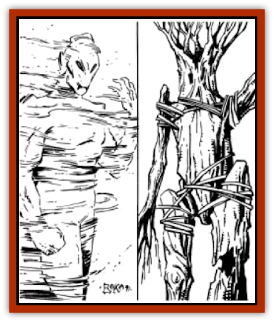

# Golem - Athas - III

| Statistic | **Sand** | **Wood** |
| --- | --- | --- |
| **Activity Cycle:** | Any | Any |
| **Alignment:** | Neutral | Neutral |
| **Armor Class:** | 3 | 6 |
| **Climate/Terrain:** | Any | Any |
| **Damage/Attack:** | 2-12 | 2-16/2-16 |
| **Diet:** | Nil | Nil |
| **Frequency:** | Very rare | Very rare |
| **Hit Dice:** | 8 | 8 |
| **Intelligence:** | Semi- (2-4) | Semi- (2-4) |
| **Magic Resistance:** | Nil | Nil |
| **Morale:** | Fearless (19-20) | Fearless (19-20) |
| **Movement:** | 6 | 6 |
| **No. Appearing:** | 1 | 1 |
| **No. of Attacks:** | 1 | 2 |
| **Organization:** | Solitary | Solitary |
| **Size:** | L (8' tall) | L (10' tall) |
| **Special Attacks:** | Suffocation | Spells |
| **Special Defenses:** | See below | See below |
| **THAC0:** | 13 | 13 |
| **Treasure:** | Nil | Nil |
| **XP Value:** | 2,000 | 3,000 |

## Sand Golem

Sand [[Golem_General_Information|golems]] are humanoid in shape and stand roughly eight feet tall. They have indentations where their eye sockets should be, though they have no actual eyes. Likewise, they have a mouth, but they are incapable of speech, managing only to roar and growl at opponents. When a sand golem moves, it leaves a fine trail of sand behind it, making the tracking of this creature fairly easy.

**Combat:** When sand golems engage in combat, they are very powerful foes. The unusual nature of the golem's body allows many blows to simply pass right through its body without doing harm. This gives sand golems good protection against physical attacks (AC 3).

Aside from the defenses common to all [[Golem_Athas_General_Information|Athasian golems]] (see "Common Characteristics"), sand golems have some unique defenses. Sand golems are immune to any spells cast by creatures of less than 3 Hit Dice or 3rd level. In addition, they are totally immune to all transmutation spells, regardless of the level of the caster. Spells cast by defilers of 3rd level or higher do one extra point of damage to a sand golem for each experience level of the caster beyond 3rd (a 5th level caster would add +2 to his damage, 6th level +3, etc.).

When they attack, sand golems do so with their large arms. A successful blow does 2d6 points of damage to the victim. Sand golems also have a unique attack ability which allows them to suffocate a victim within themselves. On any attack roll that hits a foe, a save versus paralysis must be made. Failure indicates that the target has been drawn into the body of the golem. If this happens, the target takes 2d10 points of damage and then an additional 1d10 points each subsequent round until it dies. Breaking free of a sand golem's suffocation requires a Strength check at a -5 penalty. No other characters can aid a victim of a sand golem's suffocation, unless they are able to destroy the golem before the victim is killed. Also, attacks made against the golem while it is suffocating a victim have a chance of harming the victim. Attacking a sand golem while not hitting the victim is a called shot, otherwise all damage is split evenly between the two.

## Wood Golem

Wood golems are 10 feet tall and weigh up to 500 pounds. It is often difficult to spot a wood golem when in the forest, as its appearance closely matches natural foliage.

**Combat:** Wood golems are most often encountered within the forests and jungles of Athas. Because of their appearance, wood golems are very difficult to spot in the wild. Characters encountering a wood golem in the forest or jungle suffer a -2 penalty to their surprise rolls.

Wood golems are immune to spells cast by beings of less than 4 Hit Dice or experience levels. They are completely immune to all priest spells listed as belonging to the "plant sphere" in the *DMG*. This immunity is due to the close link between the elemental spirit of wood golems and the plant sphere. Because of the destructive effect defiler magic has on plant life, wood golems are especially vulnerable to spells cast by defilers. Spells cast by defilers do 2 extra points of damage per level of the caster beyond 4th (a 5th-level defiler adds +2, a 6th-level +4, etc.). Also, if a wood golem is within the sphere of destruction of a defiler (see "Defiler Magical Destruction Table" in the *Dark Sun* boxed set), it must save vs. spells or be destroyed instantly.

When wood golems attack, they can do so in a number of ways. The first, and most common, is with their strong arms. Wood golems can make two attacks per round, each doing 2d8 points of damage. Wood golems also have spell casting ability. They are able to cast any and all spells from the Sphere of the Cosmos (see *Dark Sun* boxed set). These spells function like any druidic spells except that no components of any kind are required in order for the wood golem to cast them.

**Habitat/Society:** Wood golems are most often found in the forests and jungles of Athas. They are used by the druids of the woodlands to protect their guarded lands from those who threaten them.

---
## Discovery & Documentation

**Source Publication:** MC12 Dark Sun Appendix I - Terrors of the Desert (1991)
**Campaign Setting:** Dark Sun
**Author(s):** Tom Prusa, Louis J. Prosperi, Walter M. Baas

### Other Creatures Found in This Source Book
   * [[Animal_Herd_Athas|Animal, Herd (Athas)]]
   * [[Animal_Household_Athas|Animal, Household (Athas)]]
   * [[Antloid_Desert|Antloid, Desert]]
   * [[Banshee_Dwarf|Banshee, Dwarf]]
   * [[Beetle_Agony|Beetle, Agony]]
   * [[Bog_Wader|Bog Wader]]
   * [[Brambleweed|Brambleweed]]
   * [[B'rohg|B'rohg]]
   * [[Burnflower|Burnflower]]
   * [[Cat_Psionic|Cat, Psionic]]
   * [[Cha'thrang|Cha'thrang]]
   * [[Cistern_Fiend|Cistern Fiend]]
   * [[Clam_Giant|Clam, Giant]]
   * [[Cloud_Ray|Cloud Ray]]
   * [[Drake_Athas_Air|Drake (Athas), Air]]
   * [[Drake_Athas_Earth|Drake (Athas), Earth]]
   * [[Drake_Athas_Fire|Drake (Athas), Fire]]
   * [[Drake_Athas_Water|Drake (Athas), Water]]
   * [[Dune_Runner|Dune Runner]]
   * [[Dune_Trapper|Dune Trapper]]
   * [[Elemental_Athas_Greater_Air|Elemental (Athas), Greater, Air]]
   * [[Elemental_Athas_Greater_Earth|Elemental (Athas), Greater, Earth]]
   * [[Elemental_Athas_Greater_Fire|Elemental (Athas), Greater, Fire]]
   * [[Elemental_Athas_Greater_Water|Elemental (Athas), Greater, Water]]
   * [[Elemental_Athas_Lesser_Air_Earth|Elemental (Athas), Lesser, Air/Earth]]
   * [[Elemental_Athas_Lesser_Fire_Water|Elemental (Athas), Lesser, Fire/Water]]
   * [[Elemental_Athas_General_Information|Elemental (Athas), General Information]]
   * [[Erdland|Erdland]]
   * [[Esperweed|Esperweed]]
   * [[Flailer|Flailer]]
   * [[Floater|Floater]]
   * [[Giant_Athas|Giant (Athas)]]
   * [[Golem_Athas_I|Golem (Athas) I]]
   * [[Golem_Athas_II|Golem (Athas) II]]
   * [[Golem_Athas_General_Information|Golem (Athas), General Information]]
   * [[Halfling_Renegade|Halfling, Renegade]]
   * [[Hej-kin|Hej-kin]]
   * [[Id_Fiend|Id Fiend]]
   * [[Insect_Swarm_Athas|Insect Swarm (Athas)]]
   * [[Kank_Wild|Kank, Wild]]
   * [[Kirre|Kirre]]
   * [[Megapede|Megapede]]
   * [[Mul_Wild|Mul, Wild]]
   * [[Nightmare_Beast|Nightmare Beast]]
   * [[Plant_Carnivorous_Athas|Plant, Carnivorous (Athas)]]
   * [[Pterran|Pterran]]
   * [[Pterrax|Pterrax]]
   * [[Pulp_Bee|Pulp Bee]]
   * [[Pyreen|Pyreen]]
   * [[Rasclinn|Rasclinn]]
   * [[Razorwing|Razorwing]]
   * [[Roc_Athas|Roc (Athas)]]
   * [[Sand_Bride|Sand Bride]]
   * [[Sand_Cactus|Sand Cactus]]
   * [[Sand_Vortex|Sand Vortex]]
   * [[Scrab|Scrab]]
   * [[Silt_Horror|Silt Horror]]
   * [[Silt_Runner|Silt Runner]]
   * [[Sink_Worm|Sink Worm]]
   * [[Sloth_Athas|Sloth (Athas)]]
   * [[So-ut|So-ut]]
   * [[Spider_Cactus|Spider Cactus]]
   * [[Spider_Crystal|Spider, Crystal]]
   * [[Spirit_of_the_Land|Spirit of the Land]]
   * [[T'Chowb|T'Chowb]]
   * [[Thrax|Thrax]]
   * [[Tohr-kreen_I|Tohr-kreen I]]
   * [[Villichi|Villichi]]
   * [[Zhackal|Zhackal]]
   * [[Zombie_Plant|Zombie Plant]]
