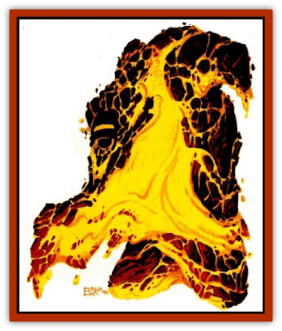

# Golem - Athas - Magma

| Statistic | **Golem (Athas), Magma** |
| --- | --- |
| **Activity Cycle:** | Any |
| **Alignment:** | Neutral |
| **Armor Class:** | 5 |
| **Climate/Terrain:** | Ring of Fire, Ur Draxa |
| **Damage/Attack:** | 4d6 |
| **Diet:** | None |
| **Frequency:** | Very rare |
| **Hit Dice:** | 12 |
| **Intelligence:** | Semi- (2-4) |
| **Magic Resistance:** | Nil |
| **Morale:** | Fearless (19-20) |
| **Movement:** | 9 |
| **No. Appearing:** | 1 |
| **No. of Attacks:** | 1 |
| **Organization:** | Solitary |
| **Size:** | L (8' tall) |
| **Special Attacks:** | Heat, crush |
| **Special Defenses:** | See below |
| **THAC0:** | 9 |
| **Treasure:** | Nil |
| **XP Value:** | 7,000 |

Magma [[Golem_General_Information|golems]] are forged by powerful wizards from the raw materials found in the Ring of Fire. They are comprised entirely of molten rock, weigh around 1600 pounds, and stand about 8' tall. They are roughly man-shaped but seem to ooze and flow as they move. The surface of the magma [[Golem_Athas_General_Information|golem]] is black, and covered with a latticework of cracks through which glows the inner radiance of the lava. Its eyes glow with the intensity of the Athasian sun.

Magma golems are incapable of any speech or communication other than with the wizards that created them. The only sound made by the creatures is the noise of their heavy footsteps.

**Combat:** Magma golems attack using powerful armlike appendages. Any target hit by a golem must make a successful save vs. death magic or catch fire, receiving 2-8 (2d4) points of damage per round until the fire is put out. The target catches fire regardless of the attire worn. Even skin and flesh will burn. Any creature within 10' of the magma golem receives 1-6 (1d6) points of damage from the intense heat it radiates. Likewise, any opponent attacking the golem barehanded takes 1-10 (1d10) points of damage.

Once every 5 rounds, a magma golem can collect itself into a fiery mass of lava and hurl itself at a single opponent. Such attacks cause 10-60 (10d6) points of damage (successful save vs. death magic for half damage). If the victim survives the attack, it must make another successful save vs. death magic or catch fire. Creatures who are at least large-sized, or are immune to fire-based attacks suffer only 3-18 (3d6) points of damage (successful save for half). This attack form is made instead of its normal attack and throws the golems to the ground when complete. During the round after this attack, the golems must regain their feet, thus sacrificing a second round of combat.

Magma golems are immune to both fire-based and cold-based attacks. Golems suffer half damage from electrical attacks. Weapons that hit cause their normal damage, but they must make a successful save vs. magical fire or be destroyed. Clerical magic that is based in either the earth or fire spheres has no effect on the creatures. If the magma golems are encountered in a volcanic environment, they are 90% likely to be mistaken for part of a lava flow.

**Habitat/Society:** Magma golems were originally created by [[Dragon_of_Tyr|The Dragon]] and its [[Kaisharga|kaisharga]] to act as guards. They have been known to go rogue on their masters when near other magma golems. Perhaps there is some form of communication between the individuals that has not been identified. Rogue golems attempt to make their way back to the area of volcanic activity from which they were created.

**Ecology:** Because it is a magical being, the magma golem has no true place in the food chain on Athas.

---
## Discovery & Documentation

**Source Publication:** Dark Sun Appendix II - Terrors Beyond Tyr (1991)
**Campaign Setting:** Dark Sun
**Author(s):** Jim Atkiss, Steve Brown, Timothy B. Brown, Andrew P. Morris, Bruce Nesmith, Wes Nicholson, Bill Slavicsek

### Other Creatures Found in This Source Book
   * [[Aarakocra_Athas|Aarakocra (Athas)]]
   * [[Animal_Domestic_Athas_II|Animal, Domestic (Athas) II]]
   * [[Aviarag|Aviarag]]
   * [[Baazrag|Baazrag]]
   * [[Baazrag_Boneclaw|Baazrag, Boneclaw]]
   * [[Bloodgrass|Bloodgrass]]
   * [[Cactus_Hunting|Cactus, Hunting]]
   * [[Cactus_Rock|Cactus, Rock]]
   * [[Cilops|Cilops]]
   * [[Crodlu|Crodlu]]
   * [[Dagorran|Dagorran]]
   * [[Dhaot|Dhaot]]
   * [[Drake_Lesser_Athas_General_Information|Drake, Lesser (Athas), General Information]]
   * [[Drake_Lesser_Athas_Magma|Drake, Lesser (Athas), Magma]]
   * [[Drake_Lesser_Athas_Rain|Drake, Lesser (Athas), Rain]]
   * [[Drake_Lesser_Athas_Silt|Drake, Lesser (Athas), Silt]]
   * [[Drake_Lesser_Athas_Sun|Drake, Lesser (Athas), Sun]]
   * [[Dray|Dray]]
   * [[Drik|Drik]]
   * [[Dune_Reaper|Dune Reaper]]
   * [[Dwarf_Athas|Dwarf (Athas)]]
   * [[Elemental_Beast_Athas_Air|Elemental Beast (Athas), Air]]
   * [[Elemental_Beast_Athas_Earth|Elemental Beast (Athas), Earth]]
   * [[Elemental_Beast_Athas_Fire|Elemental Beast (Athas), Fire]]
   * [[Elemental_Beast_Athas_Water|Elemental Beast (Athas), Water]]
   * [[Elf_Athas|Elf (Athas)]]
   * [[Fael|Fael]]
   * [[Feylaar|Feylaar]]
   * [[Fordorran|Fordorran]]
   * [[Giant_Half-giant|Giant, Half-giant]]
   * [[Giant_Shadow|Giant, Shadow]]
   * [[Golem_Athas_Salt|Golem (Athas), Salt]]
   * [[Golem_Athas_General_Information|Golem (Athas), General Information]]
   * [[Gorak|Gorak]]
   * [[Halfling_Athas|Halfling (Athas)]]
   * [[Human_Athas|Human (Athas)]]
   * [[Jhakar|Jhakar]]
   * [[Kaisharga|Kaisharga]]
   * [[Kes'trekel|Kes'trekel]]
   * [[Klar|Klar]]
   * [[Krag|Krag]]
   * [[Kragling|Kragling]]
   * [[Lirr|Lirr]]
   * [[Mastyrial|Mastyrial]]
   * [[Meorty|Meorty]]
   * [[Mul|Mul]]
   * [[Nikaal|Nikaal]]
   * [[Paraelemental_Beast_General_Information|Paraelemental Beast, General Information]]
   * [[Paraelemental_Beast_Magma|Paraelemental Beast, Magma]]
   * [[Paraelemental_Beast_Rain|Paraelemental Beast, Rain]]
   * [[Paraelemental_Beast_Silt|Paraelemental Beast, Silt]]
   * [[Paraelemental_Beast_Sun|Paraelemental Beast, Sun]]
   * [[Pakubrazi|Pakubrazi]]
   * [[Psionocus|Psionocus]]
   * [[Psurlon|Psurlon]]
   * [[Raaig|Raaig]]
   * [[Retriever_Obsidian|Retriever, Obsidian]]
   * [[Ruktoi|Ruktoi]]
   * [[Ruvoka_Athas|Ruvoka (Athas)]]
   * [[Sand_Howler|Sand Howler]]
   * [[Scorpion_Athas|Scorpion (Athas)]]
   * [[Seed_Brain|Seed, Brain]]
   * [[Silt_Horror_Black|Silt Horror, Black]]
   * [[Silt_Horror_Magma|Silt Horror, Magma]]
   * [[Silt_Horror_Red|Silt Horror, Red]]
   * [[Silt_Spawn|Silt Spawn]]
   * [[Slig|Slig]]
   * [[Spider_Athas|Spider (Athas)]]
   * [[Spinewyrm|Spinewyrm]]
   * [[Ssurran|Ssurran]]
   * [[Stalking_Horror|Stalking Horror]]
   * [[Tarek|Tarek]]
   * [[Tari|Tari]]
   * [[Thri-kreen|Thri-kreen]]
   * [[T'liz|T'liz]]
   * [[Tohr-kreen_II|Tohr-kreen II]]
   * [[Tohr-kreen_III|Tohr-kreen III]]
   * [[Trin|Trin]]
   * [[Tul'k|Tul'k]]
   * [[Undead_Athas_General_Information|Undead (Athas), General Information]]
   * [[Wraith_Athas|Wraith (Athas)]]
   * [[Xerichou|Xerichou]]
   * [[Zombie_Thinking|Zombie, Thinking]]
