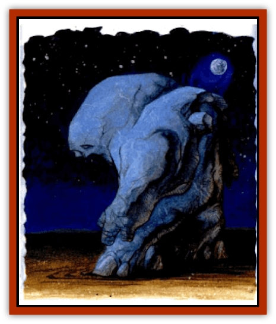

# Golem - Athas - Salt

| Statistic | **Golem (Athas), Salt** |
| --- | --- |
| **Activity Cycle:** | Any |
| **Alignment:** | Neutral |
| **Armor Class:** | 4 |
| **Climate/Terrain:** | Any |
| **Damage/Attack:** | 2d8 |
| **Diet:** | None |
| **Frequency:** | Very rare |
| **Hit Dice:** | 9 |
| **Intelligence:** | Semi- (2-4) |
| **Magic Resistance:** | Nil |
| **Morale:** | Fearless (19-20) |
| **Movement:** | 6 |
| **No. Appearing:** | 1 |
| **No. of Attacks:** | 1 |
| **Organization:** | Solitary |
| **Size:** | L (8' tall) |
| **Special Attacks:** | Pain, dehydrate |
| **Special Defenses:** | See below |
| **THAC0:** | 11 |
| **Treasure:** | Nil |
| **XP Value:** | 4,000 |

The salt [[Golem_General_Information|golem]] is created by powerful defilers and sorcerer kings and is favored by those near the salt flats. The [[Golem_Athas_General_Information|golem]] is 8 feet tall and weighs roughly 600 pounds. It resembles small [[Golem_Athas_II|rock golems]] and has an opaque color and texture. A most horrifying feature of this golem is its movement. It moves slowly and deliberately, seemingly unaware or uncaring that most other creatures can move faster. This creature has a very low intelligence, but its slow pace belles a confidence that it knows its quarry will eventually tire while it is inexhaustible. It possesses almost-recognizable facial features. The salt golem's eyes are white and opaque. It has a mouth, but the salt golem cannot speak and is silent unless in motion.

**Combat:** Salt golems are lumbering, methodical creatures in combat. They strike using their rocklike fists to deliver 2-16 (2d8) points of damage upon a successful hit. Any target hit must make a successful save vs. poison or the golems break the skin of their prey and minute flakes of salt residue are left behind. This causes the victim pain so severe that he can do nothing but writhe on the ground in agony for 1-4 (1d4) rounds. While on the ground the victim is susceptible to attacks as if he were prone (+4 to attack roll).

Salt golems can dehydrate one opponent once every 5 rounds by wrapping their powerful arms around the target for 1 round. The attack requires a standard attack roll. If the constructs. roll is 2 or more greater than the victim's THAC0, they have the target in their arms. The salt of the golem burns any skin it touches for 6-36 (6d6) points of damage. Such attacks are fairly rare though, because they cause the golem 2-16 (2d8) points of damage from the moisture absorbed.

Salt golems are immune to all electrical, cold-based, and fire-based attack forms. Fire-based attacks further fuse the individual salt granules and dry moisture absorbed by the golems. So when struck by fire, magical or other, salt golems heal 1 point of damage for each die of damage the fire should have caused. Water and water-based attacks dissolve the creatures, however, and cause double damage. Even if the golems are just walking through water or a *create water* spell is cast around them, they suffer 1-10 (1d10) points of damage per round of exposure. A *rock to mud* spell causes the golems damage as if they were another form of rock suffering 3-30 (3d10) points of damage. To attack golems, the caster must make a successful bare-handed attack to touch the creatures.

**Habitat/Society:** Salt golems remain motionless, protecting the area designated to them by their creator, until they are needed. They are more vulnerable than most golems, so there are fewer of them.

**Ecology:** Salt golems have no effect on Athasian ecology as they are magical, created beings.

---
## Discovery & Documentation

**Source Publication:** Dark Sun Appendix II - Terrors Beyond Tyr (1991)
**Campaign Setting:** Dark Sun
**Author(s):** Jim Atkiss, Steve Brown, Timothy B. Brown, Andrew P. Morris, Bruce Nesmith, Wes Nicholson, Bill Slavicsek

### Other Creatures Found in This Source Book
   * [[Aarakocra_Athas|Aarakocra (Athas)]]
   * [[Animal_Domestic_Athas_II|Animal, Domestic (Athas) II]]
   * [[Aviarag|Aviarag]]
   * [[Baazrag|Baazrag]]
   * [[Baazrag_Boneclaw|Baazrag, Boneclaw]]
   * [[Bloodgrass|Bloodgrass]]
   * [[Cactus_Hunting|Cactus, Hunting]]
   * [[Cactus_Rock|Cactus, Rock]]
   * [[Cilops|Cilops]]
   * [[Crodlu|Crodlu]]
   * [[Dagorran|Dagorran]]
   * [[Dhaot|Dhaot]]
   * [[Drake_Lesser_Athas_General_Information|Drake, Lesser (Athas), General Information]]
   * [[Drake_Lesser_Athas_Magma|Drake, Lesser (Athas), Magma]]
   * [[Drake_Lesser_Athas_Rain|Drake, Lesser (Athas), Rain]]
   * [[Drake_Lesser_Athas_Silt|Drake, Lesser (Athas), Silt]]
   * [[Drake_Lesser_Athas_Sun|Drake, Lesser (Athas), Sun]]
   * [[Dray|Dray]]
   * [[Drik|Drik]]
   * [[Dune_Reaper|Dune Reaper]]
   * [[Dwarf_Athas|Dwarf (Athas)]]
   * [[Elemental_Beast_Athas_Air|Elemental Beast (Athas), Air]]
   * [[Elemental_Beast_Athas_Earth|Elemental Beast (Athas), Earth]]
   * [[Elemental_Beast_Athas_Fire|Elemental Beast (Athas), Fire]]
   * [[Elemental_Beast_Athas_Water|Elemental Beast (Athas), Water]]
   * [[Elf_Athas|Elf (Athas)]]
   * [[Fael|Fael]]
   * [[Feylaar|Feylaar]]
   * [[Fordorran|Fordorran]]
   * [[Giant_Half-giant|Giant, Half-giant]]
   * [[Giant_Shadow|Giant, Shadow]]
   * [[Golem_Athas_Magma|Golem (Athas), Magma]]
   * [[Golem_Athas_General_Information|Golem (Athas), General Information]]
   * [[Gorak|Gorak]]
   * [[Halfling_Athas|Halfling (Athas)]]
   * [[Human_Athas|Human (Athas)]]
   * [[Jhakar|Jhakar]]
   * [[Kaisharga|Kaisharga]]
   * [[Kes'trekel|Kes'trekel]]
   * [[Klar|Klar]]
   * [[Krag|Krag]]
   * [[Kragling|Kragling]]
   * [[Lirr|Lirr]]
   * [[Mastyrial|Mastyrial]]
   * [[Meorty|Meorty]]
   * [[Mul|Mul]]
   * [[Nikaal|Nikaal]]
   * [[Paraelemental_Beast_General_Information|Paraelemental Beast, General Information]]
   * [[Paraelemental_Beast_Magma|Paraelemental Beast, Magma]]
   * [[Paraelemental_Beast_Rain|Paraelemental Beast, Rain]]
   * [[Paraelemental_Beast_Silt|Paraelemental Beast, Silt]]
   * [[Paraelemental_Beast_Sun|Paraelemental Beast, Sun]]
   * [[Pakubrazi|Pakubrazi]]
   * [[Psionocus|Psionocus]]
   * [[Psurlon|Psurlon]]
   * [[Raaig|Raaig]]
   * [[Retriever_Obsidian|Retriever, Obsidian]]
   * [[Ruktoi|Ruktoi]]
   * [[Ruvoka_Athas|Ruvoka (Athas)]]
   * [[Sand_Howler|Sand Howler]]
   * [[Scorpion_Athas|Scorpion (Athas)]]
   * [[Seed_Brain|Seed, Brain]]
   * [[Silt_Horror_Black|Silt Horror, Black]]
   * [[Silt_Horror_Magma|Silt Horror, Magma]]
   * [[Silt_Horror_Red|Silt Horror, Red]]
   * [[Silt_Spawn|Silt Spawn]]
   * [[Slig|Slig]]
   * [[Spider_Athas|Spider (Athas)]]
   * [[Spinewyrm|Spinewyrm]]
   * [[Ssurran|Ssurran]]
   * [[Stalking_Horror|Stalking Horror]]
   * [[Tarek|Tarek]]
   * [[Tari|Tari]]
   * [[Thri-kreen|Thri-kreen]]
   * [[T'liz|T'liz]]
   * [[Tohr-kreen_II|Tohr-kreen II]]
   * [[Tohr-kreen_III|Tohr-kreen III]]
   * [[Trin|Trin]]
   * [[Tul'k|Tul'k]]
   * [[Undead_Athas_General_Information|Undead (Athas), General Information]]
   * [[Wraith_Athas|Wraith (Athas)]]
   * [[Xerichou|Xerichou]]
   * [[Zombie_Thinking|Zombie, Thinking]]
