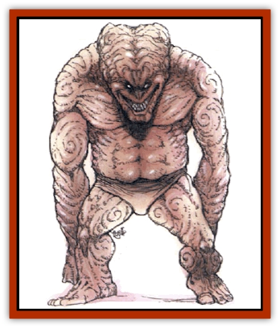

# Golem - Brain

| Statistic | **Golem, Brain** |
| --- | --- |
| **Activity Cycle:** | Any |
| **Alignment:** | Lawful evil |
| **Armor Class:** | 3 |
| **Climate/Terrain:** | Subterranean |
| **Damage/Attack:** | 2d12 |
| **Diet:** | None |
| **Frequency:** | Very rare |
| **Hit Dice:** | 12 (60 hp) |
| **Intelligence:** | Low (5-7) |
| **Magic Resistance:** | 70% |
| **Morale:** | Fearless (20) |
| **Movement:** | 6 |
| **No. Appearing:** | 1 |
| **No. of Attacks:** | 1 |
| **Organization:** | Solitary |
| **Size:** | L (8' tall, 5' wide) |
| **Special Attacks:** | Mental blast |
| **Special Defenses:** | Spell immunities, +2 weapon to hit |
| **THAC0:** | 9 |
| **Treasure:** | Nil |
| **XP Value:** | 10,000 |

A creation of the ancient race of [[Mind_Flayer|mind flayers]], brain [[Golem_General_Information|golems]] may be the most horrible of all their kind. They exist purely for the desire of [[Mind_Flayer|illithids]] and are unswayed from their goals.

A brain golem appears as a huge, burly humanoid with an oversized brain for a head. In fact, the whole body is made up of brain tissue, but is covered with a thin film of slimy skin.

Although brain golems are more intelligent than other golems, they are completely unable to communicate.

**Combat:** Brain golems are used as muscle or guards for illithids, and they attack an opponent only if so ordered or if the opponent tries to get at what the brain golem is guarding. Regardless of the situation, brain golems never attack mind flayers, which limits their effectiveness in battles between members of that race.

In combat, brain golems are more aware of their environment than other golems. They always aim for wizards first, knowing that a quick strike could easily kill a member of that physically weak class. They seem to have an innate ability to roughly determine an opponent's condition (i.e., hit poinst), so they can continue to aim for the next weakest character after defeating a wizard.

A brain golem's physical attack is a swift punch with its fist. It is unable to employ both fists in a round because of its singular thought pattern. but the one fist is often good enough. In addition, once per turn, a brain golem can release a form of the mind flayer's mental blast. This energy strikes everyone within 60 feet. All those hit must make successful saving throws vs. spell or suffer 2d8 points of damage and become stunned for 1d10 rounds. Those who do save only lose initiative for the next round and suffer 1d8 damage. The golem generally calls upon this attack if reduced to 15 hp or less, or if ordered to do so by a mind flayer.

Like all golems, brain golems are immune to all forms of poison and cannot be affected by mind-influencing spells such as charms or illusions. They are also immune to death magic.

**Habitat/Society:** In a book by a sage called Hapworth is a tale told by two rescued human prisoners of the illithids, who apparently saw a brain golem created. Although the magic used was unknown to the humans, the brain golem's body seemed to be a combination of different racial brains. As for the head, this was taken from a part of the [[Elder_Brain|elder brain]] of the mind flayers. The skin was a membrane oozed from that same being.

Mind flayers use brain golems as they use all slaves: as heavy guards, used against monsters resistant to mind attacks or the physical attacks of the illithids. In addition, they are used to perform tasks that are beneath mind flayers, such as guarding food stocks and slaves, etc. Because of their undying loyalty and obedience, the mind flayers prefer brain golems over other races or constructs. A cynical phrase used by the [[Githzerai|githzerai]], "treated like a brain golem," means to be treated well by a slave master.

No city or community of mind flayers will have more than 25 such golems, probably because the illithids don't want to take too much tissue from their beloved elder brain.

**Ecology:** Except in the services of their masters, brain golems have no place in any ecology. However, parts of them are useful in the manufacture of mind-affecting magical items (according to Sage Hapworth, at least).

---
## Discovery & Documentation

**Source Publication:** Monstrous Compendium, 1994 Annual, Volume 1 (1995)
**Campaign Setting:** Advanced Dungeons & Dragons 2nd Edition
**Author(s):** David Wise

### Other Creatures Found in This Source Book
   * [[Abyss_Ant|Abyss Ant]]
   * [[Achaierai|Achaierai]]
   * [[Afanc|Afanc]]
   * [[Al-Jahar|Al-Jahar]]
   * [[Baelnorn|Baelnorn]]
   * [[Baneguard|Baneguard]]
   * [[Banelar|Banelar]]
   * [[Bird_Talking|Bird, Talking]]
   * [[Blazing_Bones|Blazing Bones]]
   * [[Campestri|Campestri]]
   * [[Caniquine|Caniquine]]
   * [[Cat_Winged|Cat, Winged]]
   * [[Crypt_Servant|Crypt Servant]]
   * [[Death's_Head_Tree|Death's Head Tree]]
   * [[Dog_Saluqi|Dog, Saluqi]]
   * [[Dragon_Electrum|Dragon, Electrum]]
   * [[Dragon_Fang|Dragon, Fang]]
   * [[Dragon_Linnorm_Corpse_Tearer|Dragon, Linnorm, Corpse Tearer]]
   * [[Dragon_Linnorm_Dread|Dragon, Linnorm, Dread]]
   * [[Dragon_Linnorm_Flame|Dragon, Linnorm, Flame]]
   * [[Dragon_Linnorm_Forest|Dragon, Linnorm, Forest]]
   * [[Dragon_Linnorm_Frost|Dragon, Linnorm, Frost]]
   * [[Dragon_Linnorm_Gray|Dragon, Linnorm, Gray]]
   * [[Dragon_Linnorm_Land|Dragon, Linnorm, Land]]
   * [[Dragon_Linnorm_Midgard|Dragon, Linnorm, Midgard]]
   * [[Dragon_Linnorm_Rain|Dragon, Linnorm, Rain]]
   * [[Dragon_Linnorm_Sea|Dragon, Linnorm, Sea]]
   * [[Dragon_Neutral_Jacinth|Dragon, Neutral, Jacinth]]
   * [[Dragon_Neutral_Jade|Dragon, Neutral, Jade]]
   * [[Dragon_Neutral_Pearl|Dragon, Neutral, Pearl]]
   * [[Dread|Dread]]
   * [[Dragon-kin|Dragon-kin]]
   * [[Elemental_Earth_Kin_Chrysmal|Elemental, Earth Kin, Chrysmal]]
   * [[Elemental_Earth_Kin_Earth_Weird|Elemental, Earth Kin, Earth Weird]]
   * [[Elemental_Fire_Kin_Azer|Elemental, Fire Kin, Azer]]
   * [[Elemental_Sandman|Elemental, Sandman]]
   * [[Elemental_Wind_Walker|Elemental, Wind Walker]]
   * [[Elemental_Vermin|Elemental Vermin]]
   * [[Feystag|Feystag]]
   * [[Flame_Skull|Flame Skull]]
   * [[Foulwing|Foulwing]]
   * [[Gambado|Gambado]]
   * [[Garbug|Garbug]]
   * [[Genie_Tasked_Administrator|Genie, Tasked, Administrator]]
   * [[Genie_Tasked_Deceiver|Genie, Tasked, Deceiver]]
   * [[Genie_Tasked_Harim_Servant|Genie, Tasked, Harim Servant]]
   * [[Genie_Tasked_Messenger|Genie, Tasked, Messenger]]
   * [[Genie_Tasked_Miner|Genie, Tasked, Miner]]
   * [[Genie_Tasked_Oathbinder|Genie, Tasked, Oathbinder]]
   * [[Gibbering_Mouther|Gibbering Mouther]]
   * [[Gnasher|Gnasher]]
   * [[Gnasher_Winged|Gnasher, Winged]]
   * [[Golem_Hammer|Golem, Hammer]]
   * [[Golem_Metagolem|Golem, Metagolem]]
   * [[Golem_Spiderstone|Golem, Spiderstone]]
   * [[Gorynych|Gorynych]]
   * [[Greelox|Greelox]]
   * [[Helmed_Horror|Helmed Horror]]
   * [[Jarbo|Jarbo]]
   * [[Laraken|Laraken]]
   * [[Lich_Psionic|Lich, Psionic]]
   * [[Living_Steel|Living Steel]]
   * [[Lock_Lurker|Lock Lurker]]
   * [[Loxo|Loxo]]
   * [[Lycanthrope_Loup_de_Noir|Lycanthrope, Loup de Noir]]
   * [[Lycanthrope_Werebadger|Lycanthrope, Werebadger]]
   * [[Lycanthrope_Werejaguar|Lycanthrope, Werejaguar]]
   * [[Lythlyx|Lythlyx]]
   * [[Magebane|Magebane]]
   * [[Marrashi|Marrashi]]
   * [[Metalmaster|Metalmaster]]
   * [[Mimic_House_Hunter|Mimic, House Hunter]]
   * [[Naga_Bone|Naga, Bone]]
   * [[Nautilus_Giant|Nautilus, Giant]]
   * [[Nightshade_Toril|Nightshade (Toril)]]
   * [[Nishruu|Nishruu]]
   * [[Noran|Noran]]
   * [[Opinicus|Opinicus]]
   * [[Ormyrr|Ormyrr]]
   * [[Parasite|Parasite]]
   * [[Pasari-Niml|Pasari-Niml]]
   * [[Plant_Vampire_Moss|Plant, Vampire Moss]]
   * [[Pteraman|Pteraman]]
   * [[Rautym|Rautym]]
   * [[Shadeling|Shadeling]]
   * [[Skum|Skum]]
   * [[Snake_Giant_Cobra|Snake, Giant Cobra]]
   * [[Snake_Stone|Snake, Stone]]
   * [[Spectral_Wizard|Spectral Wizard]]
   * [[Spell_Weaver|Spell Weaver]]
   * [[Spider_Brain|Spider, Brain]]
   * [[Suwyze|Suwyze]]
   * [[Tatalla|Tatalla]]
   * [[Tick_Heart|Tick, Heart]]
   * [[Tree_Dark|Tree, Dark]]
   * [[Tree_Singing|Tree, Singing]]
   * [[Tressym|Tressym]]
   * [[Troll_Snow|Troll, Snow]]
   * [[Tuyewera|Tuyewera]]
   * [[Ulitharid|Ulitharid]]
   * [[Undead_Dwarf|Undead Dwarf]]
   * [[Undead_Lake_Monster|Undead Lake Monster]]
   * [[Whipsting|Whipsting]]
   * [[Windghost|Windghost]]
   * [[Wolf_Dread|Wolf, Dread]]
   * [[Wolf_Stone|Wolf, Stone]]
   * [[Wolf_Vampiric|Wolf, Vampiric]]
   * [[Wraith_Shimmering|Wraith, Shimmering]]
   * [[Xantravar|Xantravar]]
   * [[Xaver|Xaver]]
