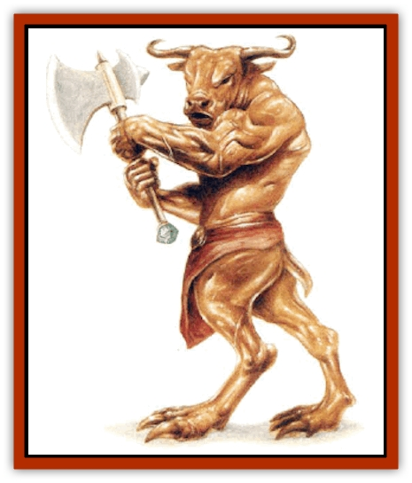

# Golem - Brass Minotaur

| Statistic | **Golem, Brass Minotaur** |
| --- | --- |
| **Activity Cycle:** | Any |
| **Alignment:** | Neutral |
| **Armor Class:** | 4 |
| **Climate/Terrain:** | Any |
| **Damage/Attack:** | 3d10 + special |
| **Diet:** | None |
| **Frequency:** | Very rare |
| **Hit Dice:** | 18 (80 hit points) |
| **Intelligence:** | Non- (0) |
| **Magic Resistance:** | Nil |
| **Morale:** | Fearless (20) |
| **Movement:** | 8 |
| **No. Appearing:** | 1 (very rarely more) |
| **No. of Attacks:** | 1 |
| **Organization:** | Solitary |
| **Size:** | L (12' tall) |
| **Special Attacks:** | Wounding, maze |
| **Special Defenses:** | +3 or better magical weapon to hit, immune to most spells |
| **THAC0:** | 5 |
| **Treasure:** | Nil (see below) |
| **XP Value:** | 17,000 |

The brass [[Minotaur|minotaur]] is a terrible instrument of vengeance. The [[Golem_General_Information|golem]] appears to be but a large brass stature. When activated, it becomes a terrifying engine of destruction. Remaining in a passive state until triggered (for example, by the violation of a shrine), it awakens and seeks out its victims relentlessly: a faultless and tireless tracker.

**Combat:** The brass minotaur is armed with a *battle axe of wounding +3*, which functions as the sword of the same name. The end of the axe's shaft has a large inset gem. The gem acts as a focus for a *trap the soul* effect (as the 7th-level wizard spell. Once each day, the golem can trap a quarry in the gem in the haft of its axe. The trapped foe is sent to an extra-dimensional space resembling the 8th-level wizard spell, *maze*.

The brass minotaur can follow at will into the maze to dispose of the trapped quarry, vanishing completely before the eyes of any onlookers. Once the quarry is destroyed or escapes (as from the *maze* spell) the minotaur can elect to remain within the maze as long as it wills. Each time the minotaur enters the maze (a maximum of once per day) it regains 10-60% of its original hit points, to its 80-point maximum.

The brass minotaur can be struck only by magical weapons of +3 or better enchantment. Lesser weapons inflict no damage and have a 10% chance to shatter if nonmagical.

The only magic that affects the brass minotaur is the 6th-level priest spell *find the path*. If the spell is cast upon the area from which the minotaur disappeared with a quarry, the minotaur and quarry are immediately returned to the Prime Material plane. If cast directly onto the brass minotaur, the golem must make a successful saving throw vs. spell or shatter.

The brass minotaur fights only to defend itself while seeking its quarry and will not use its special *maze* ability on others. If severly damaged, the golem will withdraw and spend several days entering and leaving its maze until it has gained its lost hit points. The *battle axe of wounding* usually shatters when the golem is destroyed, though at the DM's discretion, it might not.

**Habitat/Society:** Brass minotaurs exist to fulfill one goal, set at the time of their creation. They wait with absolute patience until activated. If the goal has become somehow unobtainable - for example, if created to guard a temple that no longer exists - the golem loses its enchantment entirely, as does its weapon.

**Ecology:** As an artificial construct, a brass minotaur is seldom encountered except as a guardian. Occasionally, one might be created to carry out a particular task of vengeance.

This type of golem was first created by Relnar the Just to avenge the death of his wife (slain during the desecration of her temple). Although Relnar quickly recalled his lady from death, he was mightily angered by the massacre of the priestess and the pillaging of the sacred grounds. Once he had constructed this golem, he used a *wish* spell to place it just outside the temple grounds the night of the original onslaught. It was commanded to follow and slay the three-score barbarian attackers. By the next moon, even before Relnar had fully started enchanting of this creature, the brass minotaur was again reported at the temple site, standing guard over the surviving priestesses until the temple was rebuilt.

*Construction Notes:* The requirements for building this golem are many. First, a *battle axe of wounding* must be enchanted. The end of the shaft is capped with a large, flawless gem. Once the weapon is ready, the golem is created. A perfect minotaur skeleton must be laid in a great mold, and three handfuls of powdered diamond and the ores to be alloyed into brass prepared.

The molten ores, sprinkled with the diamond dust, are poured over the skeleton. As the brass takes the place of the minotaur's flesh, the transformation is completed with casting of the spells *strength*, *polymorph any object*, and *geas* on the golem; *trap the soul* and *maze* on the gem in the shaft of the axe (held by the golem); and a *wish* upon all to bind the creation together.

---
## Discovery & Documentation

**Source Publication:** Monstrous Compendium, 1997 Annual, Volume 4 (1995)
**Campaign Setting:** Advanced Dungeons & Dragons 2nd Edition
**Author(s):** Jon Pickens

### Other Creatures Found in This Source Book
   * [[Anemone_Giant_Sea|Anemone, Giant Sea]]
   * [[Asperii|Asperii]]
   * [[Bainligor|Bainligor]]
   * [[Beast_of_Chaos|Beast of Chaos]]
   * [[Blindheim|Blindheim]]
   * [[Bloodsipper_Far_Realm|Bloodsipper (Far Realm)]]
   * [[Bulette_Gohlbrorn|Bulette, Gohlbrorn]]
   * [[Child_of_the_Sea|Child of the Sea]]
   * [[Clockwork_Horror|Clockwork Horror]]
   * [[Clockwork_Swordsman|Clockwork Swordsman]]
   * [[Coral|Coral]]
   * [[Darklore|Darklore]]
   * [[Dharculus|Dharculus]]
   * [[Dolphin_Athas|Dolphin (Athas)]]
   * [[Dragon_Neutral_Moonstone|Dragon, Neutral, Moonstone]]
   * [[Dragon_Prismatic|Dragon, Prismatic]]
   * [[Dream_Stalker|Dream Stalker]]
   * [[Dragon-kin_Albino_Wyrm|Dragon-kin, Albino Wyrm]]
   * [[Echyan|Echyan]]
   * [[Firestar|Firestar]]
   * [[Firetail|Firetail]]
   * [[Fish_Ascallion|Fish, Ascallion]]
   * [[Fish_Deep_Ocean|Fish, Deep Ocean]]
   * [[Fish_Tropical|Fish, Tropical]]
   * [[Fish_Vurgens|Fish, Vurgens]]
   * [[Fogwarden|Fogwarden]]
   * [[Fraal|Fraal]]
   * [[Giant_Crag|Giant, Crag]]
   * [[Gibberling_Brood|Gibberling, Brood]]
   * [[Glutton_Sea|Glutton, Sea]]
   * [[Golden_Ammonite|Golden Ammonite]]
   * [[Golem_Gemstone|Golem, Gemstone]]
   * [[Golem_Maggot|Golem, Maggot]]
   * [[Groundling|Groundling]]
   * [[Hermit_Sea|Hermit, Sea]]
   * [[Hound_of_Law|Hound of Law]]
   * [[Human_Amazon|Human, Amazon]]
   * [[Human_Pygmy|Human, Pygmy]]
   * [[Inquisitor|Inquisitor]]
   * [[Kercpa|Kercpa]]
   * [[Kreel|Kreel]]
   * [[Lycanthrope_Lythari|Lycanthrope, Lythari]]
   * [[Mercurial|Mercurial]]
   * [[Mold_Chromatic|Mold, Chromatic]]
   * [[Mummy_Bog|Mummy, Bog]]
   * [[Neh-thalggu|Neh-thalggu]]
   * [[Nymph_Grain|Nymph, Grain]]
   * [[Nymph_Unseelie|Nymph, Unseelie]]
   * [[Octopus_Octo-Jelly|Octopus, Octo-Jelly]]
   * [[Puddingfish|Puddingfish]]
   * [[Sea_Demon|Sea Demon]]
   * [[Shade|Shade]]
   * [[Shadowrath|Shadowrath]]
   * [[Shark_Athas|Shark (Athas)]]
   * [[Siren_Ravenloft|Siren (Ravenloft)]]
   * [[Skeleton_Variant|Skeleton, Variant]]
   * [[Skyfish|Skyfish]]
   * [[Spectral_Scion|Spectral Scion]]
   * [[Spyder_Fiend|Spyder Fiend]]
   * [[Squid_Squark|Squid, Squark]]
   * [[Tanar'ri_Lesser_Uridezu|Tanar'ri, Lesser, Uridezu]]
   * [[Troll_Mutate|Troll Mutate]]
   * [[Vaati|Vaati]]
   * [[Vampire_Cerebral|Vampire, Cerebral]]
   * [[Varkha|Varkha]]
   * [[Wizshade|Wizshade]]
   * [[Worm_Lukhorn|Worm, Lukhorn]]
   * [[Wyste|Wyste]]
   * [[Yugoloth_Lesser_Gacholoth|Yugoloth, Lesser, Gacholoth]]
   * [[Zombie_Mud|Zombie, Mud]]
