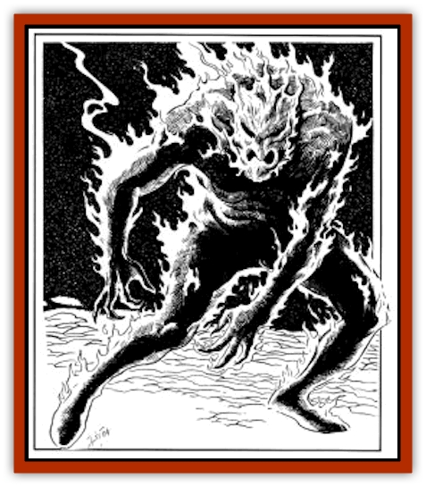

# Golem - Burning Man

| Statistic | **Golem, Burning Man** |
| --- | --- |
| **Activity Cycle:** | Any |
| **Alignment:** | Neutral evil |
| **Armor Class:** | 4 |
| **Climate/Terrain:** | Any |
| **Damage/Attack:** | 2d8/2d8 |
| **Diet:** | Nil |
| **Frequency:** | Very rare |
| **Hit Dice:** | 14 (60 hit points) |
| **Intelligence:** | Semi- (2-4) |
| **Magic Resistance:** | Nil |
| **Morale:** | Variable (see below) |
| **Movement:** | 12 |
| **No. Appearing:** | 1 |
| **No. of Attacks:** | 2 |
| **Organization:** | Solitary |
| **Size:** | H (18' tall) |
| **Special Attacks:** | Keening, cinder shower |
| **Special Defenses:** | +2 or better weapons to hit; immune to fire, lightning, and illusions; regeneration |
| **THAC0:** | 7 |
| **Treasure:** | Nil |
| **XP Value:** | 10,000 |

The "burning man" is a [[Golem_General_Information|golem]] that appears as a humanoid figure made of glowing red coals covered with white-hot cinders. It radiates waves of heat, and can set fire to flammable materials with a touch. When it strikes with its fists, burning cinders shower from its body, these remain and continue to burn until washed away.

**Combat:** This crude, unintelligent creature attacks almost without strategy. It is best used on the battlefield where its awesome presence can do the most good as it wades into masses of enemy troops. Because of the heat it generates, this construct is rarely found in a noncombat role.

The golem can use a terrible *keening* attack once each day. Any creature within 80 feet of the golem must save vs. breath weapon or be affected with *fear*, as by the *wand of fear*. The golem will usually use its keening ability two rounds after a combat starts.

When the golem attacks with its powerful fists each successful strike creates a *cinder shower* that covers its opponent with glowing cinders. These cinders continue to burn for 1 hit point of damage per round for each shower until doused with water or earth. Unless magically protected from fire, any foe so showered is also affected as though by a *symbol of pain* for 2d10 rounds (-1 to attack rolls and -2 to Dexterity). Shower effects are not cumulative except for damage; the maximum Dexterity penalty is -2, but an opponent struck twice would take 2 additional points of damage per round until doused.

A magical weapon of +2 or better enchantment is needed to damage this construct. The golem is impervious to magical fire- or lightning-bases attacks, and illusions. The spell *quench fire* (reversed 4th level priest spell *produce fire*) extinguishes the cinders and reduces the golem's Armor Class to AC 6; this lasts one round per experience level of the caster.

The golem regenerates at the rate of one hit point each turn. When reduced to 0 hit points, each fragment of the golem will flash into a brightly burning flame and collapse into ash. This ash very slowly regenerates, reforming the golem completely from as little as a mere speck unless each ash pile is mixed with holy water and scattered. Regeneration from the merest dust to full form requires a month's time. Each time it regenerates there is a 1% cumulative chance it breaks free of its creator's control.

It has no sense of self preservation; when engaged in a task the golem's morale rating is Fearless (20). When they have broken the control from their lords, their morale is Steady (12), but all of their actions are based on their own desires.

**Habitat/Society:** Although this is a mighty creation and a powerful servant, extreme care and long thought should be taken before deciding to create one. The fiery nature of this creation fills it with a lust to burn and destroy - even its maker. It is compelled to obedience, but only to the letter of the command. It seeks to pervert the spirit of any command and is for most uses unreliable.

**Ecology:** This golem requires three months of construction time by a wizard of 14th or higher level; it costs 60,000 gold pieces. Construction is begun by fashioning a giant manshaped wicker container, which is filled with pitch. On this form the wizard casts *burning sphere*, *animate object*, *fire shield*, *wish*, and *geas*.

---
## Discovery & Documentation

**Source Publication:** Monstrous Compendium, 1995 Annual, Volume 2 (1995)
**Campaign Setting:** Advanced Dungeons & Dragons 2nd Edition
**Author(s):** Jon Pickens

### Other Creatures Found in This Source Book
   * [[Aboleth_Savant|Aboleth, Savant]]
   * [[Addazahr|Addazahr]]
   * [[Amiq_Rasol|Amiq Rasol]]
   * [[Arch-Shadow|Arch-Shadow]]
   * [[Automaton_Scaladar|Automaton, Scaladar]]
   * [[Automaton_Trobriand's|Automaton, Trobriand's]]
   * [[Bat_Sporebat|Bat, Sporebat]]
   * [[Beetle_Dragon|Beetle, Dragon]]
   * [[Bi-nou|Bi-nou]]
   * [[Boggle|Boggle]]
   * [[Brownie_Dobie|Brownie, Dobie]]
   * [[Brownie_Quickling|Brownie, Quickling]]
   * [[Cat_Crypt|Cat, Crypt]]
   * [[Cat_Great_Cath_Shee|Cat, Great, Cath Shee]]
   * [[Centaur-kin_Dorvesh|Centaur-kin, Dorvesh]]
   * [[Centaur-kin_Gnoat|Centaur-kin, Gnoat]]
   * [[Centaur-kin_Ha'pony|Centaur-kin, Ha'pony]]
   * [[Centaur-kin_Zebranaur|Centaur-kin, Zebranaur]]
   * [[Chronolily|Chronolily]]
   * [[Curst|Curst]]
   * [[Darktentacles|Darktentacles]]
   * [[Dinosaur_Aquatic|Dinosaur, Aquatic]]
   * [[Dinosaur_II|Dinosaur II]]
   * [[Dinosaur_III|Dinosaur III]]
   * [[Doppelganger_Greater|Doppelganger, Greater]]
   * [[Dragon_Brine|Dragon, Brine]]
   * [[Dragon_Half-|Dragon, Half-]]
   * [[Dragon-kin_Sea_Wyrm|Dragon-kin, Sea Wyrm]]
   * [[Dwarf_Wild|Dwarf, Wild]]
   * [[Ekimmu|Ekimmu]]
   * [[Elemental_Nature|Elemental, Nature]]
   * [[Elf_Winged|Elf, Winged]]
   * [[Fish_Great_Glacier|Fish (Great Glacier)]]
   * [[Fish_Subterranean|Fish, Subterranean]]
   * [[Fish_Toril|Fish (Toril)]]
   * [[Flareater|Flareater]]
   * [[Flumph|Flumph]]
   * [[Froghemoth|Froghemoth]]
   * [[Ghost_Casurua|Ghost, Casurua]]
   * [[Ghost_Ker|Ghost, Ker]]
   * [[Ghul|Ghul]]
   * [[Ghul-Kin|Ghul-Kin]]
   * [[Giant_Half-giant|Giant, Half-giant]]
   * [[Golem_Phantom_Flyer|Golem, Phantom Flyer]]
   * [[Gulguthhydra|Gulguthhydra]]
   * [[Hakeashar|Hakeashar]]
   * [[Horse_Moon-|Horse, Moon-]]
   * [[Human_Dragonslayer|Human, Dragonslayer]]
   * [[Human_Vistana|Human, Vistana]]
   * [[Jellyfish_Giant|Jellyfish, Giant]]
   * [[Kalin|Kalin]]
   * [[Kholiathra|Kholiathra]]
   * [[Laerti|Laerti]]
   * [[Leucrotta_Greater|Leucrotta, Greater]]
   * [[Lich_Suel|Lich, Suel]]
   * [[Lurker_Shadow|Lurker, Shadow]]
   * [[Lycanthrope_Werepanther|Lycanthrope, Werepanther]]
   * [[Lycanthrope_Wereshark|Lycanthrope, Wereshark]]
   * [[Mammal_Herd_II|Mammal, Herd II]]
   * [[Marl|Marl]]
   * [[Meenlock|Meenlock]]
   * [[Mimic_Greater|Mimic, Greater]]
   * [[Mold_II|Mold II]]
   * [[Mummy_Creature|Mummy, Creature]]
   * [[Nyth|Nyth]]
   * [[Ooze_Slime_Jelly_Ghaunadan|Ooze/Slime/Jelly, Ghaunadan]]
   * [[Palimpsest|Palimpsest]]
   * [[Peltast|Peltast]]
   * [[Plant_Dangerous_II|Plant, Dangerous II]]
   * [[Pleistocene_Animal|Pleistocene Animal]]
   * [[Pudding_Subterranean|Pudding, Subterranean]]
   * [[Raggamoffyn|Raggamoffyn]]
   * [[Snake_Serpent|Snake, Serpent]]
   * [[Snake_Serpent_Vine|Snake, Serpent Vine]]
   * [[Sphinx_Draco-|Sphinx, Draco-]]
   * [[Sprite_Seelie_Faerie|Sprite, Seelie Faerie]]
   * [[Sprite_Unseelie_Faerie|Sprite, Unseelie Faerie]]
   * [[Squealer|Squealer]]
   * [[Turtle_Giant|Turtle, Giant]]
   * [[Umpleby|Umpleby]]
   * [[Vizier's_Turban|Vizier's Turban]]
   * [[Wall_Walker|Wall Walker]]
   * [[Webbird|Webbird]]
   * [[Yak-Man|Yak-Man]]
   * [[Zorbo|Zorbo]]
