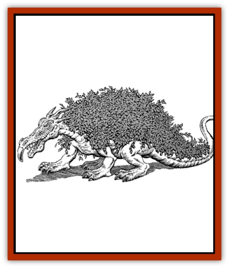

# Golem - Chia

| Statistic | **Golem, Chia** |
| --- | --- |
| **Activity Cycle:** | Any |
| **Alignment:** | Neutral |
| **Armor Class:** | 4 |
| **Climate/Terrain:** | Any |
| **Damage/Attack:** | 2d4/2d4 |
| **Diet:** | Soil, water, compost |
| **Frequency:** | Rare |
| **Hit Dice:** | 8 |
| **Intelligence:** | Non- (0) |
| **Magic Resistance:** | Nil |
| **Morale:** | Fearless (19) |
| **Movement:** | 6 |
| **No. Appearing:** | 1 |
| **No. of Attacks:** | 2 |
| **Organization:** | Solitary |
| **Size:** | L (6-8' tall) |
| **Special Attacks:** | Nil |
| **Special Defenses:** | Nil |
| **THAC0:** | 13 |
| **Treasure:** | Nil |
| **XP Value:** | 1,400 |

Chia [[Golem_General_Information|golems]] span the full range from beautiful, elegant topiary creations to hideous, diseased, overgrown plantings. On royal estates, one might detect chia golems in the form of giant rabbits, mice, [[Cat_Great|lions]], [[Camel|camels]], [[Dragon_General_Information|dragons]], or even uniformed armed guards. Near an abandoned wizard's tower or in the courtyards of evil temples, chia golems may be present in the form of [[Vampire_General_Information|vampires]], [[Lycanthrope_General_Information|werebeasts]], [[Minotaur|minotaurs]], various giants, insects, or other horrid creatures.

A chia golem is a terra cotta or other baked stone sculpture that serves as a surface for plant growth. The chia golem is typically soaked in water and spread with seeds to await sprouting. They have a truly bizarre appearance until the plants have fully matured.

Chia golems may be planted with nearly any type of seeds, such as grass, resulting in a thick green coat; a creeping flowering plant such as phlox or alyssum, resulting in a fluffy pastel mat; a poisonous plant such as poison ivy or oxalis; or a vine plant such as morning glory, ivy, or grape (vines may cause damage in melee; see Combat). A combination of plants may be used to achieve a particular aesthetic effect.
No one has ever been known to have created a chia golem for himself; all known examples have been received as gifts.

Chia golems typically range in size from 6-8'. Smaller golems are somehow unable to maintain the enchantments.

The creation of a chia golem begins with a sculpture in the form of the desired creature. The sculpture requires at least 1,000 lbs. of material. The material must be porous when it is hard to allow for rooting and water seepage; thus, a golem could not be sculpted of granite, but it could be sculpted of limestone or of clay and then baked.

**Combat:** Chia golems act primarily as sentries. They may be stationed in a particular place to stand guard or they may be ordered to creep slowly around the perimeter of an estate to keep watch. Their lack of intelligence and capability for imperceptibly slow movement makes them ideal for this type of watch duty.

A chia golem attacks with both fists for 2d4 hp damage each. If the golem is planted with a vine whose tendrils might slap at an opponent, +1 hp is added to each fist strike. If the creator of the golem chose to plant it with a thorny or otherwise noxious plant, other bonuses may be assessed as well.

Chia golems are immune to *sleep*, *hold*, and *paralysis* spells. Cold-based and heat-based spells may wither the foliage of a chia golem but cause normal damage. Spells such as *entangle*, *warp wood*, and *plant growth* have no effect. *Hold plant* and *antiplant shell* work on chia golems as per the spell descriptions. *Transmute rock to mud* destroys a chia golem, but the plants will live in the resulting mud as long as conditions are right.

**Habitat/Society:** Chia golems may be planted with perennial plants and kept outdoors year round or, if planted with more tender plants, may be moved indoors with the onset of cold weather. Chia golems may also live indoors year round.

The golems, which are hollow, must contain a small amount of soil at all times, and they must be watered according to the requirements of the particular plant. A quantity of compost must also be added to the golem about once per month.

**Ecology:** Like all golems, the chia golem is a manufactured creature and has no place in nature. They are created only through magical means.
A priest of at least 11th level can create a chia golem through extensive ritual, preparation of the terra cotta figure, and use of the following spells: *plant growth*, *prayer*, *commune*, and *animate object*.

A wizard of at least 14th level must cast *fabricate*, *geas*, *charm plants*, and *limited wish* following the construction of the baked clay figure and extensive preparatory rituals.

A druid of at least 14th level may create a chia golem using *animate rock* and *plant growth* and a month-long process of fertility and other rituals that must culminate on the eve of the winter solstice.

---
## Discovery & Documentation

**Source Publication:** Dragon228 (1996)
**Campaign Setting:** Dragon Magazine
**Author(s):** 

### Other Creatures Found in This Source Book
   * [[Golem_Chocolate|Golem, Chocolate]]
   * [[Golem_Plush|Golem, Plush]]
