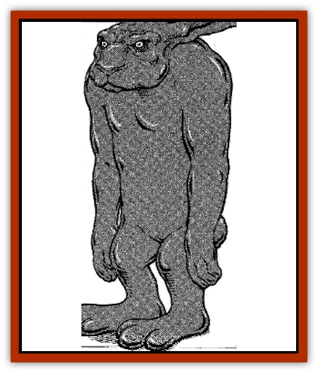

# Golem - Chocolate

| Statistic | **Golem, Chocolate** |
| --- | --- |
| **Activity Cycle:** | Any |
| **Alignment:** | Neutral |
| **Armor Class:** | 10 |
| **Climate/Terrain:** | Any |
| **Damage/Attack:** | 1d4/1d4 |
| **Diet:** | None |
| **Frequency:** | Rare |
| **Hit Dice:** | 6 or 1 |
| **Intelligence:** | Non- (0) |
| **Magic Resistance:** | Nil |
| **Morale:** | Fearless (19) |
| **Movement:** | 6 |
| **No. Appearing:** | 1 |
| **No. of Attacks:** | 2 or 0 |
| **Organization:** | Solitary |
| **Size:** | L (7' tall) |
| **Special Attacks:** | Breath weapon |
| **Special Defenses:** | Nil |
| **THAC0:** | 15 or Nil |
| **Treasure:** | Special |
| **XP Value:** | 650 or 0 |

A chocolate [[Golem_General_Information|golem]] is a sight never to be forgotten. Stories describe chocolate golems of every size and shape, including giant rabbits, chicks, [[Dragon_General_Information|dragons]], reindeer, scarecrows, humans, humanoids, [[Vampire_General_Information|vampires]], and other fantastic creatures.

Two types are known: hollow and solid. Bittersweet, milk, or even white or flavored chocolate may be used in construction. The hollow chocolate golem requires at least 500 lbs. of the finest quality chocolate. The chocolate may be poured into a specially created mold or may be sculpted and the middle hollowed out. Making the solid chocolate golem requires at least a 1,000 lb. block of fine chocolate. The golem is then sculpted from the single block.

Either golem may be embellished with edible paints, frosting, or small candies.

**Combat:** The deluxe chocolate golem (6 HD) typically serves similar purposes as other golems - as sentry or guard. They are sometimes used as security for large parties thrown by kings and other royalty. They appear to be nothing more than edible room decorations but can be ordered to attack. Thus, the golems offer a more innocuous presence than armed guards.

The deluxe golem attacks with both fists for 1d4 hp damage each. Approximately 25% of deluxe golems also have a breath weapon of sorts. Such golems are filled with fruit-flavored liqueur, whipped cream, peanut butter, or marshmallow. The golem can spew forth one gallon of filling every three rounds until its supply (typically 1d6 +6 gallons of filling) is exhausted.

A golem's THAC0 is 10 for purposes of spraying filling and it can hit one victim. The golem's spray causes no damage (although golems filled with chunky peanut butter cause 1 hp damage) but blinds a victim for 1d4 rounds. There is no saving throw.

The lesser chocolate golems (1 HD), often called "party golems", are typically commissioned at great expense for children's parties by royalty. The party golems are capable of nothing more than walking, sitting, or standing. They never attack.

Party golems are always hollow and are filled with small trinkets and candies. Children make a game of whacking the golem with a stick or pole until it shatters, spilling its treasure and shards of chocolate for partygoers to scoop up.

Chocolate golems exhibit varied reactions to spell effects. Electricity affects them normally. *Hold*, *paralysis*, and *sleep* spells have no effect. Cold-based spells improve a chocolate golem's Armor Class by 2 (making them AC 8) for 1d4 rounds. Cumulative cold-based spells have no additional effect.

Any heat-based or fire spells function fully against a chocolate golem, but with a dangerous side effect. The blast of heat instantly causes a spray of hot melted chocolate in a 15' radius. Any creatures within this area suffer 1 hp damage per die of damage caused by the spell. Thus, a golem struck by a six-die fireball causes 6 hp damage to all creatures within 15'.

**Ecology:** Like all golems, the chocolate golem is a manufactured creature and has no place in nature. They are created only through magical means.

A priest of at least 11th level can create a chocolate golem through extensive ritual, preparation of the chocolate figure, and use of the following spells: *purify food &amp; drink*, *prayer*, *commune*, and *animate object*.

A wizard of at least 14th level must cast *fabricate*, *geas*, and *limited wish* following the construction of the chocolate figure and extensive preparatory rituals.

As part of their enchantment, chocolate golems are stable at temperatures up to 125�F. Enduring any temperature beyond that causes them to lose 1 hp per turn. When a golem loses 50% of its hit points from melting (whether magical or mundane), it is affected as if by a *slow* spell.

Anyone wishing to purchase a chocolate golem can expect to pay a minimum of 700 gp for a hollow golem, 1,000 gp for a solid golem, and 1,200 gp for a filled golem. The wizard's labor costs and additional 2,000-3,000 gp.

---
## Discovery & Documentation

**Source Publication:** Dragon228 (1996)
**Campaign Setting:** Dragon Magazine
**Author(s):** 

### Other Creatures Found in This Source Book
   * [[Golem_Chia|Golem, Chia]]
   * [[Golem_Plush|Golem, Plush]]
