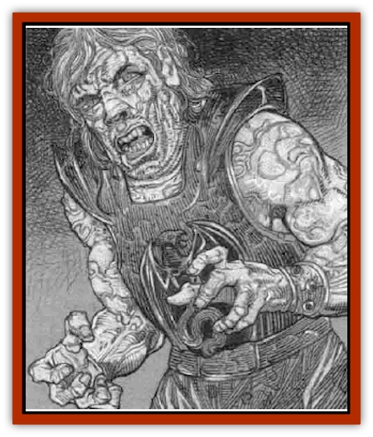

# Golem - Flesh - Ravenloft

| Statistic | **Golem, Flesh (Ravenloft)** |
| --- | --- |
| **Activity Cycle:** | Any |
| **Alignment:** | Chaotic neutral |
| **Armor Class:** | 6 |
| **Climate/Terrain:** | Any |
| **Damage/Attack:** | 2d8/2d8 |
| **Diet:** | None |
| **Frequency:** | Very rare |
| **Hit Dice:** | 9 (40 hp) |
| **Intelligence:** | Average (8-10) |
| **Magic Resistance:** | Special |
| **Morale:** | Fearless (19) |
| **Movement:** | 12 |
| **No. Appearing:** | 1 |
| **No. of Attacks:** | 2 (fists) |
| **Organization:** | Solitary |
| **Size:** | Large (7-8' tall) |
| **Special Attacks:** | Strangulation |
| **Special Defenses:** | See below |
| **THAC0:** | 11 |
| **Treasure:** | Nil |
| **XP Value:** | 5,000 |

Stitched together from the collected body parts of various corpses, [[Golem_II_Lesser_Golem|flesh golems]] have a horrific appearance. Contrary to old movies, they are not flat headed, nor do they have bolts in the side of their necks. Since they are composed of the body parts of many different people, they can have a variety of appearances. All are gruesome and ghastly.

**Combat:** The Ravenloft flesh [[Golem_Ravenloft_General_Information|golems]] are immune to cold and electricity in any form. Cold or electrical attacks do half damage, none if the [[Golem_General_Information|golem]] makes its saving throw. Electricity does not regenerate hit points. Spells may do damage to a flesh golem, but all other types of spell effects are ignored. This only applies to spells cast directly upon the golem, including area effect spells. It does not include the side effects of spells, such as a *wall of stone* falling on it. The golem does not eliminate the wall with its touch, and is still required to deal with it. However, spells like *charm person*, *sleep*, and *teleport other* will fail on golems. The golem does not see through illusions, unless directly cast on it, as in *phantasmal killer*, nor can it automatically see invisible creatures.

If the golem hits with both fists in the same round, it can begin strangling its victim on the next round. This is an optional attack, not required of the creature. Strangulation does 3d8 damage each round automatically. Of course, the victim is unable to escape unless it has a strength of 19 or greater. It is possible for two people to break the grip (one on each arm) so long as they each have at least a 17 Strength.

Although flesh golems are immune to normal weapons and physical attacks, they can be harmed by magical weapons (+1 enchantment or better) and attacks from monsters of sufficient hit dice (4+1 or more, PCs don't qualify!) can harm them. Lesser attacks will not penetrate their skin.

In its own way, the flesh of the golem is alive. It is vulnerable to poison, level draining, gasses and other things that attack the flesh. It has a high resistance, reflected in the +4 saving throw bonus it receives. The exception to this rule is that flesh golems are completely immune to disease.

The flesh golems of Ravenloft have unique regenerative powers. A normal human heals 1 hit point for every day of full rest. The flesh golem recovers 1 point an hour, whether or not it is resting. If it is brought below zero hit points, it does not heal at all - the body is incapacitated, but not dead. Its mind is dormant, unconscious. Its wounds must be stitched up and repaired - it then takes a bolt of electricity to reawaken life in the monster.

Fire does normal damage to golems, as does acid. Only fire or acid can permanently destroy the body of a flesh golem. Anything less and it can be reanimated at a later date.

**Habitat/Society:** Made to serve the selfish purposes of their mad scientist-creators, flesh golems rarely possess either a habitat or a society. They long to be accepted as people, The inevitable rejection they suffer causes most of them to develop a deep hatred of living creatures, especially humans and demihumans.

Normal flesh golems are mindless automatons, Ravenloft flesh golems are not. The spirit that kindles life in the flesh of the golems is keenly aware of its existence and frequently filled with hate. The spirit belongs to the brain used to make the golem, or that of another creature transferred into it. This spirit is usually damaged by the process of transference or reanimation and is a lot more primitive and childlike than the original.

The flesh golem has is one inherent weakness: its fear of fire. It will flee from any source of fire, even one as small as a match. It must remain at least 10 feet from small flames (torches, cooking fires, etc.) and at least 25 feet from larger flames [bonfires, a large collection of torches, etc.). In the case of a small flame, a golem may attempt to move past the fire or knock it from its holder, but only if a successful fear check is made (save vs paralyzation). The fear check for flesh golems is normally an 8 (they are relatively fearless), but they have a -4 penalty for fire, making the save 12 or better on a 20-sided die. If forced too close to a flame, roll on the failed fear check table to see how the creature reacts.

**Ecology:** Flesh golems are not living creatures, and have no ecology.

---
## Discovery & Documentation

**Source Publication:** Ravenloft Appendix III (1991)
**Campaign Setting:** Ravenloft
**Author(s):** Kirk Botulla

### Other Creatures Found in This Source Book
   * [[Akikage|Akikage]]
   * [[Animator_Common|Animator, Common]]
   * [[Animator_Greater|Animator, Greater]]
   * [[Animator_Minor|Animator, Minor]]
   * [[Animator_General_Information|Animator, General Information]]
   * [[Bakhna_Rakhna|Bakhna Rakhna]]
   * [[Baobhan_Sith|Baobhan Sith]]
   * [[Beetle_Scarab|Beetle, Scarab]]
   * [[Boneless|Boneless]]
   * [[Boowray|Boowray]]
   * [[Bruja|Bruja]]
   * [[Carrionette|Carrionette]]
   * [[Carrion_Stalker|Carrion Stalker]]
   * [[Cat_Midnight|Cat, Midnight]]
   * [[Cat_Skeletal|Cat, Skeletal]]
   * [[Cloaker_Resplendent|Cloaker, Resplendent]]
   * [[Cloaker_Shadow|Cloaker, Shadow]]
   * [[Cloaker_Undead|Cloaker, Undead]]
   * [[Corpse_Candle|Corpse Candle]]
   * [[Death's_Head_Tree|Death's Head Tree]]
   * [[Doppelganger_Ravenloft|Doppelganger (Ravenloft)]]
   * [[Familiar_Pseudo-|Familiar, Pseudo-]]
   * [[Familiar_Undead|Familiar, Undead]]
   * [[Feathered_Serpent|Feathered Serpent]]
   * [[Fenhound|Fenhound]]
   * [[Figurine_Ceramic|Figurine, Ceramic]]
   * [[Figurine_Crystal|Figurine, Crystal]]
   * [[Figurine_Ivory|Figurine, Ivory]]
   * [[Figurine_Obsidian|Figurine, Obsidian]]
   * [[Figurine_Porcelain|Figurine, Porcelain]]
   * [[Figurine_General_Information|Figurine, General Information]]
   * [[Fleas_of_Madness|Fleas of Madness]]
   * [[Furies|Furies]]
   * [[Geist|Geist]]
   * [[Ghost_Animal|Ghost, Animal]]
   * [[Golem_Mist_Ravenloft|Golem, Mist (Ravenloft)]]
   * [[Golem_Wax_Ravenloft|Golem, Wax (Ravenloft)]]
   * [[Gremishka|Gremishka]]
   * [[Hag_Spectral|Hag, Spectral]]
   * [[Head_Hunter|Head Hunter]]
   * [[Hearth_Fiend|Hearth Fiend]]
   * [[Hebi-No-Onna|Hebi-No-Onna]]
   * [[Hound_Phantom|Hound, Phantom]]
   * [[Hound_Skeletal|Hound, Skeletal]]
   * [[Imp_Wishing|Imp, Wishing]]
   * [[Ivy_Crawling|Ivy, Crawling]]
   * [[Jack_Frost|Jack Frost]]
   * [[Jolly_Roger|Jolly Roger]]
   * [[Kizoku|Kizoku]]
   * [[Lashweed|Lashweed]]
   * [[Leech_Magical|Leech, Magical]]
   * [[Leech_Psionic|Leech, Psionic]]
   * [[Lich_Defiler|Lich, Defiler]]
   * [[Lich_Drow|Lich, Drow]]
   * [[Lich_Elemental|Lich, Elemental]]
   * [[Lich_Psionic|Lich, Psionic]]
   * [[Living_Tattoo|Living Tattoo]]
   * [[Lycanthrope_Loup-garou|Lycanthrope, Loup-garou]]
   * [[Lycanthrope_Werejackal|Lycanthrope, Werejackal]]
   * [[Lycanthrope_Werejaguar_Ravenloft|Lycanthrope, Werejaguar (Ravenloft)]]
   * [[Lycanthrope_Wereleopard|Lycanthrope, Wereleopard]]
   * [[Lycanthrope_Wereray|Lycanthrope, Wereray]]
   * [[Mist_Ferryman|Mist Ferryman]]
   * [[Moor_Man|Moor Man]]
   * [[Obedient|Obedient]]
   * [[Odem|Odem]]
   * [[Paka|Paka]]
   * [[Plant_Blood_Rose|Plant, Blood Rose]]
   * [[Plant_Fearweed|Plant, Fearweed]]
   * [[Radiant_Spirit|Radiant Spirit]]
   * [[Recluse|Recluse]]
   * [[Remnant_Aquatic|Remnant, Aquatic]]
   * [[Rushlight|Rushlight]]
   * [[Sea_Spawn_Master|Sea Spawn, Master]]
   * [[Sea_Spawn_Minion|Sea Spawn, Minion]]
   * [[Shadow_Asp|Shadow Asp]]
   * [[Shattered_Brethren|Shattered Brethren]]
   * [[Skeleton_Archer|Skeleton, Archer]]
   * [[Skeleton_Insectoid|Skeleton, Insectoid]]
   * [[Skin_Thief|Skin Thief]]
   * [[Spirit_Psionic|Spirit, Psionic]]
   * [[Strahd_Skeleton|Strahd Skeleton]]
   * [[Strahd_Zombie|Strahd Zombie]]
   * [[Unicorn_Shadow|Unicorn, Shadow]]
   * [[Vampire_Drow|Vampire, Drow]]
   * [[Vampire_Nosferatu|Vampire, Nosferatu]]
   * [[Vampire_Oriental|Vampire, Oriental]]
   * [[Virus_General_Information|Virus, General Information]]
   * [[Virus_I|Virus I]]
   * [[Virus_II|Virus II]]
   * [[Virus_III|Virus III]]
   * [[Vorlog|Vorlog]]
   * [[Will_O'Dawn|Will O'Dawn]]
   * [[Will_O'Deep|Will O'Deep]]
   * [[Will_O'Mist|Will O'Mist]]
   * [[Will_O'Sea|Will O'Sea]]
   * [[Zombie_Cannibal|Zombie, Cannibal]]
   * [[Zombie_Desert|Zombie, Desert]]
   * [[Zombie_Wolf|Zombie Wolf]]
   * [[Zombie_Fog|Zombie Fog]]
