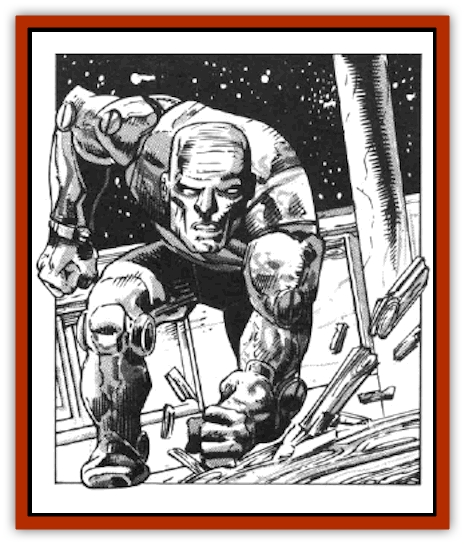

# Golem - Furnace

| Statistic | **Golem, Furnace** |
| --- | --- |
| **Activity Cycle:** | Any |
| **Alignment:** | Neutral |
| **Armor Class:** | 2 |
| **Climate/Terrain:** | Any |
| **Damage/Attack:** | See below |
| **Diet:** | None |
| **Frequency:** | Very rare |
| **Hit Dice:** | 20 (90 hp) |
| **Intelligence:** | Very (11-12) |
| **Magic Resistance:** | Nil (but see below) |
| **Morale:** | Fearless (19-20) |
| **Movement:** | 6 (see below when spelljamming) |
| **No. Appearing:** | 1 |
| **No. of Attacks:** | 1 |
| **Organization:** | Solitary |
| **Size:** | L (12' tall) |
| **Special Attacks:** | See below |
| **Special Defenses:** | See below |
| **THAC0:** | 5 |
| **Treasure:** | Nil |
| **XP Value:** | 18,000 |

The furnace [[Golem_General_Information|golem]] is a specialized form of [[Golem_I_Greater_Golem|iron golem]] that weighs 6,000 lbs. It is otherwise like its cousin in appearance. Furnace golems are created without weapons, but they can pick up and use any giant-size device that they can grasp.

Furnace golems are intelligent, speaking in slow, measured booming voices that lack all inflection and tone. Their mouths open and close, having hinged jaws, and when they speak onlookers can see a fiery glow within their mouths. Furnace golems are warm to the touch but give off no odor. Their eyes give off a dull red glow, as if heated from within. Furnace golems move with ponderous gaits that can crush floors and shake whole buildings, except when they are on thick rock foundations.

Furthermore, furnace golems are capable of spelljamming by consuming magical items, which they place in their mouths to be destroyed by the magical, molten material within them. For every 1,000 XP that a consumed magical item is worth, the golem can spelljam for one week (tonnage = 1/10 ton; SR 2; MC B). Only one item is consumed at a time, avoiding any chance of an internal explosion as might occur in normal furnaces. Furnace golems do not leave the crystal spheres in which they are found; they explode should they enter the phlogiston (300'-radius fireball causing 36d6 points of damage to all within the radius). A human carried along by a furnace golem into wildspace has enough air for 2d6+7 days, thanks to the golem's size.

**Combat:** Because of their intelligence, furnace golems are more versatile than iron golems in combat. A furnace golem may pick up a large, solid weapon (anything from a tree trunk to a giant's axe) and swing it at an opponent, gaining normal initiative and causing triple the damage that a human would do with a similar (man-sized) weapon, plus the damage bonus for having [[Giant_Storm|storm giant]] strength (+12 points). A blow from its fist causes 2d6+12 points of damage. The furnace golem may pick up and hurl boulders or similar objects up to 300 yards, inflicting 3d10 points of damage per rock; however, it can catch rocks and similar hurled objects only 10% of the time.

A furnace golem can also grasp a man-size or smaller opponent and crush him in its mighty fingers. The opponent suffers 6d6 points of damage per round, and the golem need make no further attack rolls after the first round. The golem cannot crush an opponent and fight other foes in the same round, but it can hold an opponent tightly, preventing his escape and either fight with its free hand or catch a second victim and crush them both at the same time. The golem releases their victims when they stop struggling and appear to be dead.

Because of its size and strength, a furnace golem may crush and batter furniture, walls, carts, fences, buildings, etc. A blow from this golem's fist is as effective against structures as a ram with a +1 bonus, as given on Table 52 in the 2nd Edition *Dungeon Master's Guide*, page 76. The golem is equally effective if it can grasp the object and exert force against it, tearing it apart or crushing it. In any situation, consider the golem's mass and strength when lifting, throwing, resisting, or breaking objects.

A furnace golem is immune to all weapons but those of +3 or greater enchantment. Magical cold attacks slow it for three rounds, and magical fire attacks repair 2 points of damage per hit die of damage the attack would have caused. All other spells are ineffective. [[Rust_Monster|Rust monster]] attacks affect a furnace golem, but complete destruction of the golem releases the magical molten iron within it, creating a 60-foot-diameter pool that causes |10 points of damage per round to all within it and lasts for 1d4+4 turns.

**Habitat/Society:** These creatures are animated by powerful, intelligent spirits conjured up by their creators and bound to the material form of the golems. They are servitors of their creators, having no true society or habitat. The creator of a furnace golem may hold a conversation with it, leading what the golem has seen and heard recently (these beings its only two senses). The golem can even offer minor speculations on events of which it is aware. Such conversation is not profound and lacks imagination, but the golem never lies and always tries to use logic. It may even converse with others who encounter it, though this does not hamper its attacks if such seem warranted. Furnace golems can carry out fairly complex instructions as could normal, willing human servants of good intelligence. They never rebel against their masters.

**Ecology:** Furnace golems play no part in any living ecology. Furnace golems neither eat nor sleep.

---
## Discovery & Documentation

**Source Publication:** MC7 Spelljammer Appendix I (1990)
**Campaign Setting:** Advanced Dungeons & Dragons 2nd Edition
**Author(s):** various

### Other Creatures Found in This Source Book
   * [[Aartuk|Aartuk]]
   * [[Albari|Albari]]
   * [[Ancient_Mariner|Ancient Mariner]]
   * [[Argos|Argos]]
   * [[Beholder_Abomination_Astereater|Beholder (Abomination), Astereater]]
   * [[Blazozoid|Blazozoid]]
   * [[Chattur|Chattur]]
   * [[Chevall|Chevall]]
   * [[Clockwork_Horror|Clockwork Horror]]
   * [[Colossus|Colossus]]
   * [[Delphinid|Delphinid]]
   * [[Dizantar|Dizantar]]
   * [[Dog|Dog]]
   * [[Dog_Bog_Hound|Dog, Bog Hound]]
   * [[Esthetic|Esthetic]]
   * [[Focoid|Focoid]]
   * [[Fractine|Fractine]]
   * [[Giant_Spacesea|Giant, Spacesea]]
   * [[Golem_Radiant|Golem, Radiant]]
   * [[Gravislayer|Gravislayer]]
   * [[Grommam|Grommam]]
   * [[Hadozee|Hadozee]]
   * [[Hamster_Giant_Space|Hamster, Giant Space]]
   * [[Jammer_Leech|Jammer Leech]]
   * [[Lakshu|Lakshu]]
   * [[Lumineaux|Lumineaux]]
   * [[Lutum|Lutum]]
   * [[Mimic_Space|Mimic, Space]]
   * [[Misi|Misi]]
   * [[Moon_Rogue|Moon, Rogue]]
   * [[Mortiss|Mortiss]]
   * [[Murderoid|Murderoid]]
   * [[Nay-Churr|Nay-Churr]]
   * [[Phlog-Crawler|Phlog-Crawler]]
   * [[Plasman|Plasman]]
   * [[Plasmoid_DeGleash|Plasmoid, DeGleash]]
   * [[Plasmoid_DelNoric|Plasmoid, DelNoric]]
   * [[Plasmoid_General_Information|Plasmoid, General Information]]
   * [[Plasmoid_Ontalak|Plasmoid, Ontalak]]
   * [[Puffer|Puffer]]
   * [[Q'nidar|Q'nidar]]
   * [[Rastipede|Rastipede]]
   * [[Reigar|Reigar]]
   * [[Rock_Hopper|Rock Hopper]]
   * [[Slinker|Slinker]]
   * [[Spider_Asteroid|Spider, Asteroid]]
   * [[Spiritjam|Spiritjam]]
   * [[Survivor|Survivor]]
   * [[Syllix|Syllix]]
   * [[Symbiont_Power|Symbiont, Power]]
   * [[Vine_Infinity|Vine, Infinity]]
   * [[Wiggle|Wiggle]]
   * [[Wizshade|Wizshade]]
   * [[Wryback|Wryback]]
   * [[Zard|Zard]]
   * [[Zodar|Zodar]]
