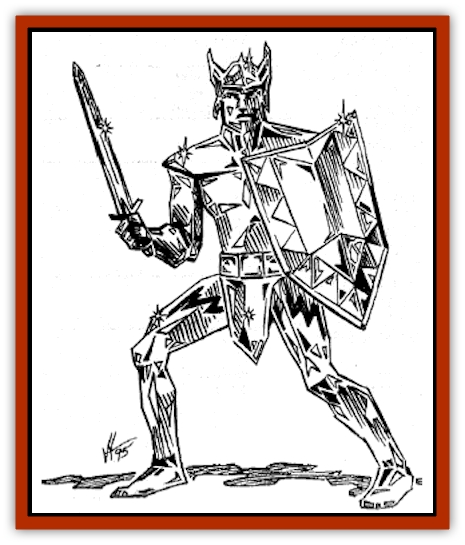
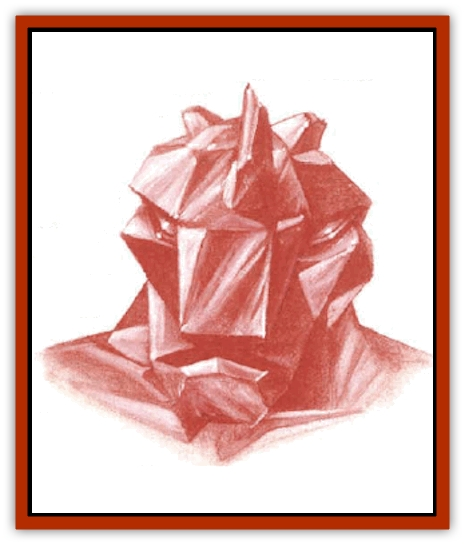
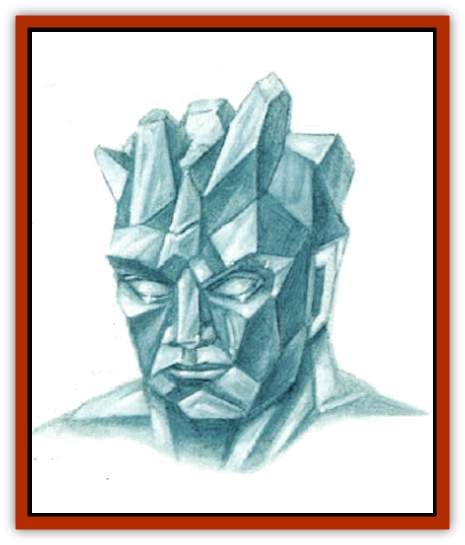
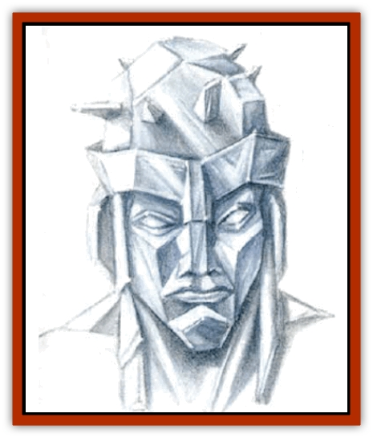
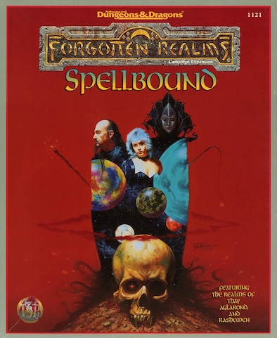

# Golem - Gemstone

| Statistic | **Diamond** | **Emerald** | **Ruby** |
| --- | --- | --- | --- |
| **Activity Cycle:** | Any | Any | Any |
| **Alignment:** | Neutral | Neutral | Neutral |
| **Armor Class:** | 0 | 0 | 0 |
| **Climate/Terrain:** | Any | Any | Any |
| **Damage/Attack:** | 5d10 | 4d10 | Nil |
| **Diet:** | None | None | None |
| **Frequency:** | Very rare | Very rare | Very rare |
| **Hit Dice:** | 14 (60 hp) | 12 (55 hp) | 10 (50 hp) |
| **Intelligence:** | Non- (0) | Non- (0) | Non- (0) |
| **Magic Resistance:** | Nil or 75% | Nil or 50% | Nil or 25% |
| **Morale:** | Fearless (20) | Fearless (20) | Fearless (20) |
| **Movement:** | 6 | 6 | 6 |
| **No. Appearing:** | 1 | 1 | 1 |
| **No. of Attacks:** | 1 | 1 | 1 |
| **Organization:** | Solitary | Solitary | Solitary |
| **Size:** | L (10' tall) | L (9' tall) | L (8' tall) |
| **Special Attacks:** | Diamond chips, sunray | Lightning bolt, cloudkill | Nil |
| **Special Defenses:** | +3 or better to hit, immune to heat, electricity, and acid-based attacks | +2 or better to hit, immune to acid and heat-based spells, 50% damage from electrical attacks | +1 or better to hit, immune to electrical and heat-based spells |
| **THAC0:** | 7 | 9 | 11 |
| **Treasure:** | See below | See below | See below |
| **XP Value:** | 10,000 | 8,000 | 5,000 |

So far, only three major types of gemstone golems have been created in Faer�n - ruby, emerald, and diamond. In the Realms, they are controlled only by the Red Wizards of Thay and the secret of their construction is known only by the Asnar Thuul, the zulkir of invocation magic.

## 

Ruby Golem

Ruby golems stand 8 feet tall and weigh over 3,000 pounds. They resemble statues of dark red, glossy humans clad in armor or robes. Their surfaces are slick and hard, and they are often crafted with the heads of fanciful monsters or armored humans.

Ruby golems strike in combat with stone-hard fists. They are completely mindless in battle, directed by the controlling wizard's circle. For purposes of lifting, breaking, and throwing, they have an effective Strength of 20.

Ruby golems can be hit only by magic or by weapons of +1 or greater enchantment. They have a 25% resistance to priestly spheres of animal, elemental, plant, sun, and weather, and all spells cast by druids, Rashemaar witches, and the magical abilities of the nature spirits of Rashemen. If this resistance fails, the golem takes only half damage from these spells. Ruby golems are completely immune to all electricand heat-based spells.

A *rock to mud spell* immobilizes a ruby golem for 2d4 rounds, while a *crystalbrittle* spell causes it to become vulnerable to normal weapons and eliminates its resistance to heat and electricity. The shatter spell inflicts 5d6 points of damage on a ruby golem, while a mending spell heals all of the golem's damage.

## 

Emerald Golem

Emerald golems resemble tall, muscular human males carved of glittering green stone. Most of these resemble normal, physically perfect males.

Emerald golems are immune to weapons of less than +2 enchantment and possess a 50% immunity to nature-based magic. They are alse completely immune to acid- and heat-based attacks, and take half damage from electrical attacks.

In combat, emerald golems strike with their fists. For purposes of lifting, breaking and throwing. emerald golems have an effective Strength of 22. Three times per day, an emerald golem can shoot a flickering green *lightning bolt* that inflicts 8d8 points of damage. Once per day, an emerald golem can release a cloud of green gas that acts as a *cloudkill* spell.

*Shatter* inflicts 4d6 points of damage on emerald golems, while *crystalbrittle* eliminates their immunity to magic and causes them to be vulnerable to +1, rather than +2, weapons. A mending spell restores 2d6 lost hit points, while glassteel completely restores all damage inflicted upon them.

## 

Diamond Golem

Diamond golems are the most powerful of the gemstone golems known. They resemble tall, muscular humans clad in armor and carved out of multifaceted diamond. They are often armed with swords or carry shields, although these are merely decorative and do not provide the golem with any additional armor or advantage in combat. They are completely immune to heat-, electricity-, and acid-based attacks.

Diamond golems strike for 5d10 points of damage and have an effective Strength of 24 for purposes of throwing, breaking and lifting. They are immune to attacks from all weapons of less than +3 enchantment and are 75% resistant to nature-based magic and Rashemaar creatures.

Three times per a day, a diamond golem can spray a cloud of tiny diamond chips in all directions, unflicting 10d8 points of damage on all within a 25-foot-radius. Also, three times per day, diamond golems can emit a blinding light equivalent to *sunray*, the 7th-level priest spell.

*Shatter* causes 3d6 points of damage to diamond golems, while *crystalbrittle* reduces diamond golems' nature-magic immunity to 25% and its immunity to heat, electricity, and acid to 50%, also rendering it vulnerable to +2 and above weapons, rather than +3. *Mending* restores 2d6 lost hit points, while *glassteel* restores all damage.

**Habitat/Society:** A circle of at least twelve wizards, led by a spellcaster of at least 12th level, is required to control and direct the golems in battle. The circle cannot take any other actions while doing so, and if the circle is disrupted, the golems under its control stop fighting and wander aimlessly. The circle can maintain control only of the golems within the 1-mile radius when the circle is first formed - they cannot add more golems or take control of another circle's golems.

Gemstone golems, when not in use by their controllers, are deactivated by the controlling circle. While gemstone golems are most often used in combat or as guardians, they are sometimes used as servants.

**Ecology:** When finally slain, gemstone golems collapse into piles of rough-cut gems identical to their type. Each golem produces 10d10 gems of the precious category, with values determined using Table 86 in the *DMG*. The remainder is powder, useless for most purposes, though some wizards and alchemists may be able to use it for spell components.

Gemstone golems were originally created long ago by the god-kings of Mulhorand. These fearsome creatures are highly resistant to damage and, once set in motion, virtually unstoppable. Some observers link these gemstone golems with rumors of "statues that walk" in Mulhorand, claiming that the two share similar enchantments and construction techniques, but other claim that they are entirely different.

---
## Discovery & Documentation

**Source Publication:** Spellbound: Thay, Rasheman, & Aglarond (1995)
**Campaign Setting:** Forgotten Realms
**Author(s):** Anthony Pryor

### Other Creatures Found in This Source Book
   * [[Cat_Great_Snow_Tiger|Cat, Great, Snow Tiger]]
   * [[Chosen_One|Chosen One]]
   * [[Dread_Warrior|Dread Warrior]]
   * [[Hag_Bheur|Hag, Bheur]]
   * [[Orc_Neo-Orog|Orc, Neo-Orog]]
   * [[Spirit_Forest_Uthraki|Spirit, Forest, Uthraki]]
   * [[Spirit_Forest_Wood_Man|Spirit, Forest, Wood Man]]
   * [[Spirit_Ice_Orglash|Spirit, Ice, Orglash]]
   * [[Spirit_Rock_Thomil|Spirit, Rock, Thomil]]
   * [[Sprite_Seelie_Faerie|Sprite, Seelie Faerie]]
   * [[Sprite_Unseelie_Faerie|Sprite, Unseelie Faerie]]
   * [[Unicorn_Black_Toril|Unicorn, Black (Toril)]]
   * [[Vampire_Cerebral|Vampire, Cerebral]]
