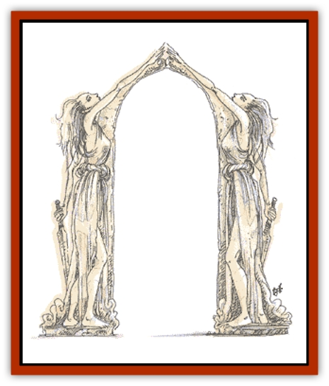

# Golem - General Information

**Combat:** All golems share several traits in common. They are all immune to all forms of poison and cannot be affected by *hold*, *charm*, *fear*, or other mindbased spells, as they have no minds of their own. Certain spells can harm golems; these are mentioned below.

Most golems are fearless and need never check morale.

**Flesh Golem**

The pieces of the golem must be sewn together from the dead bodies of normal humans that have not decayed significantly. A minimum of 6 different bodies must be used, one for each limb, one for the torso (with head), and a different one for the brain. In some cases, more bodies may be necessary to form a complete golem. The spells needed are *wish*, *polymorph any object*, *geas*, *protection from normal missiles*, and *strength*.

**Clay Golems**

Only a lawful good priest can create a clay golem. The body is sculpted from a single block of clay weighing at least 1,000 pounds, which takes about a month. The vestments, which cost 30,000 gp, are the only materials that are not consumed and can be reused, reducing the total cost after the first golem. The spells used are *resurrection*, *animate object*, *commune*, *prayer*, and *bless*.

**Stone Golems**

A stone golem's body is chiseled from a single block of hard stone, such as granite, weighing at least 3,000 pounds, which takes 2 months. The rituals to animate require another month. The materials and spell components alone cost 60,000 gold pieces and the spells used are *wish*, *polymorph any object*, *geas*, and *slow*.

**Iron Golems**

It takes 5,000 pounds of iron,to build the body, which must be done by a skilled iron smith. The spells used in the ritual are *wish*, *polymorph any object*, *geas*, and *cloud kill*. Construction of the body requires an ornate sword which is incorporated into the monster. A magical sword can be used, in which case there is a 50% chance that it is drained of magic when the golem is animated. The golem can only use those abilities of the sword that are automatic. Any property that requires a command word and any sentient ability of the sword is lost. If the sword is ever removed from the golem, it loses all of its magic.

## Variant Golems

The first golems were, undoubtedly, all traditional golems. Over the years, however, various wizards and priests examined the techniques employed by earlier designers and modified them. As they introduced changes, they documented the processes they used to create their new constructs. This process of study and modification is never-ending. Even today, the work of these mysterious scholars is being studied and revised in magical colleges around the world.

**Theory:** Like other golems, golem variants depend on the powerful forces of elemental magic to animate them. They have no lives of their own and are animated by a spirit from the elemental plane of Earth. In some cases this spirit is tricked, lured, or forced into animating the body while in other cases it comes willingly. In the former cases, the stone construct sometimes breaks free of the influence of its creator and becomes a free-willed entity. Because of the nature of its physical shell, constructs that break free often become berserk killers, destroying everything in their paths before being annihilated themselves.

**Construction:** The actual construction of any golem's physical body is a tiring and demanding task. Although the steps required to create a variant golem differ depending on the type, they do have some elements in common. The most important of these is the degree of detail that is put into the carving of the body. In the case of the caryatid column, for example, the construct must be lovingly crafted with great skill. In most cases, the wizard or priest creating a caryatid column hires a professional sculptor or stone mason to undertake this step of the animation process.

Less sophisticated golems, like the stone guardian and the primitive scarecrow, do not require the artistic perfection of the caryatid column. However, they are often covered with delicate mystical runes or glyphs that must be perfect if the creature is to be successfully animated.

**Bone Golem**

The body of a bone golem is assembled wholly from the bones of animated skeletons who have been defeated in combat. Any type of skeletal undead will do, but all must have been created and slain in the Demiplane of Dread. Only 10% of the bones from any given skeleton can be used, so the final product is the compilation of bones from many creatures. Often, there will be animal, monster, and human bones in the same golem, giving the creature a nightmarish appearance. The spells woven over the body must include *animate dead*, *symbol of fear*, *binding*, and *wish*.

**Caryatid column**

The caryatid column can be created by a priest or wizard using a special version of the *manual of golems*. Whenever such a tome is discovered, there is a 20% chance that it describes a caryatid column.

**Doll Golem**

These creatures resemble a child's toy - often a baby doll or stuffed animal. Doll golems can serve as either the guardians of children or as murdering things too foul to contemplate. The spells needed to complete the animation are *imbue with spell ability*, *Tasha's uncontrollable hideous laughter*, *(un)holy word*, *bless*, and *prayer*. The first known examples of this type of golem turned up on the Demiplane of Dread in the land of Sanguinia.

**Gargoyle Golem**

This creature is fashioned in the image of a real [[Gargoyle_I|gargoyle]] and is often placed as a warden atop buildings, cathedrals, or tombs. It is most similar to the stone golem; the body must be carved from a single slab of granite (weighing 3,000 pounds) and prepared with expensive components. Only the vestments created for the process are reusable (saving 15,000 gp on the cost of additional gargoyle golems). The spells required to complete the process are *bless*, *exaction*, *(un)holy word*, *stone shape*, *conjure earth elemental*, and *prayer*.

**Glass Golem**

The glass golem is composed entirely of stained glass. Perhaps the most artistic of all golems, its creation requires the following spells: *glassteel*, *animate object*, *prismatic spray*, *rainbow*, and *wish*. Because of the mixture of spells, this type of golem is usually built by multi- or dual-classed characters or with the aid of a powerful assistant.

The first appearance of glass golems is not recorded with certainty. It is believed that they were created by a spell-caster who fancied himself an artist (hence their eerie beauty), but no one knows.

**Juggernaut**

Juggernauts that can alter their form require an extra step in their creation, which normally resembles the process to make a stone golem. Prior to animating a juggernaut, the wizard must use the [[Mimic|mimic]] blood as a material component in the final spells woven over the body. This addition gives this golem variant intelligence and an alignment.

**Necrophidius**

A necrophidius may be created in one of three ways. The first is a special form of *manual of golems* that provides secrets of its construction. The *Necrophidicon*, as it is called, must be burnt to ashes that provide the monster's animating force. The other two arcane and priestly processes are long and complex.

A wizard must cast *limited wish*, *geas*, and *charm person* spells. A priest requires the spells *quest*, *neutralize poison*, *prayer*, *silence*, and *snake charm*. Whichever method is used, the monster requires a complete [[Snake|giant snake]] skeleton (either poisonous or constrictor), slain within 24 hours of the enchantment's commencement. Each necrophidius is built for a single specific purpose (which must be in the spellcaster's mind when he creates it), such as "Kill Ragnar the Bold". The necrophidius never seeks to twist the intent of its maker, but its enchantments fade when its task is done or cannot be completed; for example, when it kills Ragnar.

The maker must want the necrophidius to serve its purpose. He could not, for example, build a death worm to "Sneak into the druid's hut and steal his staff", if he really intended for the necrophidius to merely provide a distraction. He could not build more than one death worm and assign both to kill Ragnar, since he could not imbue the second death worm with a task that he intended the first one to complete. For this reason, necrophidii almost never work as a team.

Rumors claim that there were once methods to make a necrophidius gain 1 Hit Die every century it was pursuing its purpose.

**Scarecrow**

Scarecrows can only be created either by using a special *manual* or by a god answering the plea of a priest employing the following spells: *animate object*, *prayer*, *command*, and *quest*. The final step of the process, casting the *quest* spell, is done during a new moon.

Scarecrows can be constructed to kill a specific person. To do so, the clothes worn by the scarecrow must come from the intended victim. Once the scarecrow is animated, the priest need only utter a single word - "Quest". The scarecrow then moves in a direct line toward the victim. When it reaches the victim, the scarecrow disregards all other beings and concentrates its gaze and attacks entirely on the person it has been created to kill. After slaying its victim, a quested scarecrow's magic dissipates and it collapses into dust.

**Stone Guardian**

A stone guardian is very similar to a traditional stone golem, but it has some unique abilities its ancestor does not. In physical appearance, the two constructs are quite similar, but the stone guardian is usually decorated with runes and magical glyphs.

A stone guardian is created with the following spells: *enchant an item*, *transmute mud to rock*, *magic mouth*, and *limited wish* or *wish*. In addition, the wizard creating the guardian may cast a *detect invisible* spell to give the creature that power.

The initial material of the body is mud around a heart of polished stone. As the various spells are woven into the body, a spirit from the elemental plane of Earth is forced to enter the body and animate it. Because the spirit is there against its will, there is a 20% chance that the golem goes berserk each time it is activated.

A special *ring of protection* can be created when the stone guardian is animated; this prevents the guardian from striking at anyone wearing it. In addition, all those within 10 feet of the ring wearer are also immune to attack. Rings of this type function only against the guardian they were made with and provide no protection from any other golem.

---
## Discovery & Documentation

**Source Publication:** Monstrous Manual (1995)
**Campaign Setting:** Advanced Dungeons & Dragons 2nd Edition
**Author(s):** Tim Beach

### Other Creatures Found in This Source Book
   * [[Aarakocra|Aarakocra]]
   * [[Aboleth|Aboleth]]
   * [[Ankheg|Ankheg]]
   * [[Arcane|Arcane]]
   * [[Argos|Argos]]
   * [[Aurumvorax|Aurumvorax]]
   * [[Baatezu_Lesser_Abishai|Baatezu, Lesser, Abishai]]
   * [[Baatezu_General_Information|Baatezu, General Information]]
   * [[Baatezu_Greater_Pit_Fiend|Baatezu, Greater, Pit Fiend]]
   * [[Banshee|Banshee]]
   * [[Basilisk|Basilisk]]
   * [[Bat|Bat]]
   * [[Bear|Bear]]
   * [[Beetle_Giant|Beetle, Giant]]
   * [[Behir|Behir]]
   * [[Beholder_and_Beholder-kin_I|Beholder and Beholder-kin I]]
   * [[Beholder_and_Beholder-kin_II|Beholder and Beholder-kin II]]
   * [[Bird|Bird]]
   * [[Brain_Mole|Brain Mole]]
   * [[Broken_One|Broken One]]
   * [[Brownie|Brownie]]
   * [[Bugbear|Bugbear]]
   * [[Bulette|Bulette]]
   * [[Bullywug|Bullywug]]
   * [[Carrion_Crawler|Carrion Crawler]]
   * [[Cat_Great|Cat, Great]]
   * [[Catoblepas|Catoblepas]]
   * [[Cat_Small|Cat, Small]]
   * [[Cave_Fisher|Cave Fisher]]
   * [[Centaur|Centaur]]
   * [[Centipede|Centipede]]
   * [[Chimera|Chimera]]
   * [[Cloaker|Cloaker]]
   * [[Cockatrice|Cockatrice]]
   * [[Couatl|Couatl]]
   * [[Crabman|Crabman]]
   * [[Crawling_Claw|Crawling Claw]]
   * [[Crocodile|Crocodile]]
   * [[Crustacean_Giant|Crustacean, Giant]]
   * [[Crypt_Thing|Crypt Thing]]
   * [[Death_Knight|Death Knight]]
   * [[Deepspawn|Deepspawn]]
   * [[Dinosaur_I|Dinosaur I]]
   * [[Displacer_Beast|Displacer Beast]]
   * [[Dog|Dog]]
   * [[Dog_Moon|Dog, Moon]]
   * [[Dolphin|Dolphin]]
   * [[Doppelganger|Doppelganger]]
   * [[Dracolich|Dracolich]]
   * [[Dragon_Brown|Dragon, Brown]]
   * [[Dragon_Chromatic_Black|Dragon, Chromatic, Black]]
   * [[Dragon_Chromatic_Blue|Dragon, Chromatic, Blue]]
   * [[Dragon_Chromatic_Green|Dragon, Chromatic, Green]]
   * [[Dragon_Cloud|Dragon, Cloud]]
   * [[Dragon_Chromatic_Red|Dragon, Chromatic, Red]]
   * [[Dragon_Chromatic_White|Dragon, Chromatic, White]]
   * [[Dragon_Deep|Dragon, Deep]]
   * [[Dragon_Gem_Amethyst|Dragon, Gem, Amethyst]]
   * [[Dragon_Gem_Crystal|Dragon, Gem, Crystal]]
   * [[Dragon_Gem_Emerald|Dragon, Gem, Emerald]]
   * [[Dragon_Gem_Sapphire|Dragon, Gem, Sapphire]]
   * [[Dragon_Gem_Topaz|Dragon, Gem, Topaz]]
   * [[Dragon_Metallic_Brass|Dragon, Metallic, Brass]]
   * [[Dragon_Metallic_Bronze|Dragon, Metallic, Bronze]]
   * [[Dragon_Metallic_Copper|Dragon, Metallic, Copper]]
   * [[Dragon_Mercury|Dragon, Mercury]]
   * [[Dragon_Metallic_Gold|Dragon, Metallic, Gold]]
   * [[Dragon_Mist|Dragon, Mist]]
   * [[Dragon_Metallic_Silver|Dragon, Metallic, Silver]]
   * [[Dragon_General_Information|Dragon, General Information]]
   * [[Dragon_Shadow|Dragon, Shadow]]
   * [[Dragon_Steel|Dragon, Steel]]
   * [[Dragon_Yellow|Dragon, Yellow]]
   * [[Dragonne|Dragonne]]
   * [[Dragon_Turtle|Dragon Turtle]]
   * [[Dragonet_Faerie_Dragon|Dragonet, Faerie Dragon]]
   * [[Dragonet_Fire_Drake|Dragonet, Fire Drake]]
   * [[Dragonet_Pseudodragon|Dragonet, Pseudodragon]]
   * [[Dryad|Dryad]]
   * [[Dwarf_Derro|Dwarf, Derro]]
   * [[Dwarf|Dwarf]]
   * [[Elemental_Athas_General_Information|Elemental (Athas), General Information]]
   * [[Elemental_Air_Kin|Elemental, Air Kin]]
   * [[Elemental_Earth_Kin|Elemental, Earth Kin]]
   * [[Elemental_Fire_Kin|Elemental, Fire Kin]]
   * [[Elemental_Water_Kin|Elemental, Water Kin]]
   * [[Elemental_of_Chaos_Air_Earth|Elemental of Chaos, Air/Earth]]
   * [[Elemental_of_Chaos_Fire_Water|Elemental of Chaos, Fire/Water]]
   * [[Elemental_Composite|Elemental, Composite]]
   * [[Elemental_Air_Earth|Elemental, Air/Earth]]
   * [[Elemental_Fire_Water|Elemental, Fire/Water]]
   * [[Elemental_General_Information|Elemental, General Information]]
   * [[Elephant|Elephant]]
   * [[Elf|Elf]]
   * [[Elf_Aquatic|Elf, Aquatic]]
   * [[Elf_Drow|Elf, Drow]]
   * [[Ettercap|Ettercap]]
   * [[Eyewing|Eyewing]]
   * [[Feyr|Feyr]]
   * [[Fish|Fish]]
   * [[Frog|Frog]]
   * [[Fungus|Fungus]]
   * [[Galeb_Duhr|Galeb Duhr]]
   * [[Gargantua|Gargantua]]
   * [[Gargoyle_I|Gargoyle I]]
   * [[Genie|Genie]]
   * [[Ghost|Ghost]]
   * [[Ghoul|Ghoul]]
   * [[Giant_Cloud|Giant, Cloud]]
   * [[Giant_Cyclops|Giant, Cyclops]]
   * [[Giant_Desert|Giant, Desert]]
   * [[Giant_Ettin|Giant, Ettin]]
   * [[Giant_Firbolg|Giant, Firbolg]]
   * [[Giant_Fire|Giant, Fire]]
   * [[Giant_Fog|Giant, Fog]]
   * [[Giant_Fomorian|Giant, Fomorian]]
   * [[Giant_Frost|Giant, Frost]]
   * [[Giant_Hill|Giant, Hill]]
   * [[Giant_Jungle|Giant, Jungle]]
   * [[Giant_Mountain|Giant, Mountain]]
   * [[Giant_Reef|Giant, Reef]]
   * [[Giant_Stone|Giant, Stone]]
   * [[Giant_Storm|Giant, Storm]]
   * [[Giant_Verbeeg|Giant, Verbeeg]]
   * [[Giant_Wood|Giant, Wood]]
   * [[Gibberling|Gibberling]]
   * [[Giff|Giff]]
   * [[Gith|Gith]]
   * [[Gith_Pirate_of|Gith, Pirate of]]
   * [[Githyanki|Githyanki]]
   * [[Githzerai|Githzerai]]
   * [[Gloomwing|Gloomwing]]
   * [[Gnoll|Gnoll]]
   * [[Gnome|Gnome]]
   * [[Gnome_Spriggan|Gnome, Spriggan]]
   * [[Goblin|Goblin]]
   * [[Golem_I_Greater_Golem|Golem I (Greater Golem)]]
   * [[Golem_II_Lesser_Golem|Golem II (Lesser Golem)]]
   * [[Golem_III|Golem III]]
   * [[Golem_IV|Golem IV]]
   * [[Golem_V|Golem V]]
   * [[Golem_VI_Stone_Variants|Golem VI (Stone Variants)]]
   * [[Gorgon|Gorgon]]
   * [[Grell_Colonial|Grell, Colonial]]
   * [[Gremlin_Jermlaine|Gremlin, Jermlaine]]
   * [[Gremlin|Gremlin]]
   * [[Griffon|Griffon]]
   * [[Grimlock|Grimlock]]
   * [[Grippli|Grippli]]
   * [[Hag|Hag]]
   * [[Halfling|Halfling]]
   * [[Harpy|Harpy]]
   * [[Hatori|Hatori]]
   * [[Haunt|Haunt]]
   * [[Hell_Hound|Hell Hound]]
   * [[Heucuva|Heucuva]]
   * [[Hippocampus|Hippocampus]]
   * [[Hippogriff|Hippogriff]]
   * [[Hobgoblin|Hobgoblin]]
   * [[Homunculus|Homunculus]]
   * [[Hook_Horror|Hook Horror]]
   * [[Horse|Horse]]
   * [[Human|Human]]
   * [[Hydra|Hydra]]
   * [[Imp|Imp]]
   * [[Insect_Giant|Insect, Giant]]
   * [[Insect_Swarm|Insect Swarm]]
   * [[Intellect_Devourer|Intellect Devourer]]
   * [[Invisible_Stalker|Invisible Stalker]]
   * [[Ixitxachitl|Ixitxachitl]]
   * [[Jackalwere|Jackalwere]]
   * [[Kenku|Kenku]]
   * [[Ki-rin|Ki-rin]]
   * [[Kirre|Kirre]]
   * [[Kobold|Kobold]]
   * [[Kuo-Toa|Kuo-Toa]]
   * [[Lamia|Lamia]]
   * [[Lammasu|Lammasu]]
   * [[Leech|Leech]]
   * [[Leprechaun|Leprechaun]]
   * [[Leucrotta|Leucrotta]]
   * [[Lich|Lich]]
   * [[Living_Wall|Living Wall]]
   * [[Lizard|Lizard]]
   * [[Lizard_Man|Lizard Man]]
   * [[Locathah|Locathah]]
   * [[Lurker|Lurker]]
   * [[Lycanthrope_General_Information|Lycanthrope, General Information]]
   * [[Lycanthrope_Seawolf|Lycanthrope, Seawolf]]
   * [[Lycanthrope_Werebear|Lycanthrope, Werebear]]
   * [[Lycanthrope_Wereboar|Lycanthrope, Wereboar]]
   * [[Lycanthrope_Werebat|Lycanthrope, Werebat]]
   * [[Lycanthrope_Werefox|Lycanthrope, Werefox]]
   * [[Lycanthrope_Wererat|Lycanthrope, Wererat]]
   * [[Lycanthrope_Wereraven|Lycanthrope, Wereraven]]
   * [[Lycanthrope_Weretiger|Lycanthrope, Weretiger]]
   * [[Lycanthrope_Werewolf|Lycanthrope, Werewolf]]
   * [[Mammal|Mammal]]
   * [[Mammal_Giant|Mammal, Giant]]
   * [[Mammal_Herd_I|Mammal, Herd I]]
   * [[Mammal_Small|Mammal, Small]]
   * [[Manscorpion|Manscorpion]]
   * [[Manticore|Manticore]]
   * [[Medusa_Maedar|Medusa, Maedar]]
   * [[Medusa|Medusa]]
   * [[Mephit_General_Information|Mephit, General Information]]
   * [[Merman|Merman]]
   * [[Mimic|Mimic]]
   * [[Mind_Flayer|Mind Flayer]]
   * [[Minotaur|Minotaur]]
   * [[Mist_Crimson_Death|Mist, Crimson Death]]
   * [[Mist_Vampiric|Mist, Vampiric]]
   * [[Mold_I|Mold I]]
   * [[Moldman|Moldman]]
   * [[Mongrelman|Mongrelman]]
   * [[Morkoth|Morkoth]]
   * [[Muckdweller|Muckdweller]]
   * [[Mudman|Mudman]]
   * [[Mummy_Greater|Mummy, Greater]]
   * [[Mummy|Mummy]]
   * [[Myconid|Myconid]]
   * [[Naga|Naga]]
   * [[Naga_Dark|Naga, Dark]]
   * [[Neogi|Neogi]]
   * [[Nightmare|Nightmare]]
   * [[Nymph|Nymph]]
   * [[Octopus_Giant|Octopus, Giant]]
   * [[Ogre|Ogre]]
   * [[Ogre_Half-|Ogre, Half-]]
   * [[Ooze_Slime_Jelly_I|Ooze/Slime/Jelly I]]
   * [[Ooze_Slime_Jelly_II|Ooze/Slime/Jelly II]]
   * [[Ooze_Slime_Jelly_Slithering_Tracker|Ooze/Slime/Jelly, Slithering Tracker]]
   * [[Orc|Orc]]
   * [[Otyugh|Otyugh]]
   * [[Owlbear_I|Owlbear I]]
   * [[Pegasus|Pegasus]]
   * [[Peryton|Peryton]]
   * [[Phantom|Phantom]]
   * [[Phoenix|Phoenix]]
   * [[Piercer|Piercer]]
   * [[Plant_Dangerous_I|Plant, Dangerous I]]
   * [[Plant_Intelligent|Plant, Intelligent]]
   * [[Poltergeist|Poltergeist]]
   * [[Pudding_Deadly|Pudding, Deadly]]
   * [[Quaggoth|Quaggoth]]
   * [[Rakshasa|Rakshasa]]
   * [[Rat|Rat]]
   * [[Rat_Osquip|Rat, Osquip]]
   * [[Remorhaz|Remorhaz]]
   * [[Revenant|Revenant]]
   * [[Roc|Roc]]
   * [[Roper|Roper]]
   * [[Rust_Monster|Rust Monster]]
   * [[Sahuagin|Sahuagin]]
   * [[Satyr|Satyr]]
   * [[Scorpion|Scorpion]]
   * [[Sea_Lion|Sea Lion]]
   * [[Selkie|Selkie]]
   * [[Shadow|Shadow]]
   * [[Shedu|Shedu]]
   * [[Sirine|Sirine]]
   * [[Skeleton|Skeleton]]
   * [[Skeleton_Giant|Skeleton, Giant]]
   * [[Skeleton_Warrior|Skeleton, Warrior]]
   * [[Slaad|Slaad]]
   * [[Slug_Giant|Slug, Giant]]
   * [[Snake|Snake]]
   * [[Snake_Winged|Snake, Winged]]
   * [[Spectre|Spectre]]
   * [[Sphinx|Sphinx]]
   * [[Spider|Spider]]
   * [[Sprite|Sprite]]
   * [[Squid_Giant|Squid, Giant]]
   * [[Stirge|Stirge]]
   * [[Su-Monster|Su-Monster]]
   * [[Swanmay|Swanmay]]
   * [[Tabaxi|Tabaxi]]
   * [[Tako|Tako]]
   * [[Tanar'ri_True_Balor|Tanar'ri, True, Balor]]
   * [[Tanar'ri_True_Marilith|Tanar'ri, True, Marilith]]
   * [[Tarrasque|Tarrasque]]
   * [[Tasloi|Tasloi]]
   * [[Thought_Eater|Thought Eater]]
   * [[Thri-kreen|Thri-kreen]]
   * [[Titan|Titan]]
   * [[Toad_Giant|Toad, Giant]]
   * [[Treant|Treant]]
   * [[Triton|Triton]]
   * [[Troglodyte|Troglodyte]]
   * [[Troll|Troll]]
   * [[Umber_Hulk|Umber Hulk]]
   * [[Unicorn|Unicorn]]
   * [[Urchin|Urchin]]
   * [[Vampire|Vampire]]
   * [[Wemic|Wemic]]
   * [[Whale|Whale]]
   * [[Wight|Wight]]
   * [[Will_O'Wisp|Will O'Wisp]]
   * [[Wolf|Wolf]]
   * [[Wolfwere|Wolfwere]]
   * [[Worm|Worm]]
   * [[Wraith|Wraith]]
   * [[Wyvern|Wyvern]]
   * [[Xorn|Xorn]]
   * [[Yeti|Yeti]]
   * [[Yuan-ti_Histachii|Yuan-ti, Histachii]]
   * [[Yuan-ti|Yuan-ti]]
   * [[Yugoloth_Guardian|Yugoloth, Guardian]]
   * [[Zaratan|Zaratan]]
   * [[Zombie|Zombie]]
