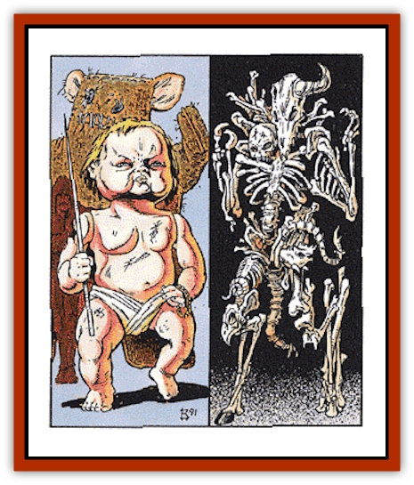

# Golem III

| Statistic | **Bone** | **Doll** |
| --- | --- | --- |
| **Activity Cycle:** | Any | Any |
| **Alignment:** | Neutral | Neutral |
| **Armor Class:** | 0 | 4 |
| **Climate/Terrain:** | Any | Any |
| **Damage/Attack:** | 3d8 | 3d6 |
| **Diet:** | None | None |
| **Frequency:** | Very rare | Very rare |
| **Hit Dice:** | 14 (70 hp) | 10 (40 hp) |
| **Intelligence:** | Non- (0) | Non- (0) |
| **Magic Resistance:** | Nil | Nil |
| **Morale:** | Fearless (20) | Fearless (20) |
| **Movement:** | 12 | 15 |
| **No. Appearing:** | 1 | 1 |
| **No. of Attacks:** | 1 | 1 |
| **Organization:** | Solitary | Solitary |
| **Size:** | M (6' tall) | T (1' tall) |
| **Special Attacks:** | See below | See below |
| **Special Defenses:** | See below | See below |
| **THAC0:** | 7 | 11 |
| **Treasure:** | Nil | Nil |
| **XP Value:** | 18,000 | 6,000 |

## Bone Golem

The bone [[Golem_General_Information|golem]] is built from the previously animated bones of skeletal undead. These horrors stand roughly 6 feet tall and weight between 50 and 60 pounds. They are seldom armored and can easily be mistaken for undead, much to the dismay of those who make this error.

**Combat:** Bone golems are no more intelligent than other forms of golem, so they will not employ clever tactics or strategies in combat. Their great power, however, makes them far deadlier than they initially appear to be. There is a 95% chance that those not familiar with the true nature of their opponent will mistake them for simple undead.

Bone golems attack with their surprisingly strong blows and sharp, claw-like fingers. Each successful hit inflicts 3-24 (3d8) points of damage. They can never be made to use weapons of any sort in melee. In addition to the common characteristics of all golems (described previously), bone golems take only half damage from those edged or piercing weapons that can harm them.

Bone golems are immune to almost all spells, but can be laid low with the aid of a *shatter* spell that is focused on them and has the capacity to affect objects of their weight. If such a spell is cast at a bone golem, the golem is entitled to a saving throw vs. spells to negate it. Failure indicates that weapons able to harm the golem will now inflict twice the damage they normally would. Thus, edged weapons would do full damage while blunt ones would inflict double damage.

Once every three rounds, the bone golem may throw back its head and issue a hideous laugh that causes all those who hear it to make fear and horror checks. Those who fail either check are paralyzed and cannot move for 2-12 rounds. Those who fail both checks are instantly stricken dead with fear.

## Doll Golem

The doll golem is an animated version of a child's toy that can be put to either good uses (defending the young) or evil uses (attacking them). It is often crafted so as to make it appear bright and cheerful when at rest. Upon activation, however, its features become twisted and horrific.

**Combat:** The doll golem is, like all similar creatures, immune to almost all magical attacks. It can be harmed by fire-based spells, although these do only half damage, while a *warp wood* spell will affect the creature as if it were a *slow* spell. A *mending* spell restores the creature to full hit points at once.

Each round, the doll golem leaps onto a victim and attempts to bite it. Success inflicts 3d6 points of damage and forces the victim to save versus spells. Failure to save causes the victim to begin to laugh uncontrollably (as if under the influence of a *Tasha's uncontrollable hideous laughter spell*) and become unable to perform any other action. The effects of the creature's bite are far worse, however. The victim begins to laugh on the round after the failed save. At this time, they take 1d4 points of damage from the muscle spasms imposed by the laughter. On following rounds, this increases to 2d4, then 3d4, and so on.

The laughter stops when the character dies or receives a *dispel magic*. Following recovery, the victim suffers a penalty on all attack and saving throws of -1 per round that they were overcome with laughter (e.g., four rounds of uncontrolled laughter would equal a -4 penalty on attack/saving throws). This represents the weakness caused by the character's inability to breathe and is reduced by 1 point per subsequent turn until the character is fully recovered.

---
## Discovery & Documentation

**Source Publication:** MC10 Ravenloft Appendix I (1989)
**Campaign Setting:** Planescape
**Author(s):** William W. Connors

### Other Creatures Found in This Source Book
   * [[Bastellus|Bastellus]]
   * [[Bat_Ravenloft|Bat (Ravenloft)]]
   * [[Bowlyn|Bowlyn]]
   * [[Broken_One|Broken One]]
   * [[Bussengeist|Bussengeist]]
   * [[Darkling|Darkling]]
   * [[Doom_Guard|Doom Guard]]
   * [[Doppelganger_Plant|Doppelganger Plant]]
   * [[Elemental_Ravenloft|Elemental (Ravenloft)]]
   * [[Ermordenung|Ermordenung]]
   * [[Ghoul_Lord|Ghoul Lord]]
   * [[Goblyn|Goblyn]]
   * [[Golem_IV|Golem IV]]
   * [[Golem_Ravenloft|Golem (Ravenloft)]]
   * [[Grim_Reaper|Grim Reaper]]
   * [[Human_Abber_Nomad|Human, Abber Nomad]]
   * [[Human_Ravenloft|Human (Ravenloft)]]
   * [[Imp_Assassin|Imp, Assassin]]
   * [[Impersonator|Impersonator]]
   * [[Lycanthrope_Werebat|Lycanthrope, Werebat]]
   * [[Lycanthrope_Wereraven|Lycanthrope, Wereraven]]
   * [[Mist_Horror|Mist Horror]]
   * [[Mummy_Greater|Mummy, Greater]]
   * [[Quevari|Quevari]]
   * [[Quickwood|Quickwood]]
   * [[Ravenkin|Ravenkin]]
   * [[Reaver|Reaver]]
   * [[Scarecrow_Ravenloft|Scarecrow (Ravenloft)]]
   * [[Shadow_Fiend|Shadow Fiend]]
   * [[Skeleton_Giant|Skeleton, Giant]]
   * [[Strahd's_Skeletal_Steed|Strahd's Skeletal Steed]]
   * [[Treant_Evil|Treant, Evil]]
   * [[Treant_Undead|Treant, Undead]]
   * [[Valpurgeist|Valpurgeist]]
   * [[Vampire_Dwarf|Vampire, Dwarf]]
   * [[Vampire_Elf|Vampire, Elf]]
   * [[Vampire_Gnome|Vampire, Gnome]]
   * [[Vampire_Halfling|Vampire, Halfling]]
   * [[Vampire_General_Information|Vampire, General Information]]
   * [[Vampire_Kender|Vampire, Kender]]
   * [[Vampyre|Vampyre]]
   * [[Widow_Red|Widow, Red]]
   * [[Wolfwere_Greater|Wolfwere, Greater]]
   * [[Zombie_Lord|Zombie Lord]]
