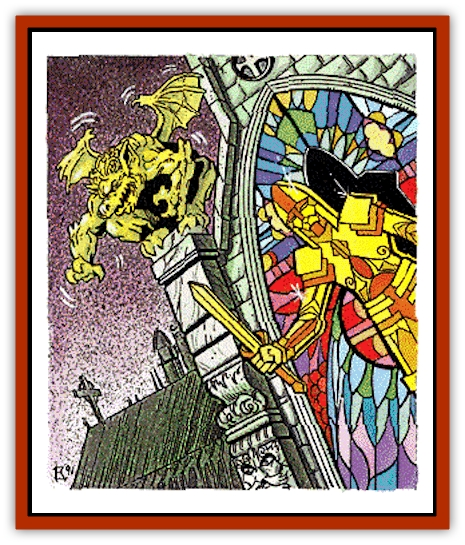

# Golem IV

| Statistic | **Gargoyle** | **Glass** |
| --- | --- | --- |
| **Activity Cycle:** | Any | Any |
| **Alignment:** | Neutral | Neutral |
| **Armor Class:** | 0 | 4 |
| **Climate/Terrain:** | Any | Any |
| **Damage/Attack:** | 3d6/3d6 | 2d12 |
| **Diet:** | Nil | Nil |
| **Frequency:** | Very rare | Very rare |
| **Hit Dice:** | 15 (60 hp) | 9 (40 hp) |
| **Intelligence:** | Non- (0) | Non- (0) |
| **Magic Resistance:** | Nil | Nil |
| **Morale:** | Fearless (20) | Fearless (20) |
| **Movement:** | 9 | 12 |
| **No. Appearing:** | 1 | 1 |
| **No. of Attacks:** | 2 | 1 |
| **Organization:** | Solitary | Solitary |
| **Size:** | M (6' tall) | M (6' tall) |
| **Special Attacks:** | See below | See below |
| **Special Defenses:** | See below | See below |
| **THAC0:** | 5 | 11 |
| **Treasure:** | Nil | Nil |
| **XP Value:** | 14,000 | 5,000 |

## Gargoyle Golem

The gargoyle [[Golem_General_Information|golem]] is a stone construct designed to guard a given structure. It is roughly the same size and weight as a real [[Gargoyle_I|gargoyle]] (6' tall and 550 pounds). Although they have wings, they cannot fly. However, a gargoyle golem can leap great distances (up to 100 feet) and will often use this ability to drop down on enemies nearing any building the golem is protecting.

Gargoyle golems cannot speak or communicate in any way. When they move, the sound of grinding rock can be heard by anyone near them. In fact, it is often this noise that serves as a party's first warning that something is amiss in an area.

**Combat:** When a gargoyle golem attacks in melee combat, it does so with its two clawed fists. Each fist must attack the same target and will inflict 3d6 points of damage. Anyone hit by both attacks must save versus petrification or be turned to stone. On the round after a gargoyle golem has petrified a victim, it will attack that same target again. Any hit scored by the golem against such a foe indicates that the stone body has shattered and cannot be resurrected. *Reincarnation*, on the other hand, is still a viable option.

Gargoyle golems are, like most golems, immune to almost every form of magical attack directed at them. They are, however, vulnerable to the effects of an *earthquake* spell. If such a spell is targeted directly at a gargoyle golem, it instantly shatters the creature without affecting the surrounding area. The lesser *transmute rock to mud* spell will inflict 2d10 points of damage to the creature while the reverse (*transmute mud to rock*) will heal a like amount of damage.

On the first round of any combat in which the gargoyle golem has not been identified for what it is, it has a good chance of gaining surprise (-2 on opponent surprise checks). Whenever a gargoyle golem attacks a character taken by surprise, it will leap onto that individual. The crushing weight of the creature delivers 4d10 points of damage and requires every object carried by that character in a vulnerable position (DM's decision) to save vs. crushing blows or be destroyed. In the round that a gargoyle golem pounces on a character, it cannot attack with its fists.

## Glass Golem

The glass golem is very nearly a work of art. Built in the form of a stained glass knight, the creature is often built into a window fashioned from such glass. Thus, it usually acts as the guardian of a given location - often a church or shrine.

Glass golems, like most others, never speak or communicate in any way. When they move, however, they are said to produce a tinkling sound like that made by delicate crystal wind chimes. If moving through a lighted area, they strobe and flicker as the light striking them is broken into its component hues.

**Combat:** When the stained glass golem attacks, it often has the advantage of surprise. If its victims have no reason to suspect that it lurks in a given window, they suffer a -3 on their surprise roll when the creature makes its presence known.

Once combat is joined, the stained glass figure (which always has the shape of a knight) strikes with is sword. Each blow that lands delivers 2d12 points of damage.

Once every three rounds, the golem can unleash a *prismatic spray* spell from its body that fans out in all directions. Any object or being (friend or foe) within 25 feet of the golem must roll as if they had been struck by a wizard's *prismatic spray* spell (see the AD&D *Player's Handbook*). Glass golems are the most fragile of any type of golem. Any blunt weapon capable of striking them (that is, a magical weapon of +2 or better) inflicts double damage. Further, a *shatter* spell directed at them weakens them so that all subsequent melee attacks have a percentage chance equal to twice the number of points of damage inflicted of instantly slaying the creature.

Anyone casting a *mending* spell on one of these creatures instantly restores it to full hit points. In addition, they regenerate 1 hit point per round when in an area of direct sunlight (or its equivalent).

---
## Discovery & Documentation

**Source Publication:** MC10 Ravenloft Appendix I (1989)
**Campaign Setting:** Planescape
**Author(s):** William W. Connors

### Other Creatures Found in This Source Book
   * [[Bastellus|Bastellus]]
   * [[Bat_Ravenloft|Bat (Ravenloft)]]
   * [[Bowlyn|Bowlyn]]
   * [[Broken_One|Broken One]]
   * [[Bussengeist|Bussengeist]]
   * [[Darkling|Darkling]]
   * [[Doom_Guard|Doom Guard]]
   * [[Doppelganger_Plant|Doppelganger Plant]]
   * [[Elemental_Ravenloft|Elemental (Ravenloft)]]
   * [[Ermordenung|Ermordenung]]
   * [[Ghoul_Lord|Ghoul Lord]]
   * [[Goblyn|Goblyn]]
   * [[Golem_III|Golem III]]
   * [[Golem_Ravenloft|Golem (Ravenloft)]]
   * [[Grim_Reaper|Grim Reaper]]
   * [[Human_Abber_Nomad|Human, Abber Nomad]]
   * [[Human_Ravenloft|Human (Ravenloft)]]
   * [[Imp_Assassin|Imp, Assassin]]
   * [[Impersonator|Impersonator]]
   * [[Lycanthrope_Werebat|Lycanthrope, Werebat]]
   * [[Lycanthrope_Wereraven|Lycanthrope, Wereraven]]
   * [[Mist_Horror|Mist Horror]]
   * [[Mummy_Greater|Mummy, Greater]]
   * [[Quevari|Quevari]]
   * [[Quickwood|Quickwood]]
   * [[Ravenkin|Ravenkin]]
   * [[Reaver|Reaver]]
   * [[Scarecrow_Ravenloft|Scarecrow (Ravenloft)]]
   * [[Shadow_Fiend|Shadow Fiend]]
   * [[Skeleton_Giant|Skeleton, Giant]]
   * [[Strahd's_Skeletal_Steed|Strahd's Skeletal Steed]]
   * [[Treant_Evil|Treant, Evil]]
   * [[Treant_Undead|Treant, Undead]]
   * [[Valpurgeist|Valpurgeist]]
   * [[Vampire_Dwarf|Vampire, Dwarf]]
   * [[Vampire_Elf|Vampire, Elf]]
   * [[Vampire_Gnome|Vampire, Gnome]]
   * [[Vampire_Halfling|Vampire, Halfling]]
   * [[Vampire_General_Information|Vampire, General Information]]
   * [[Vampire_Kender|Vampire, Kender]]
   * [[Vampyre|Vampyre]]
   * [[Widow_Red|Widow, Red]]
   * [[Wolfwere_Greater|Wolfwere, Greater]]
   * [[Zombie_Lord|Zombie Lord]]
