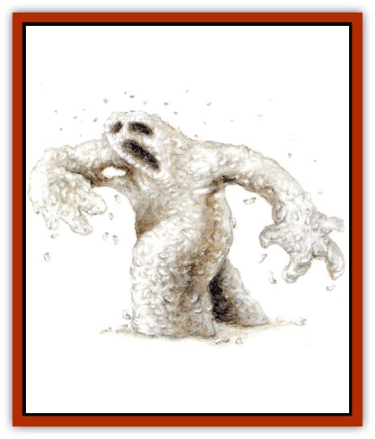

# Golem - Maggot

| Statistic | **Golem, Maggot** |
| --- | --- |
| **Activity Cycle:** | Any |
| **Alignment:** | Neutral |
| **Armor Class:** | 8 |
| **Climate/Terrain:** | Any |
| **Damage/Attack:** | Special |
| **Diet:** | Rotting flesh |
| **Frequency:** | Very rare |
| **Hit Dice:** | 8 (45 hp) |
| **Intelligence:** | Semi- (2-4) |
| **Magic Resistance:** | Nil |
| **Morale:** | Fearless (19-20) |
| **Movement:** | 9 |
| **No. Appearing:** | 1-4 |
| **No. of Attacks:** | 1 |
| **Organization:** | Solitary |
| **Size:** | S-M (3-6' tall) |
| **Special Attacks:** | Smothering |
| **Special Defenses:** | Immune to edged weapons, half damage from blunt weapons, regeneration, see below |
| **THAC0:** | 13 |
| **Treasure:** | Nil |
| **XP Value:** | 5,000 |

A maggot [[Golem_General_Information|golem]] at first glance appears to be a shambling, offwhite mound that is vaguely humanoid but with a constantly shifting form. It walks upright on two legs and has two arms but these appendages are constantly changing in length and thickness, as are the dimensions of its torso. The maggot golem's head is also in flux, at times appearing as a mere nub on the shoulders, at other times having definite features such as eyes, nose, ears, and mouth.

The explanation behind this shifting is that this type of golem is constructed of living organisms, maggots, to be specific. These are constantly turning into flies which circle around the golem's head and return to the golem to lay eggs, completing the cycle by hatching more maggots. Some of the maggots drop from the golem and lie writhing in its wake, but these are replaced at a phenomenal rate.

**Combat:** A maggot golem is mindless in combat. It either follows the instructions of its creator and master or follows its own instincts, seeking to kill the fleshy creatures. It is emotionless and cannot be provoked. Once it has broken free of its master's control, however, it turns on the master, attacking anything in its path.

As a maggot golem is made up of hundreds of thousands of individual insects, it is almost impossible to damage. Edged or piercing weapons slicing through it have no more effect than if they were passing through water (the maggots simply knit together again after the sword has passed). Blunt weapons fare little better; they are able to smash off chunks of the body, but inflict only half their usual damage.

In addition, the maggot-to-fly-to-maggot cycle happens at a greatly accelerated rate, thus allowing the golem to continuously replenish itself. This results in the golem being able to regenerate at a rate of 2 hit points per round.

Just as a maggot golem is unlikely to be harmed by most weapons, it is also incapable of holding them. It attacks by hugging its victim to its body. This occurs whenever the golem makes a successful attack. The victim is then held and slowly smothered to death, losing 2d6 hit points per round.

During the round of the successful attack, the victim is held and suffers damage. At the start of each subsequent round, the victim can attempt a Strength check. Success means the victim breaks free and suffers no automatic damage that round. The maggot golem can still attack during that round and can establish a hold on the victim.

The elemental spirit in a major golem is not bound strongly; it has a 1% cumulative chance per round of combat (calculated independently for each fight) that it will break free of its master. When this happens, the master has a 10% chance per round (cumulative) of regaining control. To do this, he must be within 60 feet of the maggot golem, and the creature must be able to see and hear its master, who need only talk to it forcefully and persuasively to convince it to obey.

Maggot golems are immune to most spells. Fire-based spells affect them normally, cold-based spells slow them for 2d6 rounds, *summon insects* heals 1d10 points of damage, and *repel insects* causes them to instantly lose half their current hit points. All other spells are ignored by these creatures.

**Habitat/Society:** The maggot golem is an automaton, artificially created and under the direct control of its creator. Typically one to four such creatures are created at once. These can obey simple instructions involving a single, direct action.

Maggot golems make poor servants because each facet of a task must be described as a separate command. They are generally used to guard valuable items or places. Since the maggots that make up the body of the golem need to continue to consume rotting flesh to survive, a maggot golem often can be placed as a guard with minimal instruction. It will, on its own, seek out fleshy creatures to kill, which it later consumes once rot has set into the corpse.

**Ecology:** A maggot golem is fashioned from a corpse that is thickly infested with maggots. The animating force is an elemental spirit from the plane of Earth, which is bound to the body. Eventually the body is consumed by the maggots, which are then held in a humanoid form by the elemental spirit.

The maggot golem is created using a refinement of the process used to create a [[Golem_II_Lesser_Golem|flesh golem]]. Tradition states this refinement was first discovered in the city of Karg in the Demiplane of Dread. It is rumored that a further refinement exists, using [[Rot_Grub|rot grubs]] rather than maggots.

---
## Discovery & Documentation

**Source Publication:** Requiem: The Grim Harvest (1996)
**Campaign Setting:** Ravenloft
**Author(s):** William W. Connors, Lisa Smedman

### Other Creatures Found in This Source Book
   * [[Dream_Stalker|Dream Stalker]]
   * [[Mummy_Bog|Mummy, Bog]]
   * [[Siren_Ravenloft|Siren (Ravenloft)]]
