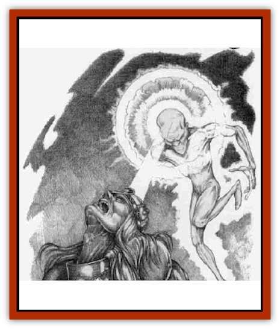

# Golem - Magic

| Statistic | **Golem, Magic** |
| --- | --- |
| **Activity Cycle:** | Any |
| **Alignment:** | Neutral |
| **Armor Class:** | -2 |
| **Climate/Terrain:** | Any |
| **Damage/Attack:** | 3d10 |
| **Diet:** | Magic |
| **Frequency:** | Very rare (3 known) |
| **Hit Dice:** | 8 (64 hit points) |
| **Intelligence:** | Nil |
| **Magic Resistance:** | 100% |
| **Morale:** | Fearless (20) |
| **Movement:** | 18 |
| **No. Appearing:** | 1 |
| **No. of Attacks:** | 1 |
| **Organization:** | Solitary |
| **Size:** | L (9' tall) |
| **Special Attacks:** | Absorbs magic, magical flare |
| **Special Defenses:** | Immune to most magic |
| **THAC0:** | 13 |
| **Treasure:** | Low (5-7) |
| **XP Value:** | 8,000 |

A magic [[Golem_General_Information|golem]] appears as a humanoid creature composed of iridescent yellow energy - pure magic. It is the unholy union of a human being and an area of wild magic. After the Time of Troubles, Zhentarim wizards began to catalog all of the areas of wild magic in an effort to study this phenomenon more closely. During an expedition to a remote wild magic area in the Hordelands, an unfortunate sequence of spells cast by one Zhentarim wizard turned another into a being of pure magical combination of the mage and untamed magical forces.

**Combat:** Magic golems absorb all magical energy within a 20-foot radius. Spells are instantly absorbed as they are cast. Running spells are terminated and absorbed at the end of one round, with the two exceptions noted below. Magical items lose one level of enchantment per round (a long sword +2 changes to a long sword +1), and charged magical items lose 1d6 charges per round. Magical weapons do no damage to the creature, but normal weapons and those drained of all magic can hurt the golem.

The magic golem attacks its victims with blasts of pure magical energy causing 3d10 points of damage. These magical blasts have a range of 75 yards. The blasts ignore all magical adjustments to Armor Class (that is, Armor Class for a blast target is calculated only by armor type and Dexterity bonus). However, these blasts do not penetrate an *anti-magic shell* or a *prismatic sphere* until such spells are absorbed by the creature. It takes six rounds for a magic golem to dissipate an *anti-magic shell*, and seven rounds for it to disable a *prismatic sphere*.

*Dispel magic* has no effect on the creature, as the spell is instantly absorbed as it is cast. However, a *limited wish* will negate the creature's ability to absorb magic for one round per level of the caster, and a *wish* will do so for an hour. During this time the creature has no immunity to magic and magical effects.

Once per day a magic golem must release a *flare* of magical energy that is a result of its link to wild magic. This flare can be used as a conscious attack in addition to the golem's normal attack in a round. Roll 1d10 for the form the flare takes and consult the table below. All spell-like effects are at 16th level unless otherwise noted.

**Habitat/Society:** A magic golem is very stupid and easily controlled through force of will by any mage or wizard of 12th level or greater. If there is no mage of the required power to control the golem, the creature wanders aimlessly in search of a source of magic to absorb. If a magic golem happens to stumble upon another zone of wild magic, the creature remains in the area and slowly absorbs all of its wild magic effects. The wild magic zone is totally absorbed, a process taking anywhere from an hour to a month, depending on its size. When a magic golem absorbs a wild magic zone, the creature's Hit Dice and hit points are increased by 50%; the size of the area absorbed has no bearing on this increase. After this absorption process, the golem is uncontrollable, lashing out at all who possess or wield magic for at least a week before it can be again controlled by a wizard.

| 1d10 | Result | 1d10 | Result |
| --- | --- | --- | --- |
| 1 | As per a wand of wonder | 6 | Wall of fire encircles golem |
| 2 | Magical blast (see above) | 7 | Color spray in a 360' radius |
| 3 | 4d6 lightning bolts | 8 | Fireball centered on golem |
| 4 | Double-strength light spell | 9 | Time stop 100' radius |
| 5 | Dispel magic 100' radius | 10 | Earthquake |

**Ecology:** The creatures need no sleep or sustenance, and as long as there is magic in the world they can continue to exist. It has been theorized that a dead magic zone, another product of the Time of Troubles, would instantly destroy a magic golem - that the dead magic area and the golem would eliminate each other, leaving a zone of normal magic function. Since magic golems are so rare to begin with, the Zhentarim have been unwilling to test this theory.

The magic golem was discovered, quite by accident, by the Zhentarim. A magic golem is formed when a mage of at least 12th level casts *detect magic*, *Ray's mnemonic enhancer*, and *anti-magic shell* in that order on himself or herself while standing in an area of wild magic. The spells themselves must escape any ill effects of the wild magic area and go off as normal. The caster then gains the ability to transform another wizard within the wild magic area into a magic golem. The victim receives no saving throw, although magic resistance applies. The new magic golem is under its creator's control, and the wild magic area is then dispelled (or, rather, it is absorbed into the golem during its creation).

The chances of a magic golem forming within a wild magic area are slim - less than 1%, given the effects of wild magic. Only three of these creatures are known to exist. All of them are under the control of the Zhentarim.

---
## Discovery & Documentation

**Source Publication:** Monstrous Compendium, 1996 Annual, Volume 3 (1995)
**Campaign Setting:** Advanced Dungeons & Dragons 2nd Edition
**Author(s):** Jon Pickens

### Other Creatures Found in This Source Book
   * [[Alaghi|Alaghi]]
   * [[Alhoon|Alhoon]]
   * [[Aranea_Savage_Coast|Aranea (Savage Coast)]]
   * [[Arcane_Head|Arcane Head]]
   * [[Banedead|Banedead]]
   * [[Banelich|Banelich]]
   * [[Bat_Bonebat|Bat, Bonebat]]
   * [[Beetle|Beetle]]
   * [[Belgoi|Belgoi]]
   * [[Bladeling|Bladeling]]
   * [[Braxat|Braxat]]
   * [[Bunyip|Bunyip]]
   * [[Burbur|Burbur]]
   * [[Bvanen|Bvanen]]
   * [[Cat_Great_Snow_Tiger|Cat, Great, Snow Tiger]]
   * [[Chosen_One|Chosen One]]
   * [[Chronovoid|Chronovoid]]
   * [[Cildabrin|Cildabrin]]
   * [[Coffer_Corpse|Coffer Corpse]]
   * [[Disenchanter|Disenchanter]]
   * [[Dog_Temporal|Dog, Temporal]]
   * [[Dragon_Cerilia|Dragon (Cerilia)]]
   * [[Dragon_Ghost|Dragon, Ghost]]
   * [[Dragon_Lesser_Undead|Dragon, Lesser Undead]]
   * [[Dragon_Neutral_Amber|Dragon, Neutral, Amber]]
   * [[Dread_Warrior|Dread Warrior]]
   * [[Dreamweaver|Dreamweaver]]
   * [[Dream_Spawn_Greater_Ennui|Dream Spawn, Greater, Ennui]]
   * [[Dream_Spawn_Lesser_Morph|Dream Spawn, Lesser, Morph]]
   * [[Dwarf_Arctic|Dwarf, Arctic]]
   * [[Dwarf_Urdunnir|Dwarf, Urdunnir]]
   * [[Eel_Giant_Moray|Eel, Giant Moray]]
   * [[Elemental_Fire_Kin_Tome_Guardian|Elemental, Fire Kin, Tome Guardian]]
   * [[Elf_Rockseer|Elf, Rockseer]]
   * [[Ethyk|Ethyk]]
   * [[Faerie_Faerie_Fiddler|Faerie, Faerie Fiddler]]
   * [[Faerie_Petty_Bramble|Faerie, Petty, Bramble]]
   * [[Faerie_Petty_Gorse|Faerie, Petty, Gorse]]
   * [[Faerie_Petty|Faerie, Petty]]
   * [[Firenewt|Firenewt]]
   * [[Formian|Formian]]
   * [[Gargoyle_II|Gargoyle II]]
   * [[Giant_Cerilia|Giant (Cerilia)]]
   * [[Goblin_Cerilia|Goblin (Cerilia)]]
   * [[Golem_Shaboath|Golem, Shaboath]]
   * [[Hag_Bheur|Hag, Bheur]]
   * [[Hamadryad|Hamadryad]]
   * [[Hound_of_Ill-Omen|Hound of Ill-Omen]]
   * [[Human_Cerilia|Human (Cerilia)]]
   * [[Hybsil|Hybsil]]
   * [[Ibrandlin|Ibrandlin]]
   * [[Imp_Chaos|Imp, Chaos]]
   * [[Ixitxachitl_Ixzan|Ixitxachitl, Ixzan]]
   * [[Jabberwock|Jabberwock]]
   * [[Kyton|Kyton]]
   * [[Kyuss_Son_of|Kyuss, Son of]]
   * [[Lillend|Lillend]]
   * [[Life-Shaped_Creation_Guardian|Life-Shaped Creation, Guardian]]
   * [[Life-Shaped_Creation_Transport|Life-Shaped Creation, Transport]]
   * [[Lycanthrope_Werecrocodile|Lycanthrope, Werecrocodile]]
   * [[Lycanthrope_Werespider|Lycanthrope, Werespider]]
   * [[Magedoom|Magedoom]]
   * [[Manotaur|Manotaur]]
   * [[Mastiff_Shadow|Mastiff, Shadow]]
   * [[Meazel|Meazel]]
   * [[Mist_Scarlet_Dancer|Mist, Scarlet Dancer]]
   * [[Needleman|Needleman]]
   * [[Orc_Neo-Orog|Orc, Neo-Orog]]
   * [[Orc_Ondonti|Orc, Ondonti]]
   * [[Owlbear_II|Owlbear II]]
   * [[Pegataur|Pegataur]]
   * [[Phaerimm|Phaerimm]]
   * [[Reggelid|Reggelid]]
   * [[Render|Render]]
   * [[Saurial|Saurial]]
   * [[Scalamagdrion|Scalamagdrion]]
   * [[Sharn|Sharn]]
   * [[Snake_Messenger|Snake, Messenger]]
   * [[Spirit_Forest_Uthraki|Spirit, Forest, Uthraki]]
   * [[Spirit_Forest_Wood_Man|Spirit, Forest, Wood Man]]
   * [[Spirit_Ice_Orglash|Spirit, Ice, Orglash]]
   * [[Spirit_Rock_Thomil|Spirit, Rock, Thomil]]
   * [[Strider_Giant|Strider, Giant]]
   * [[Tembo|Tembo]]
   * [[Temporal_Glider|Temporal Glider]]
   * [[Temporal_Stalker|Temporal Stalker]]
   * [[Tether_Beast|Tether Beast]]
   * [[Thessalmonster|Thessalmonster]]
   * [[Time_Dimensional|Time Dimensional]]
   * [[Tomb_Tapper|Tomb Tapper]]
   * [[Undead_Dragon_Slayer|Undead Dragon Slayer]]
   * [[Unicorn_Black_Toril|Unicorn, Black (Toril)]]
   * [[Vaath|Vaath]]
   * [[Vortex_Spider|Vortex Spider]]
   * [[Weredragon|Weredragon]]
   * [[Zhentarim_Spirit|Zhentarim Spirit]]
