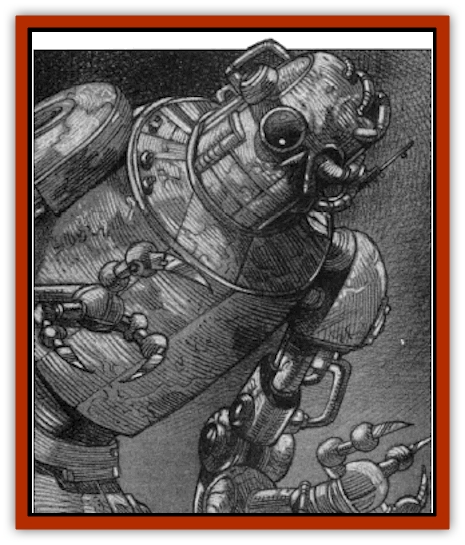

# Golem - Mechanical - Ahmi Vanjuko

| Statistic | **Golem, Mechanical, Ahmi Vanjuko** |
| --- | --- |
| **Activity Cycle:** | Any |
| **Alignment:** | Chaotic neutral |
| **Armor Class:** | -2 |
| **Climate/Terrain:** | Vechor |
| **Damage/Attack:** | 4-40 (4d10) |
| **Diet:** | None |
| **Frequency:** | Unique |
| **Hit Dice:** | 13 (75 hp) |
| **Intelligence:** | Average (10) |
| **Magic Resistance:** | Nil |
| **Morale:** | Steady (12) |
| **Movement:** | 12 |
| **No. Appearing:** | 1 |
| **No. of Attacks:** | 1 |
| **Organization:** | Solitary |
| **Size:** | M (7' tall) |
| **Special Attacks:** | Electric shock |
| **Special Defenses:** | +2 or better weapons to hit; spell immunities; lightning aura |
| **THAC0:** | 7 |
| **Treasure:** | Nil |
| **XP Value:** | 15,000 |

Of all the tragic and misshapen creatures to survive the nightmare experiments of fiends like the wizard Hazlik or the mad butcher Markov, none is more dreadful than Ahmi Vanjuko. Once a ranger and great explorer, he has been imprisoned in a metal body powered by the sinister magic of Easan, the deranged lord of Vechor.

Prior to his transformation, Vanjuko was a strong and sturdy ranger who stood just over five and a half feet tall. His skin was a rich, earthy brown worn rough by his years of exploring the wilds of countless worlds, while his hair was coffee-colored and his eyes were the cool, crisp green of fresh mint leaves. His smile, it is said, could charm man and beast alike, while his charisma earned him the love of a thousand maidens in a hundred lands.

All that changed when Vanjuko was drawn into Ravenloft. Under the careful attention of the dark wizard Easan, his spirit has been implanted in the metal shell of a [[Golem_Ravenloft|mechanical golem]]. Vanjuko's new body stands just over seven feet tall and looks more or less humanoid. It has long legs that might be likened to those of a bird and gangly arms that look vaguely ape-like. The arms end in three-finger gripping devices that incorporate deadly razors into each finger. Atop the cylindrical body of the machine rests a head shaped not unlike a human skull. Despite its slender, frame-like build, Vanjuko's mechanical body is far stronger than any known alloy.

Vanjuko is utterly unable to speak, although it may be possible to communicate with him via magical, clerical, or psionic means. If spoken to, he understands the Common Tongue of Oerth, the world of Greyhawk. During his travels in Ravenloft, he also learned the languages spoken in Barovia and Vechor, as well as a sprinkling of the Vistani tongue.

**Combat:** Vanjuko shuns humanity and has no natural enemies in the wilds of Vechor. As such, he is seldom called upon to defend himself. When he does fight, however, he is a deadly nemesis, for the mad Easan intended that his creation be a killing machine.

Like all of the mechanical golems created in Ravenloft, Vanjuko is immune to attacks by weapons with less than a +2 enchantment. Similarly, he is immune to all manner of life-affecting spells (like *hold person*). He does not, however, retain the standard golem immunity to mind-affecting magics and can be *charmed* or the like as a normal man. He is immune to all manner of poisons and diseases. Vanjuko is vulnerable to *dispel magic*, which stuns him for a number of turns equal to the caster's level. During this time, he appears to have been slain. A *detect magic* or similar spell will reveal a magical aura lingering about the golem which grows stronger as he begins to recharge himself.

Vanjuko's primary attack is made with the retractable razor-like blades hidden in his "fingers". Each round, he is able to strike with these weapons doing 4d10 points of damage to anyone unlucky enough to be hit by them.

Any natural roll of 20 on an attack made with his razors indicates that a powerful electrical current has been shunted into the victim's body. When this happens, the victim must make a Saving Throw vs. Spells. If the save is failed, the victim takes 6d6 points of additional damage; a successful save results in half damage. In addition, the victim must make a Saving Throw vs. Paralysis or be incapacitated for 2d4 rounds due to muscle spasms triggered by the discharge.

Any natural roll of 20 on an attack made against Vanjuko with a metal melee weapon indicates that he has been able to channel an electrical current through the weapon and into the any of the attacker, who then suffers damage just as if he or she had been hit with the electrical attack described above. Again, a Saving Throw vs. Spells reduces damage by half, and a successful Saving Throw vs. Paralysis will allow the attacker to avoid incapacitation. The normal damage done by the attacker is unaffected.

On every third round of combat, Vanjuko can trigger a lightning aura that surrounds his mechanical body with a deadly electrical field. Any living creature coming within 20 feet of Vanjuko that round will be struck with numerous filaments of lightning for a total of 3d6 points of damage. A successful Saving Throw vs. Breath Weapons reduces this damage by half; no incapacitation check need be made in any case. Any exposed items carried by a character who fails his or her saving throw must save versus lightning or be destroyed.

As a ranger, Vanjuko had many useful powers and special abilities. In his new mechanical form, however, most of these have been lost. He retains the ability to cast some clerical spells, but only those he had memorized at the time of his transformation. Thus, he can use the following spells once per day: *entangle*, *pass without trace*, and *warp wood*. He casts these spells as if he were a 3rd-level cleric.

For their part, animals will have nothing to do with this unnatural construct. No creature will come within 50 feet of Vanjuko unless trained and held or calmed. Any animal, even the most devoted [[Dog|dog]] or [[Horse|warhorse]], will refuse to come within 20 feet of him. If forced to do so, they will become violent and do whatever they must to free themselves and leave the abomination's presence.

**Habitat/Society:** Ahmi Vanjuko was born in the wondrous City of Greyhawk but quickly learned that urban life was not for him. Before he had reached the age of 10, he vanished into the wilds and started a new life among the animals of the green forest.

In time, he came to know every creature that shared his wilderness home with him. He learned to hunt and stalk like the [[Wolf|wolf]], to sing and play like the [[Bird|bird]], and to lurk and pounce like the cougar. By the time he reached adolescence, the forest was very much a part of him. One day, a strange figure came to the lands he called his own and began to build something. Although he resented this intrusion, Vanjuko took no action against this invader. In time, the constriction took the shape of an elegant manor house surrounded by a virtual wall of tangling vines laced with poisonous thorns. To anyone else, these thorns might have been a barrier. To Vanjuko, who knew the ways of the wild, they were nothing more than a challenge.

Determined to see what was going on behind this living fence, Vanjuko made his way through the thorns and into the lands beyond. To his horror, he found that the splendor of the forest had been decimated near the manor. Pools of deadly poisons littered the landscape, the plants were withering away in toxic soil, discarded trash lay everywhere, and the air carried an unnatural stench that made him retch. The animals trapped within the barrier's circuit were sick, dying, or dead.

Vanjuko vowed to see to it that the monster who had done these terrible things left the forest before it could do any more harm. Filled with righteous fury, he moved quickly to the manor's entrance and burst inside. He saw no immediate sign of the place's builder and began to search the house. At every turn, however, he was confronted with mechanical traps designed to kill unwanted intruders. In the end, these proved too deadly for him, and Vanjuko was forced to leave the building.

To his surprise, however, he found that the grounds outside had been engulfed with a rolling, macabre fog. Before he had travelled half the distance to the thorn barrier, Vanjuko was utterly lost and all but blinded by the blanket of mist. He settled down to wait for the passage of this heavy shroud. When it cleared an hour later, he found that he was no longer in his forest. Instead, he was in the domain of Kartakass.

Vanjuko began to explore the strange new land in which he found himself, hoping to uncover a way back to his native land and the forest he loved. From the domain of Harkon Lukas, he traveled north into Gundarak and then east into Strahd's own Barovia. For a time, he lived among the rustic folk of that mountainous domain, enjoying their simple way of life and learning their language.

While in Barovia, he met a young woman named Tanya, and the two fell deeply in love. She and her family were traveling performers who moved from city to city, entertaining the townsfolk before moving on. One night, Tanya came to him and told him that her people were leaving just before dawn. She kissed the ranger gently and bid him farewell, weeping at the thought that they might never meet again. Vanjuko pleaded with her to remain with him in Barovia and become his wife. She smiled, clearly tempted by the idea, but refused. Hers was the wanderer's life, she explained, and her people were the [[Human_Vistana|Vistani]].

Despite the warnings of his newfound friends, Vanjuko decided that he would not lose the woman he loved. Shortly before sunrise, he went to the clearing where Tanya's family had camped, only to find that they had already left. He dashed off in pursuit, following their trail to the east. He caught sight of their wagons as they rolled into a bank of fog. Without pause, he spurred his horse to greater speed and dashed into the mists after them.

Emerging from the rippling vapors, Vanjuko found no trace of Tanya or her clan. Instead, he discovered that he had again been transported by the whims of Ravenloft's mists. This time, he was in the domain of Vechor. Attempting to get his bearings and learn what was going on, Vanjuko made his way to Abdok on the shores of the Nostru River. In the distance, high atop the Cliffs of Vesanis, he saw the elegant manor house where, he was told, the madman Easan lived. To his horror, Vanjuko realized that this was the same house he had seen in the wilderness of his native Oerth.

Blaming Easan for his original abduction by the mists of Ravenloft, the ranger began to plan revenge against the mad wizard. When he learned that he could not rally the people of Vechor to overthrow their foul lord, he left them and returned to his life amongst the plants and animals of the forest.

In Vechor's wilds, he found all manner of pathetic creatures which were unknown to him. The majority of these things, he learned, were the result of Easan's horrible experiments. He also learned that the mad wizard's machinations did not end with animals. He found countless species of plants, many evil and deadly, which were the result of no natural evolutionary process.

By far the most dreadful of the creatures that he encountered, however, were the twisted men and women who had survived Easan's experiments. Most were contorted and broken, tragic things known as [[Broken_One|broken ones]]. A few, however, emerged from the caverns at the base of the Cliffs of Vesanis with mechanical parts grafted onto their bodies. Most of these, thankfully, didn't live long. Those that did, Vanjuko mercifully destroyed to end their pain and suffering.

Vowing to end this madman's butchery once and for all, Vanjuko entered the labyrinth of caves and began to make his way upward to the manor house. The trek took him nearly two days, during which he fought countless creatures more terrible than any he had seen in the forests. By the time he neared the underground entrance to Easan's laboratories, he was sick with revulsion.

Steeling himself to face whatever foul things might lurk beyond, Vanjuko entered. As before, he found the place to be a maze of traps designed to keep intruders out - or perhaps to keep prisoners in. Try as he might, the ranger was no match for the terrible mechanisms and deadly spells that Easan had set up. Shortly after he began to explore the house, Vanjuko accidentally triggered the release of a cloud of toxic gas. Expecting nothing but death, he closed his eyes and collapsed.

Much to his surprise, Vanjuko awoke. He found him self strapped to a metal table in the center of a room that looked like a cross between a wizard's laboratory and a torture chamber. For a long time, he lay still and feigned unconsciousness as he looked about the place. He had hoped to spot some escape from the dreadful place, but instead he found himself speculating as to what many of the terrible devices around him might be used for. It wasn't long before he had his answer.

High overhead, two great metal spheres hung on slender poles. Wlthout warning, a great surge of eerie blue-white light flooded the room as a steady stream of lightning began to flow between the mysterious globes. As Vanjuko watched in horror, the globes descended until they were suspended only a few feet above him. The electrical flow passing above his body crawled across his skin like stinging [[Ant|ants]].

Then, as if from nowhere, Easan appeared. He was a short man, almost [[Gnome|gnomish]] in his compact little features. His beady eyes reminded Vanjuko of the predatory gaze of a [[Mammal_Small|ferret]]. With a cruel smile, the wizard began to examine his prisoner's restraints. After a few minutes of this, Easan bent low over the ranger's face. His breath smelled like rotting fish, but Vanjuko's bonds were far too tight for him to turn away.

"Hello, my young friend," he hissed. His voice was slippery and hushed, barely audible above the cacophony of the lightning machine. "I'm so glad that you came to visit me."

Vanjuko tried to spit in the madman's face, but found that his mouth had gone dry. Easan found the gesture amusing and chuckled softly to himself. Turning away from his captive, he continued to talk while working with several arcane devices.

"For a long while, I have been planning to complete a great experiment. Time after time, I have attempted to conclude this great exploration of the soul and its ultimate origins, only to have the patient die before my work was completed. Indeed, I began to despair of ever finding someone who might have the stamina to help me draw this grand investigation to a close. Imagine my delight when I found an intruder in my own home who could survive exposure to one of my most deadly toxins. If you don't survive this experiment, I dare say that no one will."

With that, the shriveled man waddled over to a large winch and began to turn it. Slowly, a panel in the floor beside Vanjuko slid open and a second table rose out. Whatever was on the table was covered with a white sheet.

With something of a flourish, Easan swept aside the cloth and revealed a metal body that, although roughly humanoid, was a mechanical nightmare. The wizard laughed when he saw the fear fall across Vanjuko's face,

"I shouldn't worry yourself," he chuckled. "When we are finished here today, I shall have transported your soul into this metal body. You will be the father of a new race! I trust that you appreciate the honor that I'm granting you. Ah well, let's begin, shall we?"

As Easan chuckled his weasel's laugh, the metal balls began to descend again. The lightning engulfed Vanjuko and the mechanical corpse beside him. The ranger cried out in agony as he felt the arcane energies ripping his body apart. The pain was more incredible than anything that he could have imagined. He tried to succumb to it, hoping to lose consciousness or even die rather than endure the seemingly endless torment. As blackness rose up around him, the echoing laughter of Easan rang above the roar of the lightning.

And then it was over. Vanjuko was exhausted. The pain was gone, but so was his strength. Unconsciousness claimed him.

Vanjuko had no idea how long he swam in the blissful darkness of catatonia. Finally, he came to himself and the blackness fell away. The ranger was momentarily confused to discover that he was on a metal table. He attempted to sit up, and found that he was strapped down. Then, slowly, the memory of what had happened returned to him.

Praying that this might be some dreadful nightmare, he turned his head and looked along the length of his arm. When he saw the mechanical limb that lay there, he tried to scream. No sound issued forth from the mute metal giant that was now Ahmi Vanjuko.

Enraged, he fought to free himself from the shackles, only to find them too strong. As he thrashed about, Easan returned. He was smiling, if you could call the twisted grimace on his face a smile, and paid little attention to Vanjuko's struggles.

"Ahhhhh," he hissed, sounding almost cheerful, "Is it not as I told you?" Vanjuko tried to lunge at the wizard, but was held in check by the chains on his limbs. Easan seemed genuinely surprised by his behavior. "Don't you understand?" he asked. "I have made you immortal. More than that, I have freed you of the burdens of life. You'll never grow sick or old. You should thank me for the great gift that I have given you!"

That was more than Vanjuko could bear. He tried again to break fee, and this time the chains could not restrain him. Metal fragments shattered around the chamber, and Easan sprang back in surprise. Vanjuko sprang forward, his metal body moving smoothly and flawlessly in response to his thoughts. With a great lunge and a whirring of gears, he threw himself at Easan, determined to destroy the madman. When he reached the spot where the wizard stood, however, there was nothing there but smoke. Through some magic, Easan had fled.

Vanjuko tore the laboratory apart, vowing that he would destroy the beast's lair if he could not have the beast itself. Leaving the building a burning ruin, he fled back into the tunnels and made his way back down to the forest.

**Ecology:** Easan has since rebuilt his home. Vanjuko has returned to living in the forest, but he no longer draws the happiness from it that he once did. All around him are vibrant living things, animals that now flee from him in terror and flowers that he can no longer smell.

As a mechanical creature, Vanjuko has no hunger or thirst and never sleeps. He lives in a cave hidden away beneath the cascade where the river Nostru tumbles off of the Cliffs of Vesanis.

Each day, he moves about the forests in a search for more products of Easan's twisted work with the black arts. He destroys them when he finds them, ending their suffering as quickly and mercifully as he can.

As mentioned in the Combat section of this entry, animals cannot bear the presence of Vanjuko. They recognize that he is not a natural thing and abhor him. This is perhaps the most tragic aspect of Vanjuko's life, for the love of animals meant as much to him as the embrace of his beloved Tanya.

---
## Discovery & Documentation

**Source Publication:** Ravenloft Appendix II: Children of the Night (1991)
**Campaign Setting:** Ravenloft
**Author(s):** William W. Connors

### Other Creatures Found in This Source Book
   * [[Brain_Living|Brain, Living]]
   * [[Ermordenung_Nostalia_Romaine|Ermordenung, Nostalia Romaine]]
   * [[Ghoul_Ghast_Jugo_Hesketh|Ghoul, Ghast, Jugo Hesketh]]
   * [[Golem_Half-|Golem, Half-]]
   * [[Human_Cursed_Jacqueline_Montarri|Human, Cursed (Jacqueline Montarri)]]
   * [[Human_Madman_The_Midnight_Slasher|Human, Madman (The Midnight Slasher)]]
   * [[Human_Voodan|Human, Voodan]]
   * [[Lich_Bardic|Lich, Bardic]]
   * [[Lycanthrope_Weretiger_Jahed|Lycanthrope, Weretiger (Jahed)]]
   * [[Meazel_Salizarr|Meazel (Salizarr)]]
   * [[Medusa_Ravenloft|Medusa (Ravenloft)]]
   * [[Mummy_Greater_Senmet|Mummy, Greater, Senmet]]
   * [[Night_Hag_Styrix|Night Hag, Styrix]]
   * [[Spectre_Jezra_Wagner|Spectre, Jezra Wagner]]
   * [[Thrax_Pelik|Thrax (Pelik)]]
   * [[Treant_Evil_Blackroot|Treant, Evil (Blackroot)]]
   * [[Vampire_Eastern_Mayónaka|Vampire, Eastern (Mayónaka)]]
   * [[Vampire_Illithid_Athaekeetha|Vampire, Illithid (Athaekeetha)]]
   * [[Vampyre_Vladimir_Ludzig|Vampyre (Vladimir Ludzig)]]
