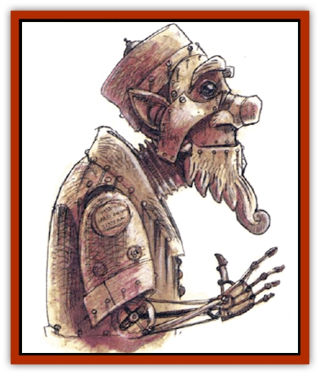

# Golem - Metagolem

| Statistic | **Golem, Metagolem** |
| --- | --- |
| **Activity Cycle:** | Any |
| **Alignment:** | Any |
| **Armor Class:** | See below |
| **Climate/Terrain:** | Any land |
| **Damage/Attack:** | Nil |
| **Diet:** | Electricity |
| **Frequency:** | Very rare |
| **Hit Dice:** | 9 (40 hp) |
| **Intelligence:** | Very (11-12) |
| **Magic Resistance:** | See below |
| **Morale:** | Fearless (20) |
| **Movement:** | See below |
| **No. Appearing:** | 1 |
| **No. of Attacks:** | 1 |
| **Organization:** | Solitary |
| **Size:** | S to M (3-6' tall) |
| **Special Attacks:** | Spells |
| **Special Defenses:** | Spell immunities, invulnerable to electricity |
| **THAC0:** | 11 |
| **Treasure:** | See below |
| **XP Value:** | 3,000 - 4,000 |

Metagolems are hollow, metallic humanoid constructs that have been given magical life. There are as many varieties of metagolems as there are metals, ranging from those made of copper to those made of platinum alloys. Like normal [[Golem_General_Information|golems]], metagolems are animated by elemental spirits. However, they are also given considerable intelligence and can speak.

Generally speaking, the more exotic the metal, the better the metagolem's armor, speed, and damage per hit. Statistics for metagolems made of common metals are given below:

| Metal | AC | Move | Damage |
| --- | --- | --- | --- |
| Copper | 6 | 3 | 1d10 |
| Tin | 5 | 4 | 2d10 |
| Bronze | 4 | 5 | 3d10 |
| Iron | 3 | 6 | 4d10 |
| Steel | 2 | 7 | 5d10 |
| Silver | 1 | 8 | 6d10 |
| Electrum | 0 | 9 | 7d10 |
| Gold | -1 | 10 | 8d10 |
| Platinum | -2 | 11 | 9d10 |

**Combat:** Metagolems are quite intelligent and employ sound tactics in battle. Aside from their limited selection of spells (see below), they never use weapons, preferring to rely on their fists instead. Despite their intelligence, they remain completely emotionless and can never be swayed from their goals.

Metagolems can cast *fireball*, *flaming sphere*, *fly*, *magic missile*, *stinking cloud*, and *web* spells, each once per day, at the 10th level of ability. They are immune to all illusion/phantasm, enchantment/charm, and alterations spells cast by wizards, and to all spells in the Charm sphere of priest magic. Further, they are not damaged by any attack involving electricity, but gain energy from such attacks instead (see "Ecology"). Like all golems, they are not affected by poison of any sort.

**Habitat/Society:** Metagolems are magical automatons created by powerful wizards to accomplish certain goals such as chasing down hated enemies, collecting treasure, and so forth. They have no society as such, but they do seem to bear a strange fondness for other of their kind. Occasionally, several metagolems can be found relaxing together on worlds particularly prone to violent lightning storms,

Metagolems have no free will, but always strive to fulfill the wishes of their creators. The methods of creating metagolems are not widely known, but only wizards of 18th level and above can make them. A metagolem has the alignment of its creator and an equivalent Strength of 15 for purposes of carrying and lifting items.

Often, a metagolem will join a party of adventurers if it is clear that doing so will accomplish its master's goal. Although a metagolcm makes a surprisingly amiable companion, it is usually mistrusted, for its companions never know when the metagolem's true instructions will interfere with their plans.

**Ecology:** As with other golems, metagolems can be created by only powerful wizards. However, unlike regular golems, metagolems occasionally require a supply of energy in the form of electricity to continue functioning. Hungry metagolcms are known to insult powerful wizards for the sole purpose of making the mages so angry that they cast *lighting bolts*. Every hit point of damage from electricity powers a metagolem for one week, to a maximum charge of 100 weeks of continuous operation. Without this power, metagolems become dormant until given a new charge.

---
## Discovery & Documentation

**Source Publication:** Monstrous Compendium, 1994 Annual, Volume 1 (1995)
**Campaign Setting:** Advanced Dungeons & Dragons 2nd Edition
**Author(s):** David Wise

### Other Creatures Found in This Source Book
   * [[Abyss_Ant|Abyss Ant]]
   * [[Achaierai|Achaierai]]
   * [[Afanc|Afanc]]
   * [[Al-Jahar|Al-Jahar]]
   * [[Baelnorn|Baelnorn]]
   * [[Baneguard|Baneguard]]
   * [[Banelar|Banelar]]
   * [[Bird_Talking|Bird, Talking]]
   * [[Blazing_Bones|Blazing Bones]]
   * [[Campestri|Campestri]]
   * [[Caniquine|Caniquine]]
   * [[Cat_Winged|Cat, Winged]]
   * [[Crypt_Servant|Crypt Servant]]
   * [[Death's_Head_Tree|Death's Head Tree]]
   * [[Dog_Saluqi|Dog, Saluqi]]
   * [[Dragon_Electrum|Dragon, Electrum]]
   * [[Dragon_Fang|Dragon, Fang]]
   * [[Dragon_Linnorm_Corpse_Tearer|Dragon, Linnorm, Corpse Tearer]]
   * [[Dragon_Linnorm_Dread|Dragon, Linnorm, Dread]]
   * [[Dragon_Linnorm_Flame|Dragon, Linnorm, Flame]]
   * [[Dragon_Linnorm_Forest|Dragon, Linnorm, Forest]]
   * [[Dragon_Linnorm_Frost|Dragon, Linnorm, Frost]]
   * [[Dragon_Linnorm_Gray|Dragon, Linnorm, Gray]]
   * [[Dragon_Linnorm_Land|Dragon, Linnorm, Land]]
   * [[Dragon_Linnorm_Midgard|Dragon, Linnorm, Midgard]]
   * [[Dragon_Linnorm_Rain|Dragon, Linnorm, Rain]]
   * [[Dragon_Linnorm_Sea|Dragon, Linnorm, Sea]]
   * [[Dragon_Neutral_Jacinth|Dragon, Neutral, Jacinth]]
   * [[Dragon_Neutral_Jade|Dragon, Neutral, Jade]]
   * [[Dragon_Neutral_Pearl|Dragon, Neutral, Pearl]]
   * [[Dread|Dread]]
   * [[Dragon-kin|Dragon-kin]]
   * [[Elemental_Earth_Kin_Chrysmal|Elemental, Earth Kin, Chrysmal]]
   * [[Elemental_Earth_Kin_Earth_Weird|Elemental, Earth Kin, Earth Weird]]
   * [[Elemental_Fire_Kin_Azer|Elemental, Fire Kin, Azer]]
   * [[Elemental_Sandman|Elemental, Sandman]]
   * [[Elemental_Wind_Walker|Elemental, Wind Walker]]
   * [[Elemental_Vermin|Elemental Vermin]]
   * [[Feystag|Feystag]]
   * [[Flame_Skull|Flame Skull]]
   * [[Foulwing|Foulwing]]
   * [[Gambado|Gambado]]
   * [[Garbug|Garbug]]
   * [[Genie_Tasked_Administrator|Genie, Tasked, Administrator]]
   * [[Genie_Tasked_Deceiver|Genie, Tasked, Deceiver]]
   * [[Genie_Tasked_Harim_Servant|Genie, Tasked, Harim Servant]]
   * [[Genie_Tasked_Messenger|Genie, Tasked, Messenger]]
   * [[Genie_Tasked_Miner|Genie, Tasked, Miner]]
   * [[Genie_Tasked_Oathbinder|Genie, Tasked, Oathbinder]]
   * [[Gibbering_Mouther|Gibbering Mouther]]
   * [[Gnasher|Gnasher]]
   * [[Gnasher_Winged|Gnasher, Winged]]
   * [[Golem_Brain|Golem, Brain]]
   * [[Golem_Hammer|Golem, Hammer]]
   * [[Golem_Spiderstone|Golem, Spiderstone]]
   * [[Gorynych|Gorynych]]
   * [[Greelox|Greelox]]
   * [[Helmed_Horror|Helmed Horror]]
   * [[Jarbo|Jarbo]]
   * [[Laraken|Laraken]]
   * [[Lich_Psionic|Lich, Psionic]]
   * [[Living_Steel|Living Steel]]
   * [[Lock_Lurker|Lock Lurker]]
   * [[Loxo|Loxo]]
   * [[Lycanthrope_Loup_de_Noir|Lycanthrope, Loup de Noir]]
   * [[Lycanthrope_Werebadger|Lycanthrope, Werebadger]]
   * [[Lycanthrope_Werejaguar|Lycanthrope, Werejaguar]]
   * [[Lythlyx|Lythlyx]]
   * [[Magebane|Magebane]]
   * [[Marrashi|Marrashi]]
   * [[Metalmaster|Metalmaster]]
   * [[Mimic_House_Hunter|Mimic, House Hunter]]
   * [[Naga_Bone|Naga, Bone]]
   * [[Nautilus_Giant|Nautilus, Giant]]
   * [[Nightshade_Toril|Nightshade (Toril)]]
   * [[Nishruu|Nishruu]]
   * [[Noran|Noran]]
   * [[Opinicus|Opinicus]]
   * [[Ormyrr|Ormyrr]]
   * [[Parasite|Parasite]]
   * [[Pasari-Niml|Pasari-Niml]]
   * [[Plant_Vampire_Moss|Plant, Vampire Moss]]
   * [[Pteraman|Pteraman]]
   * [[Rautym|Rautym]]
   * [[Shadeling|Shadeling]]
   * [[Skum|Skum]]
   * [[Snake_Giant_Cobra|Snake, Giant Cobra]]
   * [[Snake_Stone|Snake, Stone]]
   * [[Spectral_Wizard|Spectral Wizard]]
   * [[Spell_Weaver|Spell Weaver]]
   * [[Spider_Brain|Spider, Brain]]
   * [[Suwyze|Suwyze]]
   * [[Tatalla|Tatalla]]
   * [[Tick_Heart|Tick, Heart]]
   * [[Tree_Dark|Tree, Dark]]
   * [[Tree_Singing|Tree, Singing]]
   * [[Tressym|Tressym]]
   * [[Troll_Snow|Troll, Snow]]
   * [[Tuyewera|Tuyewera]]
   * [[Ulitharid|Ulitharid]]
   * [[Undead_Dwarf|Undead Dwarf]]
   * [[Undead_Lake_Monster|Undead Lake Monster]]
   * [[Whipsting|Whipsting]]
   * [[Windghost|Windghost]]
   * [[Wolf_Dread|Wolf, Dread]]
   * [[Wolf_Stone|Wolf, Stone]]
   * [[Wolf_Vampiric|Wolf, Vampiric]]
   * [[Wraith_Shimmering|Wraith, Shimmering]]
   * [[Xantravar|Xantravar]]
   * [[Xaver|Xaver]]
