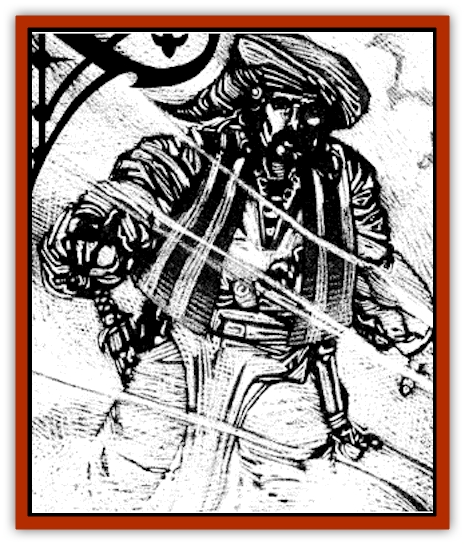

# Golem - Mist - Ravenloft

| Statistic | **Golem, Mist (Ravenloft)** |
| --- | --- |
| **Activity Cycle:** | Any |
| **Alignment:** | Chaotic evil |
| **Armor Class:** | -2 |
| **Climate/Terrain:** | Ravenloft |
| **Damage/Attack:** | 3d6/3d6 |
| **Diet:** | None |
| **Frequency:** | Very rare |
| **Hit Dice:** | 18 (90 hp) |
| **Intelligence:** | Low (5-7) |
| **Magic Resistance:** | 25% |
| **Morale:** | Fearless (19-20) |
| **Movement:** | 9 |
| **No. Appearing:** | 1 |
| **No. of Attacks:** | 2 |
| **Organization:** | Solitary |
| **Size:** | L (12' tall) |
| **Special Attacks:** | See below |
| **Special Defenses:** | See below |
| **THAC0:** | 3 |
| **Treasure:** | Nil |
| **XP Value:** | 14,000 |

Mist [[Golem_General_Information|golems]] are creatures of fate, brought into being accidentally by misguided wizards and priests who do not fully understand what they are doing. No one sets out to build a mist [[Golem_Ravenloft_General_Information|golem]], but in a fool's rush to complete the building of some other automaton, tragic circumstance often takes a hand, and even the most dedicated of labors goes astray.

Mist golems look very much like swirling wisps of vapor and billowing clouds of steam mystically constrained in the shape of a 12-foot-tall man or woman. They often resemble the man or woman responsible for creating them. When moving through areas of fog. they are all but invisible, although they may be plainly seen whenever they wish to be.

Mist golems do not speak, but can create a mournful howl that can be heard as far away as a mile.

**Combat:** When in an area of mist or fog, these creatures often surprise their enemies. Anyone attacked by a mist golem in such a place suffers a -2 penalty on his surprise roll.

As mentioned above, mist golems are able to attack with their mournful howling. Indeed. the hearing of this sound is often the first warning that a group of adventurers will have that they are in the presence of such a creature. So dreadful is this keening that all those within 50 feet of the creature must make a fear check upon hearing it.

The mist golem may strike once per round with each of its two fists, doing 3d6 points of damage on any successful hit. So powerful are these blows that they function as battering rams when the creature employs them against structures (consult the demolition rules in the *Dungeon Master Guide*).

On any natural Attack Roll of 20, the target of the golem's attack is infused with the creature's ethereal essence. If the damage generated by this attack is sufficient to kill the target, his body instantly dissolves away into mist and seemingly dissipates into nothing. In truth, the character has been transformed in a wandering [[Mist_Horror|mist horror]]. No attempt to restore life to the character will succeed unless his new form is sought out and captured somehow.

If the damage generated in the attack does not kill the target, a lesser transformation takes place. For the next ten rounds, the person infused with the golem's power becomes an ethereal being of mist and fog. Looking like a faintly projected image, the victim is unable to take any action. Wounds inflicted upon the golem while one or more transformed creatures exist do not affect the automaton. Instead, the infused being suffers them, a fact obvious to all who can see the incorporeal character. Attacks directed at the ethereal character will not harm him unless a +2 or better weapon is used. A character who dies while infused with the power of the mist golem becomes a mist horror as detailed above.

Whenever it wishes to do so, a mist golem may envelop itself in a shroud of vapor that fills an area some 15' about the creature. The cloud is magical in nature and can have one of ten different magical effects. Each effect can be manifested only once per day, so that the cloud could be created only ten times in any given day, each time with a different mystical property. If the golem is surprised, it instinctively releases this cloud, with the DM rolling 1d10 to see which effect it has. No matter which of the cloud's effects is chosen, characters caught in the mist are entitled to any saving throws and the like that they would normally receive. However, a -4 penalty is applied to all such checks because of the golem's great power.

| Roll | Effect |
| --- | --- |
| 1 | Cloudkill |
| 2 | Irritation |
| 3 | Blindness |
| 4 | Hold Person |
| 5 | Tasha's Uncontrollable Hideous Laughter |
| 6 | Otto's irresistible Dance |
| 7 | Stinking Cloud |
| 8 | Silence, 15' Radius |
| 9 | Vampiric Touch |
| 10 | Slow |

Regardless of past exposure to this cloud, a character must make a new check each and every time he is exposed to these magical vapors.

Because of the vaporous nature of the mist golem's body it is seldom hampered by physical objects. While it cannot fly per se, it can drift through even the smallest of apertures. Traps that are triggered by things like trip wires or pressure plates fail to go off when the virtually weightless mist drifts over them.

Like most of the automatons forged in the fires of Ravenloft, the mist golem cannot be harmed by any weapon of less than +2 enchantment. All other physical attacks directed at the creature pass through it without harm, although they do cause a slight rippling in the swirls of fog that make up its body.

Magic is all but useless against these creatures. They are immune to all manner of mind- or life-affecting spells and attempts to disrupt them with spells like *gust of wind* will have no effect upon them. On a similar note, magical and natural forces in and around the creature, like fire, cold. and so forth, do not harm it in any way. The casting of a *dispel magic*, which is so deadly to all other magical automata, has no effect upon a mist golem.

Magical attacks employed directly against the golem, like a *lightning bolt* or *magic missile* spell, do not harm the automaton. Indeed, if the creature has recently been injured it will employ the power of these magics to regenerate lost hit points at a rate of 1 for every 2 points of damage that the attack would normally have done to it. Thus, a 14-point fireball would supply the golem with enough energy to heal 7 points of damage.

When it is hard pressed by an enemy, a mist golem can escape into the vaporous fabric of Ravenloft. In order to do so, the creature must take no other action for one found. During this time, all attacks against the golem are made with a +2 bonus. On the next round, the creature appears to ripple away into nothingness, leaving no indication that it had ever been present save for a dense bank of fog that thins out gradually over the course of the next hour.

**Habitat/Society:** Mist golems are not social creatures. At best, only a handful of them have ever been created, and most of these wander to endless expanses of Ravenloft's vaporous clouds, avoiding all contact with the living. For the most part. they are encountered only when someone foolish seeks them out or attempts to control them. On rare occasions, however, they wander into a domain or one of the demiplane's islands, leaving a trail of destruction behind them until they are again consumed by the mists and vanish.

Like the [[Human_Vistana|Vistani]], mist golems are able to navigate the mists of Ravenloft without effort. Whenever a golem uses its ability to escape into the mists, it can reappear anywhere else in Ravenloft after walking only a short distance. No matter how far the creature wishes to travel, its journey is always one of 99 steps. As soon as it takes the last of these steps, it materializes again in the real world. If the creature has no destination in mind, it need not leave the mists. If it wished to, the golem could wander forever among the swirling clouds of mist that make up this ethereal domain of the mist horrors.

The creation of any mist golem, accidental though it might be, also results in the manifestation of an unusual focus. No two of these objects are alike, yet all function in the same way. At the time of the monster's animation, when the physical body that was to have housed it fades away, some nearby object acts as a lens through which the animating power of the mists is concentrated, focused, and transferred upon the creature.

While it is impossible to say what object will be given this mantle of mystical energy, there are a few things that all known foci have had in common. First, a focus will always be within 50' of both the golem and its creator at the time of the transformation. Second. it will always be of great value (generally not less than 10,000 gold pieces). Third, foci are never very large, weighing at most 5 pounds and generally seldom more than half that. Lastly, the item must be bathed in direct moonlight at the time of the transmutation. As one might gather from the last point, mist golems are always created in the dead of a cloudless night.

From the moment of its creation, this focus is the bane of the golem's existence. Whoever holds the focus in his hand can command the golem to do for him no fewer than five tasks. So long as the golem's master keeps the focus on his person (either in hand, worn as an amulet, or so forth), the golem can do him no harm and must obey his instructions to the letter. As is often the case, of course, the intent of the orders or their ramifications may be perverted dangerously. As a rule, the first order is carried out exactly as its master wishes, with each additional one being more and more twisted. With the completion of the fifth task, the focus is consumed by the mists, vanishing to reappear somewhere else in Ravenloft. For its part, the golem becomes obsessed with the destruction of its former master.

**Ecology:** Unlike other golems, these mysterious creatures are not intentionally created. The first of them (and presumably all others since then) was manifested when an ancient sage attempted to animate a more traditional golem by tapping directly into the mists of Ravenloft. Aware that the land was held together by some mysterious power, but unable to fathom its true nature, the golem's architect fathered a creature more powerful and deadly than anything he could have imagined.

Invariably, the mist golem hungers for destruction and death. First it longs to see the one who sought to control it torn apart and then it begins an endless rampage in which any who encounter the ethereal creature become fair game. From time to time, it must obey a master who holds the focus that empowers it, but these occasions are fleeting and always end with the death of its would-be sovereign.

---
## Discovery & Documentation

**Source Publication:** Ravenloft Appendix III (1991)
**Campaign Setting:** Ravenloft
**Author(s):** Kirk Botulla

### Other Creatures Found in This Source Book
   * [[Akikage|Akikage]]
   * [[Animator_Common|Animator, Common]]
   * [[Animator_Greater|Animator, Greater]]
   * [[Animator_Minor|Animator, Minor]]
   * [[Animator_General_Information|Animator, General Information]]
   * [[Bakhna_Rakhna|Bakhna Rakhna]]
   * [[Baobhan_Sith|Baobhan Sith]]
   * [[Beetle_Scarab|Beetle, Scarab]]
   * [[Boneless|Boneless]]
   * [[Boowray|Boowray]]
   * [[Bruja|Bruja]]
   * [[Carrionette|Carrionette]]
   * [[Carrion_Stalker|Carrion Stalker]]
   * [[Cat_Midnight|Cat, Midnight]]
   * [[Cat_Skeletal|Cat, Skeletal]]
   * [[Cloaker_Resplendent|Cloaker, Resplendent]]
   * [[Cloaker_Shadow|Cloaker, Shadow]]
   * [[Cloaker_Undead|Cloaker, Undead]]
   * [[Corpse_Candle|Corpse Candle]]
   * [[Death's_Head_Tree|Death's Head Tree]]
   * [[Doppelganger_Ravenloft|Doppelganger (Ravenloft)]]
   * [[Familiar_Pseudo-|Familiar, Pseudo-]]
   * [[Familiar_Undead|Familiar, Undead]]
   * [[Feathered_Serpent|Feathered Serpent]]
   * [[Fenhound|Fenhound]]
   * [[Figurine_Ceramic|Figurine, Ceramic]]
   * [[Figurine_Crystal|Figurine, Crystal]]
   * [[Figurine_Ivory|Figurine, Ivory]]
   * [[Figurine_Obsidian|Figurine, Obsidian]]
   * [[Figurine_Porcelain|Figurine, Porcelain]]
   * [[Figurine_General_Information|Figurine, General Information]]
   * [[Fleas_of_Madness|Fleas of Madness]]
   * [[Furies|Furies]]
   * [[Geist|Geist]]
   * [[Ghost_Animal|Ghost, Animal]]
   * [[Golem_Flesh_Ravenloft|Golem, Flesh (Ravenloft)]]
   * [[Golem_Wax_Ravenloft|Golem, Wax (Ravenloft)]]
   * [[Gremishka|Gremishka]]
   * [[Hag_Spectral|Hag, Spectral]]
   * [[Head_Hunter|Head Hunter]]
   * [[Hearth_Fiend|Hearth Fiend]]
   * [[Hebi-No-Onna|Hebi-No-Onna]]
   * [[Hound_Phantom|Hound, Phantom]]
   * [[Hound_Skeletal|Hound, Skeletal]]
   * [[Imp_Wishing|Imp, Wishing]]
   * [[Ivy_Crawling|Ivy, Crawling]]
   * [[Jack_Frost|Jack Frost]]
   * [[Jolly_Roger|Jolly Roger]]
   * [[Kizoku|Kizoku]]
   * [[Lashweed|Lashweed]]
   * [[Leech_Magical|Leech, Magical]]
   * [[Leech_Psionic|Leech, Psionic]]
   * [[Lich_Defiler|Lich, Defiler]]
   * [[Lich_Drow|Lich, Drow]]
   * [[Lich_Elemental|Lich, Elemental]]
   * [[Lich_Psionic|Lich, Psionic]]
   * [[Living_Tattoo|Living Tattoo]]
   * [[Lycanthrope_Loup-garou|Lycanthrope, Loup-garou]]
   * [[Lycanthrope_Werejackal|Lycanthrope, Werejackal]]
   * [[Lycanthrope_Werejaguar_Ravenloft|Lycanthrope, Werejaguar (Ravenloft)]]
   * [[Lycanthrope_Wereleopard|Lycanthrope, Wereleopard]]
   * [[Lycanthrope_Wereray|Lycanthrope, Wereray]]
   * [[Mist_Ferryman|Mist Ferryman]]
   * [[Moor_Man|Moor Man]]
   * [[Obedient|Obedient]]
   * [[Odem|Odem]]
   * [[Paka|Paka]]
   * [[Plant_Blood_Rose|Plant, Blood Rose]]
   * [[Plant_Fearweed|Plant, Fearweed]]
   * [[Radiant_Spirit|Radiant Spirit]]
   * [[Recluse|Recluse]]
   * [[Remnant_Aquatic|Remnant, Aquatic]]
   * [[Rushlight|Rushlight]]
   * [[Sea_Spawn_Master|Sea Spawn, Master]]
   * [[Sea_Spawn_Minion|Sea Spawn, Minion]]
   * [[Shadow_Asp|Shadow Asp]]
   * [[Shattered_Brethren|Shattered Brethren]]
   * [[Skeleton_Archer|Skeleton, Archer]]
   * [[Skeleton_Insectoid|Skeleton, Insectoid]]
   * [[Skin_Thief|Skin Thief]]
   * [[Spirit_Psionic|Spirit, Psionic]]
   * [[Strahd_Skeleton|Strahd Skeleton]]
   * [[Strahd_Zombie|Strahd Zombie]]
   * [[Unicorn_Shadow|Unicorn, Shadow]]
   * [[Vampire_Drow|Vampire, Drow]]
   * [[Vampire_Nosferatu|Vampire, Nosferatu]]
   * [[Vampire_Oriental|Vampire, Oriental]]
   * [[Virus_General_Information|Virus, General Information]]
   * [[Virus_I|Virus I]]
   * [[Virus_II|Virus II]]
   * [[Virus_III|Virus III]]
   * [[Vorlog|Vorlog]]
   * [[Will_O'Dawn|Will O'Dawn]]
   * [[Will_O'Deep|Will O'Deep]]
   * [[Will_O'Mist|Will O'Mist]]
   * [[Will_O'Sea|Will O'Sea]]
   * [[Zombie_Cannibal|Zombie, Cannibal]]
   * [[Zombie_Desert|Zombie, Desert]]
   * [[Zombie_Wolf|Zombie Wolf]]
   * [[Zombie_Fog|Zombie Fog]]
