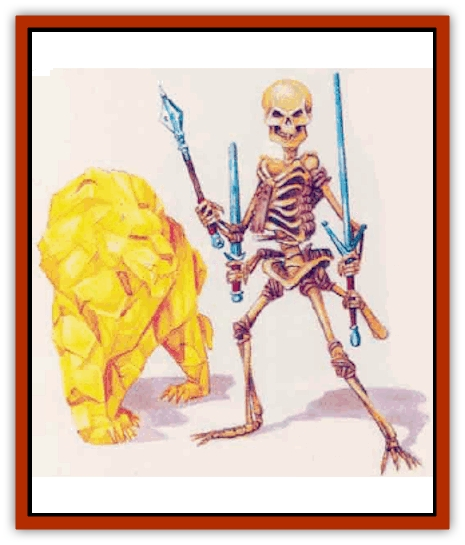

# Golem - Mystara - I

| Statistic | **Amber** | **Skeletal** |
| --- | --- | --- |
| **Activity Cycle:** | Any | Any |
| **Alignment:** | Neutral | Neutral |
| **Armor Class:** | 6 | 2 |
| **Climate/Terrain:** | Any land | Any land |
| **Damage/Attack:** | 2d6 (claw)/2d6 (claw)/2d10 (bite) | By weapon |
| **Diet:** | None | None |
| **Frequency:** | Very rare | Rare |
| **Hit Dice:** | 10 (50 hp) | 6 (30 hp) |
| **Intelligence:** | Non- (0) | Non- (0) |
| **Magic Resistance:** | Nil | Nil |
| **Morale:** | Fearless (20) | Fearless (20) |
| **Movement:** | 18 | 12 |
| **No. Appearing:** | 1 | 1 |
| **No. of Attacks:** | 3 | 4 |
| **Organization:** | Solitary | Solitary |
| **Size:** | L (8-12'long) | M (6' tall) |
| **Special Attacks:** | Nil | Nil |
| **Special Defenses:** | See below | See below |
| **THAC0:** | 11 | 15 |
| **Treasure:** | See below | Nil |
| **XP Value:** | 6,000 | 1,400 |

A [[Golem_General_Information|golem]] is actually a "construct", a powerful, enchanted monster created and animated by a high-level wizard or priest. The creatures can be made from almost any material. The DM should feel free to create new types as desired.

Golems are immune to poisons and to all mind-affecting attacks. In addition, they remain unaffected by most spells, with exceptions listed in individual entries.

## Amber Golem

Amber golems often appear in the form of [[Cat_Great|giant cats]], especially lions or tigers. Their semitranslucent amber bodies - often expertly carved - look particularly beautiful in repose.

**Combat:** As with all these constructs, an amber golem is a tireless foe. In battle, it leaps upon its opponents, slashing with its terrible claws and biting with the wickedly sharp slivers of amber that form its teeth.

Amber golems, nearly faultless trackers, prove particularly effective at recovering fleeing enemies. The golem can automatically follow a trail less than 12 hours old. For every additional 12 hours that elapses, it gains a 5% chance of missing or losing the scent. So, for example, an amber golem has an 85% chance to follow a trail 48 hours old.

These golems also make particularly effective guards, since they can cast *detect invisibility* to a range of 60 feet.

An amber golem sustains damage only from magical weapons. Such a construct is considered a crystalline creature when attacked with a *shatter* spell; it suffers 1d6 points of damage per caster level, to a maximum of 6d6 points of damage, with a saving throw allowed for half damage. Amber golems also sustain half damage from fire spells, but otherwise remain immune to spells.

**Habitat/Society:** These automatons, which operate under the direct control of their creators, have no society or association with any particular habitat. Golems can obey simple commands but have very limited mental capabilities. They often guard great treasures or places of importance.

**Ecology:** As unnatural creatures, golems play no part in the natural ecology. They neither eat nor sleep, and they "live" until destroyed, usually in combat.

The destruction of an amber golem causes the creature to shatter into many large shards of amber. All together, the piees of amber weigh 300 to 600 lbs. (1d4+2 hundred) and are worth from 3,000 to 6,000 gold pieces (1d4+2 thousand).

An amber golem, can be created only by a priest of at least 7th level who has the 100,000 gold pieces it costs to produce the construct. The work takes the priest four months and requires the following spells: *animal summoning III*, *animate object*, *prayer*, *command*, and *quest*.

## Skeletal Golem

A skeletal golem (sometimes known as a [[Golem_III|bone golem]]) looks like a man-sized creation sewn together from human bones. The bones are bound together in a rough imitation of the human body, with one obvious exception. Instead of having two arms attached to its ghastly body, a bone golem has four, sprouting from wherever its creator chose. Some wizards also like to carve or paint runes of ownership onto the bones; such golems prove particularly frightening to look upon.

**Combat:** Due to the skeletal golem's multiple arqs, it may wield four weapons (or two two-handed weapons) in combat. The golem may attack two separate foes in a slngle round.

A bone golem suffers damage only from magical weapons. Its immunities to poison and mind-affecting attacks extepd to fire, cold, and electrical attacks as well. However, the goledn remains vulnerable to spells with other effects.

**Ecology:** It is rumored that the more unscrupulous wizards of the land of Alphatia particularly enjoy creating skeletal golem guardians to protect their laboratories and abodes from ousiders - especially rival wizards.

A wizard of at least 14th level can build a skeletal golem in a process that takes three months and costs 30,000 gold pieces. The spells required are *limited wish*, *animate dead*, *geas*, and *stoneskin*.

---
## Discovery & Documentation

**Source Publication:** Mystara Appendix (1994)
**Campaign Setting:** Mystara
**Author(s):** John Nephew, Teeuwynn Woodruff, John Terra, Skip Williams

### Other Creatures Found in This Source Book
   * [[Actaeon|Actaeon]]
   * [[Agarat|Agarat]]
   * [[Ash_Crawler|Ash Crawler]]
   * [[Baldandar|Baldandar]]
   * [[Bargda|Bargda]]
   * [[Bhut|Bhut]]
   * [[Bird_Mystara|Bird (Mystara)]]
   * [[Blackball|Blackball]]
   * [[Choker|Choker]]
   * [[Coltpixie|Coltpixie]]
   * [[Crone_of_Chaos|Crone of Chaos]]
   * [[Darkhood|Darkhood]]
   * [[Darkwing|Darkwing]]
   * [[Decapus|Decapus]]
   * [[Deep_Glaurant|Deep Glaurant]]
   * [[Diabolus|Diabolus]]
   * [[Dimensional_Warper|Dimensional Warper]]
   * [[Dragon_Mystara_Crystalline|Dragon (Mystara), Crystalline]]
   * [[Dragon_Mystara_Jade|Dragon (Mystara), Jade]]
   * [[Dragon_Mystara_Onyx|Dragon (Mystara), Onyx]]
   * [[Dragon_Mystara_Ruby|Dragon (Mystara), Ruby]]
   * [[Drake_Mystara|Drake (Mystara)]]
   * [[Dragonfly|Dragonfly]]
   * [[Dusanu|Dusanu]]
   * [[Elemental_of_Chaos_Air_Earth|Elemental of Chaos, Air/Earth]]
   * [[Elemental_of_Chaos_Fire_Water|Elemental of Chaos, Fire/Water]]
   * [[Elemental_of_Law_Air_Earth|Elemental of Law, Air/Earth]]
   * [[Elemental_of_Law_Fire_Water|Elemental of Law, Fire/Water]]
   * [[Familiar_Mystara|Familiar (Mystara)]]
   * [[Frost_Salamander|Frost Salamander]]
   * [[Fundamental_Air_Earth|Fundamental, Air/Earth]]
   * [[Fundamental_Fire_Water|Fundamental, Fire/Water]]
   * [[Gargantua_Mystara|Gargantua (Mystara)]]
   * [[Geonid|Geonid]]
   * [[Ghostly_Horde|Ghostly Horde]]
   * [[Giant_Athach|Giant, Athach]]
   * [[Giant_Hephaeston|Giant, Hephaeston]]
   * [[Golem_Drolem|Golem, Drolem]]
   * [[Golem_Mystara_II|Golem (Mystara) II]]
   * [[Golem_Mystara_III|Golem (Mystara) III]]
   * [[Gray_Philosopher|Gray Philosopher]]
   * [[Guardian_Warrior|Guardian Warrior]]
   * [[Gyerian|Gyerian]]
   * [[Herex|Herex]]
   * [[Hivebrood|Hivebrood]]
   * [[Horde|Horde]]
   * [[Hsiao|Hsiao]]
   * [[Huptzeen|Huptzeen]]
   * [[Hutaakan|Hutaakan]]
   * [[Imp_Mystara|Imp (Mystara)]]
   * [[Jellyfish_Giant_Mystara|Jellyfish, Giant (Mystara)]]
   * [[Kna|Kna]]
   * [[Kopru|Kopru]]
   * [[Lizard_Mystara|Lizard (Mystara)]]
   * [[Lizard-kin_Mystara|Lizard-kin (Mystara)]]
   * [[Lupin|Lupin]]
   * [[Lycanthrope_Werejaguar_Mystara|Lycanthrope, Werejaguar (Mystara)]]
   * [[Lycanthrope_Wereswine|Lycanthrope, Wereswine]]
   * [[Magen|Magen]]
   * [[Manikin|Manikin]]
   * [[Mek|Mek]]
   * [[Mujina|Mujina]]
   * [[Nagpa|Nagpa]]
   * [[Neh-thalggu|Neh-thalggu]]
   * [[Nightshade_Mystara|Nightshade (Mystara)]]
   * [[Nuckalavee|Nuckalavee]]
   * [[Pegataur|Pegataur]]
   * [[Phanaton|Phanaton]]
   * [[Plant_Dangerous_Mystara|Plant, Dangerous (Mystara)]]
   * [[Plasm|Plasm]]
   * [[Rakasta|Rakasta]]
   * [[Rock_Man|Rock Man]]
   * [[Sabreclaw|Sabreclaw]]
   * [[Sacrol|Sacrol]]
   * [[Scamille|Scamille]]
   * [[Shapeshifter|Shapeshifter]]
   * [[Shargugh|Shargugh]]
   * [[Shark-kin|Shark-kin]]
   * [[Sollux|Sollux]]
   * [[Spectral_Death|Spectral Death]]
   * [[Spectral_Hound|Spectral Hound]]
   * [[Spider-kin|Spider-kin]]
   * [[Spirit_Mystara|Spirit (Mystara)]]
   * [[Statue_Living|Statue, Living]]
   * [[Surtaki|Surtaki]]
   * [[Tabi|Tabi]]
   * [[Thoul|Thoul]]
   * [[Thunderhead|Thunderhead]]
   * [[Tiger_Ebon|Tiger, Ebon]]
   * [[Topi|Topi]]
   * [[Tortle|Tortle]]
   * [[Vampire_Velya|Vampire, Velya]]
   * [[White_Fang|White Fang]]
   * [[Worm_Mystara|Worm (Mystara)]]
   * [[Wyrd|Wyrd]]
   * [[Yowler|Yowler]]
   * [[Zombie_Lightning|Zombie, Lightning]]
