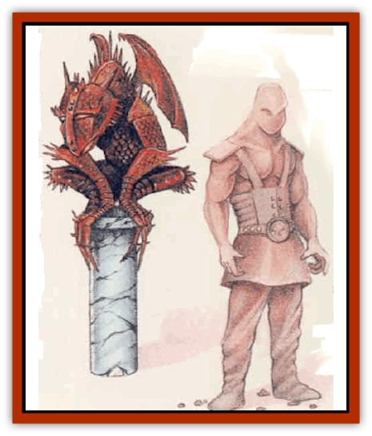

# Golem - Mystara - II

| Statistic | **Iron Gargoyle** | **Mud** |
| --- | --- | --- |
| **Activity Cycle:** | Any | Any |
| **Alignment:** | Neutral | Neutral |
| **Armor Class:** | -1 | 9 |
| **Climate/Terrain:** | Any land | Any land |
| **Damage/Attack:** | 1d8 (claw)/1d8 (claw)/2d8 (horn)/ 1d10 (tail) | 2d6 (smother) |
| **Diet:** | None | None |
| **Frequency:** | Very rare | Rare |
| **Hit Dice:** | 16 | 8 |
| **Intelligence:** | Non- (0) | Non- (0) |
| **Magic Resistance:** | Nil | Nil |
| **Morale:** | Fearless (20) | Fearless (20) |
| **Movement:** | 3, FL 9 (D) | 9 |
| **No. Appearing:** | 1d2 | 1 |
| **No. of Attacks:** | 4 | 1 |
| **Organization:** | Solitary | Solitary |
| **Size:** | L (12' tall) | M (6' tall) |
| **Special Attacks:** | Breath weapon, stun, crushing dive | Continuous damage |
| **Special Defenses:** | See below | See below |
| **THAC0:** | 5 | 13 |
| **Treasure:** | Nil | Nil |
| **XP Value:** | 19,000 | 2,000 |

A [[Golem_General_Information|golem]] is actually a "construct", a powerful, enchanted monster created and animated by a high-level wizard or priest. These creatures can be made from almost any material - in these cases, [[Golem_I_Greater_Golem|iron]] and mud. Of course, the DM may feel free to create new types as desired.

## Iron Gargoyle

Except for their great height (12 feet), iron [[Gargoyle_I|gargoyles]] resemble normal [[Golem_IV|gargoyles]]. Each of these craggy creatures is covered in iron scales, with numerous iron spikes protruding from its body. The iron gargoyle's red eyes gleam malignantly. In dim lighting conditions, flames visibly lick the edges of its grinning maw. Viewed by infravision, these monsters glow brightly from the heat their hulking bodies contain.

**Combat:** The iron gargoyle remains utterly unaffected by all forms of fire. However, any cold-based attack inflicts double damage on it. This creature is otherwise immune to spells and suffers damage only from weapons of +2 enchantment or better. It can cast detect invisibility within 60 feet.

An iron gargoyle is not a veIy agile flier, but in battle it often attacks initially from the air, attempting to crush its foe by landing on it. The intended victim of this attack can roll a saving throw vs. death to avoid it. Those who fail suffer 3d10 points of damage and, stunned, cannot act for 1d3 rounds.

In combat, the monster applies its two claws (1d8 damage each), horn (2d8 damage), and lashing tail (1d10 damage). Anyone the gargoyle's tail hits must make a successful saving throw vs. paralyzation or become stunned for 1d3 rounds. Every three rounds the gargoyle can breathe fire in a cone 30 feet long and 10 feet wide, causing 3d10 points of damage (halved by a successful saving throw vs. dragon breath).

**Ecology:** As unnatural creatures, iron gargoyles play no part in the natural ecology. They neither eat nor sleep, and they "live" only until destroyed, usually in combat.

These creatures are most often constructred and encountered in pairs, but a sole iron gargoyle may guard areas of lesser importance to its creator.

It costs 125,000 gold pieces to construct an iron gargoyle, and the process takes five months. Only a wizard of 18th level or greater can create one; the spells required are *wish*, *polymorph any object*, *geas*, *fireball*, and *fly*.

## Mud Golem

A mud golem stands about 6 feet tall and is shaped like a muscular human fighter. This creature, made from dark mud, has almost non-existent features: no mouth and only two darker, faintly gleaming hollows for eyes. The construct emits a foul odor reminiscent of swamp gas.

**Combat:** A mud golem can walk on a surface of mud and quicksand without sinking. It also can remain submerged in these substances infinitely without sinking, rising to the surface at will. Normally its creator has placed the golem so it can attack from such an advantageous position.

In battle, a mud golem attempts to throw its arms around its victim in a horrific, smothering hug. A successful attack inflicts 2d6 points of damage - and the golem hangs on. In eace subsequent round, it causes 2d6 points of smothering damage, but the victim can struggle; a successful saving throw vs. paralyzation halves damage from the smothering attack. The saving throw does not apply against the initial attack, but the character can roll a new saving throw each round thereafter. The creature does not normally release a living victim, although some adventurers claim to have "played dead" to get a slow-witted golem to drop them.

The mud golem can sustain damage from normal and magical weapons, but suffers only half damage from blunt weapons. A *transmute mud to rock* spell confers the effects of a *slow* spell upon the mud golem for 2d4 rounds, but the construct remains otherwise unaffected by spells.

**Ecology:** Mud golems can exist anywhere, but priests usually create them to guard buildings and treasures within swamps, jungles, or other dank and muddy areas.

Materials for a mud golem cost 100 gold pieces, and construction takes one month. Only a priest of at least 11th level can make a mud golem; the spells required are *transmute rock to mud*, *animate object*, *raise dead*, *slow*, and *quest*.

---
## Discovery & Documentation

**Source Publication:** Mystara Appendix (1994)
**Campaign Setting:** Mystara
**Author(s):** John Nephew, Teeuwynn Woodruff, John Terra, Skip Williams

### Other Creatures Found in This Source Book
   * [[Actaeon|Actaeon]]
   * [[Agarat|Agarat]]
   * [[Ash_Crawler|Ash Crawler]]
   * [[Baldandar|Baldandar]]
   * [[Bargda|Bargda]]
   * [[Bhut|Bhut]]
   * [[Bird_Mystara|Bird (Mystara)]]
   * [[Blackball|Blackball]]
   * [[Choker|Choker]]
   * [[Coltpixie|Coltpixie]]
   * [[Crone_of_Chaos|Crone of Chaos]]
   * [[Darkhood|Darkhood]]
   * [[Darkwing|Darkwing]]
   * [[Decapus|Decapus]]
   * [[Deep_Glaurant|Deep Glaurant]]
   * [[Diabolus|Diabolus]]
   * [[Dimensional_Warper|Dimensional Warper]]
   * [[Dragon_Mystara_Crystalline|Dragon (Mystara), Crystalline]]
   * [[Dragon_Mystara_Jade|Dragon (Mystara), Jade]]
   * [[Dragon_Mystara_Onyx|Dragon (Mystara), Onyx]]
   * [[Dragon_Mystara_Ruby|Dragon (Mystara), Ruby]]
   * [[Drake_Mystara|Drake (Mystara)]]
   * [[Dragonfly|Dragonfly]]
   * [[Dusanu|Dusanu]]
   * [[Elemental_of_Chaos_Air_Earth|Elemental of Chaos, Air/Earth]]
   * [[Elemental_of_Chaos_Fire_Water|Elemental of Chaos, Fire/Water]]
   * [[Elemental_of_Law_Air_Earth|Elemental of Law, Air/Earth]]
   * [[Elemental_of_Law_Fire_Water|Elemental of Law, Fire/Water]]
   * [[Familiar_Mystara|Familiar (Mystara)]]
   * [[Frost_Salamander|Frost Salamander]]
   * [[Fundamental_Air_Earth|Fundamental, Air/Earth]]
   * [[Fundamental_Fire_Water|Fundamental, Fire/Water]]
   * [[Gargantua_Mystara|Gargantua (Mystara)]]
   * [[Geonid|Geonid]]
   * [[Ghostly_Horde|Ghostly Horde]]
   * [[Giant_Athach|Giant, Athach]]
   * [[Giant_Hephaeston|Giant, Hephaeston]]
   * [[Golem_Drolem|Golem, Drolem]]
   * [[Golem_Mystara_I|Golem (Mystara) I]]
   * [[Golem_Mystara_III|Golem (Mystara) III]]
   * [[Gray_Philosopher|Gray Philosopher]]
   * [[Guardian_Warrior|Guardian Warrior]]
   * [[Gyerian|Gyerian]]
   * [[Herex|Herex]]
   * [[Hivebrood|Hivebrood]]
   * [[Horde|Horde]]
   * [[Hsiao|Hsiao]]
   * [[Huptzeen|Huptzeen]]
   * [[Hutaakan|Hutaakan]]
   * [[Imp_Mystara|Imp (Mystara)]]
   * [[Jellyfish_Giant_Mystara|Jellyfish, Giant (Mystara)]]
   * [[Kna|Kna]]
   * [[Kopru|Kopru]]
   * [[Lizard_Mystara|Lizard (Mystara)]]
   * [[Lizard-kin_Mystara|Lizard-kin (Mystara)]]
   * [[Lupin|Lupin]]
   * [[Lycanthrope_Werejaguar_Mystara|Lycanthrope, Werejaguar (Mystara)]]
   * [[Lycanthrope_Wereswine|Lycanthrope, Wereswine]]
   * [[Magen|Magen]]
   * [[Manikin|Manikin]]
   * [[Mek|Mek]]
   * [[Mujina|Mujina]]
   * [[Nagpa|Nagpa]]
   * [[Neh-thalggu|Neh-thalggu]]
   * [[Nightshade_Mystara|Nightshade (Mystara)]]
   * [[Nuckalavee|Nuckalavee]]
   * [[Pegataur|Pegataur]]
   * [[Phanaton|Phanaton]]
   * [[Plant_Dangerous_Mystara|Plant, Dangerous (Mystara)]]
   * [[Plasm|Plasm]]
   * [[Rakasta|Rakasta]]
   * [[Rock_Man|Rock Man]]
   * [[Sabreclaw|Sabreclaw]]
   * [[Sacrol|Sacrol]]
   * [[Scamille|Scamille]]
   * [[Shapeshifter|Shapeshifter]]
   * [[Shargugh|Shargugh]]
   * [[Shark-kin|Shark-kin]]
   * [[Sollux|Sollux]]
   * [[Spectral_Death|Spectral Death]]
   * [[Spectral_Hound|Spectral Hound]]
   * [[Spider-kin|Spider-kin]]
   * [[Spirit_Mystara|Spirit (Mystara)]]
   * [[Statue_Living|Statue, Living]]
   * [[Surtaki|Surtaki]]
   * [[Tabi|Tabi]]
   * [[Thoul|Thoul]]
   * [[Thunderhead|Thunderhead]]
   * [[Tiger_Ebon|Tiger, Ebon]]
   * [[Topi|Topi]]
   * [[Tortle|Tortle]]
   * [[Vampire_Velya|Vampire, Velya]]
   * [[White_Fang|White Fang]]
   * [[Worm_Mystara|Worm (Mystara)]]
   * [[Wyrd|Wyrd]]
   * [[Yowler|Yowler]]
   * [[Zombie_Lightning|Zombie, Lightning]]
