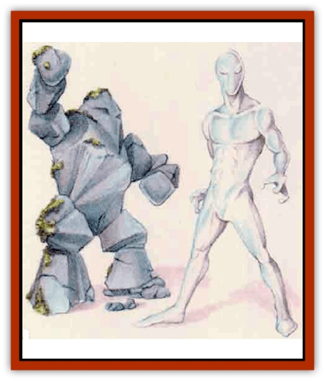

# Golem - Mystara - III

| Statistic | **Rock** | **Silver** |
| --- | --- | --- |
| **Activity Cycle:** | Any | Any |
| **Alignment:** | Neutral | Neutral |
| **Armor Class:** | -2 | 0 |
| **Climate/Terrain:** | Any land | Any land |
| **Damage/Attack:** | 2d10 (fist)/2d10 (fist) | 1d8 (fist)/1d8 (fist)/1d8 (fist)/1d8 (fist) |
| **Diet:** | Nil | Nil |
| **Frequency:** | Very rare | Very rare |
| **Hit Dice:** | 16 | 12 |
| **Intelligence:** | Non- (0) | Semi- (2-4) |
| **Magic Resistance:** | Nil | Nil |
| **Morale:** | Fearless (20) | Fearless (20) |
| **Movement:** | 6 | 30 |
| **No. Appearing:** | 1d2 | 1d3 |
| **No. of Attacks:** | 2 | 4 |
| **Organization:** | Solitary | Solitary |
| **Size:** | L (8-10' tall) | L (8' tall) |
| **Special Attacks:** | Nil | Nil |
| **Special Defenses:** | See below | See below |
| **THAC0:** | 5 | 9 |
| **Treasure:** | Nil | Nil |
| **XP Value:** | 14,000 | 9,000 |

A [[Golem_General_Information|golem]] is actually a "construct", a powerful, enchanted monster created and animated by a high-level wizard or priest. The creatures can be made from almost any material, including [[Golem_Athas_II|rock]] and silver. The DM should feel free to invent new kinds of golems as circumstances dictate.

## Rock Golem

Until activated, these constructs usually resemble irregular rock formations. Rock golems in the form of large human statues when carved with exceptional skill, occasionally can be mistaken for [[Golem_VI_Stone_Variants|caryatid columns]], a different form of magical construct.

**Combat:** Despite their slow pace, rock golems are fierce opponents. Each of their fists causes 2d10 points of damage. These golems use no other form of attack, but remain absolutely relentless and tlreless in battle, following their master's instructions explicitly and mindlessly.

Only magical weapons can strike rock golems successfully. Any normal weapon that hits the creature automatically breaks on contact. Swords snap, axe heads shatter, etc. Enchanted blunt weapons will not break against the golem's rocky skin, but edged and pointed magical weapons might; enchanted edged and pointed weapons must make a successful saving throw vs. crushing blow with a -2 penalty or shatter. A weapon's magical bonuses apply normally to the saving throw.

Like other golems, rock golems are immune to poisons and to mind-affectmg attacks. They remain unaffected by electrical, fire, and cold attacks, but can sustain damage from spells with other effects.

**Habitat/Society:** These automatons operate under the direct control of their creators - they have no society, no friends, and no relationships. They have no native habitat, either, and can exist anywhere their creator might have reason to put them. Obeying smple commands nearly exhausts their limited mental capacities. They are used almost exclusively as guardians, watching over great treasures or places of importance.

**Ecology:** As unnatural creatures, golems play no part in the natural ecology. They neither eat nor sleep, and they "live" only until destroyed, usually in combat.

A rock golem takes one month and costs 50,000 gold pieces to construct. A wizard of at least 14th level can make such a creature using the followmg spells: *limited wish*, *move earth*, *stoneskin*, and *geas*.

## Silver Golem

A silver golem is composed of a silver outer body filled with quicksilver (mercury) to grant the golem its great speed. The silver skin of these tall and lanky humanoids has such flexibility, it appears almost liquid in nature. The constructs usually possess quicksilver eyes as their only features.

**Combat:** A silver golem is the quickest of all known constructs. Its amazing speed enables it to attack twice with each fist (a total of four attacks) every round. In addition, a silver golem always gains the initiative (even over a *short sword of speed*). As with all golems, however, these creatures only follow the instructions of their creators, attacking when and how they are directed.

These constructs suffer damage only from weapon with a +1 or greater enchantment. Like other golems, they are immune to poison and to mind-affecting attacks. Magical fire-based attacks cause them to grow 1 Hit Die per level of the spell used against them, and magical cold-based attacks cause them to shrink in a similar fashion. Silver golems remain otherwise unaffected by spells.

**Ecology:** The remains of a defeated silver golem have great value. The silver composing the body weighs 100 lbs. and is worth 1,000 gold pieces.

Creatlng such a rare construct requires all the normal conjurings needed to create any golem. Additionally, the creator must find a sufficient quanhty of quicksilver (50 lbs) to animate the dread creation. The material cost to construct a silver golem totals 100,000 gold pieces. Only a wizard of at least 14th level can build one of these constructs, in a process that takes six months and requires these additional spells: *limited wish*, *haste*, *lightning bolt*, *domination*, and *major creation*.

---
## Discovery & Documentation

**Source Publication:** Mystara Appendix (1994)
**Campaign Setting:** Mystara
**Author(s):** John Nephew, Teeuwynn Woodruff, John Terra, Skip Williams

### Other Creatures Found in This Source Book
   * [[Actaeon|Actaeon]]
   * [[Agarat|Agarat]]
   * [[Ash_Crawler|Ash Crawler]]
   * [[Baldandar|Baldandar]]
   * [[Bargda|Bargda]]
   * [[Bhut|Bhut]]
   * [[Bird_Mystara|Bird (Mystara)]]
   * [[Blackball|Blackball]]
   * [[Choker|Choker]]
   * [[Coltpixie|Coltpixie]]
   * [[Crone_of_Chaos|Crone of Chaos]]
   * [[Darkhood|Darkhood]]
   * [[Darkwing|Darkwing]]
   * [[Decapus|Decapus]]
   * [[Deep_Glaurant|Deep Glaurant]]
   * [[Diabolus|Diabolus]]
   * [[Dimensional_Warper|Dimensional Warper]]
   * [[Dragon_Mystara_Crystalline|Dragon (Mystara), Crystalline]]
   * [[Dragon_Mystara_Jade|Dragon (Mystara), Jade]]
   * [[Dragon_Mystara_Onyx|Dragon (Mystara), Onyx]]
   * [[Dragon_Mystara_Ruby|Dragon (Mystara), Ruby]]
   * [[Drake_Mystara|Drake (Mystara)]]
   * [[Dragonfly|Dragonfly]]
   * [[Dusanu|Dusanu]]
   * [[Elemental_of_Chaos_Air_Earth|Elemental of Chaos, Air/Earth]]
   * [[Elemental_of_Chaos_Fire_Water|Elemental of Chaos, Fire/Water]]
   * [[Elemental_of_Law_Air_Earth|Elemental of Law, Air/Earth]]
   * [[Elemental_of_Law_Fire_Water|Elemental of Law, Fire/Water]]
   * [[Familiar_Mystara|Familiar (Mystara)]]
   * [[Frost_Salamander|Frost Salamander]]
   * [[Fundamental_Air_Earth|Fundamental, Air/Earth]]
   * [[Fundamental_Fire_Water|Fundamental, Fire/Water]]
   * [[Gargantua_Mystara|Gargantua (Mystara)]]
   * [[Geonid|Geonid]]
   * [[Ghostly_Horde|Ghostly Horde]]
   * [[Giant_Athach|Giant, Athach]]
   * [[Giant_Hephaeston|Giant, Hephaeston]]
   * [[Golem_Drolem|Golem, Drolem]]
   * [[Golem_Mystara_I|Golem (Mystara) I]]
   * [[Golem_Mystara_II|Golem (Mystara) II]]
   * [[Gray_Philosopher|Gray Philosopher]]
   * [[Guardian_Warrior|Guardian Warrior]]
   * [[Gyerian|Gyerian]]
   * [[Herex|Herex]]
   * [[Hivebrood|Hivebrood]]
   * [[Horde|Horde]]
   * [[Hsiao|Hsiao]]
   * [[Huptzeen|Huptzeen]]
   * [[Hutaakan|Hutaakan]]
   * [[Imp_Mystara|Imp (Mystara)]]
   * [[Jellyfish_Giant_Mystara|Jellyfish, Giant (Mystara)]]
   * [[Kna|Kna]]
   * [[Kopru|Kopru]]
   * [[Lizard_Mystara|Lizard (Mystara)]]
   * [[Lizard-kin_Mystara|Lizard-kin (Mystara)]]
   * [[Lupin|Lupin]]
   * [[Lycanthrope_Werejaguar_Mystara|Lycanthrope, Werejaguar (Mystara)]]
   * [[Lycanthrope_Wereswine|Lycanthrope, Wereswine]]
   * [[Magen|Magen]]
   * [[Manikin|Manikin]]
   * [[Mek|Mek]]
   * [[Mujina|Mujina]]
   * [[Nagpa|Nagpa]]
   * [[Neh-thalggu|Neh-thalggu]]
   * [[Nightshade_Mystara|Nightshade (Mystara)]]
   * [[Nuckalavee|Nuckalavee]]
   * [[Pegataur|Pegataur]]
   * [[Phanaton|Phanaton]]
   * [[Plant_Dangerous_Mystara|Plant, Dangerous (Mystara)]]
   * [[Plasm|Plasm]]
   * [[Rakasta|Rakasta]]
   * [[Rock_Man|Rock Man]]
   * [[Sabreclaw|Sabreclaw]]
   * [[Sacrol|Sacrol]]
   * [[Scamille|Scamille]]
   * [[Shapeshifter|Shapeshifter]]
   * [[Shargugh|Shargugh]]
   * [[Shark-kin|Shark-kin]]
   * [[Sollux|Sollux]]
   * [[Spectral_Death|Spectral Death]]
   * [[Spectral_Hound|Spectral Hound]]
   * [[Spider-kin|Spider-kin]]
   * [[Spirit_Mystara|Spirit (Mystara)]]
   * [[Statue_Living|Statue, Living]]
   * [[Surtaki|Surtaki]]
   * [[Tabi|Tabi]]
   * [[Thoul|Thoul]]
   * [[Thunderhead|Thunderhead]]
   * [[Tiger_Ebon|Tiger, Ebon]]
   * [[Topi|Topi]]
   * [[Tortle|Tortle]]
   * [[Vampire_Velya|Vampire, Velya]]
   * [[White_Fang|White Fang]]
   * [[Worm_Mystara|Worm (Mystara)]]
   * [[Wyrd|Wyrd]]
   * [[Yowler|Yowler]]
   * [[Zombie_Lightning|Zombie, Lightning]]
