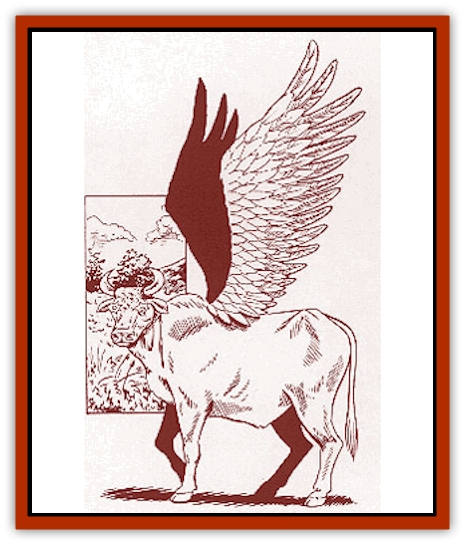

# Golem - Naâruk

| Statistic | **Golem, Naâruk** |
| --- | --- |
| **Activity Cycle:** | Any |
| **Alignment:** | Neutral |
| **Armor Class:** | 5 |
| **Climate/Terrain:** | Any |
| **Damage/Attack:** | 3d8 |
| **Diet:** | Nil |
| **Frequency:** | Very rare |
| **Hit Dice:** | 12 (50 hp) |
| **Intelligence:** | Non- (0) |
| **Magic Resistance:** | Nil |
| **Morale:** | Fearless (20) |
| **Movement:** | 6, Fl 24 (C) |
| **No. Appearing:** | 1 |
| **No. of Attacks:** | 1 |
| **Organization:** | Solitary |
| **Size:** | L (10' tall) |
| **Special Attacks:** | Charge |
| **Special Defenses:** | Hit only by +2 or better magical weapons, spell immunities |
| **THAC0:** | 9 |
| **Treasure:** | Nil |
| **XP Value:** | 11,000 |

Built by [[Enduk|enduk]] priests in their grand temples, the naâruk is a [[Golem_General_Information|golem]] which looks like a 10-foot-tall winged bull. The naâruk is usually fashioned of gleaming bronze with extremely lifelike workmanship. Naâruks stand dormant and still most of the time, appearing as statues. When active, however, a naâruk's eyes glow a soft green color.

The naâruks give the enduks the ability to rapidly reposition troops and support personnel. During a special religious ceremony, up to 10 enduk warriors or clerics of the same faith may meld (as per the Meld Legacy) into this golem and use it as a long range transportation device. While melded, all occupants remain unconscious, vulnerable only to things that damage the naâruk. The naâruk then flies back to its temple of origin after releasing all of its occupants.

**Combat:** Like most other golems, a naâruk is merely able to execute fairly detailed, linear instructions. They have difficulty handling conditional instructions.

A naâruk has a Strength of 23 for purposes of breaking or pulling things, and opponents require +2 or better magical weapons to hit a naâruk. The naâruk is immune to most spells. A *gust of wind* spell *slows* the naâruk for 1d4 rounds, and it ignores all other spells.

If the naâruk gets a flying start of at least 60 feet, it charges, inflicting double damage. Naâruks count as +2 weapons for purposes of hitting creatures struck only by magical weapons.Naâruks do not normally participate in battles, but they will defend themselves if attacked. These sacred creatures are reserved for holy wars. They will, however, attack creatures interfering with their goals. If necessary, a naâruk can release some or all of its occupants to assist in defense. If destroyed, a naâruk instantly releases all of its melded occupants.

Damage to the naâruk may only be healed at its home temple. Repairing a naâruk requires a *produce fire* spell and costs 100 gp in materials per hit point of damage repaired.

**Habitat/Society:** Most enduk temples keep at least one of these constructs as a guardian. Part of the duty of the enduk clergy is to keep the naâruk in top-notch operating condition. Many a neophyte enduk priest has spent countless hours hand-polishing the gleaming bronze flanks of the temple naâruk, learning humility, perseverance, and the honor of a task well-done.

Many enduks believe that the spiritual condition of the temple and the physical condition of the temple naâruk are linked. To them, a shiny, well-maintained naâruk indicates a healthy temple. Likewise, a naâruk with a bit of tarnish or a hitch in its step indicates corruption in the temple.

**Ecology:** The naâruk is a golem, a magical construct. As such, it plays no part in the world's ecology. A naâruk does not eat, sleep, or drink, and "lives" only until its body is destroyed.

Only the enduk priests know the secret of constructing a naâruk. It requires raw materials worth 40,000 gp and vestments worth 20,000 gp (which are not consumed) and requires a head priest of 16th level or higher. The head priest must have at least eight assistant priests, each of 8th level or higher. The ritual must be performed in a consecrated enduk temple.

---
## Discovery & Documentation

**Source Publication:** Monstrous Compendium Savage Coast Appendix (Online Exclusive) (1995)
**Campaign Setting:** Mystara
**Author(s):** Loren L Coleman, Ted James, Thomas Zuvich, Cindi M. Rice

### Other Creatures Found in This Source Book
   * [[Aranea_Savage_Coast|Aranea (Savage Coast)]]
   * [[Arashaeem|Arashaeem]]
   * [[Batracine|Batracine]]
   * [[Cat_Marine|Cat, Marine]]
   * [[Cinnavixen|Cinnavixen]]
   * [[Clockwork_Swordsman|Clockwork Swordsman]]
   * [[Critter_Temple|Critter, Temple]]
   * [[Cursed_One|Cursed One]]
   * [[Deathmare|Deathmare]]
   * [[Dragon_Savage_Coast_Crimson|Dragon (Savage Coast), Crimson]]
   * [[Dragon_Savage_Coast_Red_Hawk|Dragon (Savage Coast), Red Hawk]]
   * [[Echyan|Echyan]]
   * [[Ee'aar|Ee'aar]]
   * [[Enduk|Enduk]]
   * [[Fachan_Savage_Coast|Fachan (Savage Coast)]]
   * [[Feliquine|Feliquine]]
   * [[Fiend_Narvaezan|Fiend, Narvaezan]]
   * [[Frelôn|Frelôn]]
   * [[Ghriest|Ghriest]]
   * [[Glutton_Sea|Glutton, Sea]]
   * [[Goatman|Goatman]]
   * [[Golem_Savage_Coast|Golem (Savage Coast)]]
   * [[Grudgling|Grudgling]]
   * [[Heraldic_Servant_I|Heraldic Servant I]]
   * [[Heraldic_Servant_II|Heraldic Servant II]]
   * [[Heraldic_Servant_III|Heraldic Servant III]]
   * [[Heraldic_Servant_IV|Heraldic Servant IV]]
   * [[Heraldic_Servant_V|Heraldic Servant V]]
   * [[Heraldic_Servant_General_Information|Heraldic Servant, General Information]]
   * [[Hermit_Sea|Hermit, Sea]]
   * [[Jorri|Jorri]]
   * [[Juhrion|Juhrion]]
   * [[Kla'a-tah|Kla'a-tah]]
   * [[Leech_Legacy|Leech, Legacy]]
   * [[Lich_Inheritor|Lich, Inheritor]]
   * [[Lizard_Kin_Savage_Coast|Lizard Kin (Savage Coast)]]
   * [[Lupasus|Lupasus]]
   * [[Lupin|Lupin]]
   * [[Lyra_Bird_Saragón|Lyra Bird, Saragón]]
   * [[Malfera|Malfera]]
   * [[Manscorpion_Nimmurian|Manscorpion, Nimmurian]]
   * [[Mythuínn_Folk|Mythuínn Folk]]
   * [[Neshezu|Neshezu]]
   * [[Nikt'oo|Nikt'oo]]
   * [[Nosferatu|Nosferatu]]
   * [[Omm-wa|Omm-wa]]
   * [[Omshirim|Omshirim]]
   * [[Parasite_Savage_Coast|Parasite (Savage Coast)]]
   * [[Phanaton|Phanaton]]
   * [[Plant_Savage_Coast|Plant (Savage Coast)]]
   * [[Pudding_Vermilion|Pudding, Vermilion]]
   * [[Rakasta|Rakasta]]
   * [[Ray_Forest|Ray, Forest]]
   * [[Shedu_Greater_Savage_Coast|Shedu, Greater (Savage Coast)]]
   * [[Shimmerfish|Shimmerfish]]
   * [[Skinwing|Skinwing]]
   * [[Spawn_of_Nimmur|Spawn of Nimmur]]
   * [[Spider-spy|Spider-spy]]
   * [[Spirit_Heroic|Spirit, Heroic]]
   * [[Spirit_Walleran|Spirit, Walleran]]
   * [[Succulus|Succulus]]
   * [[Swampmare|Swampmare]]
   * [[Symbiont_Shadow|Symbiont, Shadow]]
   * [[Tortle|Tortle]]
   * [[Troll_Legacy|Troll, Legacy]]
   * [[Trosip|Trosip]]
   * [[Tyminid|Tyminid]]
   * [[Utukku|Utukku]]
   * [[Voat|Voat]]
   * [[Voat_Herathian|Voat, Herathian]]
   * [[Vulturehound|Vulturehound]]
   * [[Wallara|Wallara]]
   * [[Wurmling|Wurmling]]
   * [[Wynzet|Wynzet]]
   * [[Yeshom|Yeshom]]
   * [[Zombie_Red|Zombie, Red]]
