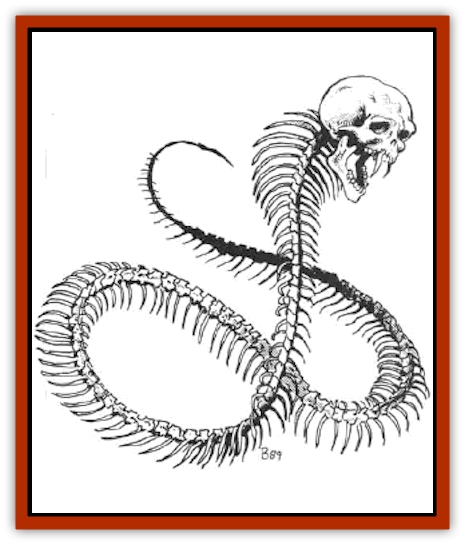

# Golem - Necrophidius

| Statistic | **Golem, Necrophidius** |
| --- | --- |
| **Activity Cycle:** | Any |
| **Alignment:** | Neutral |
| **Armor Class:** | 2 |
| **Climate/Terrain:** | Any/Land |
| **Damage/Attack:** | 1-8 |
| **Diet:** | None |
| **Frequency:** | Very rare |
| **Hit Dice:** | 2 |
| **Intelligence:** | Average (10) |
| **Magic Resistance:** | Nil |
| **Morale:** | Fearless (19-20) |
| **Movement:** | 9 |
| **No. Appearing:** | 1 |
| **No. of Attacks:** | 1 |
| **Organization:** | Solitary |
| **Size:** | L (12' long) |
| **Special Attacks:** | Paralyzation and see below |
| **Special Defenses:** | Immune to poison and see below |
| **THAC0:** | 19 |
| **Treasure:** | Nil |
| **XP Value:** | 270 |

The [[Golem_V|necrophidius]], called the "death worm" by some, is an artificial creature, built and animated by a wizard or priest for a single task, such as protecting a particular treasure or assassinating a specific target.

The necrophidius resembles a bleached-white skeleton of a [[Snake|giant snake]], topped by a fanged human skull with constantly whirling, milk-white eyes. The death worm's bones are warm to the touch. The necrophidius is nearly undetectable to most senses. It is absolutely silent; it may open a door and cause the hinges to creak, but it makes no noise whatsoever even when slithering across a floor strewn with leaves. The necrophidius has no odor. The necrophidius keeps up a constant motion, moving with a macabre grace.

**Combat:** Whenever possible, the necrophidius attacks with surprise. The creature's silence imposes a -2 penalty to its opponents' surprise rolls. If it is not itself surprised, it executes a movement commonly referred to as the Dance of Death, a hypnotic swaying, backed by minor magical effects. The Dance of Death rivets the attention of any victim observing the necrophidius, unless he rolls a successful saving throw vs. spell. In this condition, an intelligent opponent is unable to make any action, as per the effects of the *hypnotism* spell. This enables the necrophidius to advance and attack without opposition.

Its bite causes 1d8 points of damage and requires another saving throw vs. spell. A character who fails this saving throw is paralyzed for 1d4 turns. This effect is magical, and while a *dispel magic* would end its effects, a *neutralize poison* would not. The victim is not conscious during the paralysis.

The intelligence of a necrophidius is magically imbued; the monster does not have a real mind. As such, mind-influencing spells, such as *sleep* or *cause fear*, have no effect on a necrophidius. It is not alive in any sense of the word, and poisons have no effect upon it. It does not require sleep or any sustenance. Despite a number of characteristics to the contrary, a necrophidius is not an undead creature and cannot be turned.

**Habitat/Society:** A necrophidius is created for a single purpose. It may be created in one of three ways. The first is via a magical tome, akin to a *manual of [[Golem_General_Information|golems]]* can provide secrets of the necrophidius's construction (the Necrophidicon, as it is sometimes called, must be burnt to ashes, which provides the animating force for the monster). Alternatively, a wizard can create a necrophidius by his own means. This process is long and complex, and requires that the wizard be able to cast *limited wish*, *geas*, and *charm person* spells. The third method enables a high-level priest of some Powers to build a necrophidius. Again, the method is long and tedious. It requires the spells *quest*, *neutralize poison*, *prayer*, *silence*, and *snake charm*. Whichever method is used, the monster requires the complete skeleton of a giant snake (either poisonous or constrictor) slain within 24 hours of the enchantment's commencement. The construction takes 500 gold pieces worth of herbs and ointments per hit point of the necrophidius; and ten days are required.

A necrophidius is built for a specific purpose (which must be in the spellcaster's mind when he creates it), such as "Kill Ragnar the Bold" or "Keep the Scepter of Trystom safe on this altar". The necrophidius has a reasonable intelligence, and does not seek to twist the intent of its maker, but its enchantments fade when its task is done or cannot be completed, for example, when it kills Ragnar, or when the owner decides to use the Scepter of Trystom.

The crafter must want the necrophidius to serve its purpose. He could not, for example, build a death worm to "Sneak into the druids hut and steal his staff," if the crafter really intended for the necrophidius to merely provide a distraction. He could not build more than one death worm and assign each of them to kill Ragnar, since he could not imbue in the second death worm a task that he intended the first one to complete. For this reason, necrophidii are almost never seen working as a team.

There are rumors, not well-founded, that there were once methods to make a necrophidius that conformed to all current specifications except that it gained 1 Hit Die every century it was pursuing its purpose.

**Ecology:** The necrophidius does not eat, nor does it provide any useful ecological function. It is effectively outside the ecosystem around it.

---
## Discovery & Documentation

**Source Publication:** MC5 Greyhawk Appendix (1989)
**Campaign Setting:** Advanced Dungeons & Dragons 2nd Edition
**Author(s):** Grant Boucher, William W. Connors, Steve Gilbert, Bruce Nesmith, Chris Mortika, Skip Williams

### Other Creatures Found in This Source Book
   * [[Aspis|Aspis]]
   * [[Beastman|Beastman]]
   * [[Bonesnapper|Bonesnapper]]
   * [[Booka|Booka]]
   * [[Brownie_Buckawn|Brownie, Buckawn]]
   * [[Brownie_Quickling|Brownie, Quickling]]
   * [[Crystalmist|Crystalmist]]
   * [[Dragon_Cloud|Dragon, Cloud]]
   * [[Dragon_Oerth_Greyhawk|Dragon (Oerth), Greyhawk]]
   * [[Dragonfly_Giant|Dragonfly, Giant]]
   * [[Dragonnel|Dragonnel]]
   * [[Elf_Grugach|Elf, Grugach]]
   * [[Elf_Valley|Elf, Valley]]
   * [[Grell_Wild|Grell, Wild]]
   * [[Grung|Grung]]
   * [[Hobgoblin_Norker|Hobgoblin, Norker]]
   * [[Hook_Horror|Hook Horror]]
   * [[Horgar|Horgar]]
   * [[Hound_Yeth|Hound, Yeth]]
   * [[Iguana_Giant|Iguana, Giant]]
   * [[Ingundi|Ingundi]]
   * [[Kech|Kech]]
   * [[Kyuss_Son_of|Kyuss, Son of]]
   * [[Mite|Mite]]
   * [[Needleman|Needleman]]
   * [[Plant_Carnivorous_Oerth|Plant, Carnivorous (Oerth)]]
   * [[Plant_Carnivorous_Vampire_Cactus|Plant, Carnivorous, Vampire Cactus]]
   * [[Plasmoid_General_Information|Plasmoid, General Information]]
   * [[Rat_Oerth|Rat (Oerth)]]
   * [[Raven_Crow|Raven/Crow]]
   * [[Scarecrow|Scarecrow]]
   * [[Shadow_Slow|Shadow, Slow]]
   * [[Skulk|Skulk]]
   * [[Snail|Snail]]
   * [[Sprite|Sprite]]
   * [[Taer|Taer]]
   * [[Tentamort|Tentamort]]
   * [[Turtle_Giant|Turtle, Giant]]
   * [[Tyrg|Tyrg]]
   * [[Wolf_Mist|Wolf, Mist]]
   * [[Wraith_Oerth|Wraith (Oerth)]]
   * [[Zygom|Zygom]]
