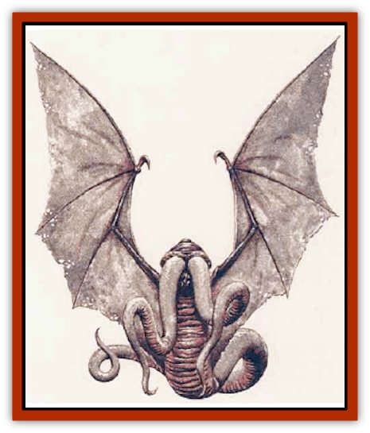

# Golem - Phantom Flyer

| Statistic | **Golem, Phantom Flyer** |
| --- | --- |
| **Activity Cycle:** | Night |
| **Alignment:** | Neutral |
| **Armor Class:** | 6 |
| **Climate/Terrain:** | Any |
| **Damage/Attack:** | 2d8/2d8 |
| **Diet:** | None |
| **Frequency:** | Very rare |
| **Hit Dice:** | 9 |
| **Intelligence:** | High (13-14) |
| **Magic Resistance:** | See below |
| **Morale:** | Fearless (19) |
| **Movement:** | 3, F124 (C) |
| **No. Appearing:** | 1 |
| **No. of Attacks:** | 2 |
| **Organization:** | Solitary |
| **Size:** | H (18' wingspan; see below) |
| **Special Attacks:** | See below |
| **Special Defenses:** | See below |
| **THAC0:** | 11 (50 hit points) |
| **Treasure:** | Nil |
| **XP Value:** | 8,000 |

This magical creation offers swift and discreet service in the realms of the night. It can hide from prying eyes during the day until the disappearance of the hateful light. The shadowy, shimmering beast has a wingspan of 20 feet and two tentacles of a similar length. In fact, when it can be seen, it appears only as two wings, a horselike back, and two black tentacles. This [[Golem_General_Information|golem]] flies silently, as swiftly as most [[Dragon_General_Information|dragons]], and it can carry two fully-equipped man-sized creatures on its back. If need arises, the phantom flyer can lift a draft horse in its tentacles, or it can carry messages and retrieve property or people. The master of the golem always has a magical silver whistle with which the golem is summoned and controlled.

**Combat:** The phantom flyer is comfortable only in darkness; in torchlight or less, it is 90% undetectable. During the daylight, the flyer must remain hidden. A shadow of any size can conceal the phantom flyer, whether on the ground or under an object. If noticed in this form, the flyer seems to be a particularly dark shadow. While hiding in shadows this way, it can neither attack nor fly, but it can flow thxough existing shadows at its flying rate as long as an uninterrupted path exists. Only *truesight* reveals the golem in this form, but if magic is detected for in its area, a faint dweomer is evident.

The phantom flyer has the strength of an [[Golem_I_Greater_Golem|iron golem]]. It has two tentacles, with which it can attack each round. Each tentacle inflicts 2d8 points of damage.

Any type of *light* spell successfully cast onto this golem pinpoints its position. Fire- or cold-based spells do no harm. A +3 or better magical weapon is required to damage this creation. A *darkness* spell cast upon the golem restores 1d8 hit points of damage; a *continual darkness*, 2d8+1 points.

**Habitat/Society:** Its rapid flight and ability to hide make the phantom flyer an excellent carrier of messages. They also are quite useful spies. For example, a wizard sends a phantom flyer out to spy on an adventuring party. It hides in the shadow od a war horse and overhears all the party's conversation during the day. At nightfall, the wizard blows the whistle and the phantom flyer flies back and repeats the conversation verbatim. The wizard either can use the phantom flyer to transport himself to the scene or tell it to go and fetch a party member to the wizard's black tower for who knows what eldritch ends.

The flyer is controlled by whoever possesses its silver whistle, which shows a faint dweomer. If the whistle is lost, the flyer will simply lurk in a shadow nearby until someone finds and sounds the whistle. While so lurking, the golem takes no action except to destroy light sources. As long as the whistle exists, the phantom flyer is the devoted servant of its master. Should the whistle be destroyed, the phantom flyer will fly off to the Demiplane of Shadow.

**Ecology:** As an artificial construct, the phantom flyer exists only to sewe its master. Its essence comes from the Demiplane of Shadow; it is not known what form, if any, its animating force takes there.

This golem requires three months of construction time by a wizard of 18th or higher level; it costs 90,000 gold pieces. The creating wizard needs two large mirrors, enough molten silver to fill a large chalice, the pinions of a [[Tanar'ri_True_Vrock|vrock]] ([[Tanar'ri_General_Information|tanar'ri]]), and enough fresh spider silk to cover the pinions twice. The wizard must set the mirrors exactly eleven paces apart, facing each other squarely, The pinions and the silk are placed between the mirrors, with the chalice of molten silver directly before, the wing materials. Onto this area, the wizard casts continual darkness, Evard's black tentacles, forget, fly, wish, disintegrate, and geas. What will be left is the mere reflection of a creature, the victory of imagination over solidity; that, and the silver whistle that controls it.

---
## Discovery & Documentation

**Source Publication:** Monstrous Compendium, 1995 Annual, Volume 2 (1995)
**Campaign Setting:** Advanced Dungeons & Dragons 2nd Edition
**Author(s):** Jon Pickens

### Other Creatures Found in This Source Book
   * [[Aboleth_Savant|Aboleth, Savant]]
   * [[Addazahr|Addazahr]]
   * [[Amiq_Rasol|Amiq Rasol]]
   * [[Arch-Shadow|Arch-Shadow]]
   * [[Automaton_Scaladar|Automaton, Scaladar]]
   * [[Automaton_Trobriand's|Automaton, Trobriand's]]
   * [[Bat_Sporebat|Bat, Sporebat]]
   * [[Beetle_Dragon|Beetle, Dragon]]
   * [[Bi-nou|Bi-nou]]
   * [[Boggle|Boggle]]
   * [[Brownie_Dobie|Brownie, Dobie]]
   * [[Brownie_Quickling|Brownie, Quickling]]
   * [[Cat_Crypt|Cat, Crypt]]
   * [[Cat_Great_Cath_Shee|Cat, Great, Cath Shee]]
   * [[Centaur-kin_Dorvesh|Centaur-kin, Dorvesh]]
   * [[Centaur-kin_Gnoat|Centaur-kin, Gnoat]]
   * [[Centaur-kin_Ha'pony|Centaur-kin, Ha'pony]]
   * [[Centaur-kin_Zebranaur|Centaur-kin, Zebranaur]]
   * [[Chronolily|Chronolily]]
   * [[Curst|Curst]]
   * [[Darktentacles|Darktentacles]]
   * [[Dinosaur_Aquatic|Dinosaur, Aquatic]]
   * [[Dinosaur_II|Dinosaur II]]
   * [[Dinosaur_III|Dinosaur III]]
   * [[Doppelganger_Greater|Doppelganger, Greater]]
   * [[Dragon_Brine|Dragon, Brine]]
   * [[Dragon_Half-|Dragon, Half-]]
   * [[Dragon-kin_Sea_Wyrm|Dragon-kin, Sea Wyrm]]
   * [[Dwarf_Wild|Dwarf, Wild]]
   * [[Ekimmu|Ekimmu]]
   * [[Elemental_Nature|Elemental, Nature]]
   * [[Elf_Winged|Elf, Winged]]
   * [[Fish_Great_Glacier|Fish (Great Glacier)]]
   * [[Fish_Subterranean|Fish, Subterranean]]
   * [[Fish_Toril|Fish (Toril)]]
   * [[Flareater|Flareater]]
   * [[Flumph|Flumph]]
   * [[Froghemoth|Froghemoth]]
   * [[Ghost_Casurua|Ghost, Casurua]]
   * [[Ghost_Ker|Ghost, Ker]]
   * [[Ghul|Ghul]]
   * [[Ghul-Kin|Ghul-Kin]]
   * [[Giant_Half-giant|Giant, Half-giant]]
   * [[Golem_Burning_Man|Golem, Burning Man]]
   * [[Gulguthhydra|Gulguthhydra]]
   * [[Hakeashar|Hakeashar]]
   * [[Horse_Moon-|Horse, Moon-]]
   * [[Human_Dragonslayer|Human, Dragonslayer]]
   * [[Human_Vistana|Human, Vistana]]
   * [[Jellyfish_Giant|Jellyfish, Giant]]
   * [[Kalin|Kalin]]
   * [[Kholiathra|Kholiathra]]
   * [[Laerti|Laerti]]
   * [[Leucrotta_Greater|Leucrotta, Greater]]
   * [[Lich_Suel|Lich, Suel]]
   * [[Lurker_Shadow|Lurker, Shadow]]
   * [[Lycanthrope_Werepanther|Lycanthrope, Werepanther]]
   * [[Lycanthrope_Wereshark|Lycanthrope, Wereshark]]
   * [[Mammal_Herd_II|Mammal, Herd II]]
   * [[Marl|Marl]]
   * [[Meenlock|Meenlock]]
   * [[Mimic_Greater|Mimic, Greater]]
   * [[Mold_II|Mold II]]
   * [[Mummy_Creature|Mummy, Creature]]
   * [[Nyth|Nyth]]
   * [[Ooze_Slime_Jelly_Ghaunadan|Ooze/Slime/Jelly, Ghaunadan]]
   * [[Palimpsest|Palimpsest]]
   * [[Peltast|Peltast]]
   * [[Plant_Dangerous_II|Plant, Dangerous II]]
   * [[Pleistocene_Animal|Pleistocene Animal]]
   * [[Pudding_Subterranean|Pudding, Subterranean]]
   * [[Raggamoffyn|Raggamoffyn]]
   * [[Snake_Serpent|Snake, Serpent]]
   * [[Snake_Serpent_Vine|Snake, Serpent Vine]]
   * [[Sphinx_Draco-|Sphinx, Draco-]]
   * [[Sprite_Seelie_Faerie|Sprite, Seelie Faerie]]
   * [[Sprite_Unseelie_Faerie|Sprite, Unseelie Faerie]]
   * [[Squealer|Squealer]]
   * [[Turtle_Giant|Turtle, Giant]]
   * [[Umpleby|Umpleby]]
   * [[Vizier's_Turban|Vizier's Turban]]
   * [[Wall_Walker|Wall Walker]]
   * [[Webbird|Webbird]]
   * [[Yak-Man|Yak-Man]]
   * [[Zorbo|Zorbo]]
