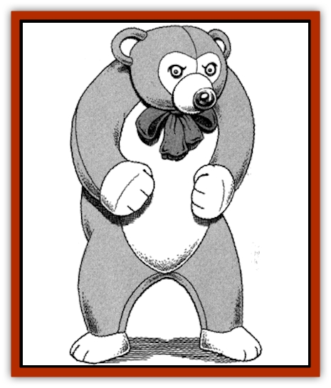
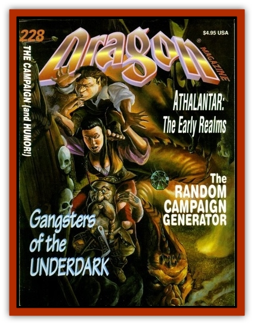

# Golem - Plush

| Statistic | **Golem, Plush** |
| --- | --- |
| **Activity Cycle:** | Any |
| **Alignment:** | Neutral |
| **Armor Class:** | 10 |
| **Climate/Terrain:** | Any |
| **Damage/Attack:** | 1d2/1d2 |
| **Diet:** | None |
| **Frequency:** | Rare |
| **Hit Dice:** | 5 |
| **Intelligence:** | Non- (0) |
| **Magic Resistance:** | Nil |
| **Morale:** | Fearless (19) |
| **Movement:** | 9 |
| **No. Appearing:** | 1 |
| **No. of Attacks:** | 2 |
| **Organization:** | Solitary |
| **Size:** | L (6' tall) |
| **Special Attacks:** | Nil |
| **Special Defenses:** | Surprise |
| **THAC0:** | 15 |
| **Treasure:** | Nil |
| **XP Value:** | 650 |

Plush [[Golem_General_Information|golems]] are every parents nightmare. They are typically given as gifts to young children, usually by obnoxious aunts or uncles. Plush golems seem like ordinary stuffed animals at first, but eventually reveal their animated state of being to the children who own them. As the children treat their toy animals more and more like live creatures, the parents' frustration increases as the child insists that the toy be allowed to eat at the dinner table, go along on outings, and take part in other family activities to the nuisance of everyone.

Plush golems are finely crafted stuffed animals and may be made of velvet, cotton, or wool. They are usually stuffed with cotton batting, but are sometimes partly filled with dried beans. They may be created in realistic colors to represent a real bear, panda, lion, or tiger, or they may be fabricated into fantastic creatures such as pink elephants, purple rabbits, or lime green monkeys.

Of particular note are plush golems in the form of a large purple-and-green dinosaur. For some unknown reason, these have been seen in great numbers in recent years, and have an affect of aversion and fear in individuals over 12 years of age. Upon viewing such a creature, persons over 12 must roll a saving throw vs. paralyzation or be struck dumb for 2 rounds.

Also of note are plush golems in the form of a small striped [[Cat_Great|tiger]]. These are far more rare than the purple dinosaurs. Children who receive the tigers as gifts suddenly seem to find themselves in more trouble with their parents than normal, find that no amount of cleaning will keep their bedrooms neat, and that they have trouble concentrating on schoolwork.

**Combat:** Plush golems never attack individuals under 16 years of age. They attack only when provoked or when the children of the household are threatened. They gain the element of surprise, since most adults never suspect the possibility of the creature's animation. Although they are weak in combat, they often provide enough distraction for a child to escape a dangerous situation.

These creatures are immune to *sleep*, *hold*, *paralysis*, and cold-based spells. They are immune to heat-based spells but suffer normal damage from fire-based spells. Plush golems suffer only half damage from bludgeoning weapons. They instinctively react to the commands of the children who receive them as gifts.

**Ecology:** Like all golems, the plush golem is a manufactured creature and has no place in nature. They are created only through magical means.

A priest of at least 11th level can create a plush golem through extensive ritual, preparation of the stuffed figure, and use of the following spells: *prayer*, *commune*, and *animate object*.

A wizard of at least 14th level must cast *fabricate*, *geas*, and *limited wish* following the construction of the stuffed figure and extensive preparatory rituals.

---
## Discovery & Documentation

**Source Publication:** Dragon228 (1996)
**Campaign Setting:** Dragon Magazine
**Author(s):** 

### Other Creatures Found in This Source Book
   * [[Golem_Chia|Golem, Chia]]
   * [[Golem_Chocolate|Golem, Chocolate]]
