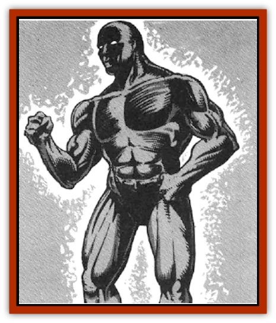

# Golem - Radiant

| Statistic | **Golem, Radiant** |
| --- | --- |
| **Activity Cycle:** | Any |
| **Alignment:** | Neutral (good) |
| **Armor Class:** | 1 |
| **Climate/Terrain:** | Any |
| **Damage/Attack:** | 6-60 |
| **Diet:** | None |
| **Frequency:** | Unique |
| **Hit Dice:** | 20 (90 hp) |
| **Intelligence:** | Low (5-7) |
| **Magic Resistance:** | See below |
| **Morale:** | Fearless (19-20) |
| **Movement:** | 6 |
| **No. Appearing:** | 1 |
| **No. of Attacks:** | 1 |
| **Organization:** | Solitary |
| **Size:** | L (15' tall) |
| **Special Attacks:** | Death aura |
| **Special Defenses:** | See below |
| **THAC0:** | 5 |
| **Treasure:** | Nil |
| **XP Value:** | Special |

The radiant [[Golem_General_Information|golem]] is a unique creature that some claim is as old as the races of [[Elf|elves]], [[Gnome|gnomes]], and [[Dwarf|dwarves]].

In physical appearance, the radiant golem looks much like an [[Golem_I_Greater_Golem|iron golem]]. It stands somewhat taller, reaching a height of 15 feet and weighing roughly 6,000 pounds. It has been formed in the image of a powerfully built man with eyes that burn with a cool, blue light. The black body of the creature scintillates with an azure aura that fills the area around the creature with a smell of summer lightning.

The radiant golem is able to speak with almost any creature it meets via an innate telepathic power. This ability transcends linguistic barriers and falters only when the golem is attempting to communicate with truly unusual creatures, such as [[Cloaker|cloakers]] or [[Clockwork_Horror|clockwork horrors]].

**Combat:** The radiant golem is even more deadly than its iron cousins. Were it not for the fact that the creature abhors violence in any form, it would certainly be among the most deadly monsters known in any crystal sphere.

In melee, a single blow from its mighty fist inflicts 6d10 points of damage. For the purposes of lifting and breaking objects, the radiant golem has a Strength of 25. The creature is immune to all weapons of less than +4 enchantment.

In addition, this golem radiates a magical *death aura*. All beings who spend at least one hour of any 24-hour period within ten yards of the golem must roll a saving throw vs. death magic. If they fail, they suffer a permanent loss of 1d6 hit points. No magic short of a wish can restore these lost hit points. The saving throw (and hit point reduction) occur at the end of the 24-hour period in question. The golem cannot turn this power off.

Magical attacks that are based on electricity cause no damage to the radiant golem, but they do *slow* it for one or two rounds. All other magical attacks are ignored, save for those of a fire- or heat-based nature, which restore 1 hit point to the creature for every die of damage they would normally inflict.

Whenever the radiant golem takes damage from an attack, it tries to flee the area. If retreat is impossible. it turns and attacks. While engaged in melee, it repeatedly offers its foes the chance to break off hostilities.

The radiant golem automatically regenerates 1d10 lost hit points at the end of any round.

One can best understand the radiant golem if one thinks of it as an orphan. Long ago, an unknown race created the mysterious creature in an attempt to improve upon the existing iron golems. They used a unique ore rotund on a lifeless asteroid to fashion the thing's body and wove magical spells never before crafted to breathe life into it.

Unlike iron golems, the radiant golem has intelligence. While it is certainly not an intellectual giant, it is fully self-aware and able to reason and imagine. Its creators found that the creature was not useful as a guardian or warrior, because it would never take action to harm another creature. By the time they had learned about the golem's gentle and friendly nature, however, they had fallen victim to another unexpected power - the death aura.

Since that time, the radiant golem has drifted from crystal sphere to crystal sphere in an attempt to find friends. It longs to have companions who do not flee from it or succumb to its deadly presence. As such, it often latches onto parties of adventurers and tries to join their ranks. The golem is helpful to such companions, offering advice, lifting heavy weights, and doing everything a servant might do to make their lives easier (but shorter).

The golem does not know about its death aura, and it will not understand or believe in the aura if told of its existence. Aware that it is almost immortal, the golem simply assumes that living things die very quickly. In fact, the golem often bemoans the fact that fate has made mortals so fragile. All it wants, as it will tell adventureres, is a friend.

**Ecology:** The radiant golem's death aura affects not only animal life, but plant life as well. In cases where the golem has set up a home for itself and spent a good deal of time in one area, the entire region is likely to become barren and lifeless. The aura does not affect unliving material, like stone and metal, or once living matter (like a wooden cart) in any way.

---
## Discovery & Documentation

**Source Publication:** MC7 Spelljammer Appendix I (1990)
**Campaign Setting:** Advanced Dungeons & Dragons 2nd Edition
**Author(s):** various

### Other Creatures Found in This Source Book
   * [[Aartuk|Aartuk]]
   * [[Albari|Albari]]
   * [[Ancient_Mariner|Ancient Mariner]]
   * [[Argos|Argos]]
   * [[Beholder_Abomination_Astereater|Beholder (Abomination), Astereater]]
   * [[Blazozoid|Blazozoid]]
   * [[Chattur|Chattur]]
   * [[Chevall|Chevall]]
   * [[Clockwork_Horror|Clockwork Horror]]
   * [[Colossus|Colossus]]
   * [[Delphinid|Delphinid]]
   * [[Dizantar|Dizantar]]
   * [[Dog|Dog]]
   * [[Dog_Bog_Hound|Dog, Bog Hound]]
   * [[Esthetic|Esthetic]]
   * [[Focoid|Focoid]]
   * [[Fractine|Fractine]]
   * [[Giant_Spacesea|Giant, Spacesea]]
   * [[Golem_Furnace|Golem, Furnace]]
   * [[Gravislayer|Gravislayer]]
   * [[Grommam|Grommam]]
   * [[Hadozee|Hadozee]]
   * [[Hamster_Giant_Space|Hamster, Giant Space]]
   * [[Jammer_Leech|Jammer Leech]]
   * [[Lakshu|Lakshu]]
   * [[Lumineaux|Lumineaux]]
   * [[Lutum|Lutum]]
   * [[Mimic_Space|Mimic, Space]]
   * [[Misi|Misi]]
   * [[Moon_Rogue|Moon, Rogue]]
   * [[Mortiss|Mortiss]]
   * [[Murderoid|Murderoid]]
   * [[Nay-Churr|Nay-Churr]]
   * [[Phlog-Crawler|Phlog-Crawler]]
   * [[Plasman|Plasman]]
   * [[Plasmoid_DeGleash|Plasmoid, DeGleash]]
   * [[Plasmoid_DelNoric|Plasmoid, DelNoric]]
   * [[Plasmoid_General_Information|Plasmoid, General Information]]
   * [[Plasmoid_Ontalak|Plasmoid, Ontalak]]
   * [[Puffer|Puffer]]
   * [[Q'nidar|Q'nidar]]
   * [[Rastipede|Rastipede]]
   * [[Reigar|Reigar]]
   * [[Rock_Hopper|Rock Hopper]]
   * [[Slinker|Slinker]]
   * [[Spider_Asteroid|Spider, Asteroid]]
   * [[Spiritjam|Spiritjam]]
   * [[Survivor|Survivor]]
   * [[Syllix|Syllix]]
   * [[Symbiont_Power|Symbiont, Power]]
   * [[Vine_Infinity|Vine, Infinity]]
   * [[Wiggle|Wiggle]]
   * [[Wizshade|Wizshade]]
   * [[Wryback|Wryback]]
   * [[Zard|Zard]]
   * [[Zodar|Zodar]]
