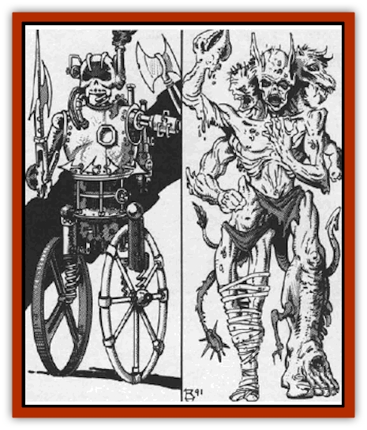

# Golem - Ravenloft

| Statistic | **Mechanical** | **Zombie** |
| --- | --- | --- |
| **Activity Cycle:** | Any | Any |
| **Alignment:** | Neutral | Neutral |
| **Armor Class:** | -2 | 2 |
| **Climate/Terrain:** | Any | Any |
| **Damage/Attack:** | 4d10 | 3d6/3d6 |
| **Diet:** | Nil | Nil |
| **Frequency:** | Very rare | Very rare |
| **Hit Dice:** | 13 (75 hp) | 18 (60 hp) |
| **Intelligence:** | Non- (0) | Non- (0) |
| **Magic Resistance:** | Nil | Nil |
| **Morale:** | Fearless (20) | Fearless (20) |
| **Movement:** | 12 | 6 |
| **No. Appearing:** | 1 | 1 |
| **No. of Attacks:** | 1 | 2 |
| **Organization:** | Solitary | Solitary |
| **Size:** | M (7' tall) | M (6' tall) |
| **Special Attacks:** | See below | See below |
| **Special Defenses:** | See below | See below |
| **THAC0:** | 7 | 4 |
| **Treasure:** | Nil | Nil |
| **XP Value:** | 15,000 | 17,000 |

## Mechanical Golem

The mechanical [[Golem_General_Information|golem]] is a nightmare combination of magic and technology first woven together in the mind of a madman. They come in many sizes, but are generally man-like in shape. In most cases, they have some manner of melee weapon built onto one of their arms.

A mechanical [[Golem_Ravenloft_General_Information|golem]] moves with a variety of whirs, clicks, and other mechanical sounds. It occasionally releases a hissing sound and a cloud of steam. Despite the creature's jury rigged appearance, however, it is a smoothly functioning and deadly machine.

**Combat:** In melee combat, the mechanical golem attacks with whatever weapon has been built into it. In most cases, this weapon inflicts 4d10 points of damage, although examples of these creatures capable of inflicting greater or lesser injuries have been found.

When the golem's weapon strikes an enemy with a natural attack roll of 20, it delivers a powerful electrical shock. This attack inflicts an additional |6 points of damage (half that if a save versus spells is made). The victim of this attack is entitled to a saving throw versus paralysis to avoid being incapacitated for 2d4 rounds due to the effects of the electrical current on his muscles.

Anyone attacking the mechanical golem with a metal weapon (whether or not it is capable of harming the golem) suffers the same electrical attack if they roll a natural 20 on their attack dice. The same saving throw vs. paralysis is required to avoid incapacitation as well.

On every other combat round, the golem can engage its lightning aura. This field causes all those within 20 feet of the creature to be hit with small lightning bolts that inflict 3d6 points of damage. Saving throws vs. breath weapons are allowed for half damage and no paralysis is inflicted by this attack. Exposed items carried by anyone struck by the lightning aura must save vs. lightning or be destroyed.

## Zombie Golem

First created by Azalin from information he gleaned while in the employ of Strahd von Zarovich of Barovia, these foul creatures look much like [[Golem_II_Lesser_Golem|flesh golems]]. Unlike those traditional golems, however, these creatures are composed of rotting body parts and carry the stench of death about them wherever they go.

Unlike flesh golems which are able to emit a guttural roar when they engage in combat, zombie golems are utterly silent. They move slowly and without thought, attacking in a lackluster manner that has been retained from their undead status.

**Combat:** The zombie golem attacks with its powerful fists. In any round two separate attacks may be made that will inflict 3d6 points of damage each. Because of the creature's slow movements, however, it always arts last in any given combat round with no initiative check being required. Further, the zombie golem never attains surprise.

The odor of decay and corruption that surrounds a zombie golem is so strong that it causes all those who move within 30 feet of it to save vs. poison or be overcome with nausea. Such individuals suffer a -2 penalty on all attack rolls and saving throws while within the area of the stench. Characters who make their saving throws are unaffected unless they move outside of the area and then re-enter it (in which case they must make another save).

Zombie golems are immune to most magical spells, although a *resurrection* spell will instantly slay them. On the other hand, an *animate dead* spell will restore them to full hit points as if it were some manner of healing magic.

---
## Discovery & Documentation

**Source Publication:** MC10 Ravenloft Appendix I (1989)
**Campaign Setting:** Planescape
**Author(s):** William W. Connors

### Other Creatures Found in This Source Book
   * [[Bastellus|Bastellus]]
   * [[Bat_Ravenloft|Bat (Ravenloft)]]
   * [[Bowlyn|Bowlyn]]
   * [[Broken_One|Broken One]]
   * [[Bussengeist|Bussengeist]]
   * [[Darkling|Darkling]]
   * [[Doom_Guard|Doom Guard]]
   * [[Doppelganger_Plant|Doppelganger Plant]]
   * [[Elemental_Ravenloft|Elemental (Ravenloft)]]
   * [[Ermordenung|Ermordenung]]
   * [[Ghoul_Lord|Ghoul Lord]]
   * [[Goblyn|Goblyn]]
   * [[Golem_III|Golem III]]
   * [[Golem_IV|Golem IV]]
   * [[Grim_Reaper|Grim Reaper]]
   * [[Human_Abber_Nomad|Human, Abber Nomad]]
   * [[Human_Ravenloft|Human (Ravenloft)]]
   * [[Imp_Assassin|Imp, Assassin]]
   * [[Impersonator|Impersonator]]
   * [[Lycanthrope_Werebat|Lycanthrope, Werebat]]
   * [[Lycanthrope_Wereraven|Lycanthrope, Wereraven]]
   * [[Mist_Horror|Mist Horror]]
   * [[Mummy_Greater|Mummy, Greater]]
   * [[Quevari|Quevari]]
   * [[Quickwood|Quickwood]]
   * [[Ravenkin|Ravenkin]]
   * [[Reaver|Reaver]]
   * [[Scarecrow_Ravenloft|Scarecrow (Ravenloft)]]
   * [[Shadow_Fiend|Shadow Fiend]]
   * [[Skeleton_Giant|Skeleton, Giant]]
   * [[Strahd's_Skeletal_Steed|Strahd's Skeletal Steed]]
   * [[Treant_Evil|Treant, Evil]]
   * [[Treant_Undead|Treant, Undead]]
   * [[Valpurgeist|Valpurgeist]]
   * [[Vampire_Dwarf|Vampire, Dwarf]]
   * [[Vampire_Elf|Vampire, Elf]]
   * [[Vampire_Gnome|Vampire, Gnome]]
   * [[Vampire_Halfling|Vampire, Halfling]]
   * [[Vampire_General_Information|Vampire, General Information]]
   * [[Vampire_Kender|Vampire, Kender]]
   * [[Vampyre|Vampyre]]
   * [[Widow_Red|Widow, Red]]
   * [[Wolfwere_Greater|Wolfwere, Greater]]
   * [[Zombie_Lord|Zombie Lord]]
