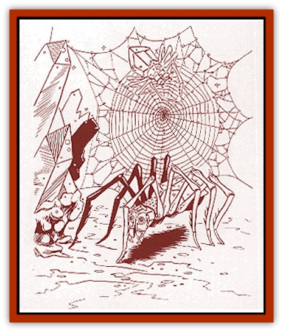

# Golem - Savage Coast

| Statistic | **Aelder (lesser golem)** | **Glassine Horror (lesser golem)** | **Golem, Red (greater golem)** | **Juggernaut, Hulean (greater golem)** |
| --- | --- | --- | --- | --- |
| **Activity Cycle:** | Any | Any | Any | Any |
| **Alignment:** | Neutral | Lawful neutral | Neutral | Neutral |
| **Armor Class:** | 3 | 2 | 1 | 0 |
| **Climate/Terrain:** | Mountains | Any | Any | Any settled |
| **Damage/Attack:** | 2d6/2d6 | 2d10 | 2d12/2d12 | 10d10 |
| **Diet:** | None | None | None | None |
| **Frequency:** | Rare | Very rare | Very rare | Very rare |
| **Hit Dice:** | 9 (60 hp) | 8 (60 hp) | 18 (90 hp) | 30 (150 hp) |
| **Intelligence:** | Low (5-7) | Very (11-12) | Semi- (2-4) | Semi- (2-4) |
| **Magic Resistance:** | Nil | Nil | Nil | Nil |
| **Morale:** | Fearless (19-20) | Average (8-10) | Fearless (19-20) | Elite (13-14) |
| **Movement:** | 18 | 9, Fl 36 | 6 | 9 |
| **No. Appearing:** | 2 | 1 (1d6) | 1 | 1 |
| **No. of Attacks:** | 2 | 1 | 2 | 1 |
| **Organization:** | Solitary | Solitary | Solitary | Solitary |
| **Size:** | L (8' tall) | H (see below) | L (12' tall) | G (30'&times;40'&times;40') |
| **Special Attacks:** | Spells | Blinding, spells | Depletes cinnabryl | Crush |
| **Special Defenses:** | Near invisibility, spell immunities | See below | Need +2 weapon to hit, spell immunities | Spell immunities, special saves |
| **THAC0:** | 11 | 13 | 3 | Special |
| **Treasure:** | Nil | Q(&times;4) | Nil | A (+) |
| **XP Value:** | 2,000 | 4,000 | 14,000 | 21,000 |

The Savage Coast offers some unique variations on the standard [[Golem_General_Information|golem]] design, in both form and material. Standard golems are slowly giving way to the new forms.

## 

Aelder

The [[Ee'aar|ee'aar]] build these glassteel golems for the express purpose of guarding sacred burial places up in the high mountains. Only ee'aar priests can create them, and they are always constructed in pairs.

An aelder golem can be created in any of a dozen different forms - including a [[Spider|spider]], [[Centaur|centaur]], serpent, and [[Gargoyle_I|gargoyle]]. The most common form chosen is a tall, slender spider. The eight segmented legs of this aelder rise 10 feet from the ground before slanting back down three feet to support the multifaceted body. The two forward legs end in pointed, serrated segments. Two spinnerets extend from the rear of the spider body.

Within the icy mountain reaches where the ee'aar make burial sites, the aelder golem is nearly impossible to see. Ranged attacks beyond 20 feet are impossible, and even up close, all opponents suffer a -2 penalty on anything but melee attacks. An aelder attacks with the end segments of its front legs, which act as piercing weapons and can strike targets up to 10 feet away.

Aelder are immune to any spells or spell effects which employ light or a gaze. These golems can invoke each of the spells *color spray*, *dancing lights*, and *hypnotic pattern* three times per day.

The spider golem can actually spin a web of glassteel, which is either applied thickly for concealment or spun so fine and brittle that it is essentially invisible. Attempting to walk through this web shatters it, alerting the aelder of intruders.

Aelder communicate with the ee'aar through a series of shrieks and screeches translatable only by priests. [[Mythuínn_Folk|Mythu�nn folk]] are allowed to hide in aelder webs from predators, so long as they do not try to venture farther into the burial site.

## Glassine Horror

Another construct of the ee'aar, the glassine horror was an attempt by ee'aar wizards to design a more intelligent golem. They succeeded only too well; the higher Intelligence brought with it a more independent spirit, including an inherent desire for self-preservation.

The glassine horror can assume three different forms. The first, from which it takes its name, is a sheet of crystalline substance with an area between 50 and 100 square feet (thickness varies from 1 to 6 inches). In this inactive state, it rests across a window or doorway until needed or until a trespasser is detected.

The second form is that of a roughly-shaped humanoid figure, approximately 15 feet tall and constructed of a scintillating, gemlike material. As light glistens off the facets, it produces a dazzling effect. All opponents within a 10-foot radius must make a successful saving throw vs. spell or suffer -2 attack penalties. Besides its devastating punch, this form has three magical abilities: *crystalbrittle*; *create sunburst* (as per *wand of illumination*); and *continual light*. In this form, the glassine horror is immune to any spell effects employing light or electricity.

The third form is a whirling cloud of glistening sand. This cloud can move at a speed of 36 but cannot rise more than five feet above any surface. Any creature caught within this 100 cubic-foot cloud (indicated by a successful attack roll) takes 2d8 points of damage and must make a successful saving throw vs. spell or be blinded for 2d4 turns. This form is immune to all "wind" spells.

Though loyal to its master, the glassine horror also possesses the need for self-preservation. It never fights to its destruction, fleeing if it ever falls below 10% of its starting hit points. As a reward for good service, this golem expects to be given gems, which it can use to heal damage. The glassine horror absorbs them, healing 1 hit point per 50 gp worth of gems. Rest also heals the golem.

Glassine horrors, if commanded by the wizard who created them, are encountered in groups of 1d6 golems. However, most are encountered singly, far from the ee'aar lands. A glassine horror whose master dies is considered a free entity, usually leaving the vicinity. These creatures enjoy working as guards and will serve loyally for the price of a few gems. A glassine horror will adopt a new master with the same guidelines as before: It will not let itself be destroyed, and it expects to be rewarded.

## Red Golem

Red golems resemble [[Golem_I_Greater_Golem|iron golems]], but they are made entirely out of *red steel*. Also, these golems are tougher than the iron golem, while weighing only half as much (about 2500 pounds). These golems understand verbal commands and can even differentiate between opponents, attacking the most threatening one first.

A red golem attacks with two heavy punches (which must be aimed at the same opponent as long as that opponent is still standing). Red golems also radiate an aura that depletes *cinnabryl* within a 10-foot radius. The *cinnabryl* is depleted at a rate of one ounce per round, but this aura does not cause victims to enter the Time of Loss or Change. While red golems are immune to nonmagical weapons of less than +2 enchantment, weapons of less than +4 enchantment inflict only half damage. Magical electrical attacks merely *slow* red golems for 1d3 rounds, and magical fire actually heals 1 point of damage for each Hit Die of damage it was supposed to inflict. Red golems are immune to all other spells.

Red golems were also imbued with the ability to *taunt* their opponents (as per the wizard spell). When one of these golems is attacked with a nonmagical weapon or a spell that it is immune to, it uses this skill to mock its foes.

Red golems can also shapechange. A golem implements this ability only at the command of its master. By using this ability, the creature can alter its size and basic appearance. As its master wishes, the red golem can resemble a human or [[Ogre_Half-|demi-ogre]] under a heavy cloak.

## Juggernaut, Hulean

In pursuit of the ultimate war machine, the kingdom of Hule devised this [[Golem_VI_Stone_Variants|juggernaut]]. Only the wizards of Hule know how this construct is given life.

The Hulean juggernaut is a giant stone building built on a platform with huge, iron-banded wheels. Dimensions vary, but it usually stands about 30 feet wide, 40 feet high, and 40 feet long. Battlements and archer slits are both common features, allowing the juggernaut to carry humanoid soldiers and, thereby, increase its deadly power. Many are also affixed with a battering ram.

In combat, the juggernaut simply rolls over its opponents, crushing even small stone buildings beneath it. The battering ram demolishes things too large to simply roll over. The wide wheelbase allows the juggernaut to attack multiple targets at the same time. Anyone caught in front of this leviathan must make a successful saving throw vs. breath weapon to escape to the side or be crushed. Those inside the juggernaut can still attack those who manage to get out of its way. The juggernaut can stop, turn, or reverse in the space of one round, allowing it to attack creatures on any side from one round to the next.

The Hulean juggernaut is immune to magical and normal fire; *sleep*, *charm*, and *hold* spells; and nonmagical weapons. All of its saves succeed on 4 or better. Hulean juggernauts often have treasure inside them (as one of the safest places to store spoils of war), but the creature must be killed in order to gain entry. Only its master can command it to allow entrance.

The juggernaut's dependence on its master remains the weak point in its design. While the construct obeys simple verbal commands (like "defend this area", "attack that fortress", or "destroy that army"), it is still answerable only to its creator. If the juggernaut's master is killed, the creature may continue following its last orders indefinitely. Those inside are trapped, and the juggernaut could even turn on its own army now. Outside of Hule, juggernauts are most commonly found among ruins, waiting for further people and objects to crush.

---
## Discovery & Documentation

**Source Publication:** Monstrous Compendium Savage Coast Appendix (Online Exclusive) (1995)
**Campaign Setting:** Mystara
**Author(s):** Loren L Coleman, Ted James, Thomas Zuvich, Cindi M. Rice

### Other Creatures Found in This Source Book
   * [[Aranea_Savage_Coast|Aranea (Savage Coast)]]
   * [[Arashaeem|Arashaeem]]
   * [[Batracine|Batracine]]
   * [[Cat_Marine|Cat, Marine]]
   * [[Cinnavixen|Cinnavixen]]
   * [[Clockwork_Swordsman|Clockwork Swordsman]]
   * [[Critter_Temple|Critter, Temple]]
   * [[Cursed_One|Cursed One]]
   * [[Deathmare|Deathmare]]
   * [[Dragon_Savage_Coast_Crimson|Dragon (Savage Coast), Crimson]]
   * [[Dragon_Savage_Coast_Red_Hawk|Dragon (Savage Coast), Red Hawk]]
   * [[Echyan|Echyan]]
   * [[Ee'aar|Ee'aar]]
   * [[Enduk|Enduk]]
   * [[Fachan_Savage_Coast|Fachan (Savage Coast)]]
   * [[Feliquine|Feliquine]]
   * [[Fiend_Narvaezan|Fiend, Narvaezan]]
   * [[Frelôn|Frelôn]]
   * [[Ghriest|Ghriest]]
   * [[Glutton_Sea|Glutton, Sea]]
   * [[Goatman|Goatman]]
   * [[Golem_Naâruk|Golem, Naâruk]]
   * [[Grudgling|Grudgling]]
   * [[Heraldic_Servant_I|Heraldic Servant I]]
   * [[Heraldic_Servant_II|Heraldic Servant II]]
   * [[Heraldic_Servant_III|Heraldic Servant III]]
   * [[Heraldic_Servant_IV|Heraldic Servant IV]]
   * [[Heraldic_Servant_V|Heraldic Servant V]]
   * [[Heraldic_Servant_General_Information|Heraldic Servant, General Information]]
   * [[Hermit_Sea|Hermit, Sea]]
   * [[Jorri|Jorri]]
   * [[Juhrion|Juhrion]]
   * [[Kla'a-tah|Kla'a-tah]]
   * [[Leech_Legacy|Leech, Legacy]]
   * [[Lich_Inheritor|Lich, Inheritor]]
   * [[Lizard_Kin_Savage_Coast|Lizard Kin (Savage Coast)]]
   * [[Lupasus|Lupasus]]
   * [[Lupin|Lupin]]
   * [[Lyra_Bird_Saragón|Lyra Bird, Saragón]]
   * [[Malfera|Malfera]]
   * [[Manscorpion_Nimmurian|Manscorpion, Nimmurian]]
   * [[Mythuínn_Folk|Mythuínn Folk]]
   * [[Neshezu|Neshezu]]
   * [[Nikt'oo|Nikt'oo]]
   * [[Nosferatu|Nosferatu]]
   * [[Omm-wa|Omm-wa]]
   * [[Omshirim|Omshirim]]
   * [[Parasite_Savage_Coast|Parasite (Savage Coast)]]
   * [[Phanaton|Phanaton]]
   * [[Plant_Savage_Coast|Plant (Savage Coast)]]
   * [[Pudding_Vermilion|Pudding, Vermilion]]
   * [[Rakasta|Rakasta]]
   * [[Ray_Forest|Ray, Forest]]
   * [[Shedu_Greater_Savage_Coast|Shedu, Greater (Savage Coast)]]
   * [[Shimmerfish|Shimmerfish]]
   * [[Skinwing|Skinwing]]
   * [[Spawn_of_Nimmur|Spawn of Nimmur]]
   * [[Spider-spy|Spider-spy]]
   * [[Spirit_Heroic|Spirit, Heroic]]
   * [[Spirit_Walleran|Spirit, Walleran]]
   * [[Succulus|Succulus]]
   * [[Swampmare|Swampmare]]
   * [[Symbiont_Shadow|Symbiont, Shadow]]
   * [[Tortle|Tortle]]
   * [[Troll_Legacy|Troll, Legacy]]
   * [[Trosip|Trosip]]
   * [[Tyminid|Tyminid]]
   * [[Utukku|Utukku]]
   * [[Voat|Voat]]
   * [[Voat_Herathian|Voat, Herathian]]
   * [[Vulturehound|Vulturehound]]
   * [[Wallara|Wallara]]
   * [[Wurmling|Wurmling]]
   * [[Wynzet|Wynzet]]
   * [[Yeshom|Yeshom]]
   * [[Zombie_Red|Zombie, Red]]
