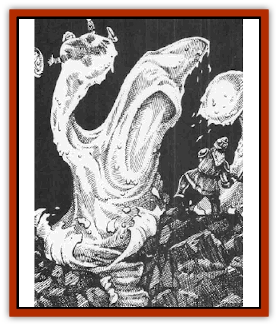

# Golem - Shaboath

| Statistic | **Golem, Shaboath** |
| --- | --- |
| **Activity Cycle:** | Any |
| **Alignment:** | Neutral |
| **Armor Class:** | 3 |
| **Climate/Terrain:** | Aquatic |
| **Damage/Attack:** | 2d10 |
| **Diet:** | None |
| **Frequency:** | Very rare |
| **Hit Dice:** | 11 (50 hp) |
| **Intelligence:** | Non- (0) |
| **Magic Resistance:** | Nil |
| **Morale:** | Fearless (20) |
| **Movement:** | 6, Sw 12 |
| **No. Appearing:** | 1 |
| **No. of Attacks:** | 1 |
| **Organization:** | Solitary |
| **Size:** | L (10' long/wide) |
| **Special Attacks:** | Engulfing, <i>wall of ice</i> |
| **Special Defenses:** | Immune to paralysis, poison, acid, cold, gas, <i>caused</i> wounds; Strength or energy drain; <i>sleep</i>, <i>charm</i>, and <i>hold</i> spells; and water-based creatures, spells, and effects |
| **THAC0:** | 9 |
| **Treasure:** | Nil |
| **XP Value:** | 6,000 |

Shaboath [[Golem_General_Information|golems]] are a unique creation by the Grand [[Aboleth_Savant|Savant Aboleth]] of the city of Shaboath. They are polymorphous watery creatures, not unlike [[Elemental_Fire_Water|water elementals]] in appearance (and are 90% likely to be mistaken for one). They are artificial watery constructs animated by a water elemental spirit, remaining under the control of the Grand Savant or another savant [[Aboleth|aboleth]].

**Combat:** Shaboath golems are always encountered in water or on land within 60 feet of a pool or more sizeable body of water. They attack for 2d10 points of damage with a wavelike pseudopod protrusion from their amorphous hulk. The golem engulfs its target if it rolls either a natural 20 or at least +4 above the minimum required on the attack roll. An engulfed victim automatically suffers 2d10 points of drowning damage per round, minus 1 point of damage per point of Constitution above 12 (minimum damage 2 hp). A target protected by an operative *water breathing* spell or a *necklace of adaptation* will not suffer this damage, but an *airy water* spell provides no protection unless the golem fails its saving throw vs. spell (in which case the entrapped character can breathe normally, although the spell does not harm the golem). Engulfed creatures are subject to attack from the golem in melee, though it usually directs such attacks at other targets. A shaboath golem can engulf up to thirty tiny creatures (size T), ten small creatures (size S), four medium creatures (size M), or one large target (size L). Once per turn, a shaboath golem can create a *wall of ice*; it usually creates a horizontal wall in the air, dropping it on enemies not in water for 3d10 points of damage to each.

Shaboath golems are immune to all Elemental Water effects and cold-based spells, to paralyzation, poisons of all kinds, acid, *caused* wounds, Strength and energy drains, and gaseous attacks. They cannot be *polymorphed* since they are themselves almost formless. Like all golems, they are immune to any form of mind-affecting or mind-controlling spells. They do have some weaknesses, making all saving throws against firebased attacks at a -2 penalty. A *transmute water to dust* spell will destroy a shaboath golem utterly if it fails a saving throw vs. spell; if it succeeds, the golem loses 3d6 hit points or half its current hit point total, whichever is the greater number. The golem is also immune to any and all attacks from creatures from the Elemental Plane of Water.

A shaboath golem never becomes uncontrolled in any manner, and in this respect it is similar to a [[Golem_I_Greater_Golem|greater (iron, stone) golem]].

**Habitat/Society:** The shaboath golem is an automaton with virtually no independent volition or  ability to make intelligent choices of action for itself, save for self-defensively attacking creatures attacking it. It is wholly under the  control of its master. However, the golem can be given orders to guard or protect some area and to attack any creatures of certain types entering the area, provided such instructions are simple ("attack any non-aboleth" or "attack any non-aboleth or any non-[[Mind_Flayer|illithid]]"). Complex instructions, or conditional ones ("attack any non-aboleth unless the creature is wearing a red robe and has gray hair"), will fail utterly. It is also capable of making rational combat choices and usually employs its *wall of ice* attack before entering melee.

**Ecology:** Golems neither eat nor sleep and play no part in the ecology of the world they occupy.

The shaboath golem is created by a unique process which involves use of the spells *animate water* (similar to the 7th-level priest spell *animate rock*, but the aboleth variant is a waterbased wizard spell), *conjure (water) elemental*, *elemental aura (water)*, *wall of ice*, and *wish*. A *bowl of commanding water elementals* must be used in the creation of a shaboath golem, and this item is consumed during the manufacture of the automaton. Creation time is believed to be some 1d4+8 weeks, and the cost is some 60,000 gp. It is only possible for the Grand Savant Aboleth to create these unique water-based golems; other wizards only know the secrets of creation of golems crafted from Elemental Earth, making the production of this automaton a unique secret of the aboleth.

---
## Discovery & Documentation

**Source Publication:** Monstrous Compendium, 1996 Annual, Volume 3 (1995)
**Campaign Setting:** Advanced Dungeons & Dragons 2nd Edition
**Author(s):** Jon Pickens

### Other Creatures Found in This Source Book
   * [[Alaghi|Alaghi]]
   * [[Alhoon|Alhoon]]
   * [[Aranea_Savage_Coast|Aranea (Savage Coast)]]
   * [[Arcane_Head|Arcane Head]]
   * [[Banedead|Banedead]]
   * [[Banelich|Banelich]]
   * [[Bat_Bonebat|Bat, Bonebat]]
   * [[Beetle|Beetle]]
   * [[Belgoi|Belgoi]]
   * [[Bladeling|Bladeling]]
   * [[Braxat|Braxat]]
   * [[Bunyip|Bunyip]]
   * [[Burbur|Burbur]]
   * [[Bvanen|Bvanen]]
   * [[Cat_Great_Snow_Tiger|Cat, Great, Snow Tiger]]
   * [[Chosen_One|Chosen One]]
   * [[Chronovoid|Chronovoid]]
   * [[Cildabrin|Cildabrin]]
   * [[Coffer_Corpse|Coffer Corpse]]
   * [[Disenchanter|Disenchanter]]
   * [[Dog_Temporal|Dog, Temporal]]
   * [[Dragon_Cerilia|Dragon (Cerilia)]]
   * [[Dragon_Ghost|Dragon, Ghost]]
   * [[Dragon_Lesser_Undead|Dragon, Lesser Undead]]
   * [[Dragon_Neutral_Amber|Dragon, Neutral, Amber]]
   * [[Dread_Warrior|Dread Warrior]]
   * [[Dreamweaver|Dreamweaver]]
   * [[Dream_Spawn_Greater_Ennui|Dream Spawn, Greater, Ennui]]
   * [[Dream_Spawn_Lesser_Morph|Dream Spawn, Lesser, Morph]]
   * [[Dwarf_Arctic|Dwarf, Arctic]]
   * [[Dwarf_Urdunnir|Dwarf, Urdunnir]]
   * [[Eel_Giant_Moray|Eel, Giant Moray]]
   * [[Elemental_Fire_Kin_Tome_Guardian|Elemental, Fire Kin, Tome Guardian]]
   * [[Elf_Rockseer|Elf, Rockseer]]
   * [[Ethyk|Ethyk]]
   * [[Faerie_Faerie_Fiddler|Faerie, Faerie Fiddler]]
   * [[Faerie_Petty_Bramble|Faerie, Petty, Bramble]]
   * [[Faerie_Petty_Gorse|Faerie, Petty, Gorse]]
   * [[Faerie_Petty|Faerie, Petty]]
   * [[Firenewt|Firenewt]]
   * [[Formian|Formian]]
   * [[Gargoyle_II|Gargoyle II]]
   * [[Giant_Cerilia|Giant (Cerilia)]]
   * [[Goblin_Cerilia|Goblin (Cerilia)]]
   * [[Golem_Magic|Golem, Magic]]
   * [[Hag_Bheur|Hag, Bheur]]
   * [[Hamadryad|Hamadryad]]
   * [[Hound_of_Ill-Omen|Hound of Ill-Omen]]
   * [[Human_Cerilia|Human (Cerilia)]]
   * [[Hybsil|Hybsil]]
   * [[Ibrandlin|Ibrandlin]]
   * [[Imp_Chaos|Imp, Chaos]]
   * [[Ixitxachitl_Ixzan|Ixitxachitl, Ixzan]]
   * [[Jabberwock|Jabberwock]]
   * [[Kyton|Kyton]]
   * [[Kyuss_Son_of|Kyuss, Son of]]
   * [[Lillend|Lillend]]
   * [[Life-Shaped_Creation_Guardian|Life-Shaped Creation, Guardian]]
   * [[Life-Shaped_Creation_Transport|Life-Shaped Creation, Transport]]
   * [[Lycanthrope_Werecrocodile|Lycanthrope, Werecrocodile]]
   * [[Lycanthrope_Werespider|Lycanthrope, Werespider]]
   * [[Magedoom|Magedoom]]
   * [[Manotaur|Manotaur]]
   * [[Mastiff_Shadow|Mastiff, Shadow]]
   * [[Meazel|Meazel]]
   * [[Mist_Scarlet_Dancer|Mist, Scarlet Dancer]]
   * [[Needleman|Needleman]]
   * [[Orc_Neo-Orog|Orc, Neo-Orog]]
   * [[Orc_Ondonti|Orc, Ondonti]]
   * [[Owlbear_II|Owlbear II]]
   * [[Pegataur|Pegataur]]
   * [[Phaerimm|Phaerimm]]
   * [[Reggelid|Reggelid]]
   * [[Render|Render]]
   * [[Saurial|Saurial]]
   * [[Scalamagdrion|Scalamagdrion]]
   * [[Sharn|Sharn]]
   * [[Snake_Messenger|Snake, Messenger]]
   * [[Spirit_Forest_Uthraki|Spirit, Forest, Uthraki]]
   * [[Spirit_Forest_Wood_Man|Spirit, Forest, Wood Man]]
   * [[Spirit_Ice_Orglash|Spirit, Ice, Orglash]]
   * [[Spirit_Rock_Thomil|Spirit, Rock, Thomil]]
   * [[Strider_Giant|Strider, Giant]]
   * [[Tembo|Tembo]]
   * [[Temporal_Glider|Temporal Glider]]
   * [[Temporal_Stalker|Temporal Stalker]]
   * [[Tether_Beast|Tether Beast]]
   * [[Thessalmonster|Thessalmonster]]
   * [[Time_Dimensional|Time Dimensional]]
   * [[Tomb_Tapper|Tomb Tapper]]
   * [[Undead_Dragon_Slayer|Undead Dragon Slayer]]
   * [[Unicorn_Black_Toril|Unicorn, Black (Toril)]]
   * [[Vaath|Vaath]]
   * [[Vortex_Spider|Vortex Spider]]
   * [[Weredragon|Weredragon]]
   * [[Zhentarim_Spirit|Zhentarim Spirit]]
