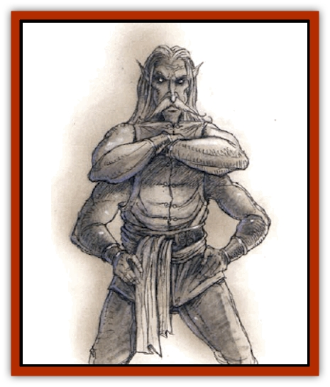

# Golem - Spiderstone

| Statistic | **Golem, Spiderstone** |
| --- | --- |
| **Activity Cycle:** | Any |
| **Alignment:** | Chaotic evil |
| **Armor Class:** | 3 |
| **Climate/Terrain:** | Subterranean (drow kingdoms) |
| **Damage/Attack:** | 1d12 (&times;4) |
| **Diet:** | None |
| **Frequency:** | Very rare |
| **Hit Dice:** | 11 (55 hp) |
| **Intelligence:** | Non- (0) |
| **Magic Resistance:** | 50% |
| **Morale:** | Fearless (20) |
| **Movement:** | 9 |
| **No. Appearing:** | 1 |
| **No. of Attacks:** | 4 |
| **Organization:** | Solitary |
| **Size:** | L (7' tall) |
| **Special Attacks:** | <i>Web spit</i> |
| **Special Defenses:** | Spell immunities, +1 weapon to hit, <i>spider climb</i> |
| **THAC0:** | 9 |
| **Treasure:** | Nil |
| **XP Value:** | 8,000 |

Spiderstone [[Golem_General_Information|golems]], also known as obsidian golems, are the constructed servants of [[Elf_Drow|drow]] spellcasters. Unlike other golems, each of these is inhabited by the spirit of an unknown [[Tanar'ri_General_Information|tanar'ri]] servant of the deity Lolth, ensuring that its use is not directed against Lolth or her servants. Because a spiderstone golem has a spirit that is not completely bound to its material form, it is considered to be a [[Golem_II_Lesser_Golem|lesser golem]].

Physically, this golem resembles a large statue of a four armed drow carved out of glossy black obsidian. When inactive, no signs of animation are apparent, but when it activates, the golem's eyes glow a fiery red. It weighs about 1,000 lbs.

**Combat:** In combat, spiderstone golems attack with four fists or a *web spit*. This *spit* has a range of 90 yards and requires an attack roll. If it hits, anyone within 20 feet is affected as if they are the victim of a *web* spell; the being on which the web is centered gets no saving throw. If the attack roll fails, the "spit" splatters harmlessly (see the section on "Grenade-like Missiles" in the *DMG*) and dissipates in 1d4 rounds.

A weapon of at least +1 enchantment is needed to strike a spiderstone golem.

Spiderstone golems are able to use *spider climb* at will. They are immune to all spells except those of drow priests or invocation/evocation spells (though they still roll for magic resistance and gain a saving throw, if applicable).

Each week, there is a small chance for a spiderstone golem to "go wild". If commanded by a priest in the service of Lolth, the chance is only 1%. Otherwise, it varies from 5% to 100%, depending on what the golem is currently being used for: The chance is 5% if it's under the control of a wizard in the service of Lolth; 50% if it's being used to guard something of personal value to the master, but of no use to Lolth; or 100% if it is being used directly against Lolth.

When a spiderstone golem goes wild, it becomes more cunning, as its Intelligence rises to the Semi (2-4) category. It always seeks to kill its master first, then follows the commands of Lolth. In this mode, the golem is capable of designing simple traps, maximizing its abilities fully.

**Habitat/Society:** Spiderstone golems are most often used for such tasks as guarding a temple or hunting down enemies of the priesthood. They can be as useful to wizards as any golem as well, but their propensity for wildness makes them a dangerous servant.

When under mortal control, a spiderstone golem has as much intelligence as any golem, though the presence of the tanar'ri "overseer" gives it an evil alignment. However, it is able to follow one different command per round, as long as the command does not exceed four words for a wizard or six for a priest. This command may be changed from round to round.

**Ecology:** Except in the service of drow elves, spiderstone golems are similar to other subterranean golems in that they neither give nor take anything from the ecology. However, the powdered remains of this golem are useful in the creation of magical scrolls and items related to spiders, webs, and the abilities of spiders (e.g., *scroll of spider climbing*, *cloak of arachnida*, *arrow of slaying arachnids*, etc.). The eyes of a spiderstone are rubies that may fetch up to 10,000 gp apiece on the open market.

---
## Discovery & Documentation

**Source Publication:** Monstrous Compendium, 1994 Annual, Volume 1 (1995)
**Campaign Setting:** Advanced Dungeons & Dragons 2nd Edition
**Author(s):** David Wise

### Other Creatures Found in This Source Book
   * [[Abyss_Ant|Abyss Ant]]
   * [[Achaierai|Achaierai]]
   * [[Afanc|Afanc]]
   * [[Al-Jahar|Al-Jahar]]
   * [[Baelnorn|Baelnorn]]
   * [[Baneguard|Baneguard]]
   * [[Banelar|Banelar]]
   * [[Bird_Talking|Bird, Talking]]
   * [[Blazing_Bones|Blazing Bones]]
   * [[Campestri|Campestri]]
   * [[Caniquine|Caniquine]]
   * [[Cat_Winged|Cat, Winged]]
   * [[Crypt_Servant|Crypt Servant]]
   * [[Death's_Head_Tree|Death's Head Tree]]
   * [[Dog_Saluqi|Dog, Saluqi]]
   * [[Dragon_Electrum|Dragon, Electrum]]
   * [[Dragon_Fang|Dragon, Fang]]
   * [[Dragon_Linnorm_Corpse_Tearer|Dragon, Linnorm, Corpse Tearer]]
   * [[Dragon_Linnorm_Dread|Dragon, Linnorm, Dread]]
   * [[Dragon_Linnorm_Flame|Dragon, Linnorm, Flame]]
   * [[Dragon_Linnorm_Forest|Dragon, Linnorm, Forest]]
   * [[Dragon_Linnorm_Frost|Dragon, Linnorm, Frost]]
   * [[Dragon_Linnorm_Gray|Dragon, Linnorm, Gray]]
   * [[Dragon_Linnorm_Land|Dragon, Linnorm, Land]]
   * [[Dragon_Linnorm_Midgard|Dragon, Linnorm, Midgard]]
   * [[Dragon_Linnorm_Rain|Dragon, Linnorm, Rain]]
   * [[Dragon_Linnorm_Sea|Dragon, Linnorm, Sea]]
   * [[Dragon_Neutral_Jacinth|Dragon, Neutral, Jacinth]]
   * [[Dragon_Neutral_Jade|Dragon, Neutral, Jade]]
   * [[Dragon_Neutral_Pearl|Dragon, Neutral, Pearl]]
   * [[Dread|Dread]]
   * [[Dragon-kin|Dragon-kin]]
   * [[Elemental_Earth_Kin_Chrysmal|Elemental, Earth Kin, Chrysmal]]
   * [[Elemental_Earth_Kin_Earth_Weird|Elemental, Earth Kin, Earth Weird]]
   * [[Elemental_Fire_Kin_Azer|Elemental, Fire Kin, Azer]]
   * [[Elemental_Sandman|Elemental, Sandman]]
   * [[Elemental_Wind_Walker|Elemental, Wind Walker]]
   * [[Elemental_Vermin|Elemental Vermin]]
   * [[Feystag|Feystag]]
   * [[Flame_Skull|Flame Skull]]
   * [[Foulwing|Foulwing]]
   * [[Gambado|Gambado]]
   * [[Garbug|Garbug]]
   * [[Genie_Tasked_Administrator|Genie, Tasked, Administrator]]
   * [[Genie_Tasked_Deceiver|Genie, Tasked, Deceiver]]
   * [[Genie_Tasked_Harim_Servant|Genie, Tasked, Harim Servant]]
   * [[Genie_Tasked_Messenger|Genie, Tasked, Messenger]]
   * [[Genie_Tasked_Miner|Genie, Tasked, Miner]]
   * [[Genie_Tasked_Oathbinder|Genie, Tasked, Oathbinder]]
   * [[Gibbering_Mouther|Gibbering Mouther]]
   * [[Gnasher|Gnasher]]
   * [[Gnasher_Winged|Gnasher, Winged]]
   * [[Golem_Brain|Golem, Brain]]
   * [[Golem_Hammer|Golem, Hammer]]
   * [[Golem_Metagolem|Golem, Metagolem]]
   * [[Gorynych|Gorynych]]
   * [[Greelox|Greelox]]
   * [[Helmed_Horror|Helmed Horror]]
   * [[Jarbo|Jarbo]]
   * [[Laraken|Laraken]]
   * [[Lich_Psionic|Lich, Psionic]]
   * [[Living_Steel|Living Steel]]
   * [[Lock_Lurker|Lock Lurker]]
   * [[Loxo|Loxo]]
   * [[Lycanthrope_Loup_de_Noir|Lycanthrope, Loup de Noir]]
   * [[Lycanthrope_Werebadger|Lycanthrope, Werebadger]]
   * [[Lycanthrope_Werejaguar|Lycanthrope, Werejaguar]]
   * [[Lythlyx|Lythlyx]]
   * [[Magebane|Magebane]]
   * [[Marrashi|Marrashi]]
   * [[Metalmaster|Metalmaster]]
   * [[Mimic_House_Hunter|Mimic, House Hunter]]
   * [[Naga_Bone|Naga, Bone]]
   * [[Nautilus_Giant|Nautilus, Giant]]
   * [[Nightshade_Toril|Nightshade (Toril)]]
   * [[Nishruu|Nishruu]]
   * [[Noran|Noran]]
   * [[Opinicus|Opinicus]]
   * [[Ormyrr|Ormyrr]]
   * [[Parasite|Parasite]]
   * [[Pasari-Niml|Pasari-Niml]]
   * [[Plant_Vampire_Moss|Plant, Vampire Moss]]
   * [[Pteraman|Pteraman]]
   * [[Rautym|Rautym]]
   * [[Shadeling|Shadeling]]
   * [[Skum|Skum]]
   * [[Snake_Giant_Cobra|Snake, Giant Cobra]]
   * [[Snake_Stone|Snake, Stone]]
   * [[Spectral_Wizard|Spectral Wizard]]
   * [[Spell_Weaver|Spell Weaver]]
   * [[Spider_Brain|Spider, Brain]]
   * [[Suwyze|Suwyze]]
   * [[Tatalla|Tatalla]]
   * [[Tick_Heart|Tick, Heart]]
   * [[Tree_Dark|Tree, Dark]]
   * [[Tree_Singing|Tree, Singing]]
   * [[Tressym|Tressym]]
   * [[Troll_Snow|Troll, Snow]]
   * [[Tuyewera|Tuyewera]]
   * [[Ulitharid|Ulitharid]]
   * [[Undead_Dwarf|Undead Dwarf]]
   * [[Undead_Lake_Monster|Undead Lake Monster]]
   * [[Whipsting|Whipsting]]
   * [[Windghost|Windghost]]
   * [[Wolf_Dread|Wolf, Dread]]
   * [[Wolf_Stone|Wolf, Stone]]
   * [[Wolf_Vampiric|Wolf, Vampiric]]
   * [[Wraith_Shimmering|Wraith, Shimmering]]
   * [[Xantravar|Xantravar]]
   * [[Xaver|Xaver]]
