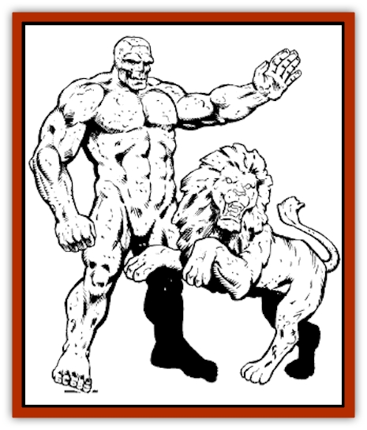

# Golem - Vault Guardian

| Statistic | **Golem, Vault Guardian** |
| --- | --- |
| **Activity Cycle:** | Any |
| **Alignment:** | Neutral |
| **Armor Class:** | 0 |
| **Climate/Terrain:** | Any |
| **Damage/Attack:** | 1d10/1d10 |
| **Diet:** | None |
| **Frequency:** | Rare |
| **Hit Dice:** | 8 (50 hit points) |
| **Intelligence:** | Low (5-7) |
| **Magic Resistance:** | Nil |
| **Morale:** | Fearless (20) |
| **Movement:** | 18 |
| **No. Appearing:** | 1 |
| **No. of Attacks:** | 2 |
| **Organization:** | Solitary |
| **Size:** | M (5-6' tall) |
| **Special Attacks:** | Surprise |
| **Special Defenses:** | Spell immunities, immune to fire and cold, partially immune to electricity, reduced damage by weapon type |
| **THAC0:** | 13 |
| **Treasure:** | Nil |
| **XP Value:** | 8,000 |

Vault guardians are simple but expensive creations of Zhentarim wizards. They are sold to lords of Zhentil Keep and beyond to guard their most precious treasures. Vault guardians are constructs of stone and metal that require incredible wealth to create, but are constantly alert and very effective at their job.

Vault guardians can appear as any type of creature, from dogs to people (though generally they appear as statues or other humanlike creatures no taller than 6 feet), but they always have two appendages, such as hands or claws, with which to attack.

**Combat:** The attack of a vault guardian is straightforward and consists of two punching attacks that inflict 1d10 points of damage per strike. What makes the vault guardian a troublesome foe are the creature's additional magical powers, which enable it to detect intruders and withstand magical attacks.

The vault guardian can perform the following at will: *detect magic*, *detect invisibility*, and *true seeing*. The attacks of the guardian can reach into the Astral and Ethereal Planes and can injure those struck only by magical, silver, or iron weapons. A vault guardian takes no damage from normal fire, magical fire, or cold-based attacks, and electrical attacks cause only one-quarter damage to the construct. *Charm* and *sleep* spells have no effect on the vault guardian, nor do other mind-affecting spells or any poisons.

Edged and piercing weapons inflict only one-quarter damage to the creature because of its durable construction. Blunt weapons such as maces and hammers do only half damage if the weapons are not enchanted to at least +1, but cause normal damage if so enchanted. The vault guardian is also extremely fast, and imposes a -3 penalty to all surprise rolls when defending its charges.

Because of its construction, the vault guardian is vulnerable to earth magic. A *rock to mud spell* inflicts 2d10 points of damage on the creature and stops it from moving for one round, and *earthquake* or *stone shape* instantly kills the construct (no saving throw allowed).

**Habitat/Society:** Vault guardians are found in treasure vaults. They are similar to [[Golem_I_Greater_Golem|stone or iron golems]], and could be considered a combination of the two types. Vault guardians are slightly cheaper to construct than stone or iron [[Golem_General_Information|golems]], but take nearly a year to fabricate and require additional enchantments to empower.

Vault guardians were first created by wizards in the nation of Sembia to protect the vast riches of Sembian trading consortiums. Years later, Zhentarim wizards learned the process for creating them, and offered to create vault guardians for various lords of Zhentil Keep at greatly inflated prices.

To create a vault guardian, a wizard of at least 18th level must first be able to cast the following spells (from memory or by scroll use) over the course of the creature's creation: *statue*, *detect magic*, *detect invisibility*, *haste*, *wall of iron*, *fabricate*, *true seeing*, *permanency*, and either *wish* or *limited wish*. In addition, a breastplate from a suit of *plate mail of etherealness* must be fused into the creature, giving it the ability to strike those opponents that hover between planes of existence. If a wizard does not have access to these spells, the cost of construction of a vault guardian could exceed that of a stone or iron golem.

Dozens of intricate symbols must be carved across the forehead and forelimbs of the vault guardian, and rubies worth at least 500 gold pieces each are needed for its eyes.

During its creation, a vault guardian is given a certain key word that is used to control it. After creating the guardian, the wizard passes on this key word to the guardian.s new owner so she or he may properly control the creature and instruct it to guard a certain place or thing. A guardian's key word can never be changed.

By the time construction of a vault guardian is complete, the total cost could range between 40,000 and 70,000 gold pieces, plus any added costs for spells. In turn, the wizard can sell the construct for up to three times the cost of fabrication. Many unscrupulous wizards have recorded the key words of their creations, using this knowledge at a later date to their advantage. The guardian can understand up to 100 command phrases in addition to its key word, and the key word must be spoken first when commanding it to any action.

**Ecology:** Vault guardians are not normal creatures, but are constructed through powerful spells. A vault guardian has no need to eat or sleep.

---
## Discovery & Documentation

**Source Publication:** Ruins of Zhentil Keep (1995)
**Campaign Setting:** Forgotten Realms
**Author(s):** John Terra and Kevin Melka

### Other Creatures Found in This Source Book
   * [[Banedead|Banedead]]
   * [[Banelich|Banelich]]
   * [[Burnbones|Burnbones]]
   * [[Elemental_Nature|Elemental, Nature]]
   * [[Gargoyle_Guardgoyle|Gargoyle, Guardgoyle]]
   * [[Golem_Magic|Golem, Magic]]
   * [[Hybsil|Hybsil]]
   * [[Magedoom|Magedoom]]
   * [[Mist_Scarlet_Dancer|Mist, Scarlet Dancer]]
   * [[Orc_Ondonti|Orc, Ondonti]]
   * [[Rat_Zhentish_Sewer|Rat, Zhentish Sewer]]
   * [[Render|Render]]
   * [[Sacaanti|Sacaanti]]
   * [[Snake_Messenger|Snake, Messenger]]
   * [[Zhentarim_Spirit|Zhentarim Spirit]]
