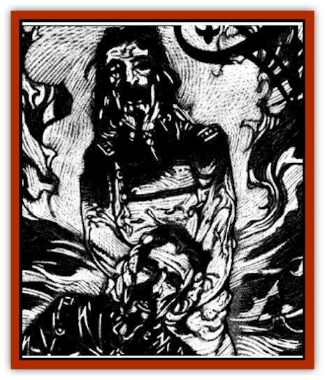

# Golem - Wax - Ravenloft

| Statistic | **Golem, Wax (Ravenloft)** |
| --- | --- |
| **Activity Cycle:** | Any |
| **Alignment:** | Neutral |
| **Armor Class:** | 4 |
| **Climate/Terrain:** | Ravenloft |
| **Damage/Attack:** | 2d6 |
| **Diet:** | None |
| **Frequency:** | Very rare |
| **Hit Dice:** | 8 |
| **Intelligence:** | Average (8-10) |
| **Magic Resistance:** | Nil |
| **Morale:** | Fearless (19-20) |
| **Movement:** | 12 |
| **No. Appearing:** | 1-25 |
| **No. of Attacks:** | 1 |
| **Organization:** | Solitary |
| **Size:** | M (5-6' tall) |
| **Special Attacks:** | See below |
| **Special Defenses:** | See below |
| **THAC0:** | 13 |
| **Treasure:** | Nil |
| **XP Value:** | 5,000 |

Perhaps the most dreadful type of [[Golem_General_Information|golem]], these creatures can be made to exactly resemble a specific person. Often, the similarity between the two is so great that the [[Golem_Ravenloft_General_Information|golem]] can take the subject's place in society without raising even the slightest suspicion.

Because of the extreme care used in their creation, wax golems are easily mistaken for the person they have been crafted to resemble. Only an indepth examination of the creature will reveal that it is not what it appears to be.

Wax golems are able to absorb the memories of those they resemble and can speak the languages known by their living counterpart.

**Combat:** Wax golems are not generally used in combat situations. While other automata might be primarily intended as watchmen or sentries, these creatures serve as spies or agents to infiltrate and supplant local rulers or other important people.

When forced into combat, a golem will tend to employ the weapons that its counterpart was proficient in. The great strength of the creature gives it a +4 bonus on all Damage Rolls. If these are not available, it will attack with its fists, delivering a volley of powerful blows that do 2d6 points of damage.

The primary ability of the wax golem is its memory drain. From the moment that it is animated, the creature is instantly aware of the location of its model. Its first task is always to seek out that person and destroy him. Each successful blow landed by the golem on its living twin forces the victim to make a saving throw vs. death magic. If the roll is failed, the attack does no physical damage. Instead, the golem steals one experience level from the victim, acquiring for itself all the memories and abilities associated with it. Each additional blow repeats this process until the target is utterly drained of its memory and vitality, leaving only a comatose shell of a body behind. A person who escapes from the creature before losing the whole of his personality to it will have vast gaps in his memory and must make a madness check each week until the golem is destroyed.

Care must be taken that the body does not die once a golem has absorbed its mind. If this happens, the force animating the simulacrum is freed and the golem softens and melts, leaving behind only a pool of wax.

The golem uses the stolen memories and powers to assume the victim's place. Any valuables (including magical items) which the victim had are taken by the golem to aid it in its masquerade.

Wax golems have the powers and weaknesses common to all Ravenloft golems. They are immune to electrical and cold-based attacks. Magical fire melts their features, making them run and revealing them at once for what they are.

**Habitat/Society:** Unlike most golems, these creatures cooperate willingly with their creator and with any other wax golems in their plans to usurp authority or take the place of living beings.

A number of wax golems, working in concert, may be used to infiltrate a village, town, or stronghold, replacing those within while remaining undiscovered. They use their new positions to change laws, commit robberies, assume positions of power, and act as advance troops to prepare places for other wax golems.

**Ecology:** Wax golems are created from fine-quality wax that must be blended with [[Mimic|mimic]] ichor, [[Obliviax|obliviax]] dust, and [[Doppelganger|doppelganger]] blood. *Polymorph any object*, *limited wish*, *strength*, and *permanency* spells are then used to animate the golem. Wax golems are tremendously expensive to create, costing fully 75,000 gold pieces each in supplies and equipment.

---
## Discovery & Documentation

**Source Publication:** Ravenloft Appendix III (1991)
**Campaign Setting:** Ravenloft
**Author(s):** Kirk Botulla

### Other Creatures Found in This Source Book
   * [[Akikage|Akikage]]
   * [[Animator_Common|Animator, Common]]
   * [[Animator_Greater|Animator, Greater]]
   * [[Animator_Minor|Animator, Minor]]
   * [[Animator_General_Information|Animator, General Information]]
   * [[Bakhna_Rakhna|Bakhna Rakhna]]
   * [[Baobhan_Sith|Baobhan Sith]]
   * [[Beetle_Scarab|Beetle, Scarab]]
   * [[Boneless|Boneless]]
   * [[Boowray|Boowray]]
   * [[Bruja|Bruja]]
   * [[Carrionette|Carrionette]]
   * [[Carrion_Stalker|Carrion Stalker]]
   * [[Cat_Midnight|Cat, Midnight]]
   * [[Cat_Skeletal|Cat, Skeletal]]
   * [[Cloaker_Resplendent|Cloaker, Resplendent]]
   * [[Cloaker_Shadow|Cloaker, Shadow]]
   * [[Cloaker_Undead|Cloaker, Undead]]
   * [[Corpse_Candle|Corpse Candle]]
   * [[Death's_Head_Tree|Death's Head Tree]]
   * [[Doppelganger_Ravenloft|Doppelganger (Ravenloft)]]
   * [[Familiar_Pseudo-|Familiar, Pseudo-]]
   * [[Familiar_Undead|Familiar, Undead]]
   * [[Feathered_Serpent|Feathered Serpent]]
   * [[Fenhound|Fenhound]]
   * [[Figurine_Ceramic|Figurine, Ceramic]]
   * [[Figurine_Crystal|Figurine, Crystal]]
   * [[Figurine_Ivory|Figurine, Ivory]]
   * [[Figurine_Obsidian|Figurine, Obsidian]]
   * [[Figurine_Porcelain|Figurine, Porcelain]]
   * [[Figurine_General_Information|Figurine, General Information]]
   * [[Fleas_of_Madness|Fleas of Madness]]
   * [[Furies|Furies]]
   * [[Geist|Geist]]
   * [[Ghost_Animal|Ghost, Animal]]
   * [[Golem_Flesh_Ravenloft|Golem, Flesh (Ravenloft)]]
   * [[Golem_Mist_Ravenloft|Golem, Mist (Ravenloft)]]
   * [[Gremishka|Gremishka]]
   * [[Hag_Spectral|Hag, Spectral]]
   * [[Head_Hunter|Head Hunter]]
   * [[Hearth_Fiend|Hearth Fiend]]
   * [[Hebi-No-Onna|Hebi-No-Onna]]
   * [[Hound_Phantom|Hound, Phantom]]
   * [[Hound_Skeletal|Hound, Skeletal]]
   * [[Imp_Wishing|Imp, Wishing]]
   * [[Ivy_Crawling|Ivy, Crawling]]
   * [[Jack_Frost|Jack Frost]]
   * [[Jolly_Roger|Jolly Roger]]
   * [[Kizoku|Kizoku]]
   * [[Lashweed|Lashweed]]
   * [[Leech_Magical|Leech, Magical]]
   * [[Leech_Psionic|Leech, Psionic]]
   * [[Lich_Defiler|Lich, Defiler]]
   * [[Lich_Drow|Lich, Drow]]
   * [[Lich_Elemental|Lich, Elemental]]
   * [[Lich_Psionic|Lich, Psionic]]
   * [[Living_Tattoo|Living Tattoo]]
   * [[Lycanthrope_Loup-garou|Lycanthrope, Loup-garou]]
   * [[Lycanthrope_Werejackal|Lycanthrope, Werejackal]]
   * [[Lycanthrope_Werejaguar_Ravenloft|Lycanthrope, Werejaguar (Ravenloft)]]
   * [[Lycanthrope_Wereleopard|Lycanthrope, Wereleopard]]
   * [[Lycanthrope_Wereray|Lycanthrope, Wereray]]
   * [[Mist_Ferryman|Mist Ferryman]]
   * [[Moor_Man|Moor Man]]
   * [[Obedient|Obedient]]
   * [[Odem|Odem]]
   * [[Paka|Paka]]
   * [[Plant_Blood_Rose|Plant, Blood Rose]]
   * [[Plant_Fearweed|Plant, Fearweed]]
   * [[Radiant_Spirit|Radiant Spirit]]
   * [[Recluse|Recluse]]
   * [[Remnant_Aquatic|Remnant, Aquatic]]
   * [[Rushlight|Rushlight]]
   * [[Sea_Spawn_Master|Sea Spawn, Master]]
   * [[Sea_Spawn_Minion|Sea Spawn, Minion]]
   * [[Shadow_Asp|Shadow Asp]]
   * [[Shattered_Brethren|Shattered Brethren]]
   * [[Skeleton_Archer|Skeleton, Archer]]
   * [[Skeleton_Insectoid|Skeleton, Insectoid]]
   * [[Skin_Thief|Skin Thief]]
   * [[Spirit_Psionic|Spirit, Psionic]]
   * [[Strahd_Skeleton|Strahd Skeleton]]
   * [[Strahd_Zombie|Strahd Zombie]]
   * [[Unicorn_Shadow|Unicorn, Shadow]]
   * [[Vampire_Drow|Vampire, Drow]]
   * [[Vampire_Nosferatu|Vampire, Nosferatu]]
   * [[Vampire_Oriental|Vampire, Oriental]]
   * [[Virus_General_Information|Virus, General Information]]
   * [[Virus_I|Virus I]]
   * [[Virus_II|Virus II]]
   * [[Virus_III|Virus III]]
   * [[Vorlog|Vorlog]]
   * [[Will_O'Dawn|Will O'Dawn]]
   * [[Will_O'Deep|Will O'Deep]]
   * [[Will_O'Mist|Will O'Mist]]
   * [[Will_O'Sea|Will O'Sea]]
   * [[Zombie_Cannibal|Zombie, Cannibal]]
   * [[Zombie_Desert|Zombie, Desert]]
   * [[Zombie_Wolf|Zombie Wolf]]
   * [[Zombie_Fog|Zombie Fog]]
