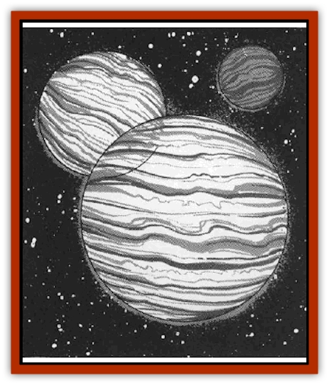

# Gonn

| Statistic | **Gonn** |
| --- | --- |
| **Activity Cycle:** | Any |
| **Alignment:** | Lawful good |
| **Armor Class:** | -4 |
| **Climate/Terrain:** | Wildspace |
| **Damage/Attack:** | Special |
| **Diet:** | Special |
| **Frequency:** | Very rare |
| **Hit Dice:** | 18 |
| **Intelligence:** | Genius (18) |
| **Magic Resistance:** | 25% |
| **Morale:** | Fearless (20) |
| **Movement:** | Fl 48 (A) |
| **No. Appearing:** | 8 |
| **No. of Attacks:** | See below |
| **Organization:** | Scale |
| **Size:** | H to G (25-1,000') |
| **Special Attacks:** | See below |
| **Special Defenses:** | See below |
| **THAC0:** | 3 |
| **Treasure:** | U |
| **XP Value:** | 25,000 |

Though wildspace is fraught with mind-blasting perils, it also holds great beauty. The musical, pacifistic race known as the Gonnlingdaah (or the Gonn for short) brings much beauty to wildspace. These good beings float through wildspace creating hauntingly beautiful music and preserving life. Though blessed with brilliant intellect, they live a simple but extremely long life. Instead of speaking, they sing. The Gonn can sing in their own mysterious language and in Common.

The Gonn resemble gas giants: perfect spheres with bands of different colors decorating their body. To the novice sailor, the Gonn appear by a trick of pespective as far-off planets.

**Combat:** Though the Gonn do not consider combat their first option, they wisely realize that sometimes one must fight to preserve good. Before any combat, however, the Gonn attempt to negotiate with all but the most violent, life-hating beings. The Gonn offer to help foes change their violent ways. If the opponent rejects their offer of help and peace, the Goon bring their powers full to bear with no hesitation.

The Gonn's power is music, and their songs can accomplish amazing feats. Their most powerful songs is a high-pitched keening that affects all enemies of the Gonn's choice within 240'. All targets take 10d10 sonic damage (save vs. breath weapon at a -2 penalty for half damage). Targets that fail to save must roll saving throws for their equipment vs. crushing blow, also at a -2 penalty. Due to the enormous power of this song, the Gonn are loathe to use it except against the most destructive foes.

Another destructive musical attack is a single shrill note. All non-living matter in 240' must save vs. disintegration or shatter. Living beings of the Gonn's choice are deafened for 1d4 rounds.

The Gonn prefer a gentle, soothing song of pacification. All targets of the Gonn's choice must save vs. spell at a -1 penalty or immediately cease combat and relax, listening to the sweet music. In addition, 30% of victims fall asleep for 2d10 turns. Those who save are confused and can take no action for one round.

Gonn can cause magical spells within 240' to cease functioning by singing a lilting ditty that arts as *dispel magic* at 9th level.

A Gonn can sing each of these songs three times a day. Gonn prefer to sing in groups of eight, called "scales". All Gonn in a scale must sing the same song. A Gonn sings solo only if it has no other choice. Such a song is diminished in power; saves are made without penalty.

Since Gonn music comes from their every pore, *silence* spells are useless against them. However, enemies in the circle of silence are immune to Gonn songs. Bard songs cannot counteract Gonn songs, since the behemoths sing so powerfully that they drown out any other sound.

**Habitat/Society:** In every scale, one Gonn is the leader, called the "conductor". The scale moves in formation, each Gonn singing one note.

Gonn live for up to six millennia, wandering wildspace, collecting songs and tales. Each Gonn's name is a long song that would take 1d20 hours to sing. Among shorter-lived races they adopt shorter melodies as temporal names.

Though the Gonn love to answer questions, the asker had best be ready for a long answer. They ramble on and on, singing instead of talking. Typically, one who seeks information from one of these singing sages must listen through 1d8 days of non-stop singing. Each day, there is a cumulative 10% chance the Gonn gives the information. The price of an answer is a song or story (make a non-weapon proficiency check to produce a successful song). Failing this, the Gonn accepts gems worth 500 gp instead.

Besides their attack spells, Gonn can also sing the following spells; *heal*, *restoration*, *raise dead*, *identify*, and *legend lore*. Costs for these spells are 1,000 gp in gems per level of the spell cast, plus a song or story. However, Gonn defend, rescue, and heal anyone that they see hurt by evil, without charge.The Gonn wander often, and like the [[Fal|Fal]], they dislike intrusions by the same visitors more than once a year. It is practically impossible to find the same scale of Gonn one met before.

**Ecology:** Once a century, a scale of Gonn engages in a song of perpetuity, which takes 1d12 months and results in the birth of 2d4 immature Gonn. The young cannot sing for five years, when they reach maturity. Until then, they hum.

The Gonn try to preserve life any way they can. Somc speculate that either Oghma or Apollo created them to bring beauty to the universe.

---
## Discovery & Documentation

**Source Publication:** MC9 Spelljammer Appendix II (1991)
**Campaign Setting:** Planescape
**Author(s):** Scott Davis, Newton Ewell, John Terra

### Other Creatures Found in This Source Book
   * [[Alchemy_Plant|Alchemy Plant]]
   * [[Allura|Allura]]
   * [[Aperusa|Aperusa]]
   * [[Autognome|Autognome]]
   * [[Bionoid|Bionoid]]
   * [[Bloodsac|Bloodsac]]
   * [[Buzzjewel|Buzzjewel]]
   * [[Constellate|Constellate]]
   * [[Contemplator|Contemplator]]
   * [[Dohwar|Dohwar]]
   * [[Dragon_Moon|Dragon, Moon]]
   * [[Dragon_Stellar|Dragon, Stellar]]
   * [[Dragon_Sun|Dragon, Sun]]
   * [[Dreamslayer|Dreamslayer]]
   * [[Dweomerborn|Dweomerborn]]
   * [[Fal|Fal]]
   * [[Feesu|Feesu]]
   * [[Fire_Bat|Fire Bat]]
   * [[Firebird|Firebird]]
   * [[Firelich|Firelich]]
   * [[Flowfiend|Flowfiend]]
   * [[Gadabout|Gadabout]]
   * [[Gammaroid|Gammaroid]]
   * [[Gossamer|Gossamer]]
   * [[Grav|Grav]]
   * [[Great_Dreamer|Great Dreamer]]
   * [[Greatswan|Greatswan]]
   * [[Grell_Colonial|Grell, Colonial]]
   * [[Gullion|Gullion]]
   * [[Insectare|Insectare]]
   * [[Lhee|Lhee]]
   * [[Mercurial_Slime|Mercurial Slime]]
   * [[Meteorspawn|Meteorspawn]]
   * [[Monitor|Monitor]]
   * [[Owl_Space|Owl, Space]]
   * [[Pristatic|Pristatic]]
   * [[Scro|Scro]]
   * [[Selkie_Star|Selkie, Star]]
   * [[Silatic|Silatic]]
   * [[Skullbird|Skullbird]]
   * [[Sleek|Sleek]]
   * [[Sluk|Sluk]]
   * [[Space_Swine|Space Swine]]
   * [[Sphinx_Astro-|Sphinx, Astro-]]
   * [[Spirit_Warrior|Spirit Warrior]]
   * [[Starfly_Plant|Starfly Plant]]
   * [[Stargazer|Stargazer]]
   * [[Undead_Stellar|Undead, Stellar]]
   * [[Witchlight_Marauder|Witchlight Marauder]]
   * [[Xixchil|Xixchil]]
   * [[Yitsan|Yitsan]]
   * [[Zurchin|Zurchin]]
