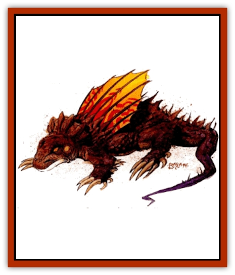

# Gorak

| Statistic | **Gorak** |
| --- | --- |
| **Activity Cycle:** | Day |
| **Alignment:** | Neutral |
| **Armor Class:** | 5 |
| **Climate/Terrain:** | Any/Desert |
| **Damage/Attack:** | 1d3/1d3/2d4 |
| **Diet:** | Carnivore (insects) |
| **Frequency:** | Common |
| **Hit Dice:** | 1+1 |
| **Intelligence:** | Animal (1) |
| **Magic Resistance:** | Nil |
| **Morale:** | Average (8-10) |
| **Movement:** | 15 |
| **No. Appearing:** | 5-30 (5d6) |
| **No. of Attacks:** | 3 |
| **Organization:** | Herd |
| **Size:** | S (3' long) |
| **Special Attacks:** | Nil |
| **Special Defenses:** | Hypnotism |
| **THAC0:** | 19 |
| **Treasure:** | Nil |
| **XP Value:** | 120 |

Goraks are herd beasts that are valued by most of the intelligent, meat-eating races of Athas for their flesh, their colorful hide, and their keen sense of smell. They are fairly common and can be found in any desert area.

Goraks are reptilian beasts that are 3 feet long and weigh approximately 150 pounds. Their skin ranges in color from red-brown to sandy-beige and they have a colorful fanlike dorsal fin that they extend to cool their bodies in the hot Athasian sun. Another less colorful fin surrounds the heads of the goraks. Their legs are short and end in small feet with extremely large claws for their size. The gorak's claws can be as long as 3 inches. Their eyes are slightly oversized for their relatively small heads. They are known for their good eyesight as well as their sense of smell. When excited they emit a loud hissing noise as a warning.

**Combat:** These creatures are relatively passive and prefer to avoid conflict if possible. They can, however, pose a significant threat to the unwary and antagonistic. If threatened, goraks fan out their dorsal fin and the fin that surrounds their head. These are natural reactions intended to make the beast look bigger and more formidable in combat. Goraks attack with their two claws and a bite, causing 1-3 and 2-8 points of damage respectively. The creatures are deceptively fast, which contributes to their impressive AC.

When in combat, the herd attacks with an almost single minded sense of purpose. Their tactics resemble that of a swarm of bees, gathering about the target and darting in and out to attack. As many as eight goraks can attack a human-sized target per round. Targets of such attacks must make a successful save vs. paralyzation or become hypnotized by the chaotic and dazzling colors of the dorsal fins. This hypnotic state lasts for 1-4 (1d4) rounds. During this attack, the alpha male of the herd stands back from the melee as if he were directing the attack.

**Habitat/Society:** Goraks are found both in the wild and in domesticated herds. Domesticated herds have been known to be as large as 50 beasts. However, in the wild they rarely have more than 20 individuals because of the scarcity of food throughout most of Athas.

Each herd of goraks is led by an alpha male who is identical to all other male goraks except for its unusual size. The alpha can grow to 4' and weigh as much as 300 pounds. Challenges for dominance are fairly common in wild herds and less common in the domesticated herds. These contests are savage and are always fought to the death. Usually the alpha wins such contests because of its larger size, unless the dominant male is sick or infirm.

Wild herds have no permanent homes, but roam over areas as large as 100 square miles. They travel by day, turning over rocks and digging into the desert sand in search of insects that make up the staple of the goraks' diet. Their keen sense of smell makes their foraging fairly fruitful and, as long as the herd is small enough, there is rarely starvation among its members. If food becomes scarce for some reason, the alpha male culls the herd of other males. Herds do not accept goraks from outside the herd and attack and kill outsiders on first contact.

**Ecology:** Goraks are an integral part of the food chain on Athas and are hunted by most flesh eaters. Animal handlers have been known to train goraks to track using their uncanny sense of smell and their ability to hypnotize. Therefore, gorak eggs are treasured as both a food source and as a source of tracking beasts.

---
## Discovery & Documentation

**Source Publication:** Dark Sun Appendix II - Terrors Beyond Tyr (1991)
**Campaign Setting:** Dark Sun
**Author(s):** Jim Atkiss, Steve Brown, Timothy B. Brown, Andrew P. Morris, Bruce Nesmith, Wes Nicholson, Bill Slavicsek

### Other Creatures Found in This Source Book
   * [[Aarakocra_Athas|Aarakocra (Athas)]]
   * [[Animal_Domestic_Athas_II|Animal, Domestic (Athas) II]]
   * [[Aviarag|Aviarag]]
   * [[Baazrag|Baazrag]]
   * [[Baazrag_Boneclaw|Baazrag, Boneclaw]]
   * [[Bloodgrass|Bloodgrass]]
   * [[Cactus_Hunting|Cactus, Hunting]]
   * [[Cactus_Rock|Cactus, Rock]]
   * [[Cilops|Cilops]]
   * [[Crodlu|Crodlu]]
   * [[Dagorran|Dagorran]]
   * [[Dhaot|Dhaot]]
   * [[Drake_Lesser_Athas_General_Information|Drake, Lesser (Athas), General Information]]
   * [[Drake_Lesser_Athas_Magma|Drake, Lesser (Athas), Magma]]
   * [[Drake_Lesser_Athas_Rain|Drake, Lesser (Athas), Rain]]
   * [[Drake_Lesser_Athas_Silt|Drake, Lesser (Athas), Silt]]
   * [[Drake_Lesser_Athas_Sun|Drake, Lesser (Athas), Sun]]
   * [[Dray|Dray]]
   * [[Drik|Drik]]
   * [[Dune_Reaper|Dune Reaper]]
   * [[Dwarf_Athas|Dwarf (Athas)]]
   * [[Elemental_Beast_Athas_Air|Elemental Beast (Athas), Air]]
   * [[Elemental_Beast_Athas_Earth|Elemental Beast (Athas), Earth]]
   * [[Elemental_Beast_Athas_Fire|Elemental Beast (Athas), Fire]]
   * [[Elemental_Beast_Athas_Water|Elemental Beast (Athas), Water]]
   * [[Elf_Athas|Elf (Athas)]]
   * [[Fael|Fael]]
   * [[Feylaar|Feylaar]]
   * [[Fordorran|Fordorran]]
   * [[Giant_Half-giant|Giant, Half-giant]]
   * [[Giant_Shadow|Giant, Shadow]]
   * [[Golem_Athas_Magma|Golem (Athas), Magma]]
   * [[Golem_Athas_Salt|Golem (Athas), Salt]]
   * [[Golem_Athas_General_Information|Golem (Athas), General Information]]
   * [[Halfling_Athas|Halfling (Athas)]]
   * [[Human_Athas|Human (Athas)]]
   * [[Jhakar|Jhakar]]
   * [[Kaisharga|Kaisharga]]
   * [[Kes'trekel|Kes'trekel]]
   * [[Klar|Klar]]
   * [[Krag|Krag]]
   * [[Kragling|Kragling]]
   * [[Lirr|Lirr]]
   * [[Mastyrial|Mastyrial]]
   * [[Meorty|Meorty]]
   * [[Mul|Mul]]
   * [[Nikaal|Nikaal]]
   * [[Paraelemental_Beast_General_Information|Paraelemental Beast, General Information]]
   * [[Paraelemental_Beast_Magma|Paraelemental Beast, Magma]]
   * [[Paraelemental_Beast_Rain|Paraelemental Beast, Rain]]
   * [[Paraelemental_Beast_Silt|Paraelemental Beast, Silt]]
   * [[Paraelemental_Beast_Sun|Paraelemental Beast, Sun]]
   * [[Pakubrazi|Pakubrazi]]
   * [[Psionocus|Psionocus]]
   * [[Psurlon|Psurlon]]
   * [[Raaig|Raaig]]
   * [[Retriever_Obsidian|Retriever, Obsidian]]
   * [[Ruktoi|Ruktoi]]
   * [[Ruvoka_Athas|Ruvoka (Athas)]]
   * [[Sand_Howler|Sand Howler]]
   * [[Scorpion_Athas|Scorpion (Athas)]]
   * [[Seed_Brain|Seed, Brain]]
   * [[Silt_Horror_Black|Silt Horror, Black]]
   * [[Silt_Horror_Magma|Silt Horror, Magma]]
   * [[Silt_Horror_Red|Silt Horror, Red]]
   * [[Silt_Spawn|Silt Spawn]]
   * [[Slig|Slig]]
   * [[Spider_Athas|Spider (Athas)]]
   * [[Spinewyrm|Spinewyrm]]
   * [[Ssurran|Ssurran]]
   * [[Stalking_Horror|Stalking Horror]]
   * [[Tarek|Tarek]]
   * [[Tari|Tari]]
   * [[Thri-kreen|Thri-kreen]]
   * [[T'liz|T'liz]]
   * [[Tohr-kreen_II|Tohr-kreen II]]
   * [[Tohr-kreen_III|Tohr-kreen III]]
   * [[Trin|Trin]]
   * [[Tul'k|Tul'k]]
   * [[Undead_Athas_General_Information|Undead (Athas), General Information]]
   * [[Wraith_Athas|Wraith (Athas)]]
   * [[Xerichou|Xerichou]]
   * [[Zombie_Thinking|Zombie, Thinking]]
