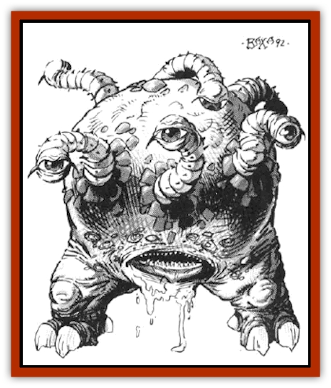

# Gorbel

| Statistic | **Gorbel** |
| --- | --- |
| **Activity Cycle:** | Day |
| **Alignment:** | Neutral |
| **Armor Class:** | 3 (10 see below) |
| **Climate/Terrain:** | Tropical/land |
| **Damage/Attack:** | 1-4 or 1-6 |
| **Diet:** | Omnivore (scavenger) |
| **Frequency:** | Uncommon |
| **Hit Dice:** | 2 |
| **Intelligence:** | Non- (0) |
| **Magic Resistance:** | Nil |
| **Morale:** | Unreliable (4) |
| **Movement:** | 1, Fl 18 (C) |
| **No. Appearing:** | 1-20 |
| **No. of Attacks:** | 1 |
| **Organization:** | Herd |
| **Size:** | S (3' diameter) |
| **Special Attacks:** | Explosion |
| **Special Defenses:** | Immune to blunt weapons |
| **THAC0:** | 19 |
| **Treasure:** | Nil |
| **XP Value:** | 120 |

The gorbel is an odd creature, believed by some to be a distant cousin to the [[Beholder_and_Beholder-kin_I|beholder]], or perhaps the result of some mad wizard's experiments. They attack and eat practically anything that moves; only their explosive nature keeps them from overrunning their habitat.

The creature usually appears as a red globe of translucent, thin rubbery material. Equally spaced around the top of the spherical body are six tiny red eyes on short, retractable eyestalks. It eats, breathes, and gives birth through a tiny mouthlike opening, and uses its short, clawed legs while walking, or in attacks. Gorbels are a mere 6" in size when born, but rapidly grow to full size of 3' diameter within six months. Like the rest of this creature, the mouth is rubbery, and can slowly stretch to fit food of up to 18" in diameter. A multitude of tiny teeth around the edge of the mouth aid in holding onto larger, struggling prey while the mouth stretches to accommodate the meal.

**Combat:** Gorbels will attack and attempt to eat anything that moves. They have even been known to attack trees swaying in the breeze. An attack is initiated by rapidly drifting towards the target, then latching on with sharp claws. The gorbel's mode of propulsion is not completely understood, but is believed to involve magic similar to a *levitation* spell. Once attached to its prey, the gorbel's grip is so strong that it cannot be detached until either the gorbel or the victim is dead. Furthermore, once the claws have found their mark, they automatically hit the victim each round for 1-6 points of clawing damage. This aggressiveness is also the creature's undoing: once attached, it loses all dexterity bonuses and drops to AC 10.

A hit with a blunt weapon merely bounces off of the gorbel's rubbery hide. A successful hit with a piercing or slashing weapon bursts the gorbel's balloon-like body. A cloud of pyrophoric gas is thus released, and explodes for 1-4 points of blast damage to any creature within 5' range. Magically-incurred damage (*magic missile*, etc) will also cause the creature to explode, regardless of damage actually inflicted.

Gorbels are not immune to the explosions of their herd-mates if in range; entire herds have been known to have destroyed themselves accidently in a chain-reaction explosion caused by damage to a single creature.

The pyrophoric gas is a result of the gorbel's inflective diet and unusual metabolic processes. A combination of green foliage, bark and a tiny amount of scrap metal or ore (to catalyze the process) is digested inside the creature. Ores containing fool's gold seem to be preferred. The gas so produced is substantially lighter than air, and is thus responsible for the creature's buoyancy. It also slowly leaks out, and must therefore be constantly replenished. The gas smells of rotten eggs; this smell may reveal the presence or approach of these creatures.

**Habitat/Society:** Gorbel herds are loosely organized groups, living on lush tropical vegetation or jungle rubbish and carrion. They have no set lairs, as the herd must move frequently when they have exhausted all of the foliage in one area. The size of the herd is not fixed; individual gorbels come and go as their own limited instincts determine. Occasional fights with other gorbels over food may occur, but these generally are little more than contests to bounce the aggressor away.

Gorbels are curious creatures, and tend to investigate anything in their local environment which is out of the ordinary, such as an adventurer's camp. Once in the camp, they will attack and attempt to eat the first thing that moves and thus catches their attention. When something has piqued its curiosity, a gorbel will begin a frantic mewing, not unlike a kitten.

**Ecology:** Gorbels are no harder on the local foliage than any other herd animals: when the food is gone, the herd moves on. Little else is known about their lives or how they react with other creatures.

Some wizards have prepared *potions of fire breath* from the pyrophoric gas contained inside the gorbel's body. The eyes may be useful as components for *wizard eye* spells or similar magical effects, while the rubbery hide is said to allow the construction of a curious lighter-than-air craft. To obtain the hide intact for such purposes, it is necessary to kill the gorbel in such a way the body sac is not ruptured, thus preventing the pyrophnric gas from exploding.

---
## Discovery & Documentation

**Source Publication:** MC14 Fiend Folio Appendix (1992)
**Campaign Setting:** Fiends Folio
**Author(s):** Don Bingle, John Terra, Wes Nicholson, Tim Beach, Steve Hardinger, Kris Hardinger, Rob Nicholls, Greg Swedberg, Al Boyce, Vince Garcia, Norm Ritchie

### Other Creatures Found in This Source Book
   * [[Aballin|Aballin]]
   * [[Achaierai|Achaierai]]
   * [[Adherer|Adherer]]
   * [[Algoid|Algoid]]
   * [[Al-Mi'raj|Al-Mi'raj]]
   * [[Apparition|Apparition]]
   * [[Caterwaul|Caterwaul]]
   * [[Coffer_Corpse|Coffer Corpse]]
   * [[Crabman|Crabman]]
   * [[Dark_Creeper|Dark Creeper]]
   * [[Dark_Stalker|Dark Stalker]]
   * [[Darter|Darter]]
   * [[Denzelian|Denzelian]]
   * [[Dune_Stalker|Dune Stalker]]
   * [[Dwarf_Urdunnir|Dwarf, Urdunnir]]
   * [[Falcon_Fire|Falcon, Fire]]
   * [[Faux_Faerie|Faux Faerie]]
   * [[Flawder|Flawder]]
   * [[Fyrefly|Fyrefly]]
   * [[Gambado|Gambado]]
   * [[Garbug|Garbug]]
   * [[Giant_Fhoimorien|Giant, Fhoimorien]]
   * [[Gibberling|Gibberling]]
   * [[Grimlock|Grimlock]]
   * [[Hellcat|Hellcat]]
   * [[Ice_Lizard|Ice Lizard]]
   * [[Iron_Cobra|Iron Cobra]]
   * [[Khargra|Khargra]]
   * [[Mantari|Mantari]]
   * [[Penanggalan|Penanggalan]]
   * [[Pernicon|Pernicon]]
   * [[Phantom_Stalker|Phantom Stalker]]
   * [[Retriever|Retriever]]
   * [[Ruve|Ruve]]
   * [[Scathe|Scathe]]
   * [[Sheet_Ghoul_Sheet_Phantom|Sheet Ghoul/Sheet Phantom]]
   * [[Shocker|Shocker]]
   * [[Spanner|Spanner]]
   * [[Stwinger|Stwinger]]
   * [[Sussurus|Sussurus]]
   * [[Symbiotic_Jelly|Symbiotic Jelly]]
   * [[Terithran|Terithran]]
   * [[Thunder_Children|Thunder Children]]
   * [[Troll_Ice|Troll, Ice]]
   * [[Tween|Tween]]
   * [[Umpleby|Umpleby]]
   * [[Volt|Volt]]
   * [[Xill|Xill]]
   * [[Xvart|Xvart]]
   * [[Zygraat|Zygraat]]
